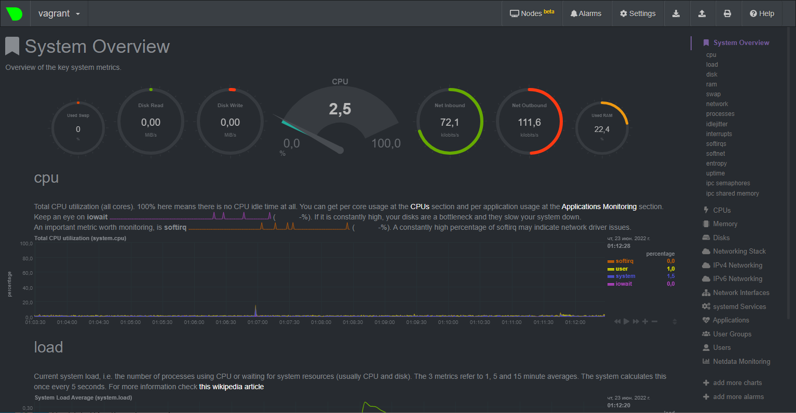

# Домашнее задание к занятию "3.4. Операционные системы, лекция 2"

1. Cоздайте самостоятельно простой [unit-файл](https://www.freedesktop.org/software/systemd/man/systemd.service.html) для node_exporter:

```bash
Скачиваем и распаковываем файл node_exporter-1.3.1.linux-amd64.tar.gz. 
В директории /opt создаем поддиректорию /node_exporter, и в нее копируем исполняемый файл node_exporter 
(или создаем symlink на него).
С помощью редактора vim в директории /etc/systemd/system/ создаем файл node_exporter.service.
[root@server /]# systemctl cat node_exporter.service
# /etc/systemd/system/node_exporter.service
[Unit]
Description=Prometheus Node Exporter
Documentation=https://github.com/prometheus/node_exporter
After=network-online.target

[Service]
User=root
EnvironmentFile=/etc/default/node_exporter
ExecStart=/opt/node_exporter/node_exporter $OPTIONS
Restart=on-failure
RestartSec=5

[Install]
WantedBy=multi-user.target
----------------------------------
Помещаем сервис в автозагрузку:
[root@server ~]# systemctl enable node_exporter.service
Проверяем, что сервис добавлен в автозагрузку:
[root@server ~]# systemctl is-enabled node_exporter.service
enabled
----------------------------------
Возможность добавления опций обеспечена строками:
EnvironmentFile=/etc/default/node_exporter
ExecStart=/opt/node_exporter/node_exporter $OPTIONS
в Unit-файле и строкой: 
OPTIONS=''
в файле /etc/default/node_exporter.
----------------------------------
Проверено, что процесс корректно стартует, завершается, а после перезагрузки автоматически поднимается:
[root@server ~]# systemctl status node_exporter.service
● node_exporter.service - Prometheus Node Exporter
   Loaded: loaded (/etc/systemd/system/node_exporter.service; enabled; vendor preset: disabled)
   Active: active (running) since Fri 2022-06-17 04:54:38 +03; 53min ago
     Docs: https://github.com/prometheus/node_exporter
 Main PID: 35853 (node_exporter)
    Tasks: 3 (limit: 4844)
   Memory: 10.9M
   CGroup: /system.slice/node_exporter.service
           └─35853 /opt/node_exporter/node_exporter

Jun 17 04:54:38 server node_exporter[35853]: ts=2022-06-17T01:54:38.663Z caller=node_exporter.go:115 level=info collector=thermal_zone
Jun 17 04:54:38 server node_exporter[35853]: ts=2022-06-17T01:54:38.663Z caller=node_exporter.go:115 level=info collector=time
Jun 17 04:54:38 server node_exporter[35853]: ts=2022-06-17T01:54:38.663Z caller=node_exporter.go:115 level=info collector=timex
Jun 17 04:54:38 server node_exporter[35853]: ts=2022-06-17T01:54:38.663Z caller=node_exporter.go:115 level=info collector=udp_queues
Jun 17 04:54:38 server node_exporter[35853]: ts=2022-06-17T01:54:38.663Z caller=node_exporter.go:115 level=info collector=uname
Jun 17 04:54:38 server node_exporter[35853]: ts=2022-06-17T01:54:38.663Z caller=node_exporter.go:115 level=info collector=vmstat
Jun 17 04:54:38 server node_exporter[35853]: ts=2022-06-17T01:54:38.663Z caller=node_exporter.go:115 level=info collector=xfs
Jun 17 04:54:38 server node_exporter[35853]: ts=2022-06-17T01:54:38.663Z caller=node_exporter.go:115 level=info collector=zfs
Jun 17 04:54:38 server node_exporter[35853]: ts=2022-06-17T01:54:38.663Z caller=node_exporter.go:199 level=info msg="Listening on" address=:9100
Jun 17 04:54:38 server node_exporter[35853]: ts=2022-06-17T01:54:38.664Z caller=tls_config.go:195 level=info msg="TLS is disabled." http2=false
[root@server ~]#
[root@server ~]# ps aux | grep node
root         850  0.0  0.0  16892   508 ?        Ss   Jun15   0:00 /usr/sbin/mcelog --ignorenodev --daemon --foreground
root       35853  0.0  2.2 717632 17952 ?        Ssl  04:54   0:00 /opt/node_exporter/node_exporter
root       36073  0.0  0.1 221900  1080 pts/0    R+   05:48   0:00 grep --color=auto node
```

2. Ознакомьтесь с опциями node_exporter и выводом `/metrics` по-умолчанию. Приведите несколько опций, которые вы бы выбрали для базового мониторинга хоста по CPU, памяти, диску и сети.
```bash
Команда вывода всех опций:
curl -s localhost:9100/metrics
----------------------------------
Вывод опций для базового мониторинга хоста по CPU:
[root@server ~]# curl -s localhost:9100/metrics | grep ^node_cpu_seconds_total
node_cpu_seconds_total{cpu="0",mode="idle"} 111817.37
node_cpu_seconds_total{cpu="0",mode="iowait"} 42.09
node_cpu_seconds_total{cpu="0",mode="irq"} 112.44
node_cpu_seconds_total{cpu="0",mode="nice"} 29.57
node_cpu_seconds_total{cpu="0",mode="softirq"} 120.43
node_cpu_seconds_total{cpu="0",mode="steal"} 0
node_cpu_seconds_total{cpu="0",mode="system"} 484.07
node_cpu_seconds_total{cpu="0",mode="user"} 118.16
----------------------------------
Вывод опций для базового мониторинга хоста по памяти:
[root@server ~]# curl -s localhost:9100/metrics | grep ^node_memory_Mem
node_memory_MemAvailable_bytes 4.99552256e+08
node_memory_MemFree_bytes 6.8059136e+07
node_memory_MemTotal_bytes 8.29943808e+08
----------------------------------
Вывод опций для базового мониторинга хоста по диску (например sda):
[root@server ~]# curl -s localhost:9100/metrics | grep '^node_disk_read\|^node_disk_write' | grep sda
node_disk_read_bytes_total{device="sda"} 2.3663621632e+10
node_disk_read_time_seconds_total{device="sda"} 168.586
node_disk_reads_completed_total{device="sda"} 62130
node_disk_reads_merged_total{device="sda"} 365
node_disk_write_time_seconds_total{device="sda"} 174.27700000000002
node_disk_writes_completed_total{device="sda"} 311812
node_disk_writes_merged_total{device="sda"} 21305
----------------------------------
Вывод опций для базового мониторинга хоста по сети (например для интерфейса ens33):
[root@server ~]# curl -s localhost:9100/metrics | grep '^node_network_receive\|^node_network_transmit' | grep 'bytes\|packets\|errs' | grep ens33
node_network_receive_bytes_total{device="ens33"} 2.3827334e+07
node_network_receive_errs_total{device="ens33"} 0
node_network_receive_packets_total{device="ens33"} 68275
node_network_transmit_bytes_total{device="ens33"} 1.2927154e+07
node_network_transmit_errs_total{device="ens33"} 0
node_network_transmit_packets_total{device="ens33"} 36186
```

3. Установите в свою виртуальную машину [Netdata](https://github.com/netdata/netdata). После успешной перезагрузки в браузере *на своем ПК* (не в виртуальной машине) вы должны суметь зайти на `localhost:19999`. Ознакомьтесь с метриками, которые по умолчанию собираются Netdata и с комментариями, которые даны к этим метрикам.
```bash
Netdata установлена, проброшен порт 19999.
Информация с vm-машины:
root@vagrant:~# lsof -i :19999
COMMAND PID    USER   FD   TYPE DEVICE SIZE/OFF NODE NAME
netdata 637 netdata    4u  IPv4  22012      0t0  TCP *:19999 (LISTEN)
netdata 637 netdata   35u  IPv4  30949      0t0  TCP 10.0.2.15:19999->10.0.2.2:59608 (ESTABLISHED)
netdata 637 netdata   48u  IPv4  30950      0t0  TCP 10.0.2.15:19999->10.0.2.2:59609 (ESTABLISHED)
netdata 637 netdata   49u  IPv4  30952      0t0  TCP 10.0.2.15:19999->10.0.2.2:59610 (ESTABLISHED)
netdata 637 netdata   50u  IPv4  30102      0t0  TCP 10.0.2.15:19999->10.0.2.2:59615 (ESTABLISHED)
netdata 637 netdata   51u  IPv4  30993      0t0  TCP 10.0.2.15:19999->10.0.2.2:59614 (ESTABLISHED)
netdata 637 netdata   53u  IPv4  31022      0t0  TCP 10.0.2.15:19999->10.0.2.2:59622 (ESTABLISHED)
----------------------------------
Информация с хостовой машины:
Microsoft Windows [Version 10.0.19044.1766]
(c) Корпорация Майкрософт (Microsoft Corporation). Все права защищены.

C:\Users\Admin>netstat

Активные подключения

  Имя    Локальный адрес        Внешний адрес          Состояние
  TCP    127.0.0.1:443          view-localhost:59654   ESTABLISHED
  TCP    127.0.0.1:2222         view-localhost:59604   ESTABLISHED
  TCP    127.0.0.1:19999        view-localhost:59608   FIN_WAIT_2
  TCP    127.0.0.1:19999        view-localhost:59609   FIN_WAIT_2
  TCP    127.0.0.1:19999        view-localhost:59610   FIN_WAIT_2
  TCP    127.0.0.1:19999        view-localhost:59614   FIN_WAIT_2
  TCP    127.0.0.1:19999        view-localhost:59615   FIN_WAIT_2
  TCP    127.0.0.1:19999        view-localhost:59622   FIN_WAIT_2
----------------------------------
```


4. Можно ли по выводу `dmesg` понять, осознает ли ОС, что загружена не на настоящем оборудовании, а на системе виртуализации?
```bash
Да, причем даже можно узнать тип гипервизора:
Вывод для Ubuntu 20.04.3 в программном средстве Vagrant (гипервизор KVM):
root@vagrant:~# dmesg | grep virt
[    0.009667] CPU MTRRs all blank - virtualized system.
[    0.181560] Booting paravirtualized kernel on KVM
[    3.515111] systemd[1]: Detected virtualization oracle.
root@vagrant:~#
----------------------------------
Вывод для CentOS Linux 8 в VMware Workstation:
[root@server ~]# dmesg | grep virt
[    0.000000] Booting paravirtualized kernel on VMware hypervisor
[    1.443388] systemd[1]: Detected virtualization vmware.
[    7.156944] systemd[1]: Detected virtualization vmware.
```

5. Как настроен sysctl `fs.nr_open` на системе по-умолчанию? Узнайте, что означает этот параметр. Какой другой существующий лимит не позволит достичь такого числа (`ulimit --help`)?
```bash
Значение по-умолчанию:
root@vagrant:~# sysctl -n fs.nr_open
1048576
Этот параметр определяет максимальное количество открытых файлов в одном процессе.
Такого числа не позволит достичь лимит "open files" в "ulimit -a":
root@vagrant:~# ulimit -n
1024
root@vagrant:~#
```

6. Запустите любой долгоживущий процесс в отдельном неймспейсе процессов; покажите, что ваш процесс работает под PID 1 через `nsenter`. Для простоты работайте в данном задании под root (`sudo -i`).
```bash
```


