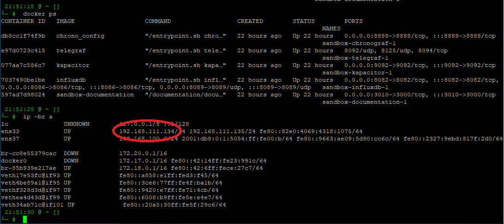
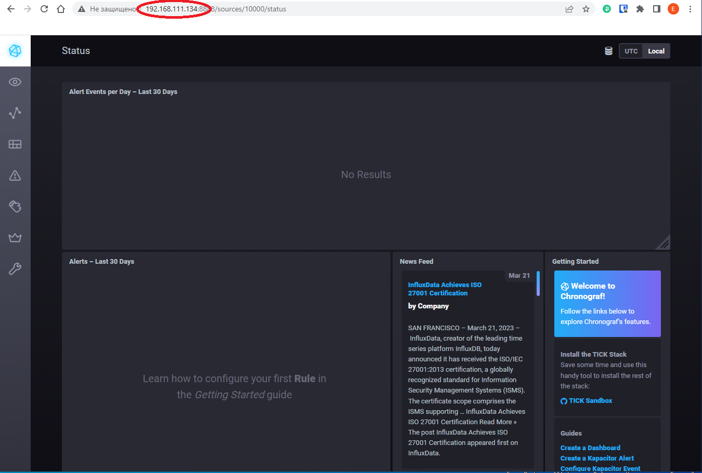
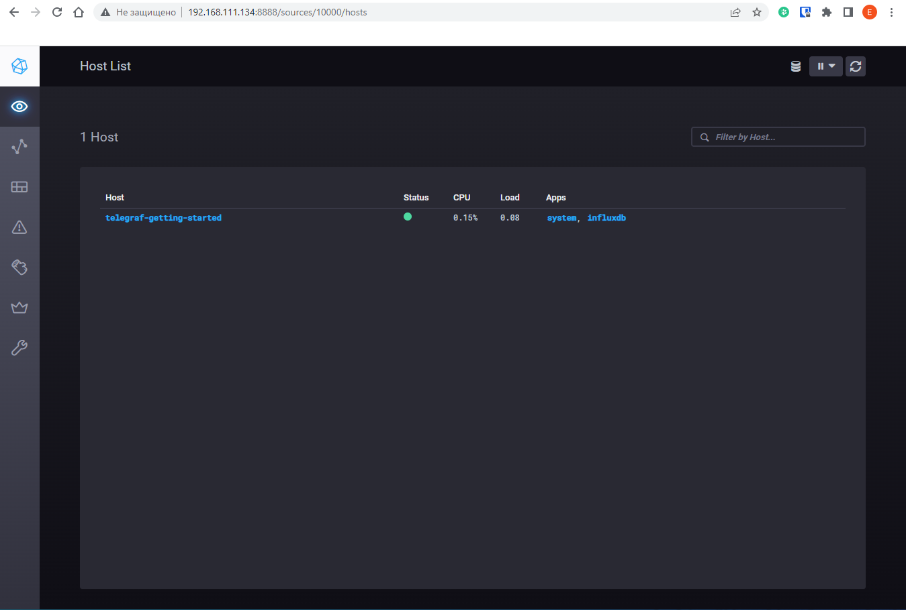
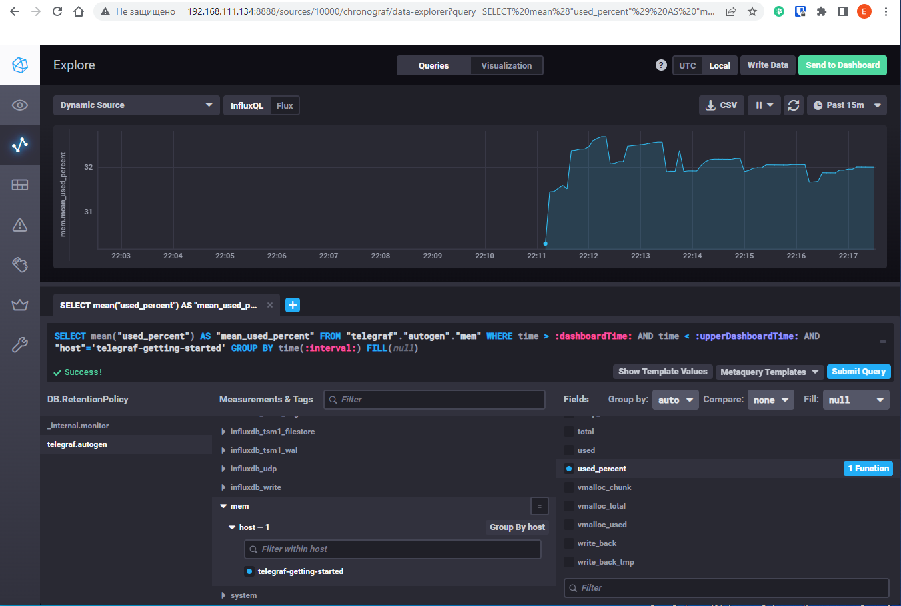
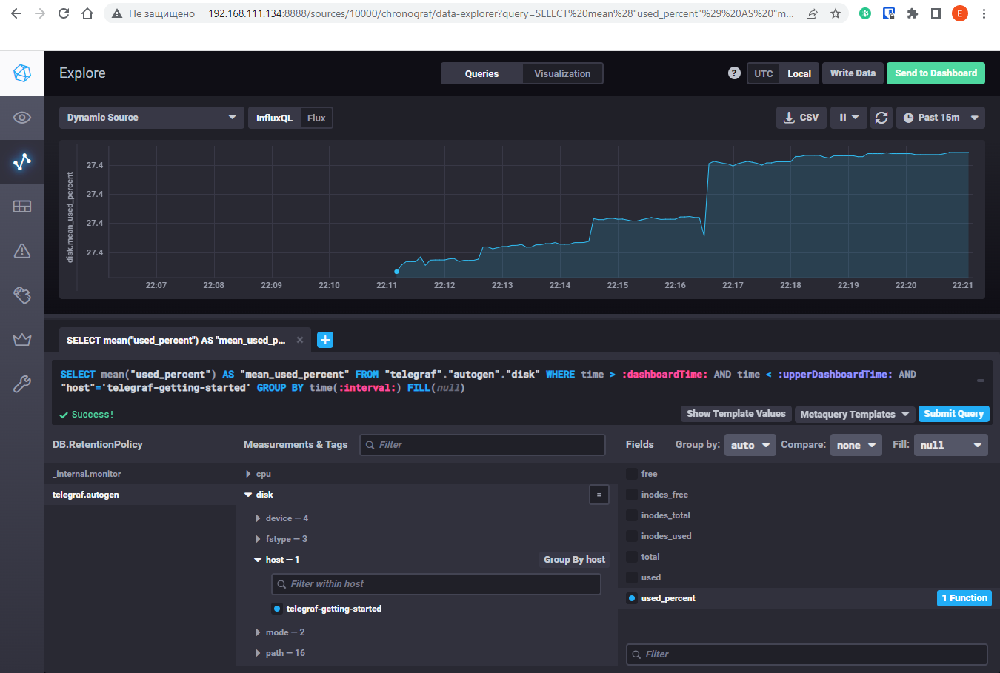
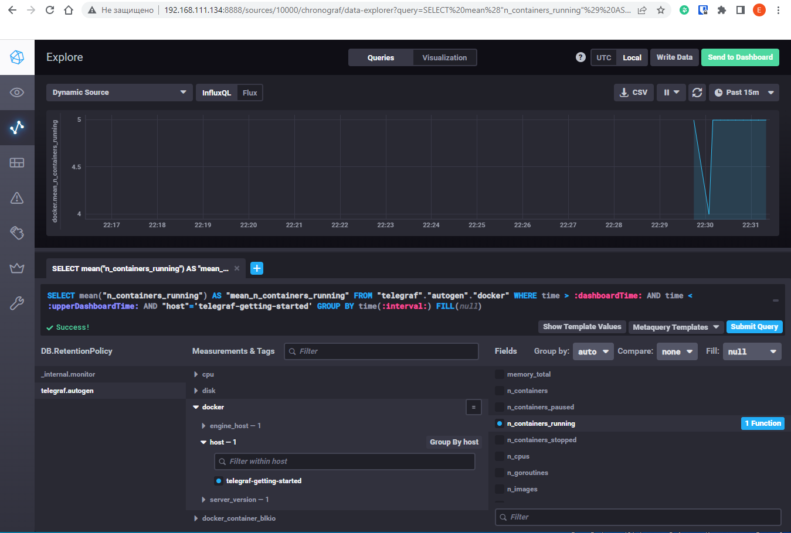

# Домашнее задание к занятию "10.2 Системы мониторинга"

## Обязательные задания

1. Вас пригласили настроить мониторинг на проект. На онбординге вам рассказали, что проект представляет из себя 
платформу для вычислений с выдачей текстовых отчетов, которые сохраняются на диск. Взаимодействие с платформой 
осуществляется по протоколу http. Также вам отметили, что вычисления загружают ЦПУ. Какой минимальный набор метрик вы
выведите в мониторинг и почему?

# 
Ответ 
* CPU_user, CPU_system, CPU_la для мониторинга заргузки процессора пользовательской и системной нагрузкой, а также для оценки средней загрузки процессора;
* RAM_used, RAM_cached, RAM_total для мониторинга использования памяти;
* Storage_space в байтах и в inodes для оценки емкости системы хранения;
* IOps для оценки производительности системы хранения;
* Байтовую и пакетную скорость на сетевых интерфейсах для оценки достаточности ресурсов ЛВС;
* Интенсивность http-запросов для оценки степени использования прикладного ПО.

#
2. Менеджер продукта посмотрев на ваши метрики сказал, что ему непонятно что такое RAM/inodes/CPUla. Также он сказал, 
что хочет понимать, насколько мы выполняем свои обязанности перед клиентами и какое качество обслуживания. Что вы 
можете ему предложить?

#
Ответ 
* Можем ввести контроль за ключевыми метриками, а также предложить соглашение об SLA, в котором прописать ключевые показатели доступности и производительности системы и их допустимые значения. (Например, процент возврата ошибок HTTP)

#
3. Вашей DevOps команде в этом году не выделили финансирование на построение системы сбора логов. Разработчики в свою 
очередь хотят видеть все ошибки, которые выдают их приложения. Какое решение вы можете предпринять в этой ситуации, 
чтобы разработчики получали ошибки приложения?

#
Ответ 
* Можем воспользоваться встроенными в ОС Linux системами логирования: rsyslog и systemd-journald. Сервис rsyslog распределяет сообщения в соответствующие log-файлы в каталоге /var/log/, которые не очищаются в ходе перезагрузки системы. Распределение сообщений осуществляется в зависимости от их типа (facility) и приоритета (priority).
Сервис systemd-journald записывает события в журналы в определенном формате. По умолчанию журналы событий хранятся в операционной системе (в директории /run/log/journal) до перезагрузки, но можно настроить и постоянное хранение.

#
4. Вы, как опытный SRE, сделали мониторинг, куда вывели отображения выполнения SLA=99% по http кодам ответов. 
Вычисляете этот параметр по следующей формуле: summ_2xx_requests/summ_all_requests. Данный параметр не поднимается выше 
70%, но при этом в вашей системе нет кодов ответа 5xx и 4xx. Где у вас ошибка?

#
Ответ 
* В вычислениях необходимо учесть HTTP коды 3xx, тогда рассматриваемый в задании параметр будет выше.

#
5. Опишите основные плюсы и минусы pull и push систем мониторинга.

#
Ответ
* Плюсы pull-модели:
    - Не требуется настройка агентов и их ассоциация с сервером;
    - Упрощение настройки (всё можно настроить в одном месте - на сервере мониторинга);
    - Можно настроить единый proxy сервер для мониторинга всех хостов;
* Минусы pull систем мониторинга:
    - Возрастает нагрузка на сервер и сеть из-за опроса хостов;
    - Высокие требования к ресурсам и надежности самой системы мониторинга;
* Плюсы push систем мониторинга:
    - Настройка каждого агента может быть индивидуальной и более тонкой;
    - Меньшая нагрузка на сервер, т.к. агент сам инициирует отправку данных;
    - Чаще используется UDP, как менее затратный транспортный протокол;
* Минусы push систем мониторинга:
    - Необходимо использовать и настраивать агент;
    - Объект мониторинга (хост) как правило не имеет обратной связи от сервера системы мониторинга.

#
6. Какие из ниже перечисленных систем относятся к push модели, а какие к pull? А может есть гибридные?

    - Prometheus
    - TICK
    - Zabbix
    - VictoriaMetrics
    - Nagios

#
Ответ
*
    - Prometheus (pull)
    - TICK (push)
    - Zabbix (pull/push)
    - VictoriaMetrics (push)
    - Nagios (pull)

#
7. Склонируйте себе [репозиторий](https://github.com/influxdata/sandbox/tree/master) и запустите TICK-стэк, 
используя технологии docker и docker-compose.

В виде решения на это упражнение приведите скриншот веб-интерфейса ПО chronograf (`http://localhost:8888`). 

P.S.: если при запуске некоторые контейнеры будут падать с ошибкой - проставьте им режим `Z`, например
`./data:/var/lib:Z`

# 
Ответ




#
8. Перейдите в веб-интерфейс Chronograf (`http://localhost:8888`) и откройте вкладку `Data explorer`.

    - Нажмите на кнопку `Add a query`
    - Изучите вывод интерфейса и выберите БД `telegraf.autogen`
    - В `measurments` выберите mem->host->telegraf_container_id , а в `fields` выберите used_percent. 
    Внизу появится график утилизации оперативной памяти в контейнере telegraf.
    - Вверху вы можете увидеть запрос, аналогичный SQL-синтаксису. 
    Поэкспериментируйте с запросом, попробуйте изменить группировку и интервал наблюдений.

Для выполнения задания приведите скриншот с отображением метрик утилизации места на диске 
(disk->host->telegraf_container_id) из веб-интерфейса.

#
Ответ
* Для добавления метрик по памяти и диску выполним корректировку файла `telegraf.conf`, добавив в него строки:
```
[[inputs.mem]]
[[inputs.disk]]
```
* Перезапустим Sandbox:
```
 22:10:49 @ ~/monitoring/sandbox [master]
└─ #  ./sandbox restart
Using latest, stable releases
Stopping all sandbox processes...
Starting all sandbox processes...
Services available!
```
* График утилизации оперативной памяти:

* График утилизации места на диске:


#
9. Изучите список [telegraf inputs](https://github.com/influxdata/telegraf/tree/master/plugins/inputs). 
Добавьте в конфигурацию telegraf следующий плагин - [docker](https://github.com/influxdata/telegraf/tree/master/plugins/inputs/docker):
```
[[inputs.docker]]
  endpoint = "unix:///var/run/docker.sock"
```

Дополнительно вам может потребоваться донастройка контейнера telegraf в `docker-compose.yml` дополнительного volume и 
режима privileged:
```
  telegraf:
    image: telegraf:1.4.0
    privileged: true
    volumes:
      - ./etc/telegraf.conf:/etc/telegraf/telegraf.conf:Z
      - /var/run/docker.sock:/var/run/docker.sock:Z
    links:
      - influxdb
    ports:
      - "8092:8092/udp"
      - "8094:8094"
      - "8125:8125/udp"
```

После настройке перезапустите telegraf, обновите веб интерфейс и приведите скриншотом список `measurments` в 
веб-интерфейсе базы telegraf.autogen . Там должны появиться метрики, связанные с docker.

#
Ответ
* В файле `telegraf.conf` уже присутствовал плагин `docker`:
```
 22:34:34 @ ~/monitoring/sandbox [master]
└─ #  cat telegraf/telegraf.conf | grep -P1 docker.sock
[[inputs.docker]]
  endpoint = "unix:///var/run/docker.sock"
  container_names = []
```
* Выполнена донастройка контейнера telegraf в `docker-compose.yml` в соответствии с заданием.
* После перезапуска в telegraf появились метрики, связанные с docker:



