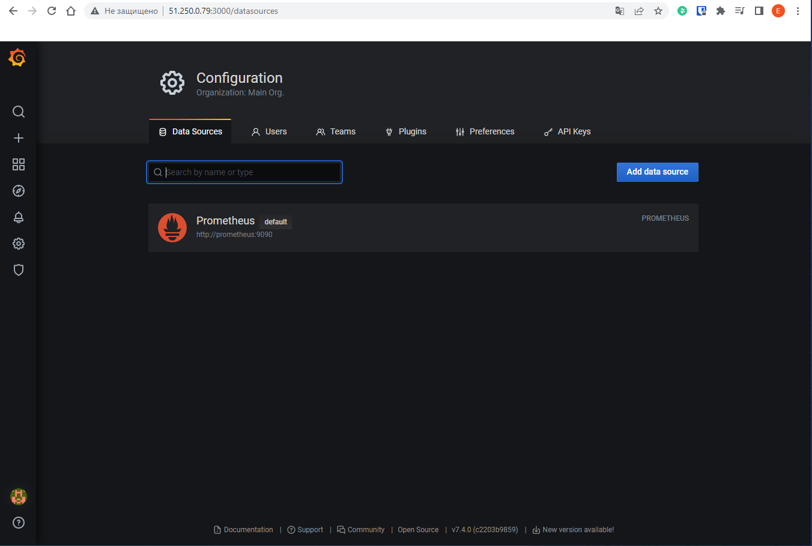
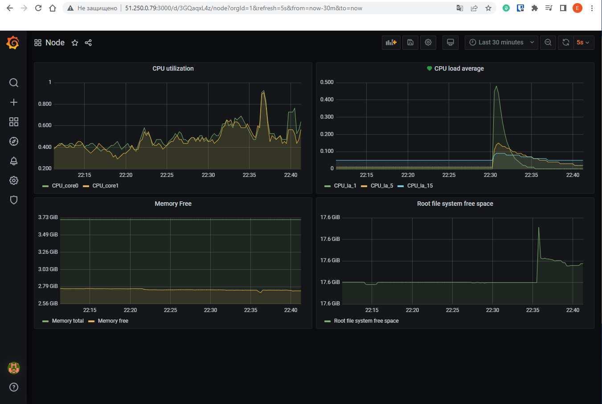
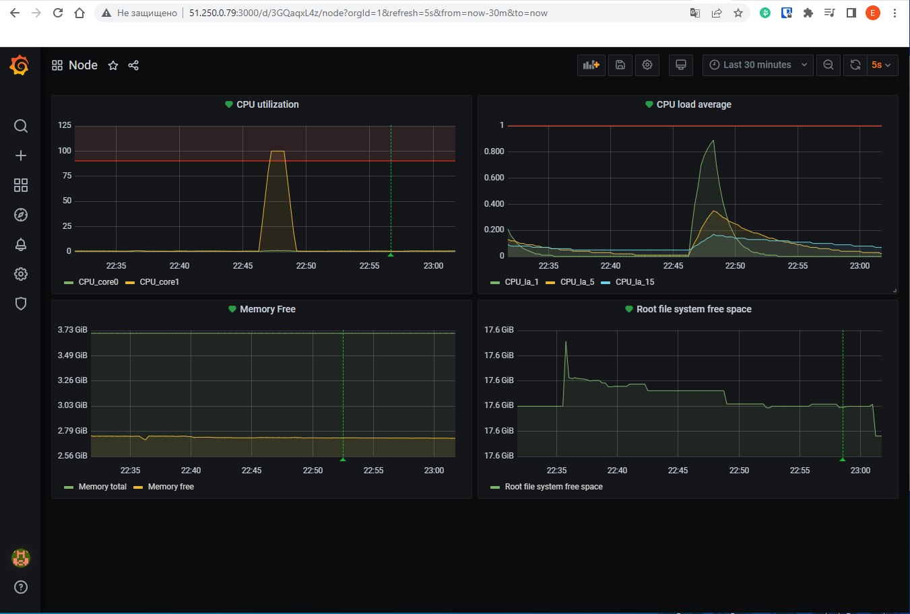
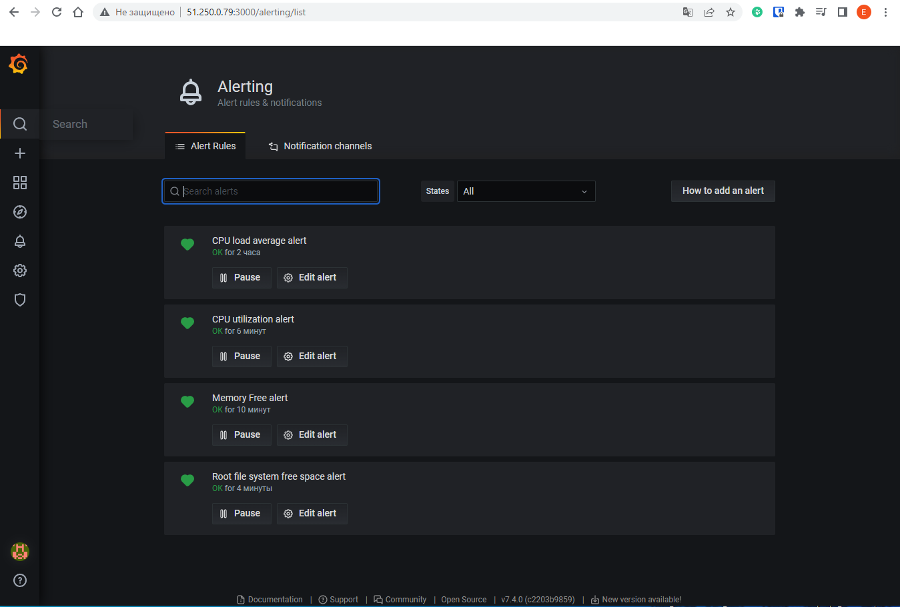
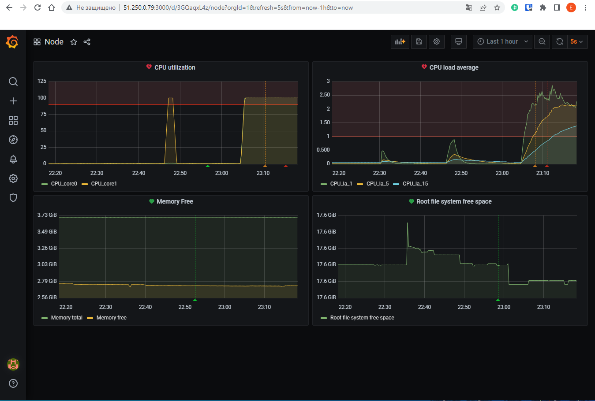

# Домашнее задание к занятию 10.3 «Средство визуализации Grafana»

## Обязательные задания

## Задание 1

1. Используя директорию help внутри этого домашнего задания, запустите связку prometheus-grafana.
2. Зайдите в веб-интерфейс grafana, используя авторизационные данные, указанные в манифесте docker-compose.
3. Подключите поднятый вами prometheus, как источник данных.
4. Решение домашнего задания — скриншот веб-интерфейса grafana со списком подключенных Datasource.

### Решение задания 1

* Поднятые docker-контейнеры:
```
[root@grafana ~]# docker ps
CONTAINER ID   IMAGE                       COMMAND                  CREATED       STATUS             PORTS                                       NAMES
c9e1db1c56d0   grafana/grafana:7.4.0       "/run.sh"                9 hours ago   Up 4 seconds       0.0.0.0:3000->3000/tcp, :::3000->3000/tcp   grafana
cdb631baf140   prom/prometheus:v2.24.1     "/bin/prometheus --c…"   9 hours ago   Up About an hour   9090/tcp                                    prometheus
03c1fce46f1d   prom/node-exporter:v1.0.1   "/bin/node_exporter …"   9 hours ago   Up About an hour   9100/tcp                                    nodeexporter
```
* Cкриншот веб-интерфейса `grafana` с подключенным `prometheus` в качестве источника данных:


## Задание 2

Изучите самостоятельно ресурсы:

1. [PromQL tutorial for beginners and humans](https://valyala.medium.com/promql-tutorial-for-beginners-9ab455142085).
2. [Understanding Machine CPU usage](https://www.robustperception.io/understanding-machine-cpu-usage).
3. [Introduction to PromQL, the Prometheus query language](https://grafana.com/blog/2020/02/04/introduction-to-promql-the-prometheus-query-language/).

Создайте Dashboard и в ней создайте Panels:

- утилизация CPU для nodeexporter (в процентах, 100-idle);
- CPULA 1/5/15;
- количество свободной оперативной памяти;
- количество места на файловой системе.

Для решения этого задания приведите promql-запросы для выдачи этих метрик, а также скриншот получившейся Dashboard.

### Решение задания 2
* Promql-запросы для выдачи метрик:
1. утилизация CPU для nodeexporter: `100 - (rate(node_cpu_seconds_total{cpu="0", job="nodeexporter", mode="idle"}[1m]) * 100)` и `100 - (rate(node_cpu_seconds_total{cpu="1", job="nodeexporter", mode="idle"}[1m]) * 100)`
2. CPULA 1/5/15: `node_load1`, `node_load5`, `node_load15`
3. Количество свободной оперативной памяти: `node_memory_MemFree_bytes`
4. Количество места на файловой системе: `node_filesystem_free_bytes{fstype!~"tmpfs|fuse.lxcfs|squashfs|vfat"}`
* Cкриншот получившейся Dashboard:


## Задание 3

1. Создайте для каждой Dashboard подходящее правило alert — можно обратиться к первой лекции в блоке «Мониторинг».
2. В качестве решения задания приведите скриншот вашей итоговой Dashboard.

### Решение задания 3
* Скриншот итоговой Dashboard:

* Скриншот с alert'ами:

* Поднимем утилизацию процессора и проследим срабатывание alert'ов по CPU:
```
[admin@grafana ~]$ md5sum /dev/urandom > /dev/null &
[1] 2674
[admin@grafana ~]$ md5sum /dev/urandom > /dev/null &
[2] 2675
[admin@grafana ~]$ uptime
 20:04:37 up  2:29,  2 users,  load average: 0.16, 0.05, 0.06
[admin@grafana ~]$ uptime
 20:05:30 up  2:30,  2 users,  load average: 1.20, 0.35, 0.17
[admin@grafana ~]$ uptime
 20:07:41 up  2:32,  2 users,  load average: 2.17, 1.04, 0.45
[admin@grafana ~]$ uptime
 20:10:37 up  2:35,  2 users,  load average: 2.45, 1.69, 0.80
```

* Убедимся, что произошло информирование о срабатывании alert'ов по CPU посредством email-рассылки:


## Задание 4

1. Сохраните ваш Dashboard. Для этого перейдите в настройки Dashboard, выберите в боковом меню «JSON MODEL». Далее скопируйте отображаемое json-содержимое в отдельный файл и сохраните его.
2. В качестве решения задания приведите листинг этого файла.

### Решение задания 4
* Файл сохранен через `Share dashboard\Export\Save to file`.
* [dashboard.json](./TASK_10.3/Node-1680985872631.json)


