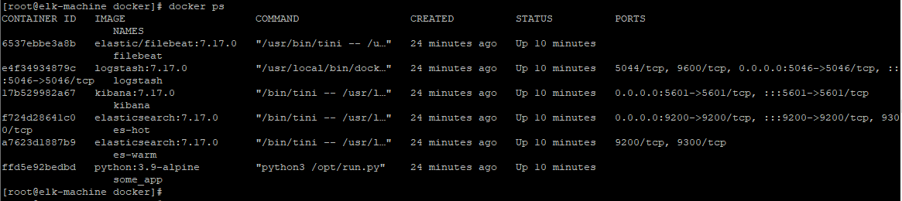
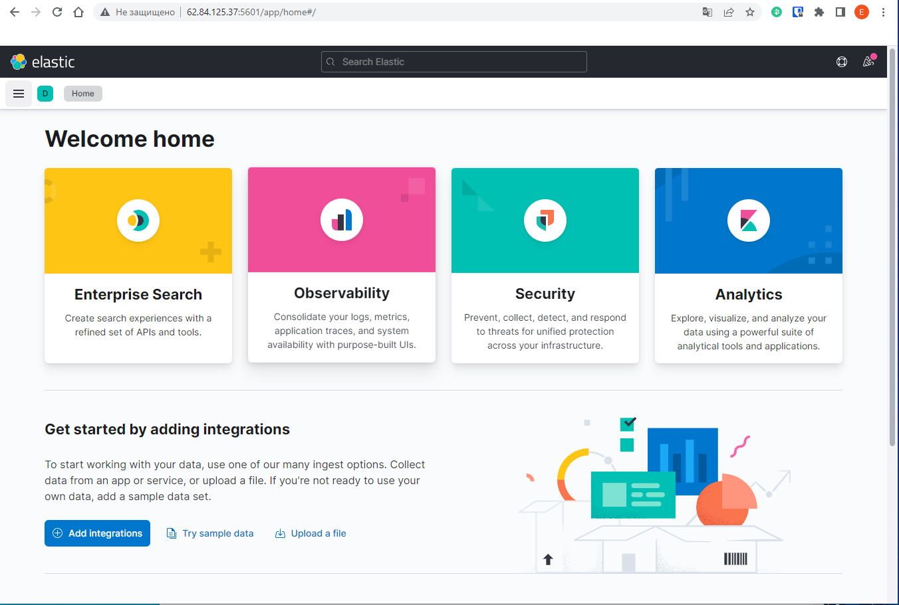
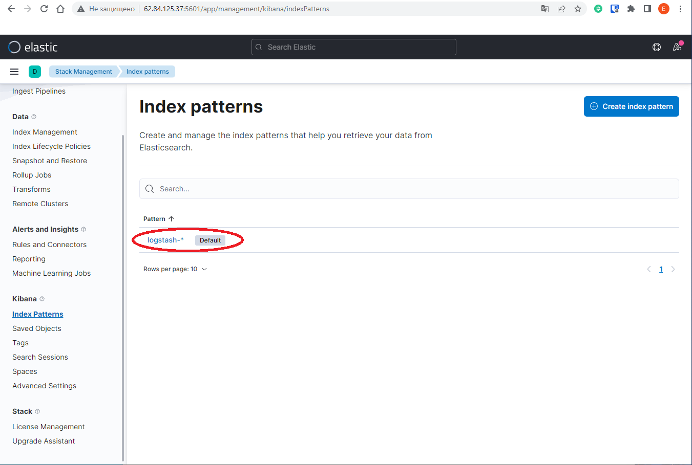
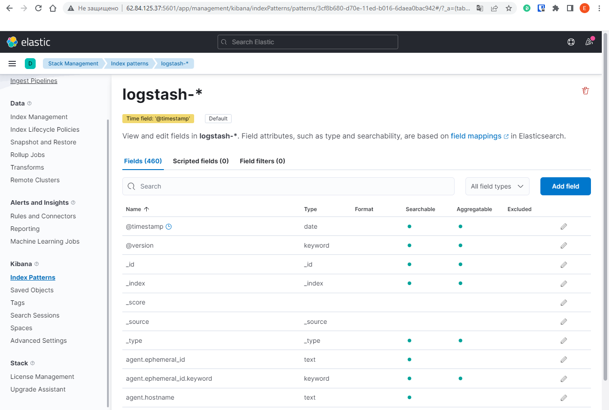
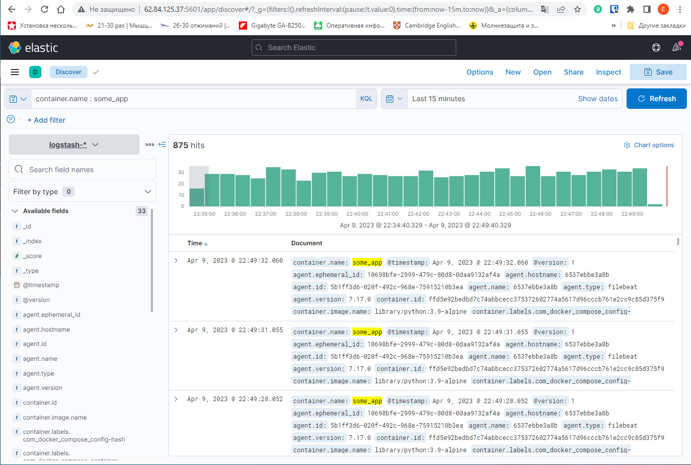
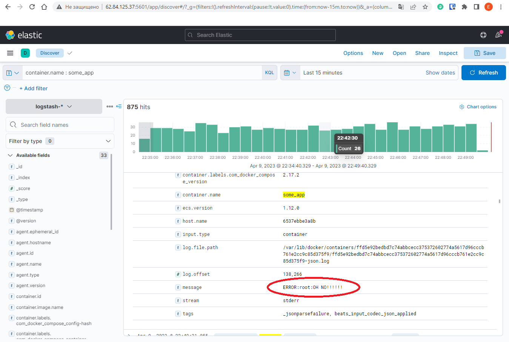

# Домашнее задание к занятию 10.4 «Система сбора логов Elastic Stack»

## Задание 1

Вам необходимо поднять в докере и связать между собой:

- elasticsearch (hot и warm ноды);
- logstash;
- kibana;
- filebeat.

Logstash следует сконфигурировать для приёма по tcp json-сообщений.

Filebeat следует сконфигурировать для отправки логов docker вашей системы в logstash.

В директории help находится манифест docker-compose и конфигурации filebeat/logstash для быстрого 
выполнения этого задания.

Результатом выполнения задания должны быть:

- скриншот `docker ps` через 5 минут после старта всех контейнеров (их должно быть 5);
- скриншот интерфейса kibana;
- docker-compose манифест (если вы не использовали директорию help);
- ваши yml-конфигурации для стека (если вы не использовали директорию help).

## Задание 2

Перейдите в меню создания index-patterns в kibana и создайте несколько index-patterns из имеющихся.

Перейдите в меню просмотра логов в kibana (Discover) и самостоятельно изучите, как отображаются логи и как производить поиск по логам.

В манифесте директории help также приведенно dummy-приложение, которое генерирует рандомные события в stdout-контейнера.
Эти логи должны порождать индекс logstash-* в elasticsearch. Если этого индекса нет — воспользуйтесь советами и источниками из раздела «Дополнительные ссылки» этого задания.
 
## Решение
1. Для поднятия в Docker'e вышеуказанных инструментов выполнялась корректировка файла-манифеста docker-compose:
- Из-за недоступности (без VPN) репозитория `docker.elastic.co` был использован стандартный репозиторий `hub.docker.com` c теми версиями `images`, которые в нем были доступны.
- Для logstash-образа были изменены пути для размещения конфигурационных файлов:
```
      - ./configs/logstash.conf:/usr/share/logstash/pipeline/logstash.conf:Z
      - ./configs/logstash.yml:/usr/share/logstash/config/logstash.yml:Z
```
- Для filebeat-образа добавлен блок, определяющий docker-сеть `elastic`, без которой filebeat не сможет передавать данные в контейнер на базе logstash: `["logstash:5046"]`
- Для filebeat-образа добавлен блок, определяющий дополнительные опции для запуска filebeat-процесса:
```
command:
      - "-e"
      - "--strict.perms=false"
``` 
2. Выполнялась корректировка файла `logstash.conf` для настройки использования filebeat-контейнера в качестве основного источника данных, а также для изменения правила именования лог-сообщений (настроено добавление текущей даты).
3. Cкриншот `docker ps` после старта всех контейнеров:

4. Форматированный вывод команды `docker ps`:
```
[root@elk-machine docker]# docker ps --format 'table {{.Names}}\t{{.RunningFor}}\t{{.Status}}\t{{.Ports}}'
NAMES      CREATED          STATUS          PORTS
filebeat   24 minutes ago   Up 10 minutes
logstash   24 minutes ago   Up 10 minutes   5044/tcp, 9600/tcp, 0.0.0.0:5046->5046/tcp, :::5046->5046/tcp
kibana     24 minutes ago   Up 10 minutes   0.0.0.0:5601->5601/tcp, :::5601->5601/tcp
es-hot     24 minutes ago   Up 10 minutes   0.0.0.0:9200->9200/tcp, :::9200->9200/tcp, 9300/tcp
es-warm    24 minutes ago   Up 10 minutes   9200/tcp, 9300/tcp
some_app   24 minutes ago   Up 10 minutes
```
5. Скриншот интерфейса kibana:

6. Манифест [docker-compose](./TASK_10.4/conf/docker-compose.yml)
7. Конфигурации для стека: [yml-conf](./TASK_10.4/conf)

8. Создаем `index-patterns` в kibana:


9. Переходим в меню просмотра логов kibana (Analytics/Discover) и выполним запрос `container.name : some_app`:

10. Проанализируем некоторые из лог-сообщений и обнаружим строки, генерируемые Python-приложением в контейнере `some_app`:


