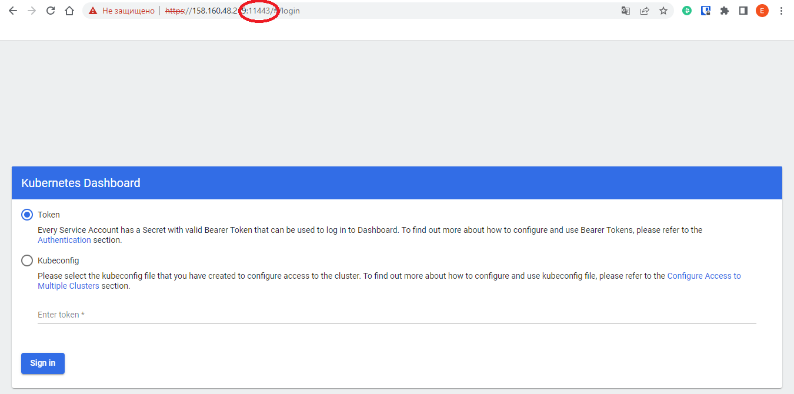
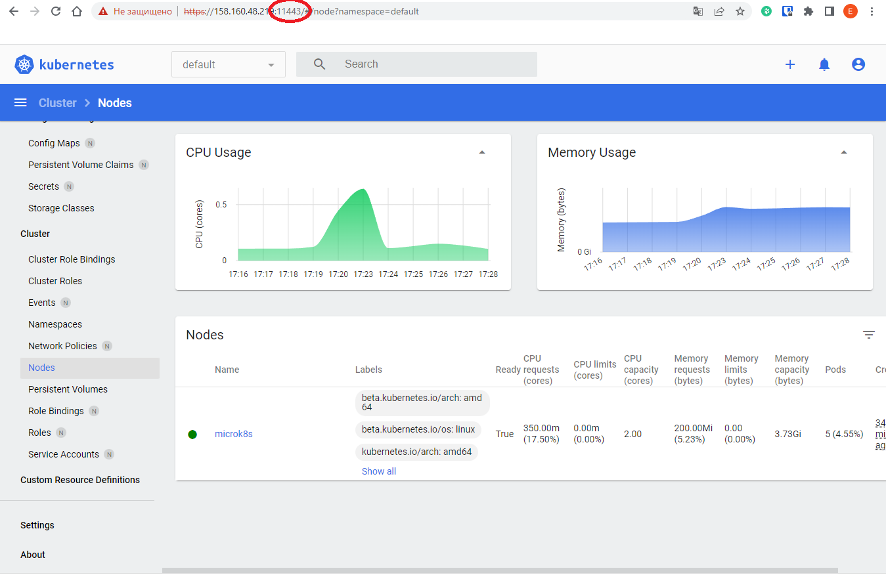
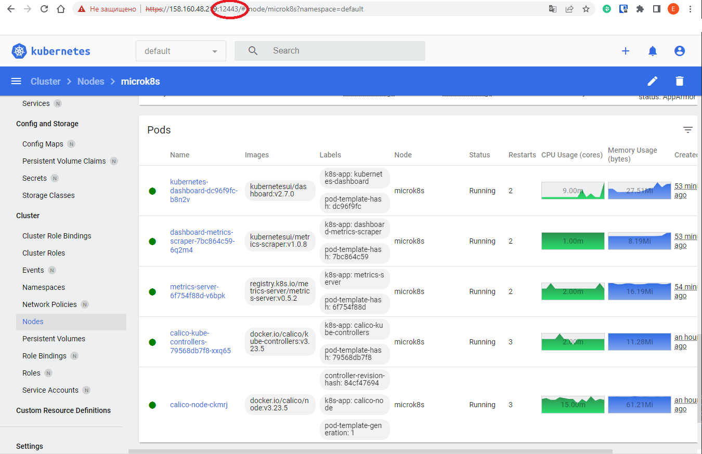

# Домашнее задание к занятию 12.1 «Kubernetes. Причины появления. Команда kubectl»

### Цель задания

Для экспериментов и валидации ваших решений вам нужно подготовить тестовую среду для работы с Kubernetes. Оптимальное решение — развернуть на рабочей машине или на отдельной виртуальной машине MicroK8S.

------

### Чеклист готовности к домашнему заданию

1. Личный компьютер с ОС Linux или MacOS 

или

2. ВМ c ОС Linux в облаке либо ВМ на локальной машине для установки MicroK8S  

------

### Инструкция к заданию

1. Установка MicroK8S:
    - sudo apt update,
    - sudo apt install snapd,
    - sudo snap install microk8s --classic,
    - добавить локального пользователя в группу `sudo usermod -a -G microk8s $USER`,
    - изменить права на папку с конфигурацией `sudo chown -f -R $USER ~/.kube`.

2. Полезные команды:
    - проверить статус `microk8s status --wait-ready`;
    - подключиться к microK8s и получить информацию можно через команду `microk8s command`, например, `microk8s kubectl get nodes`;
    - включить addon можно через команду `microk8s enable`; 
    - список addon `microk8s status`;
    - вывод конфигурации `microk8s config`;
    - проброс порта для подключения локально `microk8s kubectl port-forward -n kube-system service/kubernetes-dashboard 10443:443`.

3. Настройка внешнего подключения:
    - отредактировать файл /var/snap/microk8s/current/certs/csr.conf.template
    ```shell
    # [ alt_names ]
    # Add
    # IP.4 = 123.45.67.89
    ```
    - обновить сертификаты `sudo microk8s refresh-certs --cert front-proxy-client.crt`.

4. Установка kubectl:
    - curl -LO https://storage.googleapis.com/kubernetes-release/release/`curl -s https://storage.googleapis.com/kubernetes-release/release/stable.txt`/bin/linux/amd64/kubectl;
    - chmod +x ./kubectl;
    - sudo mv ./kubectl /usr/local/bin/kubectl;
    - настройка автодополнения в текущую сессию `bash source <(kubectl completion bash)`;
    - добавление автодополнения в командную оболочку bash `echo "source <(kubectl completion bash)" >> ~/.bashrc`.

------

### Инструменты и дополнительные материалы, которые пригодятся для выполнения задания

1. [Инструкция](https://microk8s.io/docs/getting-started) по установке MicroK8S.
2. [Инструкция](https://kubernetes.io/ru/docs/reference/kubectl/cheatsheet/#bash) по установке автодополнения **kubectl**.
3. [Шпаргалка](https://kubernetes.io/ru/docs/reference/kubectl/cheatsheet/) по **kubectl**.

------

### Задание 1. Установка MicroK8S

1. Установить MicroK8S на локальную машину или на удалённую виртуальную машину.
2. Установить dashboard.
3. Сгенерировать сертификат для подключения к внешнему ip-адресу.

------

### Задание 2. Установка и настройка локального kubectl
1. Установить на локальную машину kubectl.
2. Настроить локально подключение к кластеру.
3. Подключиться к дашборду с помощью port-forward.

------

## Решение задания №1

1. Выполнена установка MicroK8S в соответствии с инструкцией, приведенной в самОм задании;
2. Выводим статус microk8s: 
```
admin@microk8s:~$ microk8s status --wait-ready
microk8s is running
high-availability: no
  datastore master nodes: 127.0.0.1:19001
  datastore standby nodes: none
addons:
##############ВЫВОД СОКРАЩЕН##############
```
3. Выводим список нодов, видимых для microk8s:
```
admin@microk8s:~$ microk8s kubectl get nodes
NAME       STATUS   ROLES    AGE    VERSION
microk8s   Ready    <none>   5m3s   v1.26.4
```
4. Выводим конфигурацию microk8s (впоследствии будет использоваться для kubectl):
```
admin@microk8s:~$ microk8s config
apiVersion: v1
clusters:
- cluster:
    certificate-authority-data: LS0...........................tCg==
    server: https://192.168.0.23:16443
  name: microk8s-cluster
contexts:
- context:
    cluster: microk8s-cluster
    user: admin
  name: microk8s
current-context: microk8s
kind: Config
preferences: {}
users:
- name: admin
  user:
    token: WjZ........................z0K
```
5. Включаем dashboard:
```
admin@microk8s:~$ microk8s enable dashboard
Infer repository core for addon dashboard
Enabling Kubernetes Dashboard
Infer repository core for addon metrics-server
Enabling Metrics-Server
##############ВЫВОД СОКРАЩЕН##############
secret/microk8s-dashboard-token created

If RBAC is not enabled access the dashboard using the token retrieved with:

microk8s kubectl describe secret -n kube-system microk8s-dashboard-token

Use this token in the https login UI of the kubernetes-dashboard service.

In an RBAC enabled setup (microk8s enable RBAC) you need to create a user with restricted
permissions as shown in:
https://github.com/kubernetes/dashboard/blob/master/docs/user/access-control/creating-sample-user.md
```
6. Генерируем token для веб-доступа (в соответствии с командой, рекомендованной при включении dashboard'a):
```
admin@microk8s:~$ microk8s kubectl describe secret -n kube-system microk8s-dashboard-token
Name:         microk8s-dashboard-token
Namespace:    kube-system
Labels:       <none>
Annotations:  kubernetes.io/service-account.name: default
              kubernetes.io/service-account.uid: f2eeace1-fb00-4ead-814d-bc003cc81853

Type:  kubernetes.io/service-account-token

Data
====
ca.crt:     1123 bytes
namespace:  11 bytes
token:      ey........................................Mg
```
7. Редактируем конфигурацию, добавляя в нее разрешенные IP-адреса для внешнего подключения:
```
admin@microk8s:~$ vim /var/snap/microk8s/current/certs/csr.conf.template
```
8. Обновляем самоподписной сертификат для работы по https:
```
admin@microk8s:~$ sudo microk8s refresh-certs --cert front-proxy-client.crt
Taking a backup of the current certificates under /var/snap/microk8s/5219/certs-backup/
Creating new certificates
Signature ok
subject=CN = front-proxy-client
Getting CA Private Key
Restarting service kubelite.
```
9. Включаем перенаправление портов для microk8s. Будем использовать для подключения порт 11443:
```
admin@microk8s:~$ microk8s kubectl port-forward -n kube-system service/kubernetes-dashboard --address 0.0.0.0 11443:443
Forwarding from 0.0.0.0:11443 -> 8443
```
10. Предпринимаем попытку подключения (порт используем 11443):

11. Используя сгенерированный ранее token, выполняем аутентификацию:


------

## Решение задания №2
1. Устанавливаем на виртуальную машину kubectl:
```
admin@microk8s:~$ curl -LO https://storage.googleapis.com/kubernetes-release/release/`curl -s https://storage.googleapis.com/kubernetes-release/release/stable.txt`/bin/linux/amd64/kubectl
  % Total    % Received % Xferd  Average Speed   Time    Time     Time  Current
                                 Dload  Upload   Total   Spent    Left  Speed
100 46.9M  100 46.9M    0     0  5688k      0  0:00:08  0:00:08 --:--:-- 9238k

admin@microk8s:~$ chmod +x ./kubectl

admin@microk8s:~$ sudo mv ./kubectl /usr/local/bin/kubectl
```
2. Настраиваем автодополнение ввода для команды kubectl:
```
admin@microk8s:~$ source <(kubectl completion bash)
admin@microk8s:~$
admin@microk8s:~$ echo "source <(kubectl completion bash)" >> ~/.bashrc
admin@microk8s:~$
admin@microk8s:~$ source ~/.bashrc
```
3. Настраиваем локальное подключение к кластеру (используя конфиг от microk8s) и проверяем его доступность через kubectl:
```
admin@microk8s:~$ microk8s config > ~/.kube/config
admin@microk8s:~$
admin@microk8s:~$ kubectl get nodes
NAME       STATUS   ROLES    AGE   VERSION
microk8s   Ready    <none>   52m   v1.26.4
```
4. Также проверяем доступность pod'ов и информацию о кластере:
```
admin@microk8s:~$ kubectl get pods -A
NAMESPACE     NAME                                        READY   STATUS    RESTARTS      AGE
kube-system   kubernetes-dashboard-dc96f9fc-b8n2v         1/1     Running   2 (28m ago)   45m
kube-system   dashboard-metrics-scraper-7bc864c59-6q2m4   1/1     Running   2 (28m ago)   45m
kube-system   calico-kube-controllers-79568db7f8-xxq65    1/1     Running   3 (28m ago)   53m
kube-system   metrics-server-6f754f88d-v6bpk              1/1     Running   2 (28m ago)   46m
kube-system   calico-node-ckmrj                           1/1     Running   3 (28m ago)   53m
admin@microk8s:~$
admin@microk8s:~$ kubectl cluster-info
Kubernetes control plane is running at https://192.168.0.23:16443

To further debug and diagnose cluster problems, use 'kubectl cluster-info dump'.
```
5. Включаем перенаправление портов для kubectl. На этот раз будем использовать для подключения порт 12443:
```
admin@microk8s:~$ kubectl port-forward -n kube-system service/kubernetes-dashboard --address 0.0.0.0 12443:443
Forwarding from 0.0.0.0:12443 -> 8443
Handling connection for 12443
Handling connection for 12443
.......
```
6. Выполняем подключение к дашборду, используя порт 12443:


