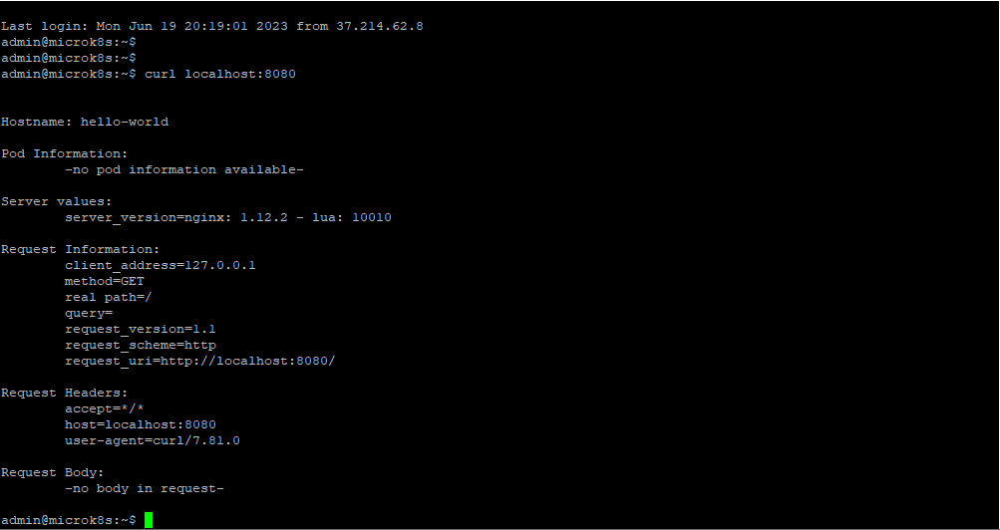
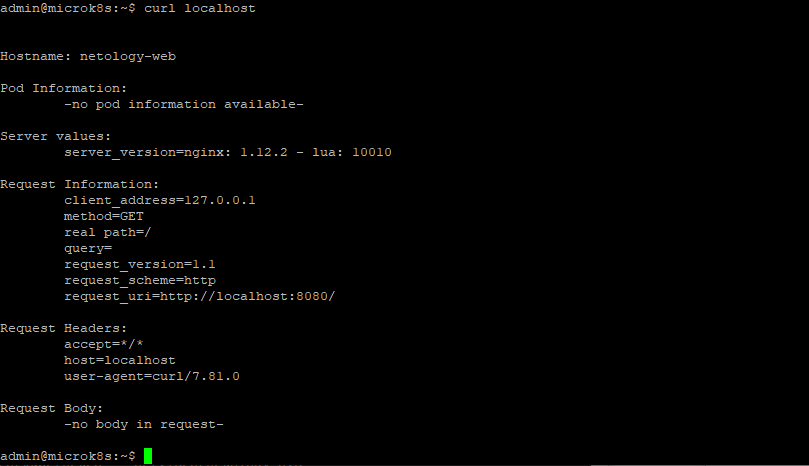

# Домашнее задание к занятию 12.2 «Базовые объекты K8S»

### Цель задания

В тестовой среде для работы с Kubernetes, установленной в предыдущем ДЗ, необходимо развернуть Pod с приложением и подключиться к нему со своего локального компьютера. 

------

### Чеклист готовности к домашнему заданию

1. Установленное k8s-решение (например, MicroK8S).
2. Установленный локальный kubectl.
3. Редактор YAML-файлов с подключенным Git-репозиторием.

------

### Инструменты и дополнительные материалы, которые пригодятся для выполнения задания

1. Описание [Pod](https://kubernetes.io/docs/concepts/workloads/pods/) и примеры манифестов.
2. Описание [Service](https://kubernetes.io/docs/concepts/services-networking/service/).

------

### Задание 1. Создать Pod с именем hello-world

1. Создать манифест (yaml-конфигурацию) Pod.
2. Использовать image - gcr.io/kubernetes-e2e-test-images/echoserver:2.2.
3. Подключиться локально к Pod с помощью `kubectl port-forward` и вывести значение (curl или в браузере).

------

### Задание 2. Создать Service и подключить его к Pod

1. Создать Pod с именем netology-web.
2. Использовать image — gcr.io/kubernetes-e2e-test-images/echoserver:2.2.
3. Создать Service с именем netology-svc и подключить к netology-web.
4. Подключиться локально к Service с помощью `kubectl port-forward` и вывести значение (curl или в браузере).

------

### Решение задания 1.

1. Создаем манифест (yaml-конфигурацию) Pod:
```
admin@microk8s:~$ cat hello-world.yaml
apiVersion: v1
kind: Pod
metadata:
  name: hello-world
  labels:
    app: hello-world
spec:
  containers:
  - name: hello-world
    image: gcr.io/kubernetes-e2e-test-images/echoserver:2.2
    ports:
     - containerPort: 8080
```
2. Был использован image - gcr.io/kubernetes-e2e-test-images/echoserver:2.2.
3. Применяем написанную yaml-конфигурацию:
```
admin@microk8s:~$ kubectl apply -f hello-world.yaml
pod/hello-world created
```
4. Убеждаемся в успешности создания пода:
```
admin@microk8s:~$ kubectl get pods -n default
NAME          READY   STATUS    RESTARTS   AGE
hello-world   1/1     Running   0          62s
```
5. Включаем проброс портов для пода:
```
admin@microk8s:~$ kubectl port-forward hello-world 8080:8080
Forwarding from 127.0.0.1:8080 -> 8080
Forwarding from [::1]:8080 -> 8080
```
6. Тестируем доступность ресурса с использованием curl:
```
admin@microk8s:~$ curl localhost:8080


Hostname: hello-world

Pod Information:
        -no pod information available-

Server values:
        server_version=nginx: 1.12.2 - lua: 10010

Request Information:
        client_address=127.0.0.1
        method=GET
        real path=/
        query=
        request_version=1.1
        request_scheme=http
        request_uri=http://localhost:8080/

Request Headers:
        accept=*/*
        host=localhost:8080
        user-agent=curl/7.81.0

Request Body:
        -no body in request-
```
7. Подтверждаем доступность ресурса скриншотом:


8. Удаляем созданный Pod:
```
admin@microk8s:~$ kubectl delete pod hello-world
pod "hello-world" deleted
admin@microk8s:~$ kubectl get pods
No resources found in default namespace.
```

------

### Решение задания 2.

1. Создаем pod с именем netology-web:
```
admin@microk8s:~$ cat netology-web.yaml
apiVersion: v1
kind: Pod
metadata:
  name: netology-web
  labels:
    app: netology-web
spec:
  containers:
  - name: netology-web
    image: gcr.io/kubernetes-e2e-test-images/echoserver:2.2
    ports:
    - containerPort: 8080
```
2. Применяем написанную yaml-конфигурацию:
```
admin@microk8s:~$ kubectl apply -f netology-web.yaml
pod/netology-web created
```

3. Убеждаемся в успешности создания пода:
```
admin@microk8s:~$ kubectl get pods -n default
NAME           READY   STATUS    RESTARTS   AGE
netology-web   1/1     Running   0          2m56s
```

4. Создаем Service с именем netology-svc и подключением к netology-web.
```
admin@microk8s:~$ cat netology-svc.yaml
apiVersion: v1
kind: Service
metadata:
  name: netology-svc
spec:
  ports:
  - name: web
    port: 8081
    protocol: TCP
    targetPort: 8080
  selector:
    app: netology-web
```

5. Применяем написанную yaml-конфигурацию для сервиса:
```
admin@microk8s:~$ kubectl apply -f netology-svc.yaml
service/netology-svc created
```

6. Проверяем доступность сервиса:
```
admin@microk8s:~$ kubectl get service
NAME           TYPE        CLUSTER-IP       EXTERNAL-IP   PORT(S)    AGE
kubernetes     ClusterIP   10.152.183.1     <none>        443/TCP    23d
netology-svc   ClusterIP   10.152.183.185   <none>        8082/TCP   9m22s
```

7. Включаем проброс портов для сервиса:
```
admin@microk8s:~$ kubectl port-forward services/netology-svc 80:8081
Forwarding from 127.0.0.1:80 -> 8080
Forwarding from [::1]:80 -> 8080
```

8. Тестируем доступность ресурса с использованием curl:
```
admin@microk8s:~$ curl localhost


Hostname: netology-web

Pod Information:
        -no pod information available-

Server values:
        server_version=nginx: 1.12.2 - lua: 10010

Request Information:
        client_address=127.0.0.1
        method=GET
        real path=/
        query=
        request_version=1.1
        request_scheme=http
        request_uri=http://localhost:8080/

Request Headers:
        accept=*/*
        host=localhost
        user-agent=curl/7.81.0

Request Body:
        -no body in request-

```

9. Подтверждаем доступность ресурса скриншотом:


10. Удаляем сервис и Pod:
```
admin@microk8s:~$ kubectl delete service/netology-svc
service "netology-svc" deleted
admin@microk8s:~$ kubectl delete -f netology-web.yaml
pod "netology-web" deleted
admin@microk8s:~$ kubectl get pods
No resources found in default namespace.
admin@microk8s:~$ kubectl get service
NAME         TYPE        CLUSTER-IP     EXTERNAL-IP   PORT(S)   AGE
kubernetes   ClusterIP   10.152.183.1   <none>        443/TCP   24d
```

------
### Конфигурационные файлы:
[hello-world.yaml](./TASK_12.2/hello-world.yaml)
[netology-web.yaml](./TASK_12.2/netology-web.yaml)
[netology-svc.yaml](./TASK_12.2/netology-svc.yaml)
