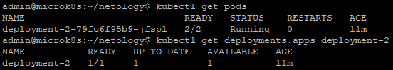
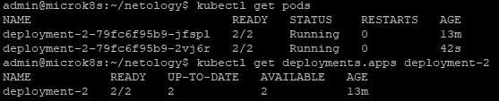
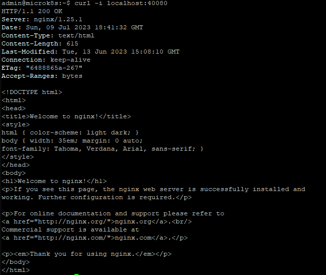
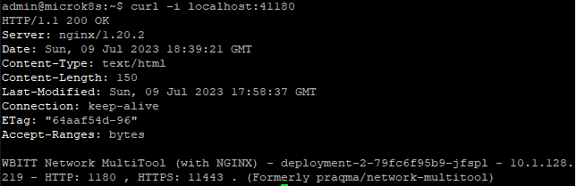
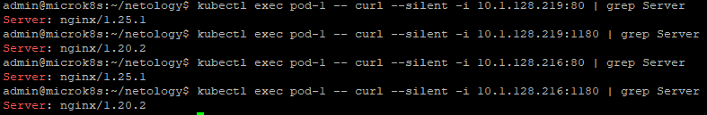
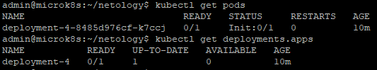
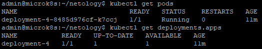

# Домашнее задание к занятию 12.3 «Запуск приложений в K8S»

### Цель задания

В тестовой среде для работы с Kubernetes, установленной в предыдущем ДЗ, необходимо развернуть Deployment с приложением, состоящим из нескольких контейнеров, и масштабировать его.

------

### Задание 1. Создать Deployment и обеспечить доступ к репликам приложения из другого Pod

1. Создать Deployment приложения, состоящего из двух контейнеров — nginx и multitool. Решить возникшую ошибку.
2. После запуска увеличить количество реплик работающего приложения до 2.
3. Продемонстрировать количество подов до и после масштабирования.
4. Создать Service, который обеспечит доступ до реплик приложений из п.1.
5. Создать отдельный Pod с приложением multitool и убедиться с помощью `curl`, что из пода есть доступ до приложений из п.1.

------

### Решение задания 1.
1. Создаем Deployment приложения, состоящего из двух контейнеров — nginx и multitool. Подготовим следующее yaml-описание в файле [deployment-1.yaml](./TASK_12.3/deployment-1.yaml):
```
---
apiVersion: apps/v1
kind: Deployment
metadata:
  name: deployment-1
  labels:
    app: deployment-1
spec:
  replicas: 1
  selector:
    matchLabels:
      app: deployment-1
  template:
    metadata:
      labels:
        app: deployment-1
    spec:
      containers:
        - name: nginx
          image: nginx
        - name: multitool
          image: wbitt/network-multitool
```

* Убеждаемся, что в текущем кластере kubernetes нет лишних запущенных Pods, ReplicaSets, Deployments и Services:
```
admin@microk8s:~/netology$ kubectl get all
NAME                 TYPE        CLUSTER-IP     EXTERNAL-IP   PORT(S)   AGE
service/kubernetes   ClusterIP   10.152.183.1   <none>        443/TCP   43d
```
* Далее запускаем развертывание Deployment (из двух контейнеров: nginx и multitool) из вышеописанного файла [deployment-1.yaml](./TASK_12.3/deployment-1.yaml):
```
admin@microk8s:~/netology$ kubectl create -f deployment-1.yaml
deployment.apps/deployment-1 created
```
* Наблюдаем за развертыванием Deployment и сталкиваемся с ошибкой:
```
admin@microk8s:~/netology$ kubectl get deployments.apps
NAME           READY   UP-TO-DATE   AVAILABLE   AGE
deployment-1   0/1     1            0           12s
admin@microk8s:~/netology$ kubectl get pods
NAME                            READY   STATUS    RESTARTS   AGE
deployment-1-546759d599-mh5dj   2/2     Running   0          42s
admin@microk8s:~/netology$
admin@microk8s:~/netology$ kubectl get pods
NAME                            READY   STATUS   RESTARTS      AGE
deployment-1-546759d599-mh5dj   1/2     Error    2 (18s ago)   65s
```
* Проверяем логи развертывания Deployment:
```
admin@microk8s:~/netology$ kubectl logs --tail=10 --all-containers=true --prefix=true deployment-1-546759d599-mh5dj
[pod/deployment-1-546759d599-mh5dj/nginx] /docker-entrypoint.sh: Launching /docker-entrypoint.d/30-tune-worker-processes.sh
[pod/deployment-1-546759d599-mh5dj/nginx] /docker-entrypoint.sh: Configuration complete; ready for start up
[pod/deployment-1-546759d599-mh5dj/nginx] 2023/07/09 17:16:42 [notice] 1#1: using the "epoll" event method
[pod/deployment-1-546759d599-mh5dj/nginx] 2023/07/09 17:16:42 [notice] 1#1: nginx/1.25.1
[pod/deployment-1-546759d599-mh5dj/nginx] 2023/07/09 17:16:42 [notice] 1#1: built by gcc 12.2.0 (Debian 12.2.0-14)
[pod/deployment-1-546759d599-mh5dj/nginx] 2023/07/09 17:16:42 [notice] 1#1: OS: Linux 5.15.0-75-generic
[pod/deployment-1-546759d599-mh5dj/nginx] 2023/07/09 17:16:42 [notice] 1#1: getrlimit(RLIMIT_NOFILE): 65536:65536
[pod/deployment-1-546759d599-mh5dj/nginx] 2023/07/09 17:16:42 [notice] 1#1: start worker processes
[pod/deployment-1-546759d599-mh5dj/nginx] 2023/07/09 17:16:42 [notice] 1#1: start worker process 29
[pod/deployment-1-546759d599-mh5dj/nginx] 2023/07/09 17:16:42 [notice] 1#1: start worker process 30
[pod/deployment-1-546759d599-mh5dj/multitool] 2023/07/09 17:17:58 [emerg] 1#1: bind() to 0.0.0.0:80 failed (98: Address in use)
[pod/deployment-1-546759d599-mh5dj/multitool] nginx: [emerg] bind() to 0.0.0.0:80 failed (98: Address in use)
[pod/deployment-1-546759d599-mh5dj/multitool] 2023/07/09 17:17:58 [emerg] 1#1: bind() to 0.0.0.0:80 failed (98: Address in use)
[pod/deployment-1-546759d599-mh5dj/multitool] nginx: [emerg] bind() to 0.0.0.0:80 failed (98: Address in use)
[pod/deployment-1-546759d599-mh5dj/multitool] 2023/07/09 17:17:58 [emerg] 1#1: bind() to 0.0.0.0:80 failed (98: Address in use)
[pod/deployment-1-546759d599-mh5dj/multitool] nginx: [emerg] bind() to 0.0.0.0:80 failed (98: Address in use)
[pod/deployment-1-546759d599-mh5dj/multitool] 2023/07/09 17:17:58 [emerg] 1#1: bind() to 0.0.0.0:80 failed (98: Address in use)
[pod/deployment-1-546759d599-mh5dj/multitool] nginx: [emerg] bind() to 0.0.0.0:80 failed (98: Address in use)
[pod/deployment-1-546759d599-mh5dj/multitool] 2023/07/09 17:17:58 [emerg] 1#1: still could not bind()
[pod/deployment-1-546759d599-mh5dj/multitool] nginx: [emerg] still could not bind()
```
* Делаем вывод об ошибке, в соответствии с которой контейнер multitool не может использовать порт 80 по умолчанию, поскольку он занят другим контейнером (nginx). На странице с [описанием](https://github.com/wbitt/Network-MultiTool) Multitool в такой ситуации рекомендуется использовать экстра аргументы с переменными окружения.
Остановим неработающий Deployment:
```
admin@microk8s:~/netology$ kubectl delete -f deployment-1.yaml
deployment.apps "deployment-1" deleted
```
* Опишем новый yaml-файл [deployment-2.yaml](./TASK_12.3/deployment-2.yaml) с переменными окружения для контейнера multitool:
```
---
apiVersion: apps/v1
kind: Deployment
metadata:
  name: deployment-2
  labels:
    app: deployment-2
spec:
  replicas: 1
  selector:
    matchLabels:
      app: deployment-2
  template:
    metadata:
      labels:
        app: deployment-2
    spec:
      containers:
        - name: nginx
          image: nginx
        - name: multitool
          image: wbitt/network-multitool
          env:
            - name: HTTP_PORT
              value: "1180"
            - name: HTTPS_PORT
              value: "11443"
```
* Выполним запуск Deployment из исправленного yaml-файла:
```
admin@microk8s:~/netology$ kubectl create -f deployment-2.yaml
deployment.apps/deployment-2 created
```
* Проверяем успешность запуска Deployment и Pods:
```
admin@microk8s:~/netology$ kubectl get deployments.apps
NAME           READY   UP-TO-DATE   AVAILABLE   AGE
deployment-2   1/1     1            1           11s
admin@microk8s:~/netology$ kubectl get pods
NAME                            READY   STATUS    RESTARTS   AGE
deployment-2-79fc6f95b9-jfspl   2/2     Running   0          20s
admin@microk8s:~/netology$ kubectl get pods
NAME                            READY   STATUS    RESTARTS   AGE
deployment-2-79fc6f95b9-jfspl   2/2     Running   0          118s
```
* Из вывода команды `kubectl logs` видно, что прежних ошибок нет:
```
admin@microk8s:~/netology$ kubectl logs --tail=10 --all-containers=true --prefix=true deployment-2-79fc6f95b9-jfspl
[pod/deployment-2-79fc6f95b9-jfspl/nginx] /docker-entrypoint.sh: Launching /docker-entrypoint.d/30-tune-worker-processes.sh
[pod/deployment-2-79fc6f95b9-jfspl/nginx] /docker-entrypoint.sh: Configuration complete; ready for start up
[pod/deployment-2-79fc6f95b9-jfspl/nginx] 2023/07/09 17:58:36 [notice] 1#1: using the "epoll" event method
[pod/deployment-2-79fc6f95b9-jfspl/nginx] 2023/07/09 17:58:36 [notice] 1#1: nginx/1.25.1
[pod/deployment-2-79fc6f95b9-jfspl/nginx] 2023/07/09 17:58:36 [notice] 1#1: built by gcc 12.2.0 (Debian 12.2.0-14)
[pod/deployment-2-79fc6f95b9-jfspl/nginx] 2023/07/09 17:58:36 [notice] 1#1: OS: Linux 5.15.0-75-generic
[pod/deployment-2-79fc6f95b9-jfspl/nginx] 2023/07/09 17:58:36 [notice] 1#1: getrlimit(RLIMIT_NOFILE): 65536:65536
[pod/deployment-2-79fc6f95b9-jfspl/nginx] 2023/07/09 17:58:36 [notice] 1#1: start worker processes
[pod/deployment-2-79fc6f95b9-jfspl/nginx] 2023/07/09 17:58:36 [notice] 1#1: start worker process 29
[pod/deployment-2-79fc6f95b9-jfspl/nginx] 2023/07/09 17:58:36 [notice] 1#1: start worker process 30
[pod/deployment-2-79fc6f95b9-jfspl/multitool] Therefore, over-writing the default index.html file with some useful information:
[pod/deployment-2-79fc6f95b9-jfspl/multitool] WBITT Network MultiTool (with NGINX) - deployment-2-79fc6f95b9-jfspl - 10.1.128.219 - HTTP: 1180 , HTTPS: 11443 . (Formerly praqma/network-multitool)
[pod/deployment-2-79fc6f95b9-jfspl/multitool] Replacing default HTTP port (80) with the value specified by the user - (HTTP_PORT: 1180).
[pod/deployment-2-79fc6f95b9-jfspl/multitool] Replacing default HTTPS port (443) with the value specified by the user - (HTTPS_PORT: 11443).
```
2. После запуска увеличим количество реплик работающего приложения до 2 (в yaml-файле [deployment-3.yaml](./TASK_12.3/deployment-3.yaml)) с теми же метками `app: deployment-2`:
```
---
apiVersion: apps/v1
kind: Deployment
metadata:
  name: deployment-2
  labels:
    app: deployment-2
spec:
  replicas: 2
  selector:
    matchLabels:
      app: deployment-2
  template:
    metadata:
      labels:
        app: deployment-2
    spec:
      containers:
        - name: nginx
          image: nginx
        - name: multitool
          image: wbitt/network-multitool
          env:
            - name: HTTP_PORT
              value: "1180"
            - name: HTTPS_PORT
              value: "11443"
```
3. Применим yaml-файл [deployment-3.yaml](./TASK_12.3/deployment-3.yaml) и продемонстрируем количество подов до и после масштабирования:
```
admin@microk8s:~/netology$ kubectl get pods
NAME                            READY   STATUS    RESTARTS   AGE
deployment-2-79fc6f95b9-jfspl   2/2     Running   0          11m
admin@microk8s:~/netology$ kubectl get deployments.apps deployment-2
NAME           READY   UP-TO-DATE   AVAILABLE   AGE
deployment-2   1/1     1            1           11m
admin@microk8s:~/netology$ kubectl apply -f deployment-3.yaml
deployment.apps/deployment-2 configured
admin@microk8s:~/netology$ kubectl get pods
NAME                            READY   STATUS    RESTARTS   AGE
deployment-2-79fc6f95b9-jfspl   2/2     Running   0          13m
deployment-2-79fc6f95b9-2vj6r   2/2     Running   0          42s
admin@microk8s:~/netology$ kubectl get deployments.apps deployment-2
NAME           READY   UP-TO-DATE   AVAILABLE   AGE
deployment-2   2/2     2            2           13m
```
* Подтвердим результат скриншотами: 
* До масштабирования 
* После масштабирования 

4. Создаем Service, который обеспечит доступ до реплик приложений из п.1. Опишем сервис в yaml-файле [service-1.yaml](./TASK_12.3/service-1.yaml):
```
---
apiVersion: v1
kind: Service
metadata:
  name: service-1
spec:
  selector:
    app: deployment-2
  ports:
    - name: nginx-http
      port: 80
      targetPort: 80
    - name: multitool-http
      port: 1180
      targetPort: 1180
    - name: multitool-https
      port: 11443
      targetPort: 11443
```
* Запускаем развертывание сервиса и проверяем его состояние:
```
admin@microk8s:~/netology$ kubectl create -f service-1.yaml
service/service-1 created
admin@microk8s:~/netology$ kubectl get services
NAME         TYPE        CLUSTER-IP      EXTERNAL-IP   PORT(S)                     AGE
kubernetes   ClusterIP   10.152.183.1    <none>        443/TCP                     43d
service-1    ClusterIP   10.152.183.68   <none>        80/TCP,1180/TCP,11443/TCP   12s
```
* Проверяем работу HTTP-портов для обоих контейнеров внутри пода:
* Для nginx:
```
admin@microk8s:~/netology$ kubectl port-forward services/service-1 40080:80
Forwarding from 127.0.0.1:40080 -> 80
Forwarding from [::1]:40080 -> 80
Handling connection for 40080
```
* Для multitool:
```
admin@microk8s:~/netology$ kubectl port-forward services/service-1 41180:1180
Forwarding from 127.0.0.1:41180 -> 1180
Forwarding from [::1]:41180 -> 1180
Handling connection for 41180
```
* Подтвердим результат скриншотами: 
* Обращение к nginx 
* Обращение к multitool
5. Создаем отдельный Pod с приложением multitool. Опишем Pod в yaml-файле [pod-1.yaml](./TASK_12.3/pod-1.yaml):
```
---
apiVersion: v1
kind: Pod
metadata:
  name: pod-1
  labels:
    app: pod-1
spec:
  containers:
    - name: multitool
      image: wbitt/network-multitool
      env:
        - name: HTTP_PORT
          value: "1080"
        - name: HTTPS_PORT
          value: "10443"
```
* Запускаем Pod:
```
admin@microk8s:~/netology$ kubectl create -f pod-1.yaml
pod/pod-1 created
admin@microk8s:~/netology$ kubectl get pods
NAME                            READY   STATUS    RESTARTS   AGE
deployment-2-79fc6f95b9-jfspl   2/2     Running   0          54m
deployment-2-79fc6f95b9-2vj6r   2/2     Running   0          41m
pod-1                           1/1     Running   0          8s
```
* Проверяем с помощью `curl`, что из пода есть доступ до приложений из п.1.:
```
admin@microk8s:~/netology$ kubectl get pods -o wide
NAME                            READY   STATUS    RESTARTS   AGE     IP             NODE       NOMINATED NODE   READINESS GATES
deployment-2-79fc6f95b9-jfspl   2/2     Running   0          57m     10.1.128.219   microk8s   <none>           <none>
deployment-2-79fc6f95b9-2vj6r   2/2     Running   0          44m     10.1.128.216   microk8s   <none>           <none>
pod-1                           1/1     Running   0          2m32s   10.1.128.220   microk8s   <none>           <none>
admin@microk8s:~/netology$ kubectl exec pod-1 -- curl --silent -i 10.1.128.219:80 | grep Server
Server: nginx/1.25.1
admin@microk8s:~/netology$ kubectl exec pod-1 -- curl --silent -i 10.1.128.219:1180 | grep Server
Server: nginx/1.20.2
admin@microk8s:~/netology$ kubectl exec pod-1 -- curl --silent -i 10.1.128.216:80 | grep Server
Server: nginx/1.25.1
admin@microk8s:~/netology$ kubectl exec pod-1 -- curl --silent -i 10.1.128.216:1180 | grep Server
Server: nginx/1.20.2
```
* Видим, что pod-1 имеет доступ к открытым портам других подов. Подтвердим результат скриншотом: 

6. Удалим развернутые ресурсы (Deployment, Service и Pod):
```
admin@microk8s:~/netology$ kubectl delete -f deployment-3.yaml -f service-1.yaml -f pod-1.yaml
deployment.apps "deployment-2" deleted
service "service-1" deleted
pod "pod-1" deleted
admin@microk8s:~/netology$ kubectl get all
NAME                 TYPE        CLUSTER-IP     EXTERNAL-IP   PORT(S)   AGE
service/kubernetes   ClusterIP   10.152.183.1   <none>        443/TCP   43d
```

------

### Задание 2. Создать Deployment и обеспечить старт основного контейнера при выполнении условий

1. Создать Deployment приложения nginx и обеспечить старт контейнера только после того, как будет запущен сервис этого приложения.
2. Убедиться, что nginx не стартует. В качестве Init-контейнера взять busybox.
3. Создать и запустить Service. Убедиться, что Init запустился.
4. Продемонстрировать состояние пода до и после запуска сервиса.

------

### Решение задания 2.

1. Создаем Deployment приложения nginx и описываем старт контейнера только после того, как будет запущен сервис этого приложения. Запуск сервиса будет отслеживаться из Init-контейнера busybox. Опишем Deployment в yaml-файле [deployment-4.yaml](./TASK_12.3/deployment-4.yaml):
```
---
apiVersion: apps/v1
kind: Deployment
metadata:
  name: deployment-4
  labels:
    app: deployment-4
spec:
  replicas: 1
  selector:
    matchLabels:
      app: deployment-4
  template:
    metadata:
      labels:
        app: deployment-4
    spec:
      containers:
        - name: nginx
          image: nginx
      initContainers:
        - name: busybox
          image: busybox
          command: ['sh', '-c', 'until nslookup service-2.default.svc.cluster.local; do echo Waiting for service-2!; sleep 5; done;']
```
* Включаем поддержку DNS
```
admin@microk8s:~/netology$ microk8s enable dns
Infer repository core for addon dns
Enabling DNS
Using host configuration from /run/systemd/resolve/resolv.conf
Applying manifest
serviceaccount/coredns created
configmap/coredns created
deployment.apps/coredns created
service/kube-dns created
clusterrole.rbac.authorization.k8s.io/coredns created
clusterrolebinding.rbac.authorization.k8s.io/coredns created
Restarting kubelet
DNS is enabled
```

2. Развертываем Deployment и убеждаемся, что контейнер nginx не стартует. 
```
admin@microk8s:~/netology$ kubectl create -f deployment-4.yaml
deployment.apps/deployment-4 created
admin@microk8s:~/netology$ kubectl get pods
NAME                            READY   STATUS     RESTARTS   AGE
deployment-4-8485d976cf-k7ccj   0/1     Init:0/1   0          46s
```
* Проверяем логи Пода:
```
admin@microk8s:~/netology$ kubectl logs --tail=10 --all-containers=true --prefix=true deployment-4-8485d976cf-k7ccj
[pod/deployment-4-8485d976cf-k7ccj/busybox]
[pod/deployment-4-8485d976cf-k7ccj/busybox] Waiting for service-2!
[pod/deployment-4-8485d976cf-k7ccj/busybox] Server:             10.152.183.10
[pod/deployment-4-8485d976cf-k7ccj/busybox] Address:    10.152.183.10:53
[pod/deployment-4-8485d976cf-k7ccj/busybox]
[pod/deployment-4-8485d976cf-k7ccj/busybox] ** server can't find service-2.default.svc.cluster.local: NXDOMAIN
[pod/deployment-4-8485d976cf-k7ccj/busybox]
[pod/deployment-4-8485d976cf-k7ccj/busybox] ** server can't find service-2.default.svc.cluster.local: NXDOMAIN
[pod/deployment-4-8485d976cf-k7ccj/busybox]
[pod/deployment-4-8485d976cf-k7ccj/busybox] Waiting for service-2!
Error from server (BadRequest): container "nginx" in pod "deployment-4-8485d976cf-k7ccj" is waiting to start: PodInitializing
```
3. Создаем Service. Опишем Service в yaml-файле [service-2.yaml](./TASK_12.3/service-2.yaml):
```
---
apiVersion: v1
kind: Service
metadata:
  name: service-2
spec:
  selector:
    app: deployment-4
  ports:
    - name: nginx-http
      port: 80
      targetPort: 80
```
4. Запустим сервис. Продемонстрируем состояние пода до и после запуска сервиса:
```
admin@microk8s:~/netology$ kubectl get pods
NAME                            READY   STATUS     RESTARTS   AGE
deployment-4-8485d976cf-k7ccj   0/1     Init:0/1   0          10m
admin@microk8s:~/netology$ kubectl get deployments.apps
NAME           READY   UP-TO-DATE   AVAILABLE   AGE
deployment-4   0/1     1            0           10m
admin@microk8s:~/netology$ kubectl create -f service-2.yaml
service/service-2 created
admin@microk8s:~/netology$ kubectl get pods
NAME                            READY   STATUS    RESTARTS   AGE
deployment-4-8485d976cf-k7ccj   1/1     Running   0          11m
admin@microk8s:~/netology$ kubectl get deployments.apps
NAME           READY   UP-TO-DATE   AVAILABLE   AGE
deployment-4   1/1     1            1           11m
```
* Проверяем логи Пода:
```
admin@microk8s:~/netology$ kubectl logs --tail=10 --all-containers=true --prefix=true deployment-4-8485d976cf-k7ccj
[pod/deployment-4-8485d976cf-k7ccj/busybox] ** server can't find service-2.default.svc.cluster.local: NXDOMAIN
[pod/deployment-4-8485d976cf-k7ccj/busybox]
[pod/deployment-4-8485d976cf-k7ccj/busybox] Waiting for service-2!
[pod/deployment-4-8485d976cf-k7ccj/busybox] Server:             10.152.183.10
[pod/deployment-4-8485d976cf-k7ccj/busybox] Address:    10.152.183.10:53
[pod/deployment-4-8485d976cf-k7ccj/busybox]
[pod/deployment-4-8485d976cf-k7ccj/busybox]
[pod/deployment-4-8485d976cf-k7ccj/busybox] Name:       service-2.default.svc.cluster.local
[pod/deployment-4-8485d976cf-k7ccj/busybox] Address: 10.152.183.195
[pod/deployment-4-8485d976cf-k7ccj/busybox]
[pod/deployment-4-8485d976cf-k7ccj/nginx] /docker-entrypoint.sh: Launching /docker-entrypoint.d/30-tune-worker-processes.sh
[pod/deployment-4-8485d976cf-k7ccj/nginx] /docker-entrypoint.sh: Configuration complete; ready for start up
[pod/deployment-4-8485d976cf-k7ccj/nginx] 2023/07/09 19:39:10 [notice] 1#1: using the "epoll" event method
[pod/deployment-4-8485d976cf-k7ccj/nginx] 2023/07/09 19:39:10 [notice] 1#1: nginx/1.25.1
[pod/deployment-4-8485d976cf-k7ccj/nginx] 2023/07/09 19:39:10 [notice] 1#1: built by gcc 12.2.0 (Debian 12.2.0-14)
[pod/deployment-4-8485d976cf-k7ccj/nginx] 2023/07/09 19:39:10 [notice] 1#1: OS: Linux 5.15.0-75-generic
[pod/deployment-4-8485d976cf-k7ccj/nginx] 2023/07/09 19:39:10 [notice] 1#1: getrlimit(RLIMIT_NOFILE): 65536:65536
[pod/deployment-4-8485d976cf-k7ccj/nginx] 2023/07/09 19:39:10 [notice] 1#1: start worker processes
[pod/deployment-4-8485d976cf-k7ccj/nginx] 2023/07/09 19:39:10 [notice] 1#1: start worker process 29
[pod/deployment-4-8485d976cf-k7ccj/nginx] 2023/07/09 19:39:10 [notice] 1#1: start worker process 30
```
* Pod `deployment-4-8485d976cf-k7ccj` c контейнером `nginx` успешно запустился.
* Подтвердим результат скриншотами: 
* Состояние Пода до запуска сервиса 
* Состояние Пода после запуска сервиса 
5. Удалим развернутые ресурсы (Deployment и Service):
```
admin@microk8s:~/netology$ kubectl delete -f deployment-4.yaml -f service-2.yaml
deployment.apps "deployment-4" deleted
service "service-2" deleted
admin@microk8s:~/netology$ kubectl get all
NAME                 TYPE        CLUSTER-IP     EXTERNAL-IP   PORT(S)   AGE
service/kubernetes   ClusterIP   10.152.183.1   <none>        443/TCP   43d
```

