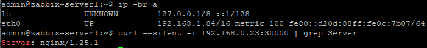

# Домашнее задание к занятию 12.4 «Сетевое взаимодействие в K8S. Часть 1»

### Цель задания

В тестовой среде Kubernetes необходимо обеспечить доступ к приложению, установленному в предыдущем ДЗ и состоящему из двух контейнеров, по разным портам в разные контейнеры как внутри кластера, так и снаружи.

### Задание 1. Создать Deployment и обеспечить доступ к контейнерам приложения по разным портам из другого Pod внутри кластера

1. Создать Deployment приложения, состоящего из двух контейнеров (nginx и multitool), с количеством реплик 3 шт.
2. Создать Service, который обеспечит доступ внутри кластера до контейнеров приложения из п.1 по порту 9001 — nginx 80, по 9002 — multitool 8080.
3. Создать отдельный Pod с приложением multitool и убедиться с помощью `curl`, что из пода есть доступ до приложения из п.1 по разным портам в разные контейнеры.
4. Продемонстрировать доступ с помощью `curl` по доменному имени сервиса.
5. Предоставить манифесты Deployment и Service в решении, а также скриншоты или вывод команды п.4.

------

### Решение задания 1.
1. Создаем Deployment приложения, состоящего из двух контейнеров (nginx и multitool), с количеством реплик 3 шт. Подготовим следующее yaml-описание в файле [deployment-1.yaml](./TASK_12.4/deployment-1.yaml):
```
---
apiVersion: apps/v1
kind: Deployment
metadata:
  name: deployment-1
  labels:
    app: deployment-1
spec:
  replicas: 3
  selector:
    matchLabels:
      app: deployment-1
  template:
    metadata:
      labels:
        app: deployment-1
    spec:
      containers:
        - name: nginx
          image: nginx
        - name: multitool
          image: wbitt/network-multitool
          env:
            - name: HTTP_PORT
              value: "8080"
            - name: HTTPS_PORT
              value: "11443"
```
* Убеждаемся, что в текущем кластере kubernetes нет лишних запущенных Pods, ReplicaSets, Deployments и Services:
```
admin@microk8s:~/netology/TASK_12.4$ kubectl get all
NAME                 TYPE        CLUSTER-IP     EXTERNAL-IP   PORT(S)   AGE
service/kubernetes   ClusterIP   10.152.183.1   <none>        443/TCP   49d
```
* Далее запускаем развертывание Deployment (из двух контейнеров: nginx и multitool) из вышеописанного файла [deployment-1.yaml](./TASK_12.4/deployment-1.yaml):
```
admin@microk8s:~/netology/TASK_12.4$ kubectl create -f deployment-1.yaml
deployment.apps/deployment-1 created
admin@microk8s:~/netology/TASK_12.4$ kubectl get pods
NAME                          READY   STATUS    RESTARTS   AGE
deployment-1-c79c95bd-jgmnv   2/2     Running   0          19s
deployment-1-c79c95bd-8k4fg   2/2     Running   0          19s
deployment-1-c79c95bd-w8ppd   2/2     Running   0          19s
```
2. Создаем Service, который обеспечит доступ внутри кластера до контейнеров приложения из п.1 по порту 9001 — nginx 80, по 9002 — multitool 8080. Подготовим следующее yaml-описание в файле [service-1.yaml](./TASK_12.4/service-1.yaml):
```
---
apiVersion: v1
kind: Service
metadata:
  name: service-1
spec:
  selector:
    app: deployment-1
  ports:
    - name: nginx-http
      port: 9001
      targetPort: 80
    - name: multitool-http
      port: 9002
      targetPort: 8080
```
* Запускаем развертывание сервиса и проверяем его состояние:
```
admin@microk8s:~/netology/TASK_12.4$ kubectl create -f service-1.yaml
service/service-1 created
admin@microk8s:~/netology/TASK_12.4$ kubectl get services
NAME         TYPE        CLUSTER-IP       EXTERNAL-IP   PORT(S)             AGE
kubernetes   ClusterIP   10.152.183.1     <none>        443/TCP             49d
service-1    ClusterIP   10.152.183.101   <none>        9001/TCP,9002/TCP   11s
```
3. Создаем отдельный Pod с приложением multitool и убеждаемся с помощью `curl`, что из пода есть доступ до приложения из п.1 по разным портам в разные контейнеры. 
* Подготовим следующее yaml-описание в файле [pod-1.yaml](./TASK_12.4/pod-1.yaml):
```
---
apiVersion: v1
kind: Pod
metadata:
  name: pod-1
  labels:
    app: pod-1
spec:
  containers:
    - name: multitool
      image: wbitt/network-multitool
      env:
        - name: HTTP_PORT
          value: "1080"
        - name: HTTPS_PORT
          value: "10443"
```
* Запускаем Pod:
```
admin@microk8s:~/netology/TASK_12.4$ kubectl create -f pod-1.yaml
pod/pod-1 created
admin@microk8s:~/netology/TASK_12.4$ kubectl get pods
NAME                          READY   STATUS    RESTARTS   AGE
deployment-1-c79c95bd-jgmnv   2/2     Running   0          18m
deployment-1-c79c95bd-8k4fg   2/2     Running   0          18m
deployment-1-c79c95bd-w8ppd   2/2     Running   0          18m
pod-1                         1/1     Running   0          9s
```
* Проверяем с помощью `curl`, что из пода есть доступ до приложений из п.1.(по разным портам в разные контейнеры):
```
admin@microk8s:~/netology/TASK_12.4$ kubectl get pods -o wide
NAME                          READY   STATUS    RESTARTS   AGE   IP             NODE       NOMINATED NODE   READINESS GATES
deployment-1-c79c95bd-jgmnv   2/2     Running   0          19m   10.1.128.236   microk8s   <none>           <none>
deployment-1-c79c95bd-8k4fg   2/2     Running   0          19m   10.1.128.234   microk8s   <none>           <none>
deployment-1-c79c95bd-w8ppd   2/2     Running   0          19m   10.1.128.237   microk8s   <none>           <none>
pod-1                         1/1     Running   0          75s   10.1.128.228   microk8s   <none>           <none>
admin@microk8s:~/netology/TASK_12.4$ kubectl exec pod-1 -- curl --silent -i 10.1.128.236:80 | grep Server
Server: nginx/1.25.1
admin@microk8s:~/netology/TASK_12.4$ kubectl exec pod-1 -- curl --silent -i 10.1.128.236:8080 | grep Server
Server: nginx/1.20.2
admin@microk8s:~/netology/TASK_12.4$ kubectl exec pod-1 -- curl --silent -i 10.1.128.234:80 | grep Server
Server: nginx/1.25.1
admin@microk8s:~/netology/TASK_12.4$ kubectl exec pod-1 -- curl --silent -i 10.1.128.234:8080 | grep Server
Server: nginx/1.20.2
admin@microk8s:~/netology/TASK_12.4$ kubectl exec pod-1 -- curl --silent -i 10.1.128.237:80 | grep Server
Server: nginx/1.25.1
admin@microk8s:~/netology/TASK_12.4$ kubectl exec pod-1 -- curl --silent -i 10.1.128.237:8080 | grep Server
Server: nginx/1.20.2
```
* Видим, что pod-1 имеет доступ к открытым портам других подов. Подтвердим результат скриншотом: 

* Проверяем с помощью `curl`, что из пода есть доступ до приложений из п.1. через сервис (по портам 9001 и 9002):
```
admin@microk8s:~/netology/TASK_12.4$ kubectl get services
NAME         TYPE        CLUSTER-IP       EXTERNAL-IP   PORT(S)             AGE
kubernetes   ClusterIP   10.152.183.1     <none>        443/TCP             49d
service-1    ClusterIP   10.152.183.101   <none>        9001/TCP,9002/TCP   14m
admin@microk8s:~/netology/TASK_12.4$ kubectl exec pod-1 -- curl --silent -i 10.152.183.101:9001 | grep Server
Server: nginx/1.25.1
admin@microk8s:~/netology/TASK_12.4$ kubectl exec pod-1 -- curl --silent -i 10.152.183.101:9002 | grep Server
Server: nginx/1.20.2
```
* Видим, что pod-1 имеет доступ к открытым портам сервиса. Подтвердим результат скриншотом: 

4. Продемонстрируем доступ с помощью `curl` по доменному имени сервиса (и по короткому, и по полному):
```
admin@microk8s:~/netology/TASK_12.4$ kubectl exec pod-1 -- curl --silent -i service-1:9001 | grep Server
Server: nginx/1.25.1
admin@microk8s:~/netology/TASK_12.4$ kubectl exec pod-1 -- curl --silent -i service-1:9002 | grep Server
Server: nginx/1.20.2
admin@microk8s:~/netology/TASK_12.4$ kubectl exec pod-1 -- curl --silent -i service-1.default.svc.cluster.local:9001 | grep Server
Server: nginx/1.25.1
admin@microk8s:~/netology/TASK_12.4$ kubectl exec pod-1 -- curl --silent -i service-1.default.svc.cluster.local:9002 | grep Server
Server: nginx/1.20.2
```
* Подтвердим результат скриншотом: 

5. Все манифесты представлены в файлах: 
[deployment-1.yaml](./TASK_12.4/deployment-1.yaml),
[service-1.yaml](./TASK_12.4/service-1.yaml),
[pod-1.yaml](./TASK_12.4/pod-1.yaml).
6. Удалим лишние ресурсы (service-1 и pod-1):
```
admin@microk8s:~/netology/TASK_12.4$ kubectl delete -f service-1.yaml
service "service-1" deleted
admin@microk8s:~/netology/TASK_12.4$ kubectl delete -f pod-1.yaml
pod "pod-1" deleted
admin@microk8s:~/netology/TASK_12.4$
admin@microk8s:~/netology/TASK_12.4$ kubectl get pods
NAME                          READY   STATUS    RESTARTS   AGE
deployment-1-c79c95bd-jgmnv   2/2     Running   0          52m
deployment-1-c79c95bd-8k4fg   2/2     Running   0          52m
deployment-1-c79c95bd-w8ppd   2/2     Running   0          52m
admin@microk8s:~/netology/TASK_12.4$ kubectl get services
NAME         TYPE        CLUSTER-IP     EXTERNAL-IP   PORT(S)   AGE
kubernetes   ClusterIP   10.152.183.1   <none>        443/TCP   49d
```

------

### Задание 2. Создать Service и обеспечить доступ к приложениям снаружи кластера

1. Создать отдельный Service приложения из Задания 1 с возможностью доступа снаружи кластера к nginx, используя тип NodePort.
2. Продемонстрировать доступ с помощью браузера или `curl` с локального компьютера.
3. Предоставить манифест и Service в решении, а также скриншоты или вывод команды п.2.

------

### Решение задания 2.
1. Создаем отдельный Service приложения из Задания 1 с возможностью доступа снаружи кластера к nginx, используя тип NodePort. Подготовим следующее yaml-описание в файле [service-2.yaml](./TASK_12.4/service-2.yaml):
```
---
apiVersion: v1
kind: Service
metadata:
  name: service-2
spec:
  type: NodePort
  selector:
    app: deployment-1
  ports:
    - name: nginx-http
      port: 9001
      targetPort: 80
      nodePort: 30000
```
* Запускаем развертывание сервиса и проверяем его состояние:
```
admin@microk8s:~/netology/TASK_12.4$ kubectl create -f service-2.yaml
service/service-2 created
admin@microk8s:~/netology/TASK_12.4$ kubectl get services
NAME         TYPE        CLUSTER-IP       EXTERNAL-IP   PORT(S)          AGE
kubernetes   ClusterIP   10.152.183.1     <none>        443/TCP          49d
service-2    NodePort    10.152.183.106   <none>        9001:30000/TCP   11s
```
2. Продемонстрируем доступ с помощью `curl` с локального компьютера (в качестве локального компьютера возьмем zabbix-sever1 с IP 192.168.1.84/16):
* Определим внешний IP-адрес ноды:
```
admin@microk8s:~/netology/TASK_12.4$ kubectl get nodes -o yaml | grep IPv4Addr
      projectcalico.org/IPv4Address: 192.168.0.23/16
```
* Проверим доступ с помощью `curl` с локального компьютера:
```
admin@zabbix-server1:~$ ip -br a
lo               UNKNOWN        127.0.0.1/8 ::1/128
eth0             UP             192.168.1.84/16 metric 100 fe80::d20d:88ff:fe0c:7b07/64
admin@zabbix-server1:~$ curl --silent -i 192.168.0.23:30000 | grep Server
Server: nginx/1.25.1
```
* Подтвердим результат скриншотом: 

3. Манифест представлен в файле [service-2.yaml](./TASK_12.4/service-2.yaml).
4. Удалим созданные ресурсы:
```
admin@microk8s:~/netology/TASK_12.4$ kubectl delete -f service-2.yaml
service "service-2" deleted
admin@microk8s:~/netology/TASK_12.4$ kubectl delete -f deployment-1.yaml
deployment.apps "deployment-1" deleted
admin@microk8s:~/netology/TASK_12.4$ kubectl get all
NAME                 TYPE        CLUSTER-IP     EXTERNAL-IP   PORT(S)   AGE
service/kubernetes   ClusterIP   10.152.183.1   <none>        443/TCP   49d
```
