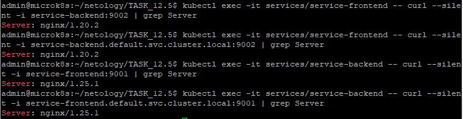
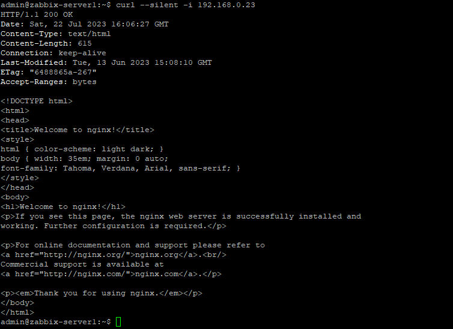
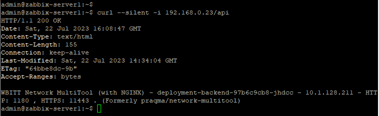

# Домашнее задание к занятию 12.5 «Сетевое взаимодействие в K8S. Часть 2»

### Цель задания

В тестовой среде Kubernetes необходимо обеспечить доступ к двум приложениям снаружи кластера по разным путям.

------

### Задание 1. Создать Deployment приложений backend и frontend

1. Создать Deployment приложения _frontend_ из образа nginx с количеством реплик 3 шт.
2. Создать Deployment приложения _backend_ из образа multitool. 
3. Добавить Service, которые обеспечат доступ к обоим приложениям внутри кластера. 
4. Продемонстрировать, что приложения видят друг друга с помощью Service.
5. Предоставить манифесты Deployment и Service в решении, а также скриншоты или вывод команды п.4.

------

### Решение задания 1.

1. Создаем Deployment приложения _frontend_ из образа nginx с количеством реплик 3 шт.
* Подготовим следующее yaml-описание в файле [deployment-1.yaml](./TASK_12.5/deployment-1.yaml):
```
---
apiVersion: apps/v1
kind: Deployment
metadata:
  name: deployment-frontend
  labels:
    app: deployment-frontend
spec:
  replicas: 3
  selector:
    matchLabels:
      app: deployment-frontend
  template:
    metadata:
      labels:
        app: deployment-frontend
    spec:
      containers:
        - name: nginx
          image: nginx
```
* Запускаем развертывание Deployment приложения _frontend_ и убеждаемся в его успешности:
```
admin@microk8s:~/netology/TASK_12.5$ kubectl create -f deployment-1.yaml
deployment.apps/deployment-frontend created
admin@microk8s:~/netology/TASK_12.5$ kubectl get pods
NAME                                   READY   STATUS    RESTARTS   AGE
deployment-frontend-77d4ddbb9c-kdwqm   1/1     Running   0          21s
deployment-frontend-77d4ddbb9c-5d7xc   1/1     Running   0          21s
deployment-frontend-77d4ddbb9c-wwtbf   1/1     Running   0          21s
admin@microk8s:~/netology/TASK_12.5$ kubectl get deployments.apps
NAME                  READY   UP-TO-DATE   AVAILABLE   AGE
deployment-frontend   3/3     3            3           25s
```
2. Создаем Deployment приложения _backend_ из образа multitool. 
* Подготовим следующее yaml-описание в файле [deployment-2.yaml](./TASK_12.5/deployment-2.yaml):
```
---
apiVersion: apps/v1
kind: Deployment
metadata:
  name: deployment-backend
  labels:
    app: deployment-backend
spec:
  replicas: 1
  selector:
    matchLabels:
      app: deployment-backend
  template:
    metadata:
      labels:
        app: deployment-backend
    spec:
      containers:
        - name: multitool
          image: wbitt/network-multitool
          env:
            - name: HTTP_PORT
              value: "1180"
            - name: HTTPS_PORT
              value: "11443"
```
* Запускаем развертывание Deployment приложения _backend_ и убеждаемся в его успешности:
```
admin@microk8s:~/netology/TASK_12.5$ kubectl create -f deployment-2.yaml
deployment.apps/deployment-backend created
admin@microk8s:~/netology/TASK_12.5$ kubectl get pods
NAME                                   READY   STATUS    RESTARTS   AGE
deployment-frontend-77d4ddbb9c-kdwqm   1/1     Running   0          5m1s
deployment-frontend-77d4ddbb9c-5d7xc   1/1     Running   0          5m1s
deployment-frontend-77d4ddbb9c-wwtbf   1/1     Running   0          5m1s
deployment-backend-97b6c9cb8-jhdcc     1/1     Running   0          27s
admin@microk8s:~/netology/TASK_12.5$ kubectl get deployments.apps
NAME                  READY   UP-TO-DATE   AVAILABLE   AGE
deployment-frontend   3/3     3            3           5m5s
deployment-backend    1/1     1            1           31s
```
3. Создаем Service, которые обеспечат доступ к обоим приложениям внутри кластера.
* Подготовим следующее yaml-описание для приложения _frontend_ в файле [service-frontend.yaml](./TASK_12.5/service-frontend.yaml):
```
---
apiVersion: v1
kind: Service
metadata:
  name: service-frontend
spec:
  selector:
    app: deployment-frontend
  ports:
    - name: nginx-http
      port: 9001
      targetPort: 80
```
* Подготовим следующее yaml-описание для приложения _backend_ в файле [service-backend.yaml](./TASK_12.5/service-backend.yaml):
```
---
apiVersion: v1
kind: Service
metadata:
  name: service-backend
spec:
  selector:
    app: deployment-backend
  ports:
    - name: multitool-http
      port: 9002
      targetPort: 1180
```
* Запускаем развертывание созданных сервисов и убеждаемся в его успешности:
```
admin@microk8s:~/netology/TASK_12.5$ kubectl create -f service-frontend.yaml
service/service-frontend created
admin@microk8s:~/netology/TASK_12.5$ kubectl create -f service-backend.yaml
service/service-backend created
admin@microk8s:~/netology/TASK_12.5$ kubectl get svc
NAME               TYPE        CLUSTER-IP       EXTERNAL-IP   PORT(S)    AGE
kubernetes         ClusterIP   10.152.183.1     <none>        443/TCP    56d
service-frontend   ClusterIP   10.152.183.180   <none>        9001/TCP   75s
service-backend    ClusterIP   10.152.183.241   <none>        9002/TCP   69s
```
4. Проверяем и убеждаемся, что приложения видят друг друга с помощью Service с использованием краткого и полного DNS-имени.
```
admin@microk8s:~/netology/TASK_12.5$ kubectl exec -it services/service-frontend -- curl --silent -i service-backend:9002 | grep Server
Server: nginx/1.20.2
admin@microk8s:~/netology/TASK_12.5$ kubectl exec -it services/service-frontend -- curl --silent -i service-backend.default.svc.cluster.local:9002 | grep Server
Server: nginx/1.20.2
admin@microk8s:~/netology/TASK_12.5$ kubectl exec -it services/service-backend -- curl --silent -i service-frontend:9001 | grep Server
Server: nginx/1.25.1
admin@microk8s:~/netology/TASK_12.5$ kubectl exec -it services/service-backend -- curl --silent -i service-frontend.default.svc.cluster.local:9001 | grep Server
Server: nginx/1.25.1
```
* Видим, что приложения имеют доступ друг к другу с помощью Service.
* Подтвердим результат скриншотом: 


5. Все манифесты представлены в файлах: 
[deployment-1.yaml](./TASK_12.5/deployment-1.yaml),
[deployment-2.yaml](./TASK_12.5/deployment-2.yaml),
[service-frontend.yaml](./TASK_12.5/service-frontend.yaml),
[service-backend.yaml](./TASK_12.5/service-backend.yaml).

------

### Задание 2. Создать Ingress и обеспечить доступ к приложениям снаружи кластера

1. Включить Ingress-controller в MicroK8S.
2. Создать Ingress, обеспечивающий доступ снаружи по IP-адресу кластера MicroK8S так, чтобы при запросе только по адресу открывался _frontend_ а при добавлении /api - _backend_.
3. Продемонстрировать доступ с помощью браузера или `curl` с локального компьютера.
4. Предоставить манифесты и скриншоты или вывод команды п.2.

------

### Решение задания 2.

1. Включаем Ingress-controller в MicroK8S:
```
admin@microk8s:~/netology/TASK_12.5$ microk8s enable ingress
Infer repository core for addon ingress
Enabling Ingress
ingressclass.networking.k8s.io/public created
ingressclass.networking.k8s.io/nginx created
namespace/ingress created
serviceaccount/nginx-ingress-microk8s-serviceaccount created
clusterrole.rbac.authorization.k8s.io/nginx-ingress-microk8s-clusterrole created
role.rbac.authorization.k8s.io/nginx-ingress-microk8s-role created
clusterrolebinding.rbac.authorization.k8s.io/nginx-ingress-microk8s created
rolebinding.rbac.authorization.k8s.io/nginx-ingress-microk8s created
configmap/nginx-load-balancer-microk8s-conf created
configmap/nginx-ingress-tcp-microk8s-conf created
configmap/nginx-ingress-udp-microk8s-conf created
daemonset.apps/nginx-ingress-microk8s-controller created
Ingress is enabled
``` 

2. Создаем Ingress, обеспечивающий доступ снаружи по IP-адресу кластера MicroK8S.
* Подготовим следующее yaml-описание для _Ingress_ в файле [ingress-1.yaml](./TASK_12.5/ingress-1.yaml):
``` 
---
apiVersion: networking.k8s.io/v1
kind: Ingress
metadata:
  name: ingress-1
  annotations:
    nginx.ingress.kubernetes.io/rewrite-target: /
spec:
  rules:
  - http:
      paths:
      - path: /
        pathType: Prefix
        backend:
          service:
            name: service-frontend
            port:
              number: 9001
      - path: /api
        pathType: Prefix
        backend:
          service:
            name: service-backend
            port:
              number: 9002
``` 
* Запускаем развертывание созданного _Ingress_ и убеждаемся в его успешности:
```
admin@microk8s:~/netology/TASK_12.5$ kubectl create -f ingress-1.yaml
ingress.networking.k8s.io/ingress-1 created
admin@microk8s:~/netology/TASK_12.5$ kubectl get ingress
NAME        CLASS    HOSTS   ADDRESS     PORTS   AGE
ingress-1   public   *       127.0.0.1   80      25s
admin@microk8s:~/netology/TASK_12.5$ kubectl describe ingress
Name:             ingress-1
Labels:           <none>
Namespace:        default
Address:          127.0.0.1
Ingress Class:    public
Default backend:  <default>
Rules:
  Host        Path  Backends
  ----        ----  --------
  *
              /      service-frontend:9001 (10.1.128.207:80,10.1.128.209:80,10.1.128.217:80)
              /api   service-backend:9002 (10.1.128.211:1180)
Annotations:  nginx.ingress.kubernetes.io/rewrite-target: /
Events:
  Type    Reason  Age                From                      Message
  ----    ------  ----               ----                      -------
  Normal  Sync    12s (x2 over 37s)  nginx-ingress-controller  Scheduled for sync
```
3. Продемонстрируем доступ с помощью `curl` с локального компьютера (в качестве локального компьютера возьмем zabbix-sever1 с IP 192.168.1.84/16):
* Определим внешний IP-адрес ноды:
```
admin@microk8s:~/netology/TASK_12.5$ kubectl get nodes -o yaml | grep IPv4Addr
      projectcalico.org/IPv4Address: 192.168.0.23/16
```
* Проверим доступ с помощью `curl` с локального компьютера (только по адресу без добавления `/api`):
```
admin@zabbix-server1:~$ curl --silent -i 192.168.0.23
HTTP/1.1 200 OK
Date: Sat, 22 Jul 2023 16:06:27 GMT
Content-Type: text/html
Content-Length: 615
Connection: keep-alive
Last-Modified: Tue, 13 Jun 2023 15:08:10 GMT
ETag: "6488865a-267"
Accept-Ranges: bytes

<!DOCTYPE html>
<html>
<head>
<title>Welcome to nginx!</title>
<style>
html { color-scheme: light dark; }
body { width: 35em; margin: 0 auto;
font-family: Tahoma, Verdana, Arial, sans-serif; }
</style>
</head>
<body>
<h1>Welcome to nginx!</h1>
<p>If you see this page, the nginx web server is successfully installed and
working. Further configuration is required.</p>

<p>For online documentation and support please refer to
<a href="http://nginx.org/">nginx.org</a>.<br/>
Commercial support is available at
<a href="http://nginx.com/">nginx.com</a>.</p>

<p><em>Thank you for using nginx.</em></p>
</body>
</html>
```
* Подтвердим результат скриншотом: 

* Еще раз проверим доступ с помощью `curl` с локального компьютера (по адресу c добавлением `/api`):
```
admin@zabbix-server1:~$ curl --silent -i 192.168.0.23/api
HTTP/1.1 200 OK
Date: Sat, 22 Jul 2023 16:08:47 GMT
Content-Type: text/html
Content-Length: 155
Connection: keep-alive
Last-Modified: Sat, 22 Jul 2023 14:34:04 GMT
ETag: "64bbe8dc-9b"
Accept-Ranges: bytes

WBITT Network MultiTool (with NGINX) - deployment-backend-97b6c9cb8-jhdcc - 10.1.128.211 - HTTP: 1180 , HTTPS: 11443 . (Formerly praqma/network-multitool)
```
* Подтвердим результат скриншотом: 

* Делаем вывод, что:
    + обращение выполняется к frontend-сервису при использовании адреса без `/api`,
    + обращение выполняется к backend-сервису при использовании адреса c `/api`.
4. Манифест представлен в файле: 
[ingress-1.yaml](./TASK_12.5/ingress-1.yaml)
5. Удалим все развернутые ресурсы:
```
admin@microk8s:~/netology/TASK_12.5$ kubectl delete -f ingress-1.yaml
ingress.networking.k8s.io "ingress-1" deleted
admin@microk8s:~/netology/TASK_12.5$ kubectl delete -f service-backend.yaml
service "service-backend" deleted
admin@microk8s:~/netology/TASK_12.5$ kubectl delete -f service-frontend.yaml
service "service-frontend" deleted
admin@microk8s:~/netology/TASK_12.5$ kubectl delete -f deployment-2.yaml
deployment.apps "deployment-backend" deleted
admin@microk8s:~/netology/TASK_12.5$ kubectl delete -f deployment-1.yaml
deployment.apps "deployment-frontend" deleted
admin@microk8s:~/netology/TASK_12.5$ kubectl get all
NAME                 TYPE        CLUSTER-IP     EXTERNAL-IP   PORT(S)   AGE
service/kubernetes   ClusterIP   10.152.183.1   <none>        443/TCP   56d
```
