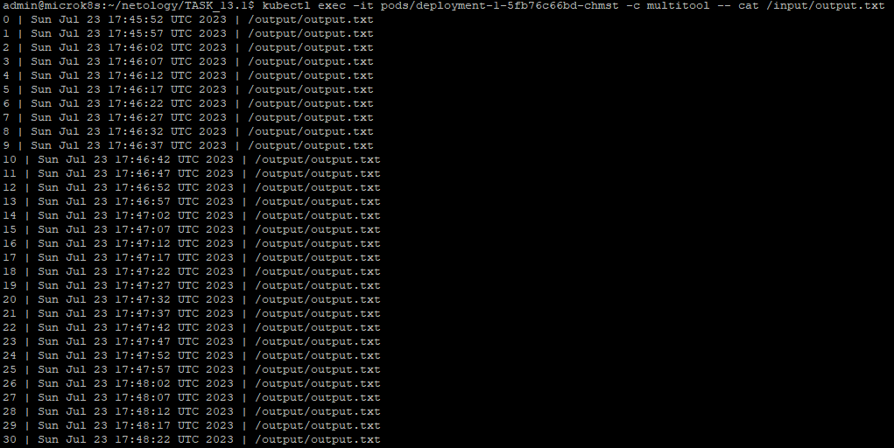
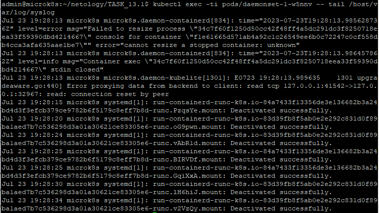

# Домашнее задание к занятию 13.1 «Хранение в K8s. Часть 1»

### Цель задания

В тестовой среде Kubernetes нужно обеспечить обмен файлами между контейнерам пода и доступ к логам ноды.

------

### Задание 1 

**Что нужно сделать**

Создать Deployment приложения, состоящего из двух контейнеров и обменивающихся данными.

1. Создать Deployment приложения, состоящего из контейнеров busybox и multitool.
2. Сделать так, чтобы busybox писал каждые пять секунд в некий файл в общей директории.
3. Обеспечить возможность чтения файла контейнером multitool.
4. Продемонстрировать, что multitool может читать файл, который периодоически обновляется.
5. Предоставить манифесты Deployment в решении, а также скриншоты или вывод команды из п. 4.

------

### Решение задания 1.

1. Создаем Deployment приложения, состоящего из контейнеров busybox и multitool.
2. Делаем так, чтобы busybox писал каждые пять секунд в файл `output.txt` в директории `/output`.
3. Обеспечиваем возможность чтения файла `output.txt` контейнером multitool из директории `/input`.
* Подготовим следующее yaml-описание в файле [deployment-1.yaml](./TASK_13.1/deployment-1.yaml):
```
---
apiVersion: apps/v1
kind: Deployment
metadata:
  name: deployment-1
  labels:
    app: deployment-1
spec:
  replicas: 1
  selector:
    matchLabels:
      app: deployment-1
  template:
    metadata:
      labels:
        app: deployment-1
    spec:
      containers:
        - name: busybox
          image: busybox
          command: ['sh', '-c', 'i=0; while true; do echo "$((i++)) | $(date) | /output/output.txt >> /output/output.txt"; sleep 5s; done']
          volumeMounts:
            - name: volume-1
              mountPath: /output          
        - name: multitool
          image: wbitt/network-multitool
          volumeMounts:
            - name: volume-1
              mountPath: /input          
          env:
            - name: HTTP_PORT
              value: "1180"
            - name: HTTPS_PORT
              value: "11443"
      volumes:
        - name: volume-1
          emptyDir: {}
```
* Запускаем развертывание Deployment приложения и убеждаемся в его успешности:
```
admin@microk8s:~/netology/TASK_13.1$ kubectl create -f deployment-1.yaml
deployment.apps/deployment-1 created
admin@microk8s:~/netology/TASK_13.1$ kubectl get pods
NAME                            READY   STATUS    RESTARTS   AGE
deployment-1-5fb76c66bd-chmst   2/2     Running   0          21s
admin@microk8s:~/netology/TASK_13.1$
admin@microk8s:~/netology/TASK_13.1$ kubectl get deployments.apps
NAME           READY   UP-TO-DATE   AVAILABLE   AGE
deployment-1   1/1     1            1           5m48s
```
4. Продемонстрируем, что multitool может читать файл output.txt, который периодически обновляется.
```
admin@microk8s:~/netology/TASK_13.1$ kubectl exec -it pods/deployment-1-5fb76c66bd-chmst -c multitool -- cat /input/output.txt
0 | Sun Jul 23 17:45:52 UTC 2023 | /output/output.txt
1 | Sun Jul 23 17:45:57 UTC 2023 | /output/output.txt
2 | Sun Jul 23 17:46:02 UTC 2023 | /output/output.txt
----------------ВЫВОД ПРОПУЩЕН------------------------
66 | Sun Jul 23 17:51:22 UTC 2023 | /output/output.txt
67 | Sun Jul 23 17:51:27 UTC 2023 | /output/output.txt
68 | Sun Jul 23 17:51:32 UTC 2023 | /output/output.txt
```
* Подтвердим результат скриншотом: 

5. Манифест представлен в файле: 
[deployment-1.yaml](./TASK_13.1/deployment-1.yaml)
* Удалим развернутые ресурсы:
```
admin@microk8s:~/netology/TASK_13.1$ kubectl delete -f deployment-1.yaml
deployment.apps "deployment-1" deleted
admin@microk8s:~/netology/TASK_13.1$ kubectl get all
NAME                 TYPE        CLUSTER-IP     EXTERNAL-IP   PORT(S)   AGE
service/kubernetes   ClusterIP   10.152.183.1   <none>        443/TCP   57d
```
------

### Задание 2

**Что нужно сделать**

Создать DaemonSet приложения, которое может прочитать логи ноды.

1. Создать DaemonSet приложения, состоящего из multitool.
2. Обеспечить возможность чтения файла `/var/log/syslog` из кластера MicroK8S.
3. Продемонстрировать возможность чтения файла изнутри пода.
4. Предоставить манифесты Deployment, а также скриншоты или вывод команды из п. 2.

------

### Решение задания 2.

1. Создаем DaemonSet приложения, состоящего из multitool.
2. Обеспечиваем возможность чтения файла `/var/log/syslog` из кластера MicroK8S.
* Подготовим следующее yaml-описание в файле [daemonset-1.yaml](./TASK_13.1/daemonset-1.yaml):
```
---
apiVersion: apps/v1
kind: DaemonSet
metadata:
  name: daemonset-1
  labels:
    app: daemonset-1
spec:
  selector:
    matchLabels:
      app: daemonset-1
  template:
    metadata:
      labels:
        app: daemonset-1
    spec:
      containers:
        - name: multitool
          image: wbitt/network-multitool
          volumeMounts:
            - name: volume-2
              mountPath: /host/var/log          
      volumes:
        - name: volume-2
          hostPath:
            path: /var/log
```
* Запускаем развертывание DaemonSet приложения и убеждаемся в его успешности:
```
admin@microk8s:~/netology/TASK_13.1$ kubectl create -f daemonset-1.yaml
daemonset.apps/daemonset-1 created
admin@microk8s:~/netology/TASK_13.1$ kubectl get pods
NAME                READY   STATUS    RESTARTS   AGE
daemonset-1-w5nnv   1/1     Running   0          39s
admin@microk8s:~/netology/TASK_13.1$ kubectl get daemonsets.apps
NAME          DESIRED   CURRENT   READY   UP-TO-DATE   AVAILABLE   NODE SELECTOR   AGE
daemonset-1   1         1         1       1            1           <none>          47s
```
3. Продемонстрируем возможность чтения хостового файла `syslog` изнутри пода.
```
admin@microk8s:~/netology/TASK_13.1$ kubectl exec -ti pods/daemonset-1-w5nnv -- tail /host/var/log/syslog
Jul 23 19:28:13 microk8s microk8s.daemon-containerd[834]: time="2023-07-23T19:28:13.985628736Z" level=error msg="Failed to resize process \"34c7f60f1250d50cc42f48ff4a5dc291dc3f8250718eea33f59390dbd4214667\" console for container \"f1e61665d571ab4a92c1c26549ee6b0c72247c0cf558db4cca3afa635aae1be7\"" error="cannot resize a stopped container: unknown"
Jul 23 19:28:13 microk8s microk8s.daemon-containerd[834]: time="2023-07-23T19:28:13.986457862Z" level=info msg="Container exec \"34c7f60f1250d50cc42f48ff4a5dc291dc3f8250718eea33f59390dbd4214667\" stdin closed"
Jul 23 19:28:13 microk8s microk8s.daemon-kubelite[1301]: E0723 19:28:13.989635    1301 upgradeaware.go:440] Error proxying data from backend to client: read tcp 127.0.0.1:41542->127.0.0.1:32967: read: connection reset by peer
Jul 23 19:28:15 microk8s systemd[1]: run-containerd-runc-k8s.io-84a7433f13356de3e136682b3a24bd4d3f3efcb379ce9782b6f5179c8eff7b8d-runc.PzqsYe.mount: Deactivated successfully.
Jul 23 19:28:20 microk8s systemd[1]: run-containerd-runc-k8s.io-83d39fb8f5ab0e2e292c831d0f89ba1aed7b7c536298d3a01a30621ce83305e6-runc.oG9pwn.mount: Deactivated successfully.
Jul 23 19:28:24 microk8s systemd[1]: run-containerd-runc-k8s.io-83d39fb8f5ab0e2e292c831d0f89ba1aed7b7c536298d3a01a30621ce83305e6-runc.vAbR1d.mount: Deactivated successfully.
Jul 23 19:28:25 microk8s systemd[1]: run-containerd-runc-k8s.io-84a7433f13356de3e136682b3a24bd4d3f3efcb379ce9782b6f5179c8eff7b8d-runc.BIRVDf.mount: Deactivated successfully.
Jul 23 19:28:25 microk8s systemd[1]: run-containerd-runc-k8s.io-84a7433f13356de3e136682b3a24bd4d3f3efcb379ce9782b6f5179c8eff7b8d-runc.GqiXxA.mount: Deactivated successfully.
Jul 23 19:28:30 microk8s systemd[1]: run-containerd-runc-k8s.io-83d39fb8f5ab0e2e292c831d0f89ba1aed7b7c536298d3a01a30621ce83305e6-runc.lH6hiJ.mount: Deactivated successfully.
Jul 23 19:28:34 microk8s systemd[1]: run-containerd-runc-k8s.io-83d39fb8f5ab0e2e292c831d0f89ba1aed7b7c536298d3a01a30621ce83305e6-runc.v2VzQy.mount: Deactivated successfully.
```
* Подтвердим результат скриншотом: 

4. Манифест представлен в файле: 
[daemonset-1.yaml](./TASK_13.1/daemonset-1.yaml)
* Удалим развернутые ресурсы:
```
admin@microk8s:~/netology/TASK_13.1$ kubectl delete -f daemonset-1.yaml
daemonset.apps "daemonset-1" deleted
admin@microk8s:~/netology/TASK_13.1$ kubectl get all
NAME                 TYPE        CLUSTER-IP     EXTERNAL-IP   PORT(S)   AGE
service/kubernetes   ClusterIP   10.152.183.1   <none>        443/TCP   57d
```
