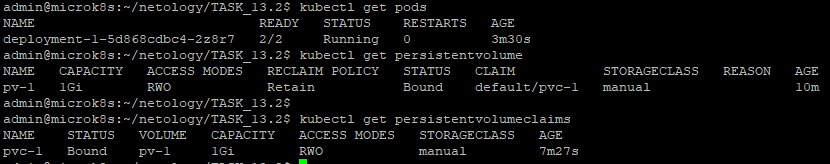
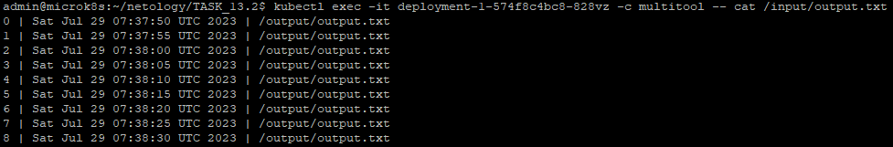
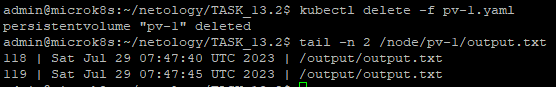
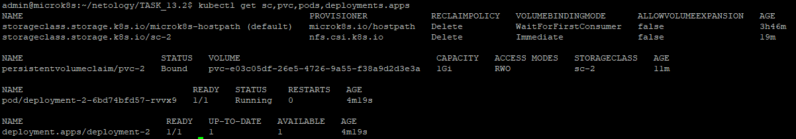
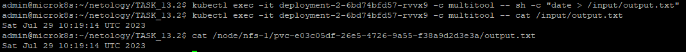

# Домашнее задание к занятию 13.2 «Хранение в K8s. Часть 2»

### Цель задания

В тестовой среде Kubernetes нужно создать PV и продемострировать запись и хранение файлов.

------

### Задание 1

**Что нужно сделать**

Создать Deployment приложения, использующего локальный PV, созданный вручную.

1. Создать Deployment приложения, состоящего из контейнеров busybox и multitool.
2. Создать PV и PVC для подключения папки на локальной ноде, которая будет использована в поде.
3. Продемонстрировать, что multitool может читать файл, в который busybox пишет каждые пять секунд в общей директории. 
4. Удалить Deployment и PVC. Продемонстрировать, что после этого произошло с PV. Пояснить, почему.
5. Продемонстрировать, что файл сохранился на локальном диске ноды. Удалить PV.  Продемонстрировать что произошло с файлом после удаления PV. Пояснить, почему.
6. Предоставить манифесты, а также скриншоты или вывод необходимых команд.

------

### Решение задания 1.

1. Создаем Deployment приложения, состоящего из контейнеров busybox и multitool, которые должны работать с файлом с общей директории. 
* Подготовим следующее yaml-описание в файле [deployment-1.yaml](./TASK_13.2/deployment-1.yaml):
```
---
apiVersion: apps/v1
kind: Deployment
metadata:
  name: deployment-1
  labels:
    app: deployment-1
spec:
  replicas: 1
  selector:
    matchLabels:
      app: deployment-1
  template:
    metadata:
      labels:
        app: deployment-1
    spec:
      containers:
        - name: busybox
          image: busybox
          command: ['sh', '-c', 'i=0; while true; do echo "$((i++)) | $(date) | /output/output.txt >> /output/output.txt"; sleep 5s; done']
          volumeMounts:
            - name: volume-1
              mountPath: /output          
        - name: multitool
          image: wbitt/network-multitool
          volumeMounts:
            - name: volume-1
              mountPath: /input          
          env:
            - name: HTTP_PORT
              value: "1180"
            - name: HTTPS_PORT
              value: "11443"
      volumes:
        - name: volume-1
          persistentVolumeClaim:
            claimName: pvc-1
```
2. Создаем PV и PVC для подключения папки на локальной ноде, которая будет использована в поде.
* Предварительно создадим директорию на локальном хосте для использования в качестве тома:
```
admin@microk8s:~$ sudo mkdir -p /node/pv-1
```
* Включим в mikrok8s поддержку локального хранения
```
admin@microk8s:~$ microk8s enable hostpath-storage
Infer repository core for addon hostpath-storage
Enabling default storage class.
WARNING: Hostpath storage is not suitable for production environments.

deployment.apps/hostpath-provisioner created
storageclass.storage.k8s.io/microk8s-hostpath created
serviceaccount/microk8s-hostpath created
clusterrole.rbac.authorization.k8s.io/microk8s-hostpath created
clusterrolebinding.rbac.authorization.k8s.io/microk8s-hostpath created
Storage will be available soon.
```
* Подготовим следующее yaml-описание для PV в файле [pv-1.yaml](./TASK_13.2/pv-1.yaml):
```
---
apiVersion: v1
kind: PersistentVolume
metadata:
  name: pv-1
  labels:
    app: pv-1
spec:
  accessModes:
    - ReadWriteOnce
  capacity:
    storage: 1Gi
  hostPath:
    path: "/node/pv-1"
```
* Подготовим следующее yaml-описание для PVC в файле [pvc-1.yaml](./TASK_13.2/pvc-1.yaml):
```
---
apiVersion: v1
kind: PersistentVolumeClaim
metadata:
  name: pvc-1
  labels:
    app: pvc-1
spec:
  storageClassName: manual
  accessModes:
    - ReadWriteOnce
  resources:
    requests:
      storage: 1Gi
```
* Запускаем развертывание созданных ресурсов:
```
admin@microk8s:~/netology/TASK_13.2$ kubectl create -f pv-1.yaml
persistentvolume/pv-1 created
admin@microk8s:~/netology/TASK_13.2$ kubectl create -f pvc-1.yaml
persistentvolumeclaim/pvc-1 created
admin@microk8s:~/netology/TASK_13.2$ kubectl create -f deployment-1.yaml
deployment.apps/deployment-1 created
```
* Убеждаемся в успешности развертывания:
```
admin@microk8s:~/netology/TASK_13.2$ kubectl get pods
NAME                            READY   STATUS    RESTARTS   AGE
deployment-1-5d868cdbc4-2z8r7   2/2     Running   0          3m30s
admin@microk8s:~/netology/TASK_13.2$ kubectl get persistentvolume
NAME   CAPACITY   ACCESS MODES   RECLAIM POLICY   STATUS   CLAIM           STORAGECLASS   REASON   AGE
pv-1   1Gi        RWO            Retain           Bound    default/pvc-1   manual                  10m
admin@microk8s:~/netology/TASK_13.2$
admin@microk8s:~/netology/TASK_13.2$ kubectl get persistentvolumeclaims
NAME    STATUS   VOLUME   CAPACITY   ACCESS MODES   STORAGECLASS   AGE
pvc-1   Bound    pv-1     1Gi        RWO            manual         7m27s
```
* Подтвердим успешность развертывания скриншотом: 


3. Продемонстрируем, что multitool может читать файл, в который busybox пишет каждые пять секунд в общей директории.
```
admin@microk8s:~/netology/TASK_13.2$ kubectl exec -it deployment-1-574f8c4bc8-828vz -c multitool -- cat /input/output.txt
0 | Sat Jul 29 07:37:50 UTC 2023 | /output/output.txt
1 | Sat Jul 29 07:37:55 UTC 2023 | /output/output.txt
2 | Sat Jul 29 07:38:00 UTC 2023 | /output/output.txt
---------------ВЫВОД ПРОПУЩЕН-------------------------
62 | Sat Jul 29 07:43:00 UTC 2023 | /output/output.txt
63 | Sat Jul 29 07:43:05 UTC 2023 | /output/output.txt
64 | Sat Jul 29 07:43:10 UTC 2023 | /output/output.txt
```
* Подтвердим успешность чтения скриншотом: 

4. Удалим Deployment и PVC. Продемонстрируем, что после этого произошло с PV.
```
admin@microk8s:~/netology/TASK_13.2$ kubectl delete -f deployment-1.yaml
deployment.apps "deployment-1" deleted
admin@microk8s:~/netology/TASK_13.2$ kubectl delete -f pvc-1.yaml
persistentvolumeclaim "pvc-1" deleted
admin@microk8s:~/netology/TASK_13.2$ kubectl get pv
NAME   CAPACITY   ACCESS MODES   RECLAIM POLICY   STATUS     CLAIM           STORAGECLASS   REASON   AGE
pv-1   1Gi        RWO            Retain           Released   default/pvc-1   manual                  16m
```
После удаления Deployment и PVC статус тома PV поменялся с `Bound` на `Released`. Таким образом, можно утверждать,  
что том PV отвязался от Pod'а.
5. Продемонстрируем, что файл сохранился на локальном диске ноды. 
```
admin@microk8s:~/netology/TASK_13.2$ tail -n 2 /node/pv-1/output.txt
118 | Sat Jul 29 07:47:40 UTC 2023 | /output/output.txt
119 | Sat Jul 29 07:47:45 UTC 2023 | /output/output.txt
```
* Удалим PV. Проверим, остался ли файл:
```
admin@microk8s:~/netology/TASK_13.2$ kubectl delete -f pv-1.yaml
persistentvolume "pv-1" deleted
admin@microk8s:~/netology/TASK_13.2$ tail -n 2 /node/pv-1/output.txt
118 | Sat Jul 29 07:47:40 UTC 2023 | /output/output.txt
119 | Sat Jul 29 07:47:45 UTC 2023 | /output/output.txt
```
* Подтвердим вывод скриншотом: 

* Из вывода видно, что файл остался. Это произошло потому, что для `PersistentVolume` при его создании не задавался параметр `persistentVolumeReclaimPolicy`. Соответственно этому параметру по-умолчанию было присвоено значение `Retain`, что соответствует сохранению файлов в директории, используемой для тома. Если бы параметр `persistentVolumeReclaimPolicy` был установлен в значение `Delete`, при работе с облачными провайдерами файл должен был удалится вместе с удалением `PersistentVolume`.
6. Манифесты представлены в файлах:
[deployment-1.yaml](./TASK_13.2/deployment-1.yaml)
[pv-1.yaml](./TASK_13.2/pv-1.yaml)
[pvс-1.yaml](./TASK_13.2/pvс-1.yaml)

------

### Задание 2

**Что нужно сделать**

Создать Deployment приложения, которое может хранить файлы на NFS с динамическим созданием PV.

1. Включить и настроить NFS-сервер на MicroK8S.
2. Создать Deployment приложения состоящего из multitool, и подключить к нему PV, созданный автоматически на сервере NFS.
3. Продемонстрировать возможность чтения и записи файла изнутри пода. 
4. Предоставить манифесты, а также скриншоты или вывод необходимых команд.

------

### Решение задания 2.

1. Выполняем установку и настройку NFS-сервера на MicroK8S.
* Установим NFS-сервер:
```
admin@microk8s:~$ sudo apt-get install nfs-kernel-server
```
* Создадим директорию и выполним соответствующую настройку NFS-сервера:
```
admin@microk8s:~$ sudo mkdir /node/nfs-1
admin@microk8s:~$ sudo chmod 777 /node/nfs-1
```
```
root@microk8s:~# echo '/node/nfs-1 *(rw,sync,no_subtree_check)' >> /etc/exports
root@microk8s:~# systemctl restart nfs-kernel-server
```
* Установим CSI драйвер для NFS в microk8s:
```
root@microk8s:~# microk8s helm3 repo add csi-driver-nfs https://raw.githubusercontent.com/kubernetes-csi/csi-driver-nfs/master/charts
"csi-driver-nfs" has been added to your repositories
root@microk8s:~# microk8s helm3 repo update
Hang tight while we grab the latest from your chart repositories...
...Successfully got an update from the "csi-driver-nfs" chart repository
Update Complete. ⎈Happy Helming!⎈
root@microk8s:~# microk8s helm3 install csi-driver-nfs csi-driver-nfs/csi-driver-nfs --namespace kube-system --set kubeletDir=/var/snap/microk8s/common/var/lib/kubelet
NAME: csi-driver-nfs
LAST DEPLOYED: Sat Jul 29 09:35:08 2023
NAMESPACE: kube-system
STATUS: deployed
REVISION: 1
TEST SUITE: None
NOTES:
The CSI NFS Driver is getting deployed to your cluster.

To check CSI NFS Driver pods status, please run:

  kubectl --namespace=kube-system get pods --selector="app.kubernetes.io/instance=csi-driver-nfs" --watch
```
2. Создадим Deployment приложения состоящего из multitool, и подключим к нему PV, созданный автоматически на сервере NFS.
* Подготовим следующее yaml-описание для SC в файле [sc-2.yaml](./TASK_13.2/sc-2.yaml):
```
---
apiVersion: storage.k8s.io/v1
kind: StorageClass
metadata:
  name: sc-2
  labels:
    app: sc-2
  namespace: default
provisioner: nfs.csi.k8s.io
parameters:
  server: 192.168.0.23
  share: /node/nfs-1
reclaimPolicy: Delete
volumeBindingMode: Immediate
mountOptions:
  - hard
  - nfsvers=4.1
```
* Выполним развертывание SC и убедимся в его успешности:
```
admin@microk8s:~/netology/TASK_13.2$ kubectl create -f sc-2.yaml
storageclass.storage.k8s.io/sc-2 created
admin@microk8s:~/netology/TASK_13.2$ kubectl get sc
NAME                          PROVISIONER            RECLAIMPOLICY   VOLUMEBINDINGMODE      ALLOWVOLUMEEXPANSION   AGE
microk8s-hostpath (default)   microk8s.io/hostpath   Delete          WaitForFirstConsumer   false                  3h27m
sc-2                          nfs.csi.k8s.io         Delete          Immediate              false                  8s
```
* Подготовим следующее yaml-описание для PVC в файле [pvc-2.yaml](./TASK_13.2/pvc-2.yaml):
```
---
apiVersion: v1
kind: PersistentVolumeClaim
metadata:
  name: pvc-2
  labels:
    app: pvc-2
spec:
  storageClassName: sc-2
  accessModes:
    - ReadWriteOnce
  resources:
    requests:
      storage: 1Gi
```
* Выполним развертывание PVC и убедимся в его успешности:
```
admin@microk8s:~/netology/TASK_13.2$ kubectl create -f pvc-2.yaml
persistentvolumeclaim/pvc-2 created
admin@microk8s:~/netology/TASK_13.2$ kubectl get pvc
NAME    STATUS   VOLUME                                     CAPACITY   ACCESS MODES   STORAGECLASS   AGE
pvc-2   Bound    pvc-e03c05df-26e5-4726-9a55-f38a9d2d3e3a   1Gi        RWO            sc-2           93s
```
* Подготовим следующее yaml-описание для Deployment в файле [deployment-2.yaml](./TASK_13.2/deployment-2.yaml):
```
---
apiVersion: apps/v1
kind: Deployment
metadata:
  name: deployment-2
  labels:
    app: deployment-2
spec:
  replicas: 1
  selector:
    matchLabels:
      app: deployment-2
  template:
    metadata:
      labels:
        app: deployment-2
    spec:
      containers:
        - name: multitool
          image: wbitt/network-multitool
          volumeMounts:
            - name: volume-2
              mountPath: /input          
      volumes:
        - name: volume-2
          persistentVolumeClaim:
            claimName: pvc-2
```
* Выполним развертывание Deployment и убедимся в его успешности:
```
admin@microk8s:~/netology/TASK_13.2$ kubectl create -f deployment-2.yaml
deployment.apps/deployment-2 created
admin@microk8s:~/netology/TASK_13.2$
admin@microk8s:~/netology/TASK_13.2$ kubectl get pods,deployments.apps
NAME                                READY   STATUS    RESTARTS   AGE
pod/deployment-2-6bd74bfd57-rvvx9   1/1     Running   0          2m4s

NAME                           READY   UP-TO-DATE   AVAILABLE   AGE
deployment.apps/deployment-2   1/1     1            1           2m4s
```
* Подтвердим успешность развертывания SC, PVC и Deployment'a скриншотом: 


3. Продемонстрируем возможность чтения и записи файла изнутри пода:
```
admin@microk8s:~/netology/TASK_13.2$ kubectl exec -it deployment-2-6bd74bfd57-rvvx9 -c multitool -- sh -c "date > /input/output.txt"
admin@microk8s:~/netology/TASK_13.2$ kubectl exec -it deployment-2-6bd74bfd57-rvvx9 -c multitool -- cat /input/output.txt
Sat Jul 29 10:19:14 UTC 2023
```
* Продемонстрируем возможность чтения файла на локальном хосте:
```
admin@microk8s:~/netology/TASK_13.2$ cat /node/nfs-1/pvc-e03c05df-26e5-4726-9a55-f38a9d2d3e3a/output.txt
Sat Jul 29 10:19:14 UTC 2023
```
* Подтвердим успешность выполнения команд скриншотом:


4. Манифесты представлены в файлах:
[deployment-2.yaml](./TASK_13.2/deployment-2.yaml)
[sc-2.yaml](./TASK_13.2/sc-2.yaml)
[pvс-2.yaml](./TASK_13.2/pvс-2.yaml)

5. Удалим развернутые ресурсы:
```
admin@microk8s:~/netology/TASK_13.2$ kubectl delete -f deployment-2.yaml
deployment.apps "deployment-2" deleted
admin@microk8s:~/netology/TASK_13.2$ kubectl delete -f pvc-2.yaml
persistentvolumeclaim "pvc-2" deleted
admin@microk8s:~/netology/TASK_13.2$ kubectl delete -f sc-2.yaml
storageclass.storage.k8s.io "sc-2" deleted
admin@microk8s:~/netology/TASK_13.2$ kubectl get sc,pvc,pv,all
NAME                                                      PROVISIONER            RECLAIMPOLICY   VOLUMEBINDINGMODE      ALLOWVOLUMEEXPANSION   AGE
storageclass.storage.k8s.io/microk8s-hostpath (default)   microk8s.io/hostpath   Delete          WaitForFirstConsumer   false                  4h2m

NAME                 TYPE        CLUSTER-IP     EXTERNAL-IP   PORT(S)   AGE
service/kubernetes   ClusterIP   10.152.183.1   <none>        443/TCP   62d
```

