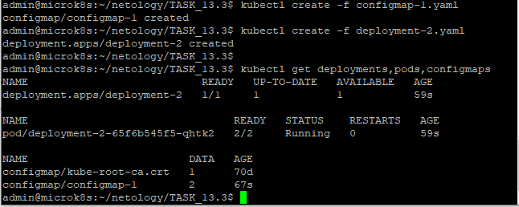
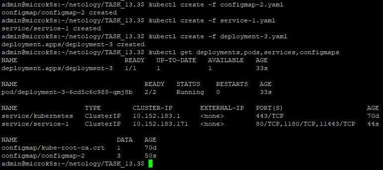
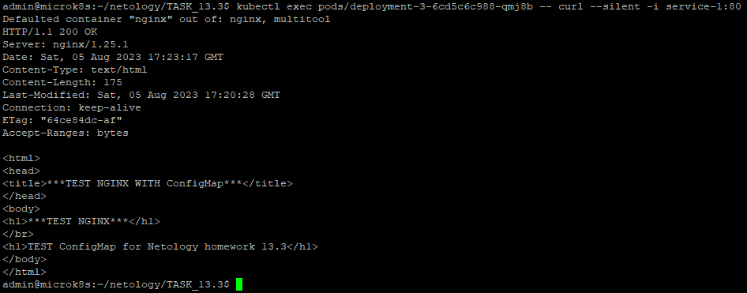
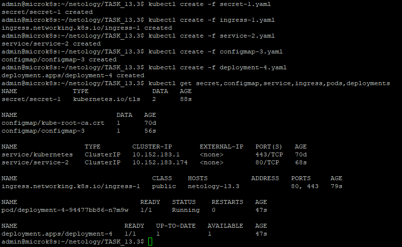

# Домашнее задание к занятию 13.3 «Конфигурация приложений»

### Цель задания

В тестовой среде Kubernetes необходимо создать конфигурацию и продемонстрировать работу приложения.

------

### Задание 1. Создать Deployment приложения и решить возникшую проблему с помощью ConfigMap. Добавить веб-страницу

1. Создать Deployment приложения, состоящего из контейнеров nginx и multitool.
2. Решить возникшую проблему с помощью ConfigMap.
3. Продемонстрировать, что pod стартовал и оба конейнера работают.
4. Сделать простую веб-страницу и подключить её к Nginx с помощью ConfigMap. Подключить Service и показать вывод curl или в браузере.
5. Предоставить манифесты, а также скриншоты или вывод необходимых команд.

------

### Решение задания 1.

1. Создаем Deployment приложения, состоящего из 2-х контейнеров.
Подготовим следующее yaml-описание в файле [deployment-1.yaml](./TASK_13.3/deployment-1.yaml):
```
---
apiVersion: apps/v1
kind: Deployment
metadata:
  name: deployment-1
  labels:
    app: deployment-1
spec:
  replicas: 1
  selector:
    matchLabels:
      app: deployment-1
  template:
    metadata:
      labels:
        app: deployment-1
    spec:
      containers:
        - name: nginx
          image: nginx
        - name: multitool
          image: wbitt/network-multitool
```

* Убеждаемся, что в текущем кластере kubernetes нет лишних запущенных Pods, ReplicaSets, Deployments и Services:
```
admin@microk8s:~/netology$ kubectl get all
NAME                 TYPE        CLUSTER-IP     EXTERNAL-IP   PORT(S)   AGE
service/kubernetes   ClusterIP   10.152.183.1   <none>        443/TCP   70d
```
* Далее запускаем развертывание Deployment (из двух контейнеров: nginx и multitool) из вышеописанного файла [deployment-1.yaml](./TASK_13.3/deployment-1.yaml):
```
admin@microk8s:~/netology$ kubectl create -f deployment-1.yaml
deployment.apps/deployment-1 created
```
* Наблюдаем за развертыванием Deployment и сталкиваемся с ошибкой:
```
admin@microk8s:~/netology$ kubectl get deployments.apps
NAME           READY   UP-TO-DATE   AVAILABLE   AGE
deployment-1   0/1     1            0           12s
admin@microk8s:~/netology$ kubectl get pods
NAME                            READY   STATUS    RESTARTS   AGE
deployment-1-546759d599-mh5dj   2/2     Running   0          42s
admin@microk8s:~/netology$
admin@microk8s:~/netology$ kubectl get pods
NAME                            READY   STATUS   RESTARTS      AGE
deployment-1-546759d599-mh5dj   1/2     Error    2 (18s ago)   65s
```
* Проверяем логи развертывания Deployment:
```
admin@microk8s:~/netology$ kubectl logs --tail=10 --all-containers=true --prefix=true deployment-1-546759d599-mh5dj
[pod/deployment-1-546759d599-mh5dj/nginx] /docker-entrypoint.sh: Launching /docker-entrypoint.d/30-tune-worker-processes.sh
[pod/deployment-1-546759d599-mh5dj/nginx] /docker-entrypoint.sh: Configuration complete; ready for start up
[pod/deployment-1-546759d599-mh5dj/nginx] 2023/07/09 17:16:42 [notice] 1#1: using the "epoll" event method
[pod/deployment-1-546759d599-mh5dj/nginx] 2023/07/09 17:16:42 [notice] 1#1: nginx/1.25.1
[pod/deployment-1-546759d599-mh5dj/nginx] 2023/07/09 17:16:42 [notice] 1#1: built by gcc 12.2.0 (Debian 12.2.0-14)
[pod/deployment-1-546759d599-mh5dj/nginx] 2023/07/09 17:16:42 [notice] 1#1: OS: Linux 5.15.0-75-generic
[pod/deployment-1-546759d599-mh5dj/nginx] 2023/07/09 17:16:42 [notice] 1#1: getrlimit(RLIMIT_NOFILE): 65536:65536
[pod/deployment-1-546759d599-mh5dj/nginx] 2023/07/09 17:16:42 [notice] 1#1: start worker processes
[pod/deployment-1-546759d599-mh5dj/nginx] 2023/07/09 17:16:42 [notice] 1#1: start worker process 29
[pod/deployment-1-546759d599-mh5dj/nginx] 2023/07/09 17:16:42 [notice] 1#1: start worker process 30
[pod/deployment-1-546759d599-mh5dj/multitool] 2023/07/09 17:17:58 [emerg] 1#1: bind() to 0.0.0.0:80 failed (98: Address in use)
[pod/deployment-1-546759d599-mh5dj/multitool] nginx: [emerg] bind() to 0.0.0.0:80 failed (98: Address in use)
[pod/deployment-1-546759d599-mh5dj/multitool] 2023/07/09 17:17:58 [emerg] 1#1: bind() to 0.0.0.0:80 failed (98: Address in use)
[pod/deployment-1-546759d599-mh5dj/multitool] nginx: [emerg] bind() to 0.0.0.0:80 failed (98: Address in use)
[pod/deployment-1-546759d599-mh5dj/multitool] 2023/07/09 17:17:58 [emerg] 1#1: bind() to 0.0.0.0:80 failed (98: Address in use)
[pod/deployment-1-546759d599-mh5dj/multitool] nginx: [emerg] bind() to 0.0.0.0:80 failed (98: Address in use)
[pod/deployment-1-546759d599-mh5dj/multitool] 2023/07/09 17:17:58 [emerg] 1#1: bind() to 0.0.0.0:80 failed (98: Address in use)
[pod/deployment-1-546759d599-mh5dj/multitool] nginx: [emerg] bind() to 0.0.0.0:80 failed (98: Address in use)
[pod/deployment-1-546759d599-mh5dj/multitool] 2023/07/09 17:17:58 [emerg] 1#1: still could not bind()
[pod/deployment-1-546759d599-mh5dj/multitool] nginx: [emerg] still could not bind()
```
* Делаем вывод об ошибке, в соответствии с которой контейнер multitool не может использовать порт 80 по умолчанию, поскольку он занят другим контейнером (nginx). На странице с [описанием](https://github.com/wbitt/Network-MultiTool) Multitool в такой ситуации рекомендуется использовать экстра аргументы с переменными окружения.
Остановим неработающий Deployment:
```
admin@microk8s:~/netology$ kubectl delete -f deployment-1.yaml
deployment.apps "deployment-1" deleted
```
2. Решим возникшую проблему с помощью ConfigMap.
* Опишем yaml-файл [configmap-1.yaml](./TASK_13.3/configmap-1.yaml):
```
---
apiVersion: v1
kind: ConfigMap
metadata:
  name: configmap-1
data:
  http-port: "1180"
  https-port: "11443"
```
* Опишем новый yaml-файл [deployment-2.yaml](./TASK_13.3/deployment-2.yaml):
```
---
apiVersion: apps/v1
kind: Deployment
metadata:
  name: deployment-2
  labels:
    app: deployment-2
spec:
  replicas: 1
  selector:
    matchLabels:
      app: deployment-2
  template:
    metadata:
      labels:
        app: deployment-2
    spec:
      containers:
        - name: nginx
          image: nginx
        - name: multitool
          image: wbitt/network-multitool
          env:
            - name: HTTP_PORT
              valueFrom:
                configMapKeyRef:
                  name: configmap-1
                  key: http-port
            - name: HTTPS_PORT
              valueFrom:
                configMapKeyRef:
                  name: configmap-1
                  key: https-port
```
3. Продемонстрируем, что pod стартовал и оба контейнера работают:
```
admin@microk8s:~/netology/TASK_13.3$ kubectl create -f configmap-1.yaml
configmap/configmap-1 created
admin@microk8s:~/netology/TASK_13.3$ kubectl create -f deployment-2.yaml
deployment.apps/deployment-2 created
admin@microk8s:~/netology/TASK_13.3$
admin@microk8s:~/netology/TASK_13.3$ kubectl get deployments,pods,configmaps
NAME                           READY   UP-TO-DATE   AVAILABLE   AGE
deployment.apps/deployment-2   1/1     1            1           59s

NAME                                READY   STATUS    RESTARTS   AGE
pod/deployment-2-65f6b545f5-qhtk2   2/2     Running   0          59s

NAME                         DATA   AGE
configmap/kube-root-ca.crt   1      70d
configmap/configmap-1        2      67s
```
* Подтвердим успешность развертывания скриншотом: 


4. Сделаем простую веб-страницу и подключим её к Nginx с помощью ConfigMap:
* Опишем yaml-файл [configmap-2.yaml](./TASK_13.3/configmap-2.yaml):
```
---
apiVersion: v1
kind: ConfigMap
metadata:
  name: configmap-2
data:
  http-port: "1180"
  https-port: "11443"
  index.html: |
    <html>
    <head>
    <title>***TEST NGINX WITH ConfigMap***</title>
    </head>
    <body>
    <h1>***TEST NGINX***</h1>
    </br>
    <h1>TEST ConfigMap for Netology homework 13.3</h1>
    </body>
    </html>
```
* Опишем новый yaml-файл [deployment-3.yaml](./TASK_13.3/deployment-3.yaml):
```
---
apiVersion: apps/v1
kind: Deployment
metadata:
  name: deployment-3
  labels:
    app: deployment-3
spec:
  replicas: 1
  selector:
    matchLabels:
      app: deployment-3
  template:
    metadata:
      labels:
        app: deployment-3
    spec:
      containers:
        - name: nginx
          image: nginx
          volumeMounts:
            - name: volume-1
              mountPath: /usr/share/nginx/html/
        - name: multitool
          image: wbitt/network-multitool
          env:
            - name: HTTP_PORT
              valueFrom:
                configMapKeyRef:
                  name: configmap-2
                  key: http-port
            - name: HTTPS_PORT
              valueFrom:
                configMapKeyRef:
                  name: configmap-2
                  key: https-port
      volumes:
        - name: volume-1
          configMap:
            name: configmap-2
```
* Подключим Service для работы с подами. Опишем yaml-файл [service-1.yaml](./TASK_13.3/service-1.yaml):
```
---
apiVersion: v1
kind: Service
metadata:
  name: service-1
spec:
  selector:
    app: deployment-3
  ports:
    - name: nginx-http
      port: 80
      protocol: TCP
      targetPort: 80
    - name: multitool-http
      port: 1180
      protocol: TCP
      targetPort: 1180
    - name: multitool-https
      port: 11443
      protocol: TCP
      targetPort: 11443
```
* Выполним запуск развертывания вышеописанных ресурсов:
```
admin@microk8s:~/netology/TASK_13.3$ kubectl create -f configmap-2.yaml
configmap/configmap-2 created
admin@microk8s:~/netology/TASK_13.3$ kubectl create -f service-1.yaml
service/service-1 created
admin@microk8s:~/netology/TASK_13.3$ kubectl create -f deployment-3.yaml
deployment.apps/deployment-3 created
admin@microk8s:~/netology/TASK_13.3$ kubectl get deployments,pods,services,configmaps
NAME                           READY   UP-TO-DATE   AVAILABLE   AGE
deployment.apps/deployment-3   1/1     1            1           33s

NAME                                READY   STATUS    RESTARTS   AGE
pod/deployment-3-6cd5c6c988-qmj8b   2/2     Running   0          33s

NAME                 TYPE        CLUSTER-IP       EXTERNAL-IP   PORT(S)                     AGE
service/kubernetes   ClusterIP   10.152.183.1     <none>        443/TCP                     70d
service/service-1    ClusterIP   10.152.183.171   <none>        80/TCP,1180/TCP,11443/TCP   44s

NAME                         DATA   AGE
configmap/kube-root-ca.crt   1      70d
configmap/configmap-2        3      50s
```
* Подтвердим успешность развертывания скриншотом: 

* Проверим работу веб-страницы, описанной в configmap'e, через curl:
```
admin@microk8s:~/netology/TASK_13.3$ kubectl exec pods/deployment-3-6cd5c6c988-qmj8b -- curl --silent -i service-1:80
Defaulted container "nginx" out of: nginx, multitool
HTTP/1.1 200 OK
Server: nginx/1.25.1
Date: Sat, 05 Aug 2023 17:23:17 GMT
Content-Type: text/html
Content-Length: 175
Last-Modified: Sat, 05 Aug 2023 17:20:28 GMT
Connection: keep-alive
ETag: "64ce84dc-af"
Accept-Ranges: bytes

<html>
<head>
<title>***TEST NGINX WITH ConfigMap***</title>
</head>
<body>
<h1>***TEST NGINX***</h1>
</br>
<h1>TEST ConfigMap for Netology homework 13.3</h1>
</body>
</html>
```
* Подтвердим успешность вывода скриншотом: 

5. Манифесты представлены в файлах:
[deployment-1.yaml](./TASK_13.3/deployment-1.yaml)
[deployment-2.yaml](./TASK_13.3/deployment-2.yaml)
[deployment-3.yaml](./TASK_13.3/deployment-3.yaml)
[configmap-1.yaml](./TASK_13.3/configmap-1.yaml)
[configmap-2.yaml](./TASK_13.3/configmap-2.yaml)
[service-1.yaml](./TASK_13.3/service-1.yaml)

------

### Задание 2. Создать приложение с вашей веб-страницей, доступной по HTTPS 

1. Создать Deployment приложения, состоящего из Nginx.
2. Создать собственную веб-страницу и подключить её как ConfigMap к приложению.
3. Выпустить самоподписной сертификат SSL. Создать Secret для использования сертификата.
4. Создать Ingress и необходимый Service, подключить к нему SSL в вид. Продемонстировать доступ к приложению по HTTPS. 
5. Предоставить манифесты, а также скриншоты или вывод необходимых команд.

------

### Решение задания 2.

1. Создаем Deployment приложения, состоящего из Nginx.
* Опишем yaml-файл [deployment-4.yaml](./TASK_13.3/deployment-4.yaml):
```
---
apiVersion: apps/v1
kind: Deployment
metadata:
  name: deployment-4
  labels:
    app: deployment-4
spec:
  replicas: 1
  selector:
    matchLabels:
      app: deployment-4
  template:
    metadata:
      labels:
        app: deployment-4
    spec:
      containers:
        - name: nginx
          image: nginx
          volumeMounts:
            - name: volume-2
              mountPath: /usr/share/nginx/html/
      volumes:
        - name: volume-2
          configMap:
            name: configmap-3
```
2. Создаем веб-страницу и подключаем её как ConfigMap к приложению.
* Опишем yaml-файл [configmap-3.yaml](./TASK_13.3/configmap-3.yaml):
```
---
apiVersion: v1
kind: ConfigMap
metadata:
  name: configmap-3
data:
  index.html: |
    <html>
    <head>
    <title>***TEST NGINX WITH ConfigMap***</title>
    </head>
    <body>
    <h1>***TEST NGINX***</h1>
    </br>
    <h1>TEST ConfigMap for Netology homework 13.3</h1>
    </body>
    </html>
```
3. Генерируем самоподписной сертификат SSL. 
```
admin@microk8s:~/netology$ openssl req -x509 -newkey rsa:4096 -sha256 -nodes -keyout netology-13.3.key -out netology-13.3.crt -subj "/CN=netology-13.3" -days 365
.+...+...+.........+...............+.+..+...+....+..+.+.....+...............+++++++++++++++++++++++++++++++++++++++++++++++++++++++++++++++++*........+..+++++++++++++++++++++++++++++++++++++++++++++++++++++++++++++++++*..+...............+......+.+........+......+.......+.............................+..................+..........+...+.........+..................+........+...+.+.....+....+...........+.+...+.........+..+.........+.+......+..+......+......+.+..............+.+...+.....+....+........+......................+.................+............................+..+.........+..............................+....+...+........+....+..+...+...+++++++++++++++++++++++++++++++++++++++++++++++++++++++++++++++++
......+..+...+.........+.........+....+......+.........+..+++++++++++++++++++++++++++++++++++++++++++++++++++++++++++++++++*..+.......+..+....+..+.........+...................+..+.......+...+..+..........+.......................+.......+..+...+.......+...+...+........+......+...+.+..+.........+...+.+..+............+......+.+......+...+................................+....+...+........+...+.......+...+.........+..+............................+..+.........+.+......+...+..+....+...+.....+......+......+.........+..........+..+....+...+++++++++++++++++++++++++++++++++++++++++++++++++++++++++++++++++*........+..................+......+++++++++++++++++++++++++++++++++++++++++++++++++++++++++++++++++
-----
admin@microk8s:~/netology$ ls netology-13.3.*
netology-13.3.crt  netology-13.3.key
```
* Конвертируем сертификат и ключ в base64-формат.
```
admin@microk8s:~/netology$ cat netology-13.3.crt | base64
LS0tLS1CRUdJTiBDRVJUSUZJQ0FURS0tLS0tCk1JSUZFVENDQXZtZ0F3SUJBZ0lVU2tLUnZEa1ZJ
---ВЫВОД СОКРАЩЕН---
admin@microk8s:~/netology$ cat netology-13.3.key | base64
LS0tLS1CRUdJTiBQUklWQVRFIEtFWS0tLS0tCk1JSUpRZ0lCQURBTkJna3Foa2lHOXcwQkFRRUZB
---ВЫВОД СОКРАЩЕН---
```
* Создаем Secret для использования сертификата. Опишем yaml-файл [secret-1.yaml](./TASK_13.3/secret-1.yaml):
```
---
apiVersion: v1
kind: Secret
metadata:
  name: secret-1
type: kubernetes.io/tls
data:
  tls.crt: |
    LS0tLS1CRUdJTiBDRVJUSUZJQ0FURS0tLS0tCk1JSUZFVENDQXZtZ0F3SUJBZ0lVU2tLUnZEa1ZJ
    ...
  tls.key: |
    LS0tLS1CRUdJTiBQUklWQVRFIEtFWS0tLS0tCk1JSUpRZ0lCQURBTkJna3Foa2lHOXcwQkFRRUZB
    ...
```
4. Создаем Ingress и необходимый Service, подключаем к нему SSL.
* Опишем yaml-файл [service-2.yaml](./TASK_13.3/service-2.yaml):
```
---
apiVersion: v1
kind: Service
metadata:
  name: service-2
spec:
  selector:
    app: deployment-4
  ports:
    - name: nginx-http
      port: 80
      protocol: TCP
      targetPort: 80
```
* Опишем yaml-файл [ingress-1.yaml](./TASK_13.3/ingress-1.yaml):
```
---
apiVersion: networking.k8s.io/v1
kind: Ingress
metadata:
  name: ingress-1
  annotations:
    nginx.ingress.kubernetes.io/rewrite-target: /
spec:
  rules:
    - host: netology-13.3
      http:
        paths:
          - path: /
            pathType: Prefix
            backend:
              service:
                name: service-2
                port:
                  number: 80
  tls:
    - hosts:
        - netology-13.3
      secretName: secret-1
```
* Добавим запись в /etc/hosts с именем хоста, которое использовалась при генерировании сертификата:
```
root@microk8s:~# echo '192.168.0.23 netology-13.3' >> /etc/hosts
```
* Выполним запуск развертывания вышеописанных ресурсов:
```
admin@microk8s:~/netology/TASK_13.3$ kubectl create -f secret-1.yaml
secret/secret-1 created
admin@microk8s:~/netology/TASK_13.3$ kubectl create -f ingress-1.yaml
ingress.networking.k8s.io/ingress-1 created
admin@microk8s:~/netology/TASK_13.3$ kubectl create -f service-2.yaml
service/service-2 created
admin@microk8s:~/netology/TASK_13.3$ kubectl create -f configmap-3.yaml
configmap/configmap-3 created
admin@microk8s:~/netology/TASK_13.3$ kubectl create -f deployment-4.yaml
deployment.apps/deployment-4 created
admin@microk8s:~/netology/TASK_13.3$ kubectl get secret,configmap,service,ingress,pods,deployments
NAME              TYPE                DATA   AGE
secret/secret-1   kubernetes.io/tls   2      88s

NAME                         DATA   AGE
configmap/kube-root-ca.crt   1      70d
configmap/configmap-3        1      56s

NAME                 TYPE        CLUSTER-IP       EXTERNAL-IP   PORT(S)   AGE
service/kubernetes   ClusterIP   10.152.183.1     <none>        443/TCP   70d
service/service-2    ClusterIP   10.152.183.174   <none>        80/TCP    68s

NAME                                  CLASS    HOSTS           ADDRESS   PORTS     AGE
ingress.networking.k8s.io/ingress-1   public   netology-13.3             80, 443   79s

NAME                               READY   STATUS    RESTARTS   AGE
pod/deployment-4-94477bb86-n7m9w   1/1     Running   0          47s

NAME                           READY   UP-TO-DATE   AVAILABLE   AGE
deployment.apps/deployment-4   1/1     1            1           47s
```
* Подтвердим успешность развертывания скриншотом: 

* Продемонстрируем доступ к приложению по HTTPS:
```
admin@microk8s:~/netology/TASK_13.3$ curl -k https://netology-13.3
<html>
<head>
<title>***TEST NGINX WITH ConfigMap***</title>
</head>
<body>
<h1>***TEST NGINX***</h1>
</br>
<h1>TEST ConfigMap for Netology homework 13.3</h1>
</body>
</html>
admin@microk8s:~/netology/TASK_13.3$ curl --insecure -vvI https://netology-13.3 2>&1 | awk 'BEGIN { cert=0 } /^\* SSL connection/ { cert=1 } /^\*/ { if (cert) print }'
* SSL connection using TLSv1.3 / TLS_AES_256_GCM_SHA384
* ALPN, server accepted to use h2
* Server certificate:
*  subject: CN=netology-13.3
*  start date: Aug 5 22:20:46 2023 GMT
*  expire date: Aug 4 22:20:46 2024 GMT
*  issuer: CN=netology-13.3
*  SSL certificate verify result: self-signed certificate (18), continuing anyway.
* Using HTTP2, server supports multiplexing
* Connection state changed (HTTP/2 confirmed)
* Copying HTTP/2 data in stream buffer to connection buffer after upgrade: len=0
* TLSv1.2 (OUT), TLS header, Supplemental data (23):
* TLSv1.2 (OUT), TLS header, Supplemental data (23):
* TLSv1.2 (OUT), TLS header, Supplemental data (23):
* Using Stream ID: 1 (easy handle 0x561f0126a970)
* TLSv1.2 (OUT), TLS header, Supplemental data (23):
* TLSv1.2 (IN), TLS header, Supplemental data (23):
* TLSv1.3 (IN), TLS handshake, Newsession Ticket (4):
* TLSv1.2 (IN), TLS header, Supplemental data (23):
* TLSv1.3 (IN), TLS handshake, Newsession Ticket (4):
* old SSL session ID is stale, removing
* TLSv1.2 (IN), TLS header, Supplemental data (23):
* Connection state changed (MAX_CONCURRENT_STREAMS == 128)!
* TLSv1.2 (OUT), TLS header, Supplemental data (23):
* TLSv1.2 (IN), TLS header, Supplemental data (23):
* Connection #0 to host netology-13.3 left intact
```
5. Остановим все запущенные ресурсы:
```
admin@microk8s:~/netology/TASK_13.3$ kubectl delete secrets secret-1
secret "secret-1" deleted
admin@microk8s:~/netology/TASK_13.3$ kubectl delete services service-2
service "service-2" deleted
admin@microk8s:~/netology/TASK_13.3$ kubectl delete configmaps configmap-3
configmap "configmap-3" deleted
admin@microk8s:~/netology/TASK_13.3$ kubectl delete ingress ingress-1
ingress.networking.k8s.io "ingress-1" deleted
admin@microk8s:~/netology/TASK_13.3$ kubectl delete deployments.apps deployment-4
deployment.apps "deployment-4" deleted
admin@microk8s:~/netology/TASK_13.3$
```
6. Манифесты представлены в файлах:
[deployment-4.yaml](./TASK_13.3/deployment-4.yaml)
[configmap-3.yaml](./TASK_13.3/configmap-3.yaml)
[service-2.yaml](./TASK_13.3/service-2.yaml)
[secret-1.yaml](./TASK_13.3/secret-1.yaml)
[ingress-1.yaml](./TASK_13.3/ingress-1.yaml)

------


