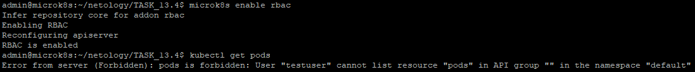
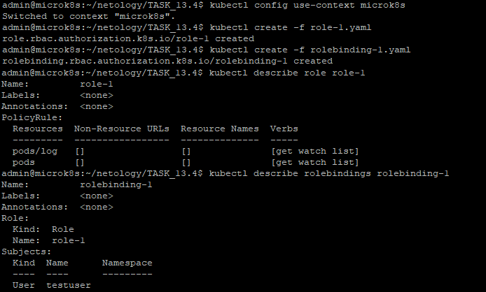
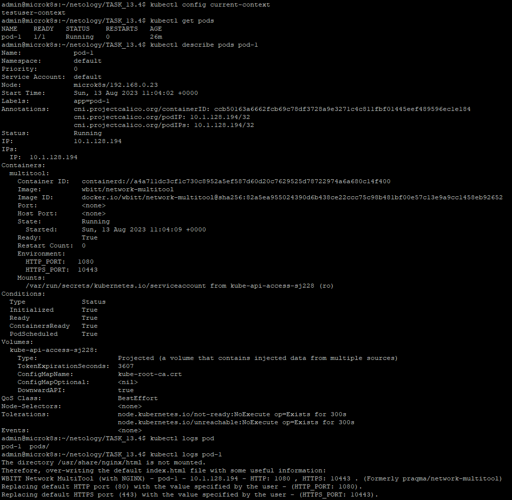

# Домашнее задание к занятию 13.4 «Управление доступом»

### Цель задания

В тестовой среде Kubernetes нужно предоставить ограниченный доступ пользователю.

------

### Задание 1. Создайте конфигурацию для подключения пользователя

1. Создайте и подпишите SSL-сертификат для подключения к кластеру.
2. Настройте конфигурационный файл kubectl для подключения.
3. Создайте роли и все необходимые настройки для пользователя.
4. Предусмотрите права пользователя. Пользователь может просматривать логи подов и их конфигурацию (`kubectl logs pod <pod_id>`, `kubectl describe pod <pod_id>`).
5. Предоставьте манифесты и скриншоты и/или вывод необходимых команд.

------

### Решение задания 1.

1. Создаем и подписываем SSL-сертификат для пользователя `testuser` для подключения к кластеру:
```
admin@microk8s:~/netology/TASK_13.4$ mkdir certs
admin@microk8s:~/netology/TASK_13.4$ cd certs/
admin@microk8s:~/netology/TASK_13.4/certs$ openssl genrsa -out testuser.key 2048
admin@microk8s:~/netology/TASK_13.4/certs$ openssl req -key testuser.key -new -out testuser.csr -subj "/CN=testuser/O=netology"
admin@microk8s:~/netology/TASK_13.4/certs$ openssl x509 -req -in testuser.csr -CA /var/snap/microk8s/current/certs/ca.crt -CAkey /var/snap/microk8s/current/certs/ca.key -CAcreateserial -out testuser.crt -days 365
Certificate request self-signature ok
subject=CN = testuser, O = netology
admin@microk8s:~/netology/TASK_13.4/certs$
```
* Проверяем успешность создания сертификата для пользователя `testuser`:
```
admin@microk8s:~/netology/TASK_13.4/certs$ ls -l
total 12
-rw-rw-r-- 1 admin admin 1021 Aug 13 10:32 testuser.crt
-rw-rw-r-- 1 admin admin  915 Aug 13 10:31 testuser.csr
-rw------- 1 admin admin 1704 Aug 13 10:29 testuser.key
```
2. Настроим конфигурационный файл kubectl для подключения.
* Сохраним шаблон текущей конфигурации в файл:
```
admin@microk8s:~/netology/TASK_13.4/certs$ microk8s config > kubeconfig
admin@microk8s:~/netology/TASK_13.4/certs$ ls -l
total 16
-rw-rw-r-- 1 admin admin 1874 Aug 13 10:37 kubeconfig
-rw-rw-r-- 1 admin admin 1021 Aug 13 10:32 testuser.crt
-rw-rw-r-- 1 admin admin  915 Aug 13 10:31 testuser.csr
-rw------- 1 admin admin 1704 Aug 13 10:29 testuser.key
```
* Переключаем конфигурацию kubernetes на созданный файл kubeconfig:
```
admin@microk8s:~/netology/TASK_13.4/certs$ export KUBECONFIG=$PWD/kubeconfig
admin@microk8s:~/netology/TASK_13.4/certs$ echo $KUBECONFIG
/home/admin/netology/TASK_13.4/certs/kubeconfig
```
* Вносим изменения в конфигурацию для пользователя `testuser`, создаем контекст `testuser-context` и переключаемся на него:
```
admin@microk8s:~/netology/TASK_13.4/certs$ kubectl config set-credentials testuser --client-certificate=testuser.crt --client-key=testuser.key
User "testuser" set.
admin@microk8s:~/netology/TASK_13.4/certs$ kubectl config set-context testuser-context --cluster=microk8s-cluster --user=testuser
Context "testuser-context" created.
admin@microk8s:~/netology/TASK_13.4/certs$ kubectl config use-context testuser-context
Switched to context "testuser-context".
admin@microk8s:~/netology/TASK_13.4/certs$ kubectl config current-context
testuser-context
```
* Проверяем файл с измененной конфигурацией:
```
admin@microk8s:~/netology/TASK_13.4/certs$ cat kubeconfig
apiVersion: v1
clusters:
- cluster:
    certificate-authority-data: *********************
    server: https://192.168.0.23:16443
  name: microk8s-cluster
contexts:
- context:
    cluster: microk8s-cluster
    user: admin
  name: microk8s
- context:
    cluster: microk8s-cluster
    user: testuser
  name: testuser-context
current-context: testuser-context
kind: Config
preferences: {}
users:
- name: admin
  user:
    token: WjZTa1dJZjNxMy9HYjd0U3Jqd0kzeUVtODlLb092OGJpZ1Z2SU5QV1g3Zz0K
- name: testuser
  user:
    client-certificate: testuser.crt
    client-key: testuser.key
```
* Включим поддержку RBAC в MicroK8S:
```
admin@microk8s:~/netology/TASK_13.4$ microk8s enable rbac
Infer repository core for addon rbac
Enabling RBAC
Reconfiguring apiserver
RBAC is enabled
```
* Проверим доступность запущенных подов:
```
admin@microk8s:~/netology/TASK_13.4$ kubectl get pods
Error from server (Forbidden): pods is forbidden: User "testuser" cannot list resource "pods" in API group "" in the namespace "default"
```
* Подтвердим недоступность подов скриншотом: 

* Видим, что по умолчанию какие-либо действия новому пользователю `testuser` запрещены.

3. Создаем роли и все необходимые настройки для пользователя `testuser`.
* Подготовим следующее yaml-описание для `Role` в файле [role-1.yaml](./TASK_13.4/role-1.yaml):
```
---
apiVersion: rbac.authorization.k8s.io/v1
kind: Role
metadata:
  name: role-1
  namespace: default
rules:
  - apiGroups: [""]
    resources: ["pods", "pods/log"]
    verbs: ["get", "watch", "list"]
```
* Подготовим следующее yaml-описание для `RoleBinding` в файле [rolebinding-1.yaml](./TASK_13.4/rolebinding-1.yaml):
```
---
apiVersion: rbac.authorization.k8s.io/v1
kind: RoleBinding
metadata:
  name: rolebinding-1
  namespace: default
subjects:
- kind: User
  name: testuser
  apiGroup: rbac.authorization.k8s.io
roleRef:
  kind: Role
  name: role-1
  apiGroup: rbac.authorization.k8s.io
```
4. Выполняем развертывание созданных ресурсов. Убеждаемся, что пользователь может просматривать логи подов и их конфигурацию (`kubectl logs pod <pod_id>`, `kubectl describe pod <pod_id>`):
* Временно возвращаемся в стандартный контекст `microk8s` с привилегированным пользователем `admin` для kubernetes:
```
admin@microk8s:~/netology/TASK_13.4$ kubectl config use-context microk8s
Switched to context "microk8s".
```
* Запускаем развертывание ресурсов `Role` и `RoleBinding`. Проверяем их состояние.
```
admin@microk8s:~/netology/TASK_13.4$ kubectl create -f role-1.yaml
role.rbac.authorization.k8s.io/role-1 created
admin@microk8s:~/netology/TASK_13.4$ kubectl create -f rolebinding-1.yaml
rolebinding.rbac.authorization.k8s.io/rolebinding-1 created
admin@microk8s:~/netology/TASK_13.4$ kubectl describe role role-1
Name:         role-1
Labels:       <none>
Annotations:  <none>
PolicyRule:
  Resources  Non-Resource URLs  Resource Names  Verbs
  ---------  -----------------  --------------  -----
  pods/log   []                 []              [get watch list]
  pods       []                 []              [get watch list]
admin@microk8s:~/netology/TASK_13.4$ kubectl describe rolebindings rolebinding-1
Name:         rolebinding-1
Labels:       <none>
Annotations:  <none>
Role:
  Kind:  Role
  Name:  role-1
Subjects:
  Kind  Name      Namespace
  ----  ----      ---------
  User  testuser
```
* Подтвердим успешность развертывания ресурсов скриншотом: 


* Переключаемся в контекст `testuser-context` с пользователем `testuser`, для которого настроен RBAC:
```
admin@microk8s:~/netology/TASK_13.4$ kubectl config use-context testuser-context
Switched to context "testuser-context".
admin@microk8s:~/netology/TASK_13.4$ kubectl config current-context
testuser-context
```
* Проверяем возможности пользователя `testuser` по просмотру подов:
```
admin@microk8s:~/netology/TASK_13.4$ kubectl get pods
NAME    READY   STATUS    RESTARTS   AGE
pod-1   1/1     Running   0          26m
admin@microk8s:~/netology/TASK_13.4$ kubectl describe pods pod-1
Name:             pod-1
Namespace:        default
Priority:         0
Service Account:  default
Node:             microk8s/192.168.0.23
Start Time:       Sun, 13 Aug 2023 11:04:02 +0000
Labels:           app=pod-1
Annotations:      cni.projectcalico.org/containerID: ccb50163a6662fcb69c78df3728a9e3271c4c811fbf01445eef489596ec1e184
                  cni.projectcalico.org/podIP: 10.1.128.194/32
                  cni.projectcalico.org/podIPs: 10.1.128.194/32
Status:           Running
IP:               10.1.128.194
IPs:
  IP:  10.1.128.194
Containers:
  multitool:
    Container ID:   containerd://a4a711dc3cf1c730c8952a5ef587d60d20c7629525d78722974a6a680c14f400
    Image:          wbitt/network-multitool
    Image ID:       docker.io/wbitt/network-multitool@sha256:82a5ea955024390d6b438ce22ccc75c98b481bf00e57c13e9a9cc1458eb92652
    Port:           <none>
    Host Port:      <none>
    State:          Running
      Started:      Sun, 13 Aug 2023 11:04:09 +0000
    Ready:          True
    Restart Count:  0
    Environment:
      HTTP_PORT:   1080
      HTTPS_PORT:  10443
    Mounts:
      /var/run/secrets/kubernetes.io/serviceaccount from kube-api-access-sj228 (ro)
Conditions:
  Type              Status
  Initialized       True
  Ready             True
  ContainersReady   True
  PodScheduled      True
Volumes:
  kube-api-access-sj228:
    Type:                    Projected (a volume that contains injected data from multiple sources)
    TokenExpirationSeconds:  3607
    ConfigMapName:           kube-root-ca.crt
    ConfigMapOptional:       <nil>
    DownwardAPI:             true
QoS Class:                   BestEffort
Node-Selectors:              <none>
Tolerations:                 node.kubernetes.io/not-ready:NoExecute op=Exists for 300s
                             node.kubernetes.io/unreachable:NoExecute op=Exists for 300s
Events:                      <none>
admin@microk8s:~/netology/TASK_13.4$ kubectl logs pod
pod-1  pods/
admin@microk8s:~/netology/TASK_13.4$ kubectl logs pod-1
The directory /usr/share/nginx/html is not mounted.
Therefore, over-writing the default index.html file with some useful information:
WBITT Network MultiTool (with NGINX) - pod-1 - 10.1.128.194 - HTTP: 1080 , HTTPS: 10443 . (Formerly praqma/network-multitool)
Replacing default HTTP port (80) with the value specified by the user - (HTTP_PORT: 1080).
Replacing default HTTPS port (443) with the value specified by the user - (HTTPS_PORT: 10443).
```
* Подтвердим доступность подов скриншотом: 


5. Манифесты и конфигурации представлены в файлах:
[pod-1.yaml](./TASK_13.4/pod-1.yaml)
[role-1.yaml](./TASK_13.4/role-1.yaml)
[rolebinding-1.yaml](./TASK_13.4/rolebinding-1.yaml)
[kubeconfig](./TASK_13.4/certs/kubeconfig)

