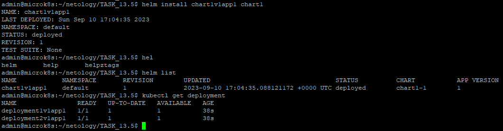
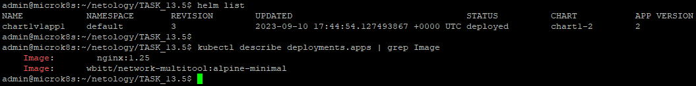
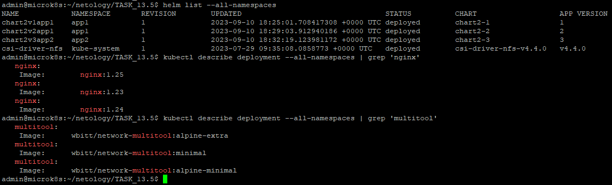

# Домашнее задание к занятию 13.5 «Helm»

### Цель задания

В тестовой среде Kubernetes необходимо установить и обновить приложения с помощью Helm.

------

### Чеклист готовности к домашнему заданию

1. Установленное k8s-решение, например, MicroK8S.
2. Установленный локальный kubectl.
3. Установленный локальный Helm.
4. Редактор YAML-файлов с подключенным репозиторием GitHub.

------

### Инструменты и дополнительные материалы, которые пригодятся для выполнения задания

1. [Инструкция](https://helm.sh/docs/intro/install/) по установке Helm. [Helm completion](https://helm.sh/docs/helm/helm_completion/).

------

### Задание 1. Подготовить Helm-чарт для приложения

1. Необходимо упаковать приложение в чарт для деплоя в разные окружения. 
2. Каждый компонент приложения деплоится отдельным deployment’ом или statefulset’ом.
3. В переменных чарта измените образ приложения для изменения версии.

------
### Задание 2. Запустить две версии в разных неймспейсах

1. Подготовив чарт, необходимо его проверить. Запуститe несколько копий приложения.
2. Одну версию в namespace=app1, вторую версию в том же неймспейсе, третью версию в namespace=app2.
3. Продемонстрируйте результат.


------


## Решение задания 1.
* Убедимся в корректности установки утилиты helm:
```
admin@microk8s:~/netology/TASK_13.5$ helm version
version.BuildInfo{Version:"v3.12.3", GitCommit:"3a31588ad33fe3b89af5a2a54ee1d25bfe6eaa5e", GitTreeState:"clean", GoVersion:"go1.20.7"}
```
* Создадим первый шаблон командой `helm create`:
```
admin@microk8s:~/netology/TASK_13.5$ helm create chart1
Creating chart1
```
* Создадим файл deployment1.yml для развёртывания компонента nginx нашего приложения:
```
admin@microk8s:~/netology/TASK_13.5/chart1/templates$ cat deployment1.yaml
---
apiVersion: apps/v1
kind: Deployment
metadata:
  labels:
    app: deployment1{{ .Values.chartVersion }}
  name: deployment1{{ .Values.chartVersion }}
  namespace: default
spec:
  replicas: {{ .Values.deployment1.replicaCount }}
  selector:
    matchLabels:
      app: deployment1{{ .Values.chartVersion }}
  template:
    metadata:
      labels:
        app: deployment1{{ .Values.chartVersion }}
    spec:
      containers:
        - name: nginx
          image: nginx:{{ .Values.deployment1.imageVersion }}
          ports:
            - name: http-{{ .Values.deployment1.containerPort }}
              containerPort: {{ .Values.deployment1.containerPort }}
```
* Создадим файл deployment2.yml для развёртывания компонента multitool нашего приложения:
```
---
apiVersion: apps/v1
kind: Deployment
metadata:
  labels:
    app: deployment2{{ .Values.chartVersion }}
  name: deployment2{{ .Values.chartVersion }}
  namespace: default
spec:
  replicas: {{ .Values.deployment2.replicaCount }}
  selector:
    matchLabels:
      app: deployment2{{ .Values.chartVersion }}
  template:
    metadata:
      labels:
        app: deployment2{{ .Values.chartVersion }}
    spec:
      containers:
        - name: multitool
          image: wbitt/network-multitool:{{ .Values.deployment2.imageVersion }}
          ports:
            - name: http-{{ .Values.deployment2.containerPort }}
              containerPort: {{ .Values.deployment2.containerPort }}
              protocol: TCP
          env:
            - name: HTTP_PORT
              value: "{{ .Values.deployment2.containerPort }}"
            - name: HTTPS_PORT
              value: "11443"
```
* Создадим файл service1.yml для развёртывания сервиса для deployment1:
```
---
apiVersion: v1
kind: Service
metadata:
  name: service1{{ .Values.chartVersion }}
  labels:
    app: deployment1{{ .Values.chartVersion }}
spec:
  selector:
    app: deployment1{{ .Values.chartVersion }}
  ports:
    - name: http-{{ .Values.service1.servicePort }}
      port: {{ .Values.service1.servicePort }}
      targetPort: {{ .Values.deployment1.containerPort }}
```
* Создадим файл service2.yml для развёртывания сервиса для deployment2:
```
---
apiVersion: v1
kind: Service
metadata:
  name: service2{{ .Values.chartVersion }}
  labels:
    app: deployment2{{ .Values.chartVersion }}
spec:
  selector:
    app: deployment2{{ .Values.chartVersion }}
  ports:
    - name: http-{{ .Values.service2.servicePort }}
      port: {{ .Values.service2.servicePort }}
      protocol: TCP
      targetPort: {{ .Values.deployment2.containerPort }}
    - name: multitool-https
      port: 11443
      targetPort: 11443
```
* Создадим файл Chart.yaml c информацией о чарте:
```
apiVersion: v2
name: chart1
description: A Helm chart for nginx and multitools

type: application

version: "1"
appVersion: "1"
```
* Создадим файл values.yaml для переменных чарта:
```
---
chartVersion: "v1app1"

deployment1:
  replicaCount: 1
  imageVersion: "1.24"
  containerPort: 80

deployment2:
  replicaCount: 1
  imageVersion: "minimal"
  containerPort: 8080

service1:
  servicePort: 80

service2:
  servicePort: 8080
```
* Запустим конструктор чарта и убедимся в корректности его работы:
```
admin@microk8s:~/netology/TASK_13.5$ helm template chart1
---
# Source: chart1/templates/service1.yaml
apiVersion: v1
kind: Service
metadata:
  name: service1v1app1
  labels:
    app: deployment1v1app1
spec:
  selector:
    app: deployment1v1app1
  ports:
    - name: http-80
      port: 80
      targetPort: 80
---
# Source: chart1/templates/service2.yaml
apiVersion: v1
----------------------ВЫВОД ОПУЩЕН-------------------------
```
* Запустим проверку синтаксиса чарта:
```
admin@microk8s:~/netology/TASK_13.5$ helm lint chart1
==> Linting chart1
[INFO] Chart.yaml: icon is recommended

1 chart(s) linted, 0 chart(s) failed
```
* Запустим развертывание чарта:
```
admin@microk8s:~/netology/TASK_13.5$ helm install chart1v1app1 chart1
NAME: chart1v1app1
LAST DEPLOYED: Sun Sep 10 17:04:35 2023
NAMESPACE: default
STATUS: deployed
REVISION: 1
TEST SUITE: None
```
* Проверим успешность развертывания:
```
admin@microk8s:~/netology/TASK_13.5$ helm list
NAME            NAMESPACE       REVISION        UPDATED                                 STATUS          CHART           APP VERSION
chart1v1app1    default         1               2023-09-10 17:04:35.088121172 +0000 UTC deployed        chart1-1        1
admin@microk8s:~/netology/TASK_13.5$ kubectl get deployment
NAME                READY   UP-TO-DATE   AVAILABLE   AGE
deployment1v1app1   1/1     1            1           38s
deployment2v1app1   1/1     1            1           38s
```
* Подтвердим успешность развертывания скриншотом:

* Создадим файл values2.yaml с измененными переменными чарта:
```
---
chartVersion: "v2app2"

deployment1:
  replicaCount: 1
  imageVersion: "1.25"
  containerPort: 80

deployment2:
  replicaCount: 1
  imageVersion: "alpine-minimal"
  containerPort: 8080

service1:
  servicePort: 80

service2:
  servicePort: 8080
```
* Изменим версию чарта и приложения в файле Chart.yaml:
```
apiVersion: v2
name: chart1
description: A Helm chart for nginx and multitools

type: application

version: "2"
appVersion: "2"
```
* Запустим конструктор чарта для файла values2.yaml с измененными переменными:
```
admin@microk8s:~/netology/TASK_13.5$ helm template -f chart1/values2.yaml chart1
---
# Source: chart1/templates/service1.yaml
apiVersion: v1
kind: Service
metadata:
-----------------ВЫВОД ОПУЩЕН---------------

          image: nginx:1.25
-----------------ВЫВОД ОПУЩЕН---------------

          image: wbitt/network-multitool:alpine-minimal
-----------------ВЫВОД ОПУЩЕН---------------
```
* Проверим текущие версии запущенных приложений в deployment до обновления:
```
admin@microk8s:~/netology/TASK_13.5$ kubectl describe deployment | grep Image
    Image:        nginx:1.24
    Image:      wbitt/network-multitool:minimal
```
* Запустим обновление работающего helm чарта:
```
admin@microk8s:~/netology/TASK_13.5$ helm upgrade chart1v1app1 chart1 -f chart1/values2.yaml
Release "chart1v1app1" has been upgraded. Happy Helming!
NAME: chart1v1app1
LAST DEPLOYED: Sun Sep 10 17:38:47 2023
NAMESPACE: default
STATUS: deployed
REVISION: 3
TEST SUITE: None
```
* Проверим успешность развертывания:
```
admin@microk8s:~/netology/TASK_13.5$ helm list
NAME            NAMESPACE       REVISION        UPDATED                                 STATUS          CHART           APP VERSION
chart1v1app1    default         3               2023-09-10 17:44:54.127493867 +0000 UTC deployed        chart1-2        2
```
* Проверим текущие версии запущенных приложений в deployment после обновления:
```
admin@microk8s:~/netology/TASK_13.5$ kubectl describe deployments.apps | grep Image
    Image:        nginx:1.25
    Image:      wbitt/network-multitool:alpine-minimal
```
* Подтвердим успешность развертывания скриншотом:

* Удалим развернутый helm чарт:
```
admin@microk8s:~/netology/TASK_13.5$ helm uninstall chart1v1app1
release "chart1v1app1" uninstalled
```
## Решение задания 2.
* Создадим 2 namespace в kubernetes:
```
admin@microk8s:~/netology/TASK_13.5$ kubectl create namespace app1
namespace/app1 created
admin@microk8s:~/netology/TASK_13.5$ kubectl create namespace app2
namespace/app2 created
```
* Создадим новый helm чарт:
```
admin@microk8s:~/netology/TASK_13.5$ helm create chart2
Creating chart2
```
* Создадим такие же файлы deployment1.yml, deployment2.yml, service1.yml, service2.yml, как и для задания 1.
* Создадим файл Chart.yaml c информацией о чарте:
```
apiVersion: v2
name: chart2
description: A Helm chart for nginx and multitools

type: application

version: "1"
appVersion: "1"
```
* Создадим файл values.yaml для переменных чарта:
```
---
chartVersion: "v1app1"

deployment1:
  replicaCount: 1
  imageVersion: "1.23"
  containerPort: 80

deployment2:
  replicaCount: 1
  imageVersion: "minimal"
  containerPort: 8080

service1:
  servicePort: 80

service2:
  servicePort: 8080
```
* Создадим файл values2.yaml для переменных чарта:
```
---
chartVersion: "v2app1"

deployment1:
  replicaCount: 1
  imageVersion: "1.24"
  containerPort: 80

deployment2:
  replicaCount: 1
  imageVersion: "alpine-minimal"
  containerPort: 8080

service1:
  servicePort: 80

service2:
  servicePort: 8080
```
* Создадим файл values3.yaml для переменных чарта:
```
---
chartVersion: "v3app2"

deployment1:
  replicaCount: 1
  imageVersion: "1.25"
  containerPort: 80

deployment2:
  replicaCount: 1
  imageVersion: "alpine-extra"
  containerPort: 8080

service1:
  servicePort: 80

service2:
  servicePort: 8080
```
* Запустим развёртывание чарта в namespace app1:
```
admin@microk8s:~/netology/TASK_13.5$ helm install chart2v1app1 chart2 -f chart2/values.yaml --namespace app1
NAME: chart2v1app1
LAST DEPLOYED: Sun Sep 10 18:19:59 2023
NAMESPACE: app1
STATUS: deployed
REVISION: 1
TEST SUITE: None
```
* Изменим файл Chart.yaml для увеличения версии чарта и приложения:
```
apiVersion: v2
name: chart2
description: A Helm chart for nginx and multitools

type: application

version: "2"
appVersion: "2"
```
* Запустим развёртывание чарта с версией приложения 2 в namespace app1:
```
admin@microk8s:~/netology/TASK_13.5$ helm install chart2v2app1 chart2 -f chart2/values2.yaml --namespace app1
NAME: chart2v2app1
LAST DEPLOYED: Sun Sep 10 18:27:19 2023
NAMESPACE: app1
STATUS: deployed
REVISION: 1
TEST SUITE: None
```
* Снова изменим файл Chart.yaml для увеличения версии чарта и приложения:
```
apiVersion: v2
name: chart2
description: A Helm chart for nginx and multitools

type: application

version: "3"
appVersion: "3"
```
* Запустим развёртывание чарта с версией приложения 3 в namespace app2:
```
admin@microk8s:~/netology/TASK_13.5$ helm install chart2v3app2 chart2 -f chart2/values3.yaml --namespace app2
NAME: chart2v3app2
LAST DEPLOYED: Sun Sep 10 18:32:19 2023
NAMESPACE: app2
STATUS: deployed
REVISION: 1
TEST SUITE: None
```
* Проверим успешность развертывания всех версий чарта:
```
admin@microk8s:~/netology/TASK_13.5$ helm list --all-namespaces
NAME            NAMESPACE       REVISION        UPDATED                                 STATUS          CHART                   APP VERSION
chart2v1app1    app1            1               2023-09-10 18:25:01.708417308 +0000 UTC deployed        chart2-1                1
chart2v2app1    app1            1               2023-09-10 18:29:03.912940186 +0000 UTC deployed        chart2-2                2
chart2v3app2    app2            1               2023-09-10 18:32:19.123981172 +0000 UTC deployed        chart2-3                3
csi-driver-nfs  kube-system     1               2023-07-29 09:35:08.0858773 +0000 UTC   deployed        csi-driver-nfs-v4.4.0   v4.4.0
```
* Проверим успешность развертывания всех версий приложений, указанных в файлах `values.yaml`, `values2.yaml` и `values3.yaml`:
```
admin@microk8s:~/netology/TASK_13.5$ kubectl describe deployment --all-namespaces | grep 'nginx'
   nginx:
    Image:        nginx:1.25
   nginx:
    Image:        nginx:1.23
   nginx:
    Image:        nginx:1.24
admin@microk8s:~/netology/TASK_13.5$ kubectl describe deployment --all-namespaces | grep 'multitool'
   multitool:
    Image:      wbitt/network-multitool:alpine-extra
   multitool:
    Image:      wbitt/network-multitool:minimal
   multitool:
    Image:      wbitt/network-multitool:alpine-minimal
```
* Подтвердим успешность выполнения задания скриншотом:

* Удалим развернутые чарты и созданные namespaces:
```
admin@microk8s:~/netology/TASK_13.5$ helm uninstall chart2v1app1 --namespace app1
release "chart2v1app1" uninstalled
admin@microk8s:~/netology/TASK_13.5$ helm uninstall chart2v2app1 --namespace app1
release "chart2v2app1" uninstalled
admin@microk8s:~/netology/TASK_13.5$ helm uninstall chart2v3app2 --namespace app2
release "chart2v3app2" uninstalled
admin@microk8s:~/netology/TASK_13.5$ kubectl delete namespace app1
namespace "app1" deleted
admin@microk8s:~/netology/TASK_13.5$ kubectl delete namespace app2
namespace "app2" deleted
```

### Ссылки на репозитории с файлами
* [Ссылка на файлы для chart1](./TASK_13.5/chart1/)
* [Ссылка на файлы для chart2](./TASK_13.5/chart2/)


