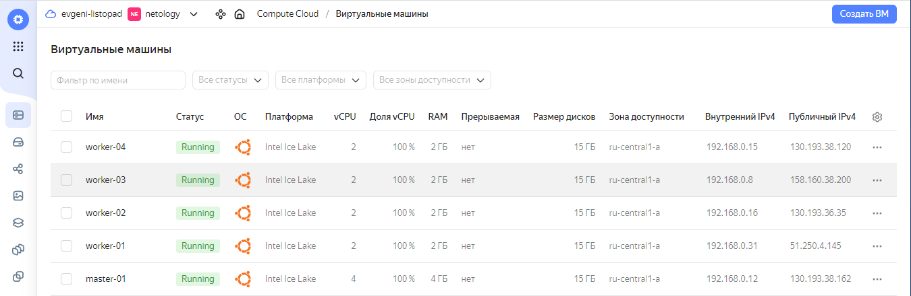
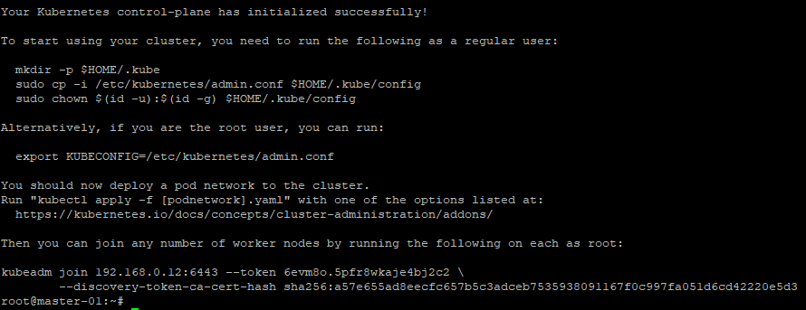
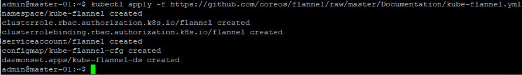
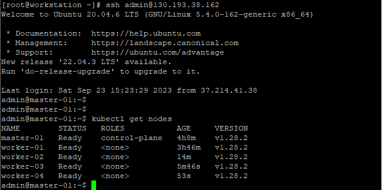
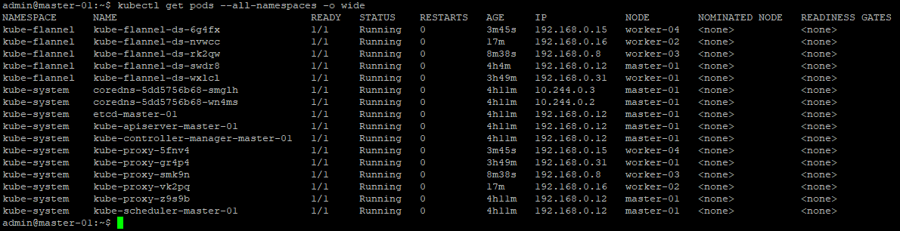

# Домашнее задание к занятию 14.2 «Установка Kubernetes»

### Цель задания

Установить кластер K8s.

### Чеклист готовности к домашнему заданию

1. Развёрнутые ВМ с ОС Ubuntu 20.04-lts.


### Инструменты и дополнительные материалы, которые пригодятся для выполнения задания

1. [Инструкция по установке kubeadm](https://kubernetes.io/docs/setup/production-environment/tools/kubeadm/create-cluster-kubeadm/).
2. [Документация kubespray](https://kubespray.io/).

-----

### Задание 1. Установить кластер k8s с 1 master node

1. Подготовка работы кластера из 5 нод: 1 мастер и 4 рабочие ноды.
2. В качестве CRI — containerd.
3. Запуск etcd производить на мастере.
4. Способ установки выбрать самостоятельно.

------


### Решение задания 1.

1. Создадим витуальные машины в Яндекс Облаке: 1 мастер и 4 рабочие ноды.


2. Подключаемся к виртуальной машине `master-01` и выполняем ее конфигурирование:

* Выполним установку kubeadm, kubelet, kubectl:
```
apt-get update
apt-get install -y apt-transport-https ca-certificates curl
mkdir -p /etc/apt/keyrings
curl -fsSL https://packages.cloud.google.com/apt/doc/apt-key.gpg | gpg --dearmor -o /etc/apt/keyrings/kubernetes-archive-keyring.gpg
echo "deb [signed-by=/etc/apt/keyrings/kubernetes-archive-keyring.gpg] https://apt.kubernetes.io/ kubernetes-xenial main" | tee /etc/apt/sources.list.d/kubernetes.list
apt-get update
apt-get install -y kubelet kubeadm kubectl
apt-mark hold kubelet kubeadm kubectl
```

* Включим работу IP forward
```
modprobe br_netfilter
modprobe overlay
echo "net.ipv4.ip_forward=1" >> /etc/sysctl.conf
echo "net.bridge.bridge-nf-call-iptables=1" >> /etc/sysctl.conf
echo "net.bridge.bridge-nf-call-arptables=1" >> /etc/sysctl.conf
echo "net.bridge.bridge-nf-call-ip6tables=1" >> /etc/sysctl.conf
sysctl -p /etc/sysctl.conf
cat <<EOF | sudo tee /etc/modules-load.d/containerd.conf
overlay
br_netfilter
EOF
```

* Установим и настроим containerd для запуска контейнеров:
```
apt-get update
apt-get install ca-certificates curl gnupg
install -m 0755 -d /etc/apt/keyrings
curl -fsSL https://download.docker.com/linux/ubuntu/gpg | gpg --dearmor -o /etc/apt/keyrings/docker.gpg
chmod a+r /etc/apt/keyrings/docker.gpg
echo "deb [arch="$(dpkg --print-architecture)" signed-by=/etc/apt/keyrings/docker.gpg] https://download.docker.com/linux/ubuntu "$(. /etc/os-release && echo "$VERSION_CODENAME")" stable" | tee /etc/apt/sources.list.d/docker.list > /dev/null
apt-get update
apt-get install containerd.io
mkdir -p /etc/containerd
containerd config default > /etc/containerd/config.toml
```
* Скорректируем секцию `[plugins."io.containerd.grpc.v1.cri".containerd.runtimes.runc.options]` в файле `/etc/containerd/config.toml` следующим образом:
```
          [plugins."io.containerd.grpc.v1.cri".containerd.runtimes.runc.options]
            BinaryName = ""
            CriuImagePath = ""
            CriuPath = ""
            CriuWorkPath = ""
            IoGid = 0
            IoUid = 0
            NoNewKeyring = false
            NoPivotRoot = false
            Root = ""
            ShimCgroup = ""
            SystemdCgroup = true
```

* Перезапускаем сервис containerd и добавляем в автозагрузку сервис kubelet:
```
root@master-01:~# systemctl restart containerd
root@master-01:~# systemctl status containerd
● containerd.service - containerd container runtime
     Loaded: loaded (/lib/systemd/system/containerd.service; enabled; vendor preset: enabled)
     Active: active (running) since Sat 2023-09-23 14:48:24 UTC; 1s ago
       Docs: https://containerd.io
    Process: 4899 ExecStartPre=/sbin/modprobe overlay (code=exited, status=0/SUCCESS)
   Main PID: 4906 (containerd)
      Tasks: 11
     Memory: 13.5M
     CGroup: /system.slice/containerd.service
             └─4906 /usr/bin/containerd

Sep 23 14:48:24 master-01 containerd[4906]: time="2023-09-23T14:48:24.474649310Z" level=info msg=serving... ad>
Sep 23 14:48:24 master-01 containerd[4906]: time="2023-09-23T14:48:24.474703467Z" level=info msg=serving... ad>
Sep 23 14:48:24 master-01 containerd[4906]: time="2023-09-23T14:48:24.474709264Z" level=info msg="Start subscr>
Sep 23 14:48:24 master-01 containerd[4906]: time="2023-09-23T14:48:24.474777743Z" level=info msg="Start recove>
Sep 23 14:48:24 master-01 containerd[4906]: time="2023-09-23T14:48:24.474840839Z" level=info msg="Start event >
Sep 23 14:48:24 master-01 containerd[4906]: time="2023-09-23T14:48:24.474854508Z" level=info msg="Start snapsh>
Sep 23 14:48:24 master-01 containerd[4906]: time="2023-09-23T14:48:24.474877264Z" level=info msg="Start cni ne>
Sep 23 14:48:24 master-01 containerd[4906]: time="2023-09-23T14:48:24.474887490Z" level=info msg="Start stream>
Sep 23 14:48:24 master-01 systemd[1]: Started containerd container runtime.
Sep 23 14:48:24 master-01 containerd[4906]: time="2023-09-23T14:48:24.476625946Z" level=info msg="containerd s>

root@master-01:~# systemctl enable kubelet
```

* Выполняем установку непосредственно мастер-ноды kubernetes:
```
root@master-01:~# kubeadm config images pull
[config/images] Pulled registry.k8s.io/kube-apiserver:v1.28.2
[config/images] Pulled registry.k8s.io/kube-controller-manager:v1.28.2
[config/images] Pulled registry.k8s.io/kube-scheduler:v1.28.2
[config/images] Pulled registry.k8s.io/kube-proxy:v1.28.2
[config/images] Pulled registry.k8s.io/pause:3.9
[config/images] Pulled registry.k8s.io/etcd:3.5.9-0
[config/images] Pulled registry.k8s.io/coredns/coredns:v1.10.1
root@master-01:~# kubeadm init --apiserver-advertise-address=192.168.0.12 --pod-network-cidr 10.244.0.0/16  --apiserver-cert-extra-sans=130.193.38.162,master-01.ru-central1.internal
[init] Using Kubernetes version: v1.28.2
-------------------------------ВЫВОД ПРОПУЩЕН-----------------------------

To start using your cluster, you need to run the following as a regular user:

  mkdir -p $HOME/.kube
  sudo cp -i /etc/kubernetes/admin.conf $HOME/.kube/config
  sudo chown $(id -u):$(id -g) $HOME/.kube/config

Alternatively, if you are the root user, you can run:

  export KUBECONFIG=/etc/kubernetes/admin.conf

You should now deploy a pod network to the cluster.
Run "kubectl apply -f [podnetwork].yaml" with one of the options listed at:
  https://kubernetes.io/docs/concepts/cluster-administration/addons/

Then you can join any number of worker nodes by running the following on each as root:

kubeadm join 192.168.0.12:6443 --token 6evm8o.5pfr8wkaje4bj2c2 \
        --discovery-token-ca-cert-hash sha256:a57e655ad8eecfc657b5c3adceb7535938091167f0c997fa051d6cd42220e5d3
```
* Подтврдим успешность создания мастер-ноды скриншотом:


* Создадим kubeconfig для пользователя admin на мастер-ноде:
```
admin@master-01:~$ mkdir -p $HOME/.kube
admin@master-01:~$ sudo cp -i /etc/kubernetes/admin.conf $HOME/.kube/config
admin@master-01:~$ sudo chown $(id -u):$(id -g) $HOME/.kube/config
```
* Установим сетевой плагин flannel на мастер-ноде:
```
admin@master-01:~$ kubectl apply -f https://github.com/coreos/flannel/raw/master/Documentation/kube-flannel.yml
namespace/kube-flannel created
clusterrole.rbac.authorization.k8s.io/flannel created
clusterrolebinding.rbac.authorization.k8s.io/flannel created
serviceaccount/flannel created
configmap/kube-flannel-cfg created
daemonset.apps/kube-flannel-ds created
admin@master-01:~$
```
* Подтврдим успешность установки flannel скриншотом:


3. Подключаемся поочередно к виртуальным машинам `worker-01, worker-02, worker-03, worker-04` и выполняем их конфигурирование одинаковым образом:
* Выполним установку kubeadm, kubelet, kubectl:
```
apt-get update
apt-get install -y apt-transport-https ca-certificates curl
mkdir -p /etc/apt/keyrings
curl -fsSL https://packages.cloud.google.com/apt/doc/apt-key.gpg | gpg --dearmor -o /etc/apt/keyrings/kubernetes-archive-keyring.gpg
echo "deb [signed-by=/etc/apt/keyrings/kubernetes-archive-keyring.gpg] https://apt.kubernetes.io/ kubernetes-xenial main" | tee /etc/apt/sources.list.d/kubernetes.list
apt-get update
apt-get install -y kubelet kubeadm kubectl
apt-mark hold kubelet kubeadm kubectl
```
* Включим работу IP forward
```
modprobe br_netfilter
modprobe overlay
echo "net.ipv4.ip_forward=1" >> /etc/sysctl.conf
echo "net.bridge.bridge-nf-call-iptables=1" >> /etc/sysctl.conf
echo "net.bridge.bridge-nf-call-arptables=1" >> /etc/sysctl.conf
echo "net.bridge.bridge-nf-call-ip6tables=1" >> /etc/sysctl.conf
sysctl -p /etc/sysctl.conf
cat <<EOF | sudo tee /etc/modules-load.d/containerd.conf
overlay
br_netfilter
EOF
```
* Установим и настроим containerd для запуска контейнеров:
```
apt-get update
apt-get install ca-certificates curl gnupg
install -m 0755 -d /etc/apt/keyrings
curl -fsSL https://download.docker.com/linux/ubuntu/gpg | gpg --dearmor -o /etc/apt/keyrings/docker.gpg
chmod a+r /etc/apt/keyrings/docker.gpg
echo "deb [arch="$(dpkg --print-architecture)" signed-by=/etc/apt/keyrings/docker.gpg] https://download.docker.com/linux/ubuntu "$(. /etc/os-release && echo "$VERSION_CODENAME")" stable" | tee /etc/apt/sources.list.d/docker.list > /dev/null
apt-get update
apt-get install containerd.io
mkdir -p /etc/containerd
containerd config default > /etc/containerd/config.toml
```
* Скорректируем секцию `[plugins."io.containerd.grpc.v1.cri".containerd.runtimes.runc.options]` в файле `/etc/containerd/config.toml` следующим образом:
```
          [plugins."io.containerd.grpc.v1.cri".containerd.runtimes.runc.options]
            BinaryName = ""
            CriuImagePath = ""
            CriuPath = ""
            CriuWorkPath = ""
            IoGid = 0
            IoUid = 0
            NoNewKeyring = false
            NoPivotRoot = false
            Root = ""
            ShimCgroup = ""
            SystemdCgroup = true
```

* Перезапускаем сервис containerd и добавляем в автозагрузку сервис kubelet:
```
root@worker-01:~# systemctl restart containerd
root@worker-01:~# systemctl status containerd
● containerd.service - containerd container runtime
     Loaded: loaded (/lib/systemd/system/containerd.service; enabled; vendor preset: enabled)
     Active: active (running) since Sat 2023-09-23 15:18:51 UTC; 8s ago
       Docs: https://containerd.io
    Process: 4632 ExecStartPre=/sbin/modprobe overlay (code=exited, status=0/SUCCESS)
   Main PID: 4633 (containerd)
      Tasks: 10
     Memory: 13.1M
     CGroup: /system.slice/containerd.service
             └─4633 /usr/bin/containerd

Sep 23 15:18:51 worker-01 containerd[4633]: time="2023-09-23T15:18:51.575997737Z" level=info msg=serving... addr>
Sep 23 15:18:51 worker-01 containerd[4633]: time="2023-09-23T15:18:51.576056848Z" level=info msg=serving... addr>
Sep 23 15:18:51 worker-01 containerd[4633]: time="2023-09-23T15:18:51.590184911Z" level=info msg="Start subscrib>
Sep 23 15:18:51 worker-01 containerd[4633]: time="2023-09-23T15:18:51.590456158Z" level=info msg="Start recoveri>
Sep 23 15:18:51 worker-01 containerd[4633]: time="2023-09-23T15:18:51.590649315Z" level=info msg="Start event mo>
Sep 23 15:18:51 worker-01 containerd[4633]: time="2023-09-23T15:18:51.590756180Z" level=info msg="Start snapshot>
Sep 23 15:18:51 worker-01 containerd[4633]: time="2023-09-23T15:18:51.590850532Z" level=info msg="Start cni netw>
Sep 23 15:18:51 worker-01 containerd[4633]: time="2023-09-23T15:18:51.590940875Z" level=info msg="Start streamin>
Sep 23 15:18:51 worker-01 systemd[1]: Started containerd container runtime.
Sep 23 15:18:51 worker-01 containerd[4633]: time="2023-09-23T15:18:51.595560928Z" level=info msg="containerd suc>
>
root@worker-01:~#
root@worker-01:~# systemctl enable kubelet
```
* Выполним ввод рабочей ноды в кластер kubernetes:
```
root@worker-01:~# kubeadm join 192.168.0.12:6443 --token 6evm8o.5pfr8wkaje4bj2c2 \
>         --discovery-token-ca-cert-hash sha256:a57e655ad8eecfc657b5c3adceb7535938091167f0c997fa051d6cd42220e5d3
[preflight] Running pre-flight checks
[preflight] Reading configuration from the cluster...
[preflight] FYI: You can look at this config file with 'kubectl -n kube-system get cm kubeadm-config -o yaml'
[kubelet-start] Writing kubelet configuration to file "/var/lib/kubelet/config.yaml"
[kubelet-start] Writing kubelet environment file with flags to file "/var/lib/kubelet/kubeadm-flags.env"
[kubelet-start] Starting the kubelet
[kubelet-start] Waiting for the kubelet to perform the TLS Bootstrap...

This node has joined the cluster:
* Certificate signing request was sent to apiserver and a response was received.
* The Kubelet was informed of the new secure connection details.

Run 'kubectl get nodes' on the control-plane to see this node join the cluster.
```
* Проверим состояние кластера на master-ноде после ввода первой рабочей ноды:
```
admin@master-01:~$ kubectl get nodes
NAME        STATUS   ROLES           AGE   VERSION
master-01   Ready    control-plane   23m   v1.28.2
worker-01   Ready    <none>          90s   v1.28.2

```
* Абсолютно аналогичным образом выполняем настройку остальных рабочих нод
* После всей настройки подключаемся к master-ноде и проверяем состояние кластера:
```
admin@master-01:~$ kubectl get nodes
NAME        STATUS   ROLES           AGE     VERSION
master-01   Ready    control-plane   4h8m    v1.28.2
worker-01   Ready    <none>          3h46m   v1.28.2
worker-02   Ready    <none>          14m     v1.28.2
worker-03   Ready    <none>          5m46s   v1.28.2
worker-04   Ready    <none>          53s     v1.28.2
admin@master-01:~$
```
* Подтврдим успешность проверки скриншотом:

* Проверим состояние всех служебных подов и убедимся в запуске etcd на master-ноде:
```
admin@master-01:~$ kubectl get pods --all-namespaces -o wide
NAMESPACE      NAME                                READY   STATUS    RESTARTS   AGE     IP             NODE        NOMINATED NODE   READINESS GATES
kube-flannel   kube-flannel-ds-6g4fx               1/1     Running   0          3m45s   192.168.0.15   worker-04   <none>           <none>
kube-flannel   kube-flannel-ds-nvwcc               1/1     Running   0          17m     192.168.0.16   worker-02   <none>           <none>
kube-flannel   kube-flannel-ds-rk2qw               1/1     Running   0          8m38s   192.168.0.8    worker-03   <none>           <none>
kube-flannel   kube-flannel-ds-swdr8               1/1     Running   0          4h4m    192.168.0.12   master-01   <none>           <none>
kube-flannel   kube-flannel-ds-wxlcl               1/1     Running   0          3h49m   192.168.0.31   worker-01   <none>           <none>
kube-system    coredns-5dd5756b68-smglh            1/1     Running   0          4h11m   10.244.0.3     master-01   <none>           <none>
kube-system    coredns-5dd5756b68-wn4ms            1/1     Running   0          4h11m   10.244.0.2     master-01   <none>           <none>
kube-system    etcd-master-01                      1/1     Running   0          4h11m   192.168.0.12   master-01   <none>           <none>
kube-system    kube-apiserver-master-01            1/1     Running   0          4h11m   192.168.0.12   master-01   <none>           <none>
kube-system    kube-controller-manager-master-01   1/1     Running   0          4h11m   192.168.0.12   master-01   <none>           <none>
kube-system    kube-proxy-5fnv4                    1/1     Running   0          3m45s   192.168.0.15   worker-04   <none>           <none>
kube-system    kube-proxy-gr4p4                    1/1     Running   0          3h49m   192.168.0.31   worker-01   <none>           <none>
kube-system    kube-proxy-smk9n                    1/1     Running   0          8m38s   192.168.0.8    worker-03   <none>           <none>
kube-system    kube-proxy-vk2pq                    1/1     Running   0          17m     192.168.0.16   worker-02   <none>           <none>
kube-system    kube-proxy-z9s9b                    1/1     Running   0          4h11m   192.168.0.12   master-01   <none>           <none>
kube-system    kube-scheduler-master-01            1/1     Running   0          4h11m   192.168.0.12   master-01   <none>           <none>
```
* Подтврдим успешность проверки скриншотом:

