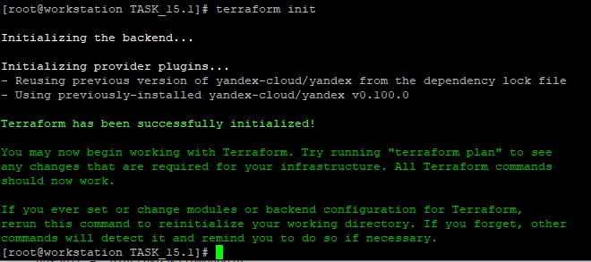
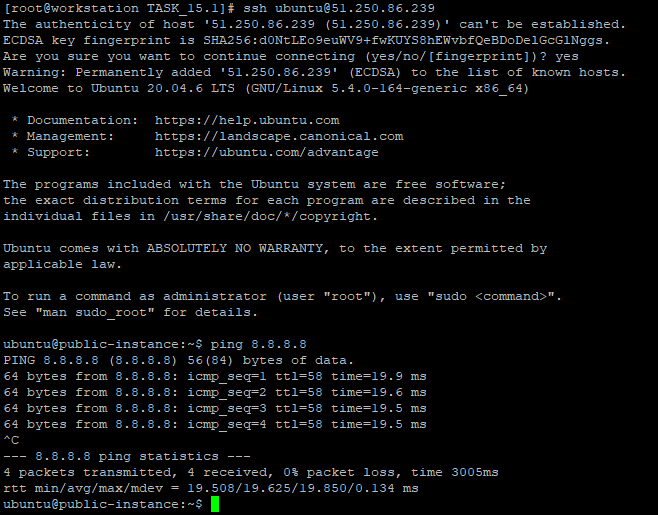
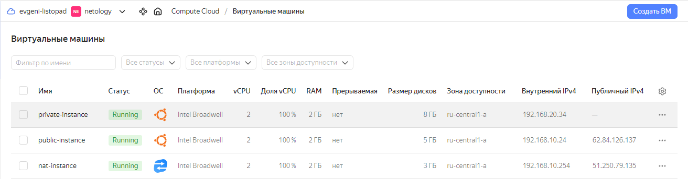
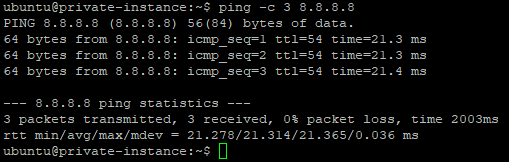

# Домашнее задание к занятию 15.1 «Организация сети»

### Подготовка к выполнению задания

1. Домашнее задание состоит из обязательной части, которую нужно выполнить на провайдере Yandex Cloud, и дополнительной части в AWS (выполняется по желанию). 
2. Все домашние задания в блоке 15 связаны друг с другом и в конце представляют пример законченной инфраструктуры.  
3. Все задания нужно выполнить с помощью Terraform. Результатом выполненного домашнего задания будет код в репозитории. 
4. Перед началом работы настройте доступ к облачным ресурсам из Terraform, используя материалы прошлых лекций и домашнее задание по теме «Облачные провайдеры и синтаксис Terraform». Заранее выберите регион (в случае AWS) и зону.

---
### Задание 1. Yandex Cloud 

**Что нужно сделать**

1. Создать пустую VPC. Выбрать зону.
2. Публичная подсеть.

 - Создать в VPC subnet с названием public, сетью 192.168.10.0/24.
 - Создать в этой подсети NAT-инстанс, присвоив ему адрес 192.168.10.254. В качестве image_id использовать fd80mrhj8fl2oe87o4e1.
 - Создать в этой публичной подсети виртуалку с публичным IP, подключиться к ней и убедиться, что есть доступ к интернету.
3. Приватная подсеть.
 - Создать в VPC subnet с названием private, сетью 192.168.20.0/24.
 - Создать route table. Добавить статический маршрут, направляющий весь исходящий трафик private сети в NAT-инстанс.
 - Создать в этой приватной подсети виртуалку с внутренним IP, подключиться к ней через виртуалку, созданную ранее, и убедиться, что есть доступ к интернету.

Resource Terraform для Yandex Cloud:

- [VPC subnet](https://registry.terraform.io/providers/yandex-cloud/yandex/latest/docs/resources/vpc_subnet).
- [Route table](https://registry.terraform.io/providers/yandex-cloud/yandex/latest/docs/resources/vpc_route_table).
- [Compute Instance](https://registry.terraform.io/providers/yandex-cloud/yandex/latest/docs/resources/compute_instance).

---

### Решение задания 1.

1. Поверим настройки утилиты `yc` для работы с Yandex Cloud:
```
[root@workstation TASK_15.1]# yc config list
token: y0_*********XKA
cloud-id: b1gkjk5reuc4u9svu54m
folder-id: b1gj45vv7fpc7kmc184h
compute-default-zone: ru-central1-a
```

2. Получим IAM-токен для работы с Yandex Cloud:
```
yc iam create-token
t1.9*********-*********BPDQ
```

3. Сохраним IAM-токен и остальные параметры в соответствующие переменные окружения `yc`:
```
export YC_TOKEN=$(yc iam create-token)
export YC_CLOUD_ID=$(yc config get cloud-id)
export YC_FOLDER_ID=$(yc config get folder-id)
export YC_ZONE=$(yc config get compute-default-zone)
```

4. Обновим Terraform до последней версии. Проверим его версию после обновления:
```
[root@workstation ~]# terraform --version
Terraform v1.6.1
on linux_amd64
```

5. Выполним настройку зеркала провайдера Yandex Cloud для Terraform, добавив файл `~/.terraformrc`:
```
[root@workstation ~]# cat .terraformrc
provider_installation {
  network_mirror {
    url = "https://terraform-mirror.yandexcloud.net/"
    include = ["registry.terraform.io/*/*"]
  }
  direct {
    exclude = ["registry.terraform.io/*/*"]
  }
}
```

6. Создадим файл `main.tf` для Terraform с информацией об облачном провайдере:
```
[root@workstation TASK_15.1]# cat main.tf
terraform {
  required_providers {
    yandex = {
      source = "yandex-cloud/yandex"
    }
  }
  required_version = ">= 0.13"
}

provider "yandex" {
  zone = "ru-central1-a"
}
``` 

7. Выполним инициализацию Terraform для работы с Yandex Cloud:
```
[root@workstation TASK_15.1]# terraform init

Initializing the backend...

Initializing provider plugins...
- Reusing previous version of yandex-cloud/yandex from the dependency lock file
- Using previously-installed yandex-cloud/yandex v0.100.0

Terraform has been successfully initialized!

You may now begin working with Terraform. Try running "terraform plan" to see
any changes that are required for your infrastructure. All Terraform commands
should now work.

If you ever set or change modules or backend configuration for Terraform,
rerun this command to reinitialize your working directory. If you forget, other
commands will detect it and remind you to do so if necessary.
```
8. Terraform успешно инициализирован. Подтвердим результат инициализации скриншотом:

9. Дополним файл `main.tf` для Terraform необходимой информацией для создания VPC и публичной подсети в Yandex Cloud:
* Добавим блок переменных, определяющих основные параметры Yandex Cloud:
```
# Variables
variable "yc_token" {
  default = "t1.9**************************************jCWSAw"
}
variable "yc_cloud_id" {
  default = "b1gkjk5reuc4u9svu54m"
}
variable "yc_folder_id" {
  default = "b1gj45vv7fpc7kmc184h"
}
variable "yc_zone" {
  default = "ru-central1-a"
} 
```
* Уточним информацию об облачном провайдере, используя описанные переменные:
```
provider "yandex" {
  token     = var.yc_token
  cloud_id  = var.yc_cloud_id
  folder_id = var.yc_folder_id
  zone = var.yc_zone
}
```
* Опишем создание VPC:
```
# VPC
resource "yandex_vpc_network" "network-netology" {
  name = "network-netology"
}
```
* Опишем создание публичной подсети с именем `public`:
```
# Public subnet
resource "yandex_vpc_subnet" "public" {
  name           = "public"
  zone           = var.yc_zone
  network_id     = yandex_vpc_network.network-netology.id
  v4_cidr_blocks = ["192.168.10.0/24"]
}
```
* Опишем создание NAT-инстанса с адресом `192.168.10.254` и image_id `fd80mrhj8fl2oe87o4e1`:
```
# NAT instance
resource "yandex_compute_instance" "nat-instance" {
  name = "nat-instance"
  hostname = "nat-instance"
  zone     = var.yc_zone
  resources {
    cores  = 2
    memory = 2
  }
  boot_disk {
    initialize_params {
      image_id = "fd80mrhj8fl2oe87o4e1"
    }
  }
  network_interface {
    subnet_id = yandex_vpc_subnet.public.id
    ip_address = "192.168.10.254"
    nat       = true
  }
  metadata = {
    ssh-keys = "ubuntu:${file("~/.ssh/id_rsa.pub")}"
  }
}
```
* Опишем создание виртуальной машины с публичным IP:
```
# Public instance
resource "yandex_compute_instance" "public-instance" {
  name = "public-instance"
  hostname = "public-instance"
  zone     = var.yc_zone
  resources {
    cores  = 2
    memory = 2
  }
  boot_disk {
    initialize_params {
      image_id = "fd826honb8s0i1jtt6cg"
    }
  }
  network_interface {
    subnet_id = yandex_vpc_subnet.public.id
    nat       = true
  }
  metadata = {
    ssh-keys = "ubuntu:${file("~/.ssh/id_rsa.pub")}"
  }
}
```
* Добавим в вывод информацию об external IP-адресах для NAT instance и Public instance:
```
output "external_ip_address_public" {
  value = yandex_compute_instance.public-instance.network_interface.0.nat_ip_address
}
output "external_ip_address_nat" {
  value = yandex_compute_instance.nat-instance.network_interface.0.nat_ip_address
}
```

* Проверим конфигурацию Terraform для созданного файла `main.tf`:
```
[root@workstation TASK_15.1]# terraform validate
Success! The configuration is valid.

```

* Подготовим план для Terraform:
```
[root@workstation TASK_15.1]# terraform plan

Terraform used the selected providers to generate the following execution plan. Resource actions are indicated with the following symbols:
  + create
----------------------------------ВЫВОД ПРОПУЩЕН----------------------------
Plan: 4 to add, 0 to change, 0 to destroy.

Changes to Outputs:
  + external_ip_address_nat    = (known after apply)
  + external_ip_address_public = (known after apply)

────────────────────────────────────────────────────────────────────────────────────────────────────────────────────────────────────────────────────────────────────────────────────────────────────────────────────────────────────────────

Note: You didn't use the -out option to save this plan, so Terraform can't guarantee to take exactly these actions if you run "terraform apply" now.
```
* Запустим создание ресурсов с помощью Terraform:
```
[root@workstation TASK_15.1]# terraform apply --auto-approve

Terraform used the selected providers to generate the following execution plan. Resource actions are indicated with the following symbols:
  + create
--------------------------------ВЫВОД ПРОПУЩЕН-------------------------------
yandex_vpc_network.network-netology: Creating...
yandex_vpc_network.network-netology: Creation complete after 3s [id=enpb6eeesjrcgo2j0fge]
yandex_vpc_subnet.public: Creating...
yandex_vpc_subnet.public: Creation complete after 1s [id=e9bsse6e42f0219svjcr]
yandex_compute_instance.nat-instance: Creating...
yandex_compute_instance.public-instance: Creating...
yandex_compute_instance.nat-instance: Still creating... [10s elapsed]
yandex_compute_instance.public-instance: Still creating... [10s elapsed]
yandex_compute_instance.nat-instance: Still creating... [20s elapsed]
yandex_compute_instance.public-instance: Still creating... [20s elapsed]
yandex_compute_instance.nat-instance: Still creating... [30s elapsed]
yandex_compute_instance.public-instance: Still creating... [30s elapsed]
yandex_compute_instance.public-instance: Still creating... [40s elapsed]
yandex_compute_instance.nat-instance: Still creating... [40s elapsed]
yandex_compute_instance.public-instance: Creation complete after 42s [id=fhmmm9dlcip9jmishj31]
yandex_compute_instance.nat-instance: Still creating... [50s elapsed]
yandex_compute_instance.nat-instance: Still creating... [1m0s elapsed]
yandex_compute_instance.nat-instance: Still creating... [1m10s elapsed]
yandex_compute_instance.nat-instance: Creation complete after 1m20s [id=fhm2gjh5e7qi72kufduf]

Apply complete! Resources: 4 added, 0 changed, 0 destroyed.

Outputs:

external_ip_address_nat = "51.250.8.222"
external_ip_address_public = "51.250.86.239"
```

* Убедимся, что сеть с именем `network-netology` создана:
```
[root@workstation TASK_15.1]# yc vpc network list
+----------------------+------------------+
|          ID          |       NAME       |
+----------------------+------------------+
| enp2uaib91nhpia5emj5 | default          |
| enpb6eeesjrcgo2j0fge | network-netology |
+----------------------+------------------+
```

* Убедимся, что в сети с именем `network-netology` создана подсеть `public`:
```
[root@workstation TASK_15.1]# yc vpc network --name network-netology list-subnets
+----------------------+--------+----------------------+----------------------+----------------+---------------+-------------------+
|          ID          |  NAME  |      FOLDER ID       |      NETWORK ID      | ROUTE TABLE ID |     ZONE      |       RANGE       |
+----------------------+--------+----------------------+----------------------+----------------+---------------+-------------------+
| e9bsse6e42f0219svjcr | public | b1gj45vv7fpc7kmc184h | enpb6eeesjrcgo2j0fge |                | ru-central1-a | [192.168.10.0/24] |
+----------------------+--------+----------------------+----------------------+----------------+---------------+-------------------+
```

* Убедимся, что созданы виртуальные машины `nat-instance` и `public-instance`:
```
[root@workstation TASK_15.1]# yc compute instance list
+----------------------+-----------------+---------------+---------+---------------+----------------+
|          ID          |      NAME       |    ZONE ID    | STATUS  |  EXTERNAL IP  |  INTERNAL IP   |
+----------------------+-----------------+---------------+---------+---------------+----------------+
| fhm2gjh5e7qi72kufduf | nat-instance    | ru-central1-a | RUNNING | 51.250.8.222  | 192.168.10.254 |
| fhmmm9dlcip9jmishj31 | public-instance | ru-central1-a | RUNNING | 51.250.86.239 | 192.168.10.6   |
+----------------------+-----------------+---------------+---------+---------------+----------------+
```

* Подключимся к виртуальной машине `public-instance` и проверим наличие доступа в Интернет:
```
[root@workstation TASK_15.1]# ssh ubuntu@51.250.86.239
The authenticity of host '51.250.86.239 (51.250.86.239)' can't be established.
ECDSA key fingerprint is SHA256:d0NtLEo9euWV9+fwKUYS8hEWvbfQeBDoDelGcGlNggs.
Are you sure you want to continue connecting (yes/no/[fingerprint])? yes
Warning: Permanently added '51.250.86.239' (ECDSA) to the list of known hosts.
Welcome to Ubuntu 20.04.6 LTS (GNU/Linux 5.4.0-164-generic x86_64)

 * Documentation:  https://help.ubuntu.com
 * Management:     https://landscape.canonical.com
 * Support:        https://ubuntu.com/advantage

The programs included with the Ubuntu system are free software;
the exact distribution terms for each program are described in the
individual files in /usr/share/doc/*/copyright.

Ubuntu comes with ABSOLUTELY NO WARRANTY, to the extent permitted by
applicable law.

To run a command as administrator (user "root"), use "sudo <command>".
See "man sudo_root" for details.

ubuntu@public-instance:~$ ping 8.8.8.8
PING 8.8.8.8 (8.8.8.8) 56(84) bytes of data.
64 bytes from 8.8.8.8: icmp_seq=1 ttl=58 time=19.9 ms
64 bytes from 8.8.8.8: icmp_seq=2 ttl=58 time=19.6 ms
64 bytes from 8.8.8.8: icmp_seq=3 ttl=58 time=19.5 ms
64 bytes from 8.8.8.8: icmp_seq=4 ttl=58 time=19.5 ms
^C
--- 8.8.8.8 ping statistics ---
4 packets transmitted, 4 received, 0% packet loss, time 3005ms
rtt min/avg/max/mdev = 19.508/19.625/19.850/0.134 ms
```

* Подтвердим результат проверки скриншотом:


* Удалим ресурсы в Yandex Cloud и перейдем к следующей части задания:
```
[root@workstation TASK_15.1]# terraform destroy --auto-approve
yandex_vpc_network.network-netology: Refreshing state... [id=enpb6eeesjrcgo2j0fge]
yandex_vpc_subnet.public: Refreshing state... [id=e9bsse6e42f0219svjcr]
yandex_compute_instance.public-instance: Refreshing state... [id=fhmmm9dlcip9jmishj31]
yandex_compute_instance.nat-instance: Refreshing state... [id=fhm2gjh5e7qi72kufduf]
---------------------------------ВЫВОД ПРОПУЩЕН--------------------------------
yandex_compute_instance.public-instance: Destroying... [id=fhmmm9dlcip9jmishj31]
yandex_compute_instance.nat-instance: Destroying... [id=fhm2gjh5e7qi72kufduf]
yandex_compute_instance.public-instance: Still destroying... [id=fhmmm9dlcip9jmishj31, 10s elapsed]
yandex_compute_instance.nat-instance: Still destroying... [id=fhm2gjh5e7qi72kufduf, 10s elapsed]
yandex_compute_instance.nat-instance: Still destroying... [id=fhm2gjh5e7qi72kufduf, 20s elapsed]
yandex_compute_instance.public-instance: Still destroying... [id=fhmmm9dlcip9jmishj31, 20s elapsed]
yandex_compute_instance.public-instance: Still destroying... [id=fhmmm9dlcip9jmishj31, 30s elapsed]
yandex_compute_instance.nat-instance: Still destroying... [id=fhm2gjh5e7qi72kufduf, 30s elapsed]
yandex_compute_instance.nat-instance: Still destroying... [id=fhm2gjh5e7qi72kufduf, 40s elapsed]
yandex_compute_instance.public-instance: Still destroying... [id=fhmmm9dlcip9jmishj31, 40s elapsed]
yandex_compute_instance.public-instance: Destruction complete after 43s
yandex_compute_instance.nat-instance: Destruction complete after 43s
yandex_vpc_subnet.public: Destroying... [id=e9bsse6e42f0219svjcr]
yandex_vpc_subnet.public: Destruction complete after 3s
yandex_vpc_network.network-netology: Destroying... [id=enpb6eeesjrcgo2j0fge]
yandex_vpc_network.network-netology: Destruction complete after 1s

Destroy complete! Resources: 4 destroyed.
```

10. Дополним файл `main.tf` для Terraform необходимой информацией для создания приватной подсети в Yandex Cloud:
* Опишем создание приватной подсети с именем `private`:
```
# Private subnet
resource "yandex_vpc_subnet" "private" {
  name           = "private"
  zone           = var.yc_zone
  network_id     = yandex_vpc_network.network-netology.id
  route_table_id = yandex_vpc_route_table.netology-routing.id
  v4_cidr_blocks = ["192.168.20.0/24"]
}
```
* Опишем создание route table. Добавим статический маршрут, направляющий весь исходящий трафик private сети в NAT-инстанс:
```
# Routing table
resource "yandex_vpc_route_table" "netology-routing" {
  name       = "netology-routing"
  network_id = yandex_vpc_network.network-netology.id
  static_route {
    destination_prefix = "0.0.0.0/0"
    next_hop_address   = "192.168.10.254"
  }
}
```
* Опишем создание виртуальной машины без публичного IP:
```
# Private instance
resource "yandex_compute_instance" "private-instance" {
  name = "private-instance"
  hostname = "private-instance"
  zone     = var.yc_zone
  resources {
    cores  = 2
    memory = 2
  }
  boot_disk {
    initialize_params {
      image_id = "fd8bkgba66kkf9eenpkb"
    }
  }
  network_interface {
    subnet_id = yandex_vpc_subnet.private.id
  }
  metadata = {
    ssh-keys = "ubuntu:${file("~/.ssh/id_rsa.pub")}"
  }
}
```
* Добавим в вывод информацию о внутреннем IP-адресе для Private instance:
```
output "internal_ip_address_private" {
  value = yandex_compute_instance.private-instance.network_interface.0.ip_address
}
```

* Проверим конфигурацию Terraform для обновленного файла `main.tf`:
```
[root@workstation TASK_15.1]# terraform validate
Success! The configuration is valid.

```

* Подготовим план для Terraform:
```
[root@workstation TASK_15.1]# terraform plan

Terraform used the selected providers to generate the following execution plan. Resource actions are indicated with the following symbols:
  + create
--------------------------ВЫВОД ПРОПУЩЕН-----------------------------
Plan: 7 to add, 0 to change, 0 to destroy.

Changes to Outputs:
  + external_ip_address_nat     = (known after apply)
  + external_ip_address_public  = (known after apply)
  + internal_ip_address_private = (known after apply)

────────────────────────────────────────────────────────────────────────────────────────────────────────────────────────────────────────────────────────────────────────────────────────────────────────────────────────────────────────────

Note: You didn't use the -out option to save this plan, so Terraform can't guarantee to take exactly these actions if you run "terraform apply" now.
```

* Запустим создание ресурсов с помощью Terraform:
```
[root@workstation TASK_15.1]# terraform apply --auto-approve

Terraform used the selected providers to generate the following execution plan. Resource actions are indicated with the following symbols:
  + create
--------------------------ВЫВОД ПРОПУЩЕН-----------------------------
Apply complete! Resources: 7 added, 0 changed, 0 destroyed.

Outputs:

external_ip_address_nat = "51.250.79.135"
external_ip_address_public = "62.84.126.137"
internal_ip_address_private = "192.168.20.34"


```
* Убедимся, что в сети с именем `network-netology` созданы подсети `public` и `private` (при этом `private` с `route table`):
```
[root@workstation TASK_15.1]# yc vpc network --name network-netology list-subnets
+----------------------+---------+----------------------+----------------------+----------------------+---------------+-------------------+
|          ID          |  NAME   |      FOLDER ID       |      NETWORK ID      |    ROUTE TABLE ID    |     ZONE      |       RANGE       |
+----------------------+---------+----------------------+----------------------+----------------------+---------------+-------------------+
| e9b0o1ak9r3i57mdk43v | private | b1gj45vv7fpc7kmc184h | enp1frd09jmhja2d7ouq | enpnvtbeu9ouur4qvuoj | ru-central1-a | [192.168.20.0/24] |
| e9bfdeuge098fnu0mc4l | public  | b1gj45vv7fpc7kmc184h | enp1frd09jmhja2d7ouq |                      | ru-central1-a | [192.168.10.0/24] |
+----------------------+---------+----------------------+----------------------+----------------------+---------------+-------------------+
```

* Убедимся, что созданы виртуальные машины `nat-instance`, `public-instance` и `private-instance`:
```
[root@workstation TASK_15.1]# yc compute instance list
+----------------------+------------------+---------------+---------+---------------+----------------+
|          ID          |       NAME       |    ZONE ID    | STATUS  |  EXTERNAL IP  |  INTERNAL IP   |
+----------------------+------------------+---------------+---------+---------------+----------------+
| fhmkrnfbi3j17qkvu2kk | nat-instance     | ru-central1-a | RUNNING | 51.250.79.135 | 192.168.10.254 |
| fhmrqnpurs4inc7tugc8 | private-instance | ru-central1-a | RUNNING |               | 192.168.20.34  |
| fhmtek1a06s9kvh2cj2j | public-instance  | ru-central1-a | RUNNING | 62.84.126.137 | 192.168.10.24  |
+----------------------+------------------+---------------+---------+---------------+----------------+
```

* Подтвердим создание виртуальных машин скриншотом из графического интерфейса Yandex Cloud:


* Видим, что виртуальная машина `private-instance` не имеет внешнего IP-адреса. Так и должно быть. Подключение к данной виртуальной машине выполним через виртуальную машину `public-instance`, скопировав на нее приватный ключ ssh:
```
[root@workstation TASK_15.1]# scp /root/.ssh/id_rsa ubuntu@62.84.126.137:/home/ubuntu/.ssh/
id_rsa                                                                                                                                                                                                     100% 2602    60.5KB/s   00:00
[root@workstation TASK_15.1]# ssh ubuntu@62.84.126.137
Welcome to Ubuntu 20.04.6 LTS (GNU/Linux 5.4.0-164-generic x86_64)

--------------------------ВЫВОД ПРОПУЩЕН-----------------------------

To run a command as administrator (user "root"), use "sudo <command>".
See "man sudo_root" for details.

ubuntu@public-instance:~$ ssh 192.168.20.34
The authenticity of host '192.168.20.34 (192.168.20.34)' can't be established.
ECDSA key fingerprint is SHA256:wo3TUtv43NwPSOTP+jA7RRViVgRbAjX9RNkOMVcNpv8.
Are you sure you want to continue connecting (yes/no/[fingerprint])? yes
Warning: Permanently added '192.168.20.34' (ECDSA) to the list of known hosts.
Welcome to Ubuntu 22.04.2 LTS (GNU/Linux 5.15.0-76-generic x86_64)

--------------------------ВЫВОД ПРОПУЩЕН-----------------------------

To run a command as administrator (user "root"), use "sudo <command>".
See "man sudo_root" for details.

ubuntu@private-instance:~$
```
* Находясь на виртуальной машине `private-instance`, проверим доступ в Интернет:
```
ubuntu@private-instance:~$ ping -c 3 8.8.8.8
PING 8.8.8.8 (8.8.8.8) 56(84) bytes of data.
64 bytes from 8.8.8.8: icmp_seq=1 ttl=54 time=21.3 ms
64 bytes from 8.8.8.8: icmp_seq=2 ttl=54 time=21.3 ms
64 bytes from 8.8.8.8: icmp_seq=3 ttl=54 time=21.4 ms

--- 8.8.8.8 ping statistics ---
3 packets transmitted, 3 received, 0% packet loss, time 2003ms
rtt min/avg/max/mdev = 21.278/21.314/21.365/0.036 ms
```
* Все работает корректно. Подтвердим успешность проверки доступа в Интернет скриншотом:


11. Удалим все созданные ресурсы в Yandex Cloud:
```
[root@workstation TASK_15.1]# terraform destroy --auto-approve
yandex_vpc_network.network-netology: Refreshing state... [id=enp1frd09jmhja2d7ouq]
yandex_vpc_route_table.netology-routing: Refreshing state... [id=enpnvtbeu9ouur4qvuoj]
--------------------------ВЫВОД ПРОПУЩЕН-----------------------------
yandex_vpc_network.network-netology: Destroying... [id=enp1frd09jmhja2d7ouq]
yandex_vpc_network.network-netology: Destruction complete after 1s

Destroy complete! Resources: 7 destroyed.
```

12. Ссылка на полный файл [main.tf](./TASK_15.1/main.tf).

