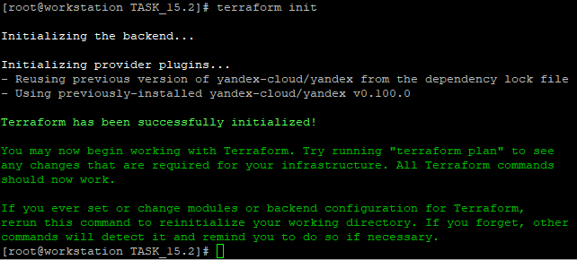
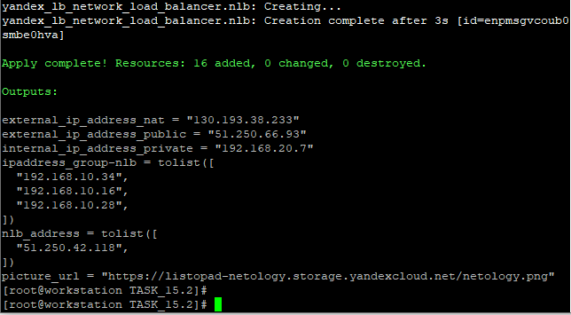
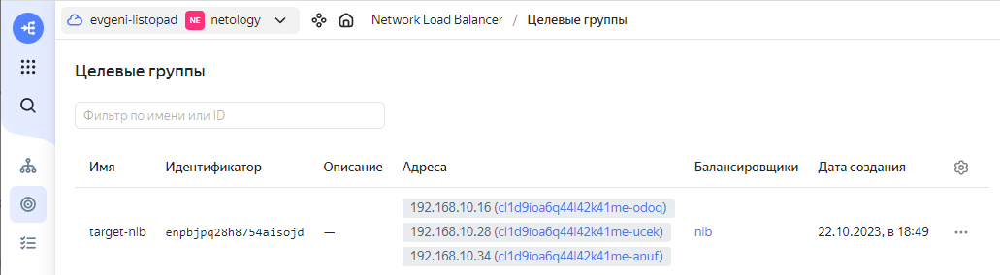
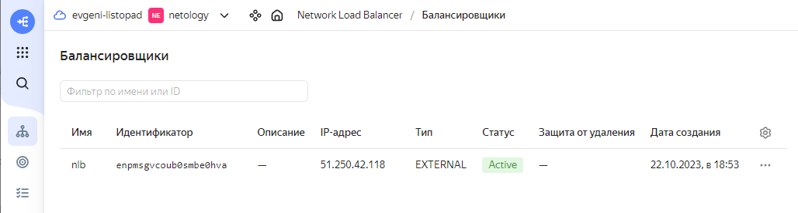
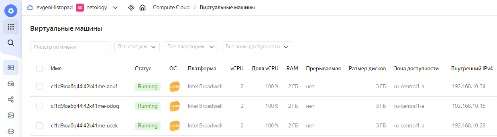
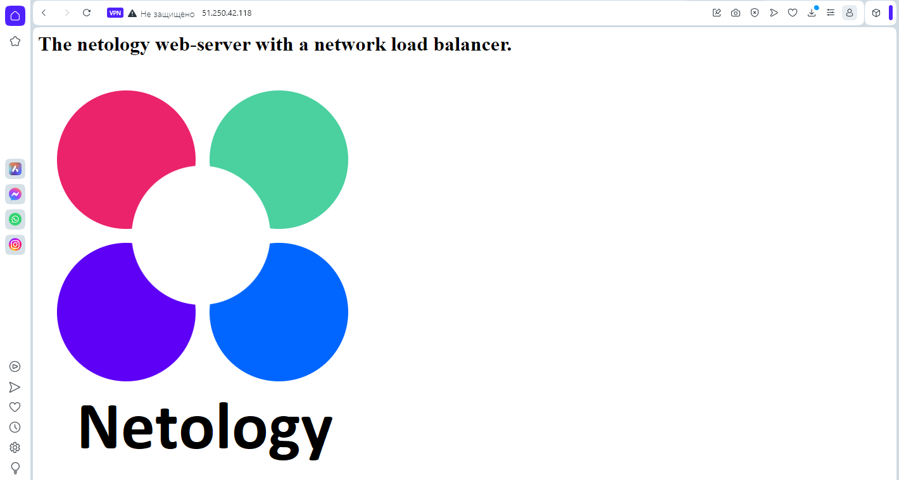
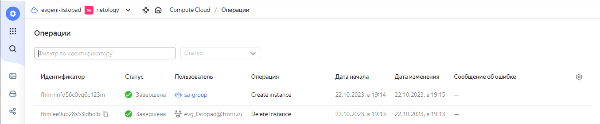

# Домашнее задание к занятию 15.2 «Вычислительные мощности. Балансировщики нагрузки»  

### Подготовка к выполнению задания

1. Домашнее задание состоит из обязательной части, которую нужно выполнить на провайдере Yandex Cloud, и дополнительной части в AWS (выполняется по желанию). 
2. Все домашние задания в блоке 15 связаны друг с другом и в конце представляют пример законченной инфраструктуры.  
3. Все задания нужно выполнить с помощью Terraform. Результатом выполненного домашнего задания будет код в репозитории. 
4. Перед началом работы настройте доступ к облачным ресурсам из Terraform, используя материалы прошлых лекций и домашних заданий.

---
## Задание 1. Yandex Cloud 

**Что нужно сделать**

1. Создать бакет Object Storage и разместить в нём файл с картинкой:

 - Создать бакет в Object Storage с произвольным именем (например, _имя_студента_дата_).
 - Положить в бакет файл с картинкой.
 - Сделать файл доступным из интернета.
 
2. Создать группу ВМ в public подсети фиксированного размера с шаблоном LAMP и веб-страницей, содержащей ссылку на картинку из бакета:

 - Создать Instance Group с тремя ВМ и шаблоном LAMP. Для LAMP рекомендуется использовать `image_id = fd827b91d99psvq5fjit`.
 - Для создания стартовой веб-страницы рекомендуется использовать раздел `user_data` в [meta_data](https://cloud.yandex.ru/docs/compute/concepts/vm-metadata).
 - Разместить в стартовой веб-странице шаблонной ВМ ссылку на картинку из бакета.
 - Настроить проверку состояния ВМ.
 
3. Подключить группу к сетевому балансировщику:

 - Создать сетевой балансировщик.
 - Проверить работоспособность, удалив одну или несколько ВМ.
4. (дополнительно)* Создать Application Load Balancer с использованием Instance group и проверкой состояния.

Полезные документы:

- [Compute instance group](https://registry.terraform.io/providers/yandex-cloud/yandex/latest/docs/resources/compute_instance_group).
- [Network Load Balancer](https://registry.terraform.io/providers/yandex-cloud/yandex/latest/docs/resources/lb_network_load_balancer).
- [Группа ВМ с сетевым балансировщиком](https://cloud.yandex.ru/docs/compute/operations/instance-groups/create-with-balancer).

---

### Решение задания 1.

1. Поверим настройки утилиты `yc` для работы с Yandex Cloud:
```
[root@workstation TASK_15.2]# yc config list
token: y0_*********XKA
cloud-id: b1gkjk5reuc4u9svu54m
folder-id: b1gj45vv7fpc7kmc184h
compute-default-zone: ru-central1-a
```

2. Получим IAM-токен для работы с Yandex Cloud:
```
yc iam create-token
t1.9***************************4Bw
```

3. Сохраним IAM-токен и остальные параметры в соответствующие переменные окружения `yc`:
```
export YC_TOKEN=$(yc iam create-token)
export YC_CLOUD_ID=$(yc config get cloud-id)
export YC_FOLDER_ID=$(yc config get folder-id)
export YC_ZONE=$(yc config get compute-default-zone)
```

4. Обновим Terraform до последней версии. Проверим версию Terraform и убедимся в ее актуальности:
```
[root@workstation ~]# terraform --version
Terraform v1.6.1
on linux_amd64
```

5. Выполним настройку зеркала провайдера Yandex Cloud для Terraform, добавив файл `~/.terraformrc`:
```
[root@workstation ~]# cat .terraformrc
provider_installation {
  network_mirror {
    url = "https://terraform-mirror.yandexcloud.net/"
    include = ["registry.terraform.io/*/*"]
  }
  direct {
    exclude = ["registry.terraform.io/*/*"]
  }
}
```

6. Создадим файл `main.tf` для Terraform с информацией об облачном провайдере:
```
[root@workstation TASK_15.2]# cat main.tf
terraform {
  required_providers {
    yandex = {
      source = "yandex-cloud/yandex"
    }
  }
  required_version = ">= 0.13"
}

provider "yandex" {
  zone = "ru-central1-a"
}
``` 

7. Выполним инициализацию Terraform для работы с Yandex Cloud:
```
[root@workstation TASK_15.2]# terraform init

Initializing the backend...

Initializing provider plugins...
- Reusing previous version of yandex-cloud/yandex from the dependency lock file
- Using previously-installed yandex-cloud/yandex v0.100.0

Terraform has been successfully initialized!

You may now begin working with Terraform. Try running "terraform plan" to see
any changes that are required for your infrastructure. All Terraform commands
should now work.

If you ever set or change modules or backend configuration for Terraform,
rerun this command to reinitialize your working directory. If you forget, other
commands will detect it and remind you to do so if necessary.
```
8. Terraform успешно инициализирован. Подтвердим результат инициализации скриншотом:


9. Дополним файл `main.tf` для Terraform необходимой информацией для создания бакета Object Storage и размещения в нём файла с картинкой:
* Добавим блок для создания нового сервисного аккаунта `sa-bucket`, добавления ему роли `storage.editor` и формирования ключа `accesskey-bucket`:
```
# Bucket
resource "yandex_iam_service_account" "sa-bucket" {
  name        = "sa-bucket"
}
resource "yandex_resourcemanager_folder_iam_member" "roleassignment-storageeditor" {
  folder_id = var.yc_folder_id
  role      = "storage.editor"
  member    = "serviceAccount:${yandex_iam_service_account.sa-bucket.id}"
}
resource "yandex_iam_service_account_static_access_key" "accesskey-bucket" {
  service_account_id = yandex_iam_service_account.sa-bucket.id
}
```
* Добавим блок для создания нового общедоступного бакета с именем `listopad-netology`:
```
resource "yandex_storage_bucket" "listopad-netology" {
  access_key = yandex_iam_service_account_static_access_key.accesskey-bucket.access_key
  secret_key = yandex_iam_service_account_static_access_key.accesskey-bucket.secret_key
  bucket     = "listopad-netology"
  default_storage_class = "STANDARD"
  acl           = "public-read"
  force_destroy = "true"
  anonymous_access_flags {
    read = true
    list = true
    config_read = true
  }
}
```
* Добавим блок для загрузки в бакет с именем `listopad-netology` графического файла `netology.png`:
```
resource "yandex_storage_object" "netology" {
  access_key = yandex_iam_service_account_static_access_key.accesskey-bucket.access_key
  secret_key = yandex_iam_service_account_static_access_key.accesskey-bucket.secret_key
  bucket     = yandex_storage_bucket.listopad-netology.id
  key        = "netology.png"
  source     = "netology.png"
}
```

10. Дополним файл `main.tf` для Terraform необходимой информацией для создания Instance Group:
* Добавим блок для создания нового сервисного аккаунта `sa-group` и добавления ему роли `editor`:
```
resource "yandex_iam_service_account" "sa-group" {
  name        = "sa-group"
}
resource "yandex_resourcemanager_folder_iam_member" "roleassignment-editor" {
  folder_id = var.yc_folder_id
  role      = "editor"
  member    = "serviceAccount:${yandex_iam_service_account.sa-group.id}"
}
```

* Опишем создание ресурса Instance Group с именем `group-nlb`:
```
resource "yandex_compute_instance_group" "group-nlb" {
  name               = "group-nlb"
  folder_id          = var.yc_folder_id
  service_account_id = "${yandex_iam_service_account.sa-group.id}"
  instance_template {
    platform_id = "standard-v1"
    resources {
      memory = 2
      cores  = 2
    }
    boot_disk {
      initialize_params {
        image_id = "fd827b91d99psvq5fjit"
      }
    }
    network_interface {
      network_id = "${yandex_vpc_network.network-netology.id}"
      subnet_ids = ["${yandex_vpc_subnet.public.id}"]
    }
    metadata = {
      ssh-keys  = "ubuntu:${file("~/.ssh/id_rsa.pub")}"
      user-data = "#!/bin/bash\n cd /var/www/html\n echo \"<html><h1>The netology web-server with a network load balancer.</h1></html>\" > index.html"
    }
    labels = {
      group = "group-nlb"
    }
  }
  scale_policy {
    fixed_scale {
      size = 3
    }
  }
  allocation_policy {
    zones = [var.yc_zone]
  }
  deploy_policy {
    max_unavailable = 2
    max_expansion   = 1
  }
  load_balancer {
    target_group_name = "target-nlb"
  }
  health_check {
    interval = 15
    timeout = 5
    healthy_threshold = 5
    unhealthy_threshold = 2
    http_options {
      path = "/"
      port = 80
    }
  }
}

```

11. Дополним файл `main.tf` для Terraform необходимой информацией для создания сетевого балансировщика:
```
# Network Load balancer
resource "yandex_lb_network_load_balancer" "nlb" {
  name = "nlb"
  listener {
    name = "nlb-listener"
    port = 80
    external_address_spec {
      ip_version = "ipv4"
    }
  }
  attached_target_group {
    target_group_id = yandex_compute_instance_group.group-nlb.load_balancer.0.target_group_id
    healthcheck {
      name = "http"
      interval = 10
      timeout = 5
      healthy_threshold = 5
      unhealthy_threshold = 2
      http_options {
        path = "/"
        port = 80        
      }
    }
  }
}
```

12. Добавим в вывод информацию об IP-адресах для инстансов созданной группы и для сетевого балансировщика, а также ссылку на графический файл в созданном объектном хранилище:
```
output "ipaddress_group-nlb" {
  value = yandex_compute_instance_group.group-nlb.instances[*].network_interface[0].ip_address
}
output "nlb_address" {
  value = yandex_lb_network_load_balancer.nlb.listener.*.external_address_spec[0].*.address
}
output "picture_url" {
  value = "https://${yandex_storage_bucket.listopad-netology.bucket_domain_name}/${yandex_storage_object.netology.key}"
}
```
13. Проверим конфигурацию Terraform для созданного файла `main.tf` и запустим создание ресурсов в облаке:
```
[root@workstation TASK_15.2]# terraform validate
Success! The configuration is valid.

[root@workstation TASK_15.2]# terraform plan

Terraform used the selected providers to generate the following execution plan.
Resource actions are indicated with the following symbols:
  + create
----------------------------ВЫВОД ПРОПУЩЕН--------------------------------------
Plan: 16 to add, 0 to change, 0 to destroy.

Changes to Outputs:
  + external_ip_address_nat     = (known after apply)
  + external_ip_address_public  = (known after apply)
  + internal_ip_address_private = (known after apply)
  + ipaddress_group-nlb         = (known after apply)
  + nlb_address                 = [
      + (known after apply),
    ]
  + picture_url                 = (known after apply)

───────────────────────────────────────────────────────────────────────────────

Note: You didn't use the -out option to save this plan, so Terraform can't
guarantee to take exactly these actions if you run "terraform apply" now.
[root@workstation TASK_15.2]# terraform apply --auto-approve

Terraform used the selected providers to generate the following execution plan.
Resource actions are indicated with the following symbols:
  + create
----------------------------ВЫВОД ПРОПУЩЕН--------------------------------------
Apply complete! Resources: 16 added, 0 changed, 0 destroyed.

Outputs:

external_ip_address_nat = "130.193.38.233"
external_ip_address_public = "51.250.66.93"
internal_ip_address_private = "192.168.20.7"
ipaddress_group-nlb = tolist([
  "192.168.10.34",
  "192.168.10.16",
  "192.168.10.28",
])
nlb_address = tolist([
  "51.250.42.118",
])
picture_url = "https://listopad-netology.storage.yandexcloud.net/netology.png"
```
14. Подтвердим результат развертывания ресурсов скриншотом:


15. Результат создания целевой группы `target-nlb`:


16. Результат создания сетевого балансировщика `nlb`:


17. Результат автоматического создания 3-х виртуальных машин с помощью целевой группы:


18. Выполним подключение в браузере к IP-адресу балансировщика:


19. Удалим одну из виртуальных машин и убедимся что ей на замену автоматически будет создана другая виртуальная машина:


* Всё работает корректно. После ручного удаления виртуальной машины в течение 1 минуты была создана новая виртуальная машина пользователем `sa-group`, который является сервисным аккаунтом для Instance Group.

20. Удалим ресурсы в Yandex Cloud:
```
[root@workstation TASK_15.2]# terraform destroy --auto-approve
```

21. Ссылка на полный файл [main.tf](./TASK_15.2/main.tf).

