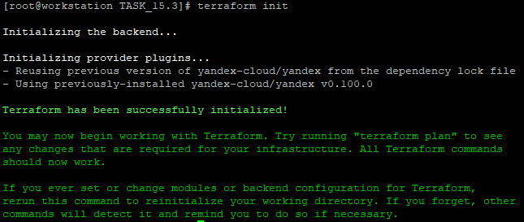
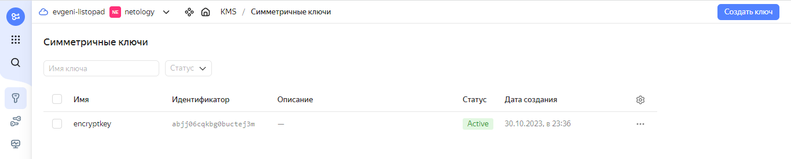

# Домашнее задание к занятию 15.3 «Безопасность в облачных провайдерах»  

Используя конфигурации, выполненные в рамках предыдущих домашних заданий, нужно добавить возможность шифрования бакета.

---
## Задание 1. Yandex Cloud   

1. С помощью ключа в KMS необходимо зашифровать содержимое бакета:

 - создать ключ в KMS;
 - с помощью ключа зашифровать содержимое бакета, созданного ранее.
2. \* (Выполняется не в Terraform)* Создать статический сайт в Object Storage c собственным публичным адресом и сделать доступным по HTTPS:

 - создать сертификат;
 - создать статическую страницу в Object Storage и применить сертификат HTTPS;
 - в качестве результата предоставить скриншот на страницу с сертификатом в заголовке (замочек).

Полезные документы:

- [Настройка HTTPS статичного сайта](https://cloud.yandex.ru/docs/storage/operations/hosting/certificate).
- [Object Storage bucket](https://registry.terraform.io/providers/yandex-cloud/yandex/latest/docs/resources/storage_bucket).
- [KMS key](https://registry.terraform.io/providers/yandex-cloud/yandex/latest/docs/resources/kms_symmetric_key).

--- 

### Решение задания 1.

1. Поверим настройки утилиты `yc` для работы с Yandex Cloud:
```
[root@workstation TASK_15.3]# yc config list
token: y0_*********XKA
cloud-id: b1gkjk5reuc4u9svu54m
folder-id: b1gj45vv7fpc7kmc184h
compute-default-zone: ru-central1-a
```

2. Получим IAM-токен для работы с Yandex Cloud:
```
yc iam create-token
t1.9***************************4Bw
```

3. Сохраним IAM-токен и остальные параметры в соответствующие переменные окружения `yc`:
```
export YC_TOKEN=$(yc iam create-token)
export YC_CLOUD_ID=$(yc config get cloud-id)
export YC_FOLDER_ID=$(yc config get folder-id)
export YC_ZONE=$(yc config get compute-default-zone)
```

4. Обновим Terraform до последней версии. Проверим версию Terraform и убедимся в ее актуальности:
```
[root@workstation ~]# terraform --version
Terraform v1.6.1
on linux_amd64
```

5. Выполним настройку зеркала провайдера Yandex Cloud для Terraform, добавив файл `~/.terraformrc`:
```
[root@workstation ~]# cat .terraformrc
provider_installation {
  network_mirror {
    url = "https://terraform-mirror.yandexcloud.net/"
    include = ["registry.terraform.io/*/*"]
  }
  direct {
    exclude = ["registry.terraform.io/*/*"]
  }
}
```

6. Создадим файл `main.tf` для Terraform с информацией об облачном провайдере:
```
[root@workstation TASK_15.3]# cat main.tf
terraform {
  required_providers {
    yandex = {
      source = "yandex-cloud/yandex"
    }
  }
  required_version = ">= 0.13"
}

provider "yandex" {
  zone = "ru-central1-a"
}
``` 

7. Выполним инициализацию Terraform для работы с Yandex Cloud:
```
[root@workstation TASK_15.3]# terraform init

Initializing the backend...

Initializing provider plugins...
- Reusing previous version of yandex-cloud/yandex from the dependency lock file
- Using previously-installed yandex-cloud/yandex v0.100.0

Terraform has been successfully initialized!

You may now begin working with Terraform. Try running "terraform plan" to see
any changes that are required for your infrastructure. All Terraform commands
should now work.

If you ever set or change modules or backend configuration for Terraform,
rerun this command to reinitialize your working directory. If you forget, other
commands will detect it and remind you to do so if necessary.
```
8. Terraform успешно инициализирован. Подтвердим результат инициализации скриншотом:


9. Дополним файл `main.tf` для Terraform необходимой информацией для создания симметричного ключа шифрования в KMS:
```
resource "yandex_kms_symmetric_key" "encryptkey" {
  name              = "encryptkey"
  default_algorithm = "AES_256"
}
```

10. Дополним файл `main.tf` для Terraform необходимой информацией для шифрования содержимого бакета Object Storage и размещения в нём файла с картинкой:
```
resource "yandex_storage_bucket" "listopad-netology" {
  access_key = yandex_iam_service_account_static_access_key.accesskey-bucket.access_key
  secret_key = yandex_iam_service_account_static_access_key.accesskey-bucket.secret_key
  bucket     = "listopad-netology"
  default_storage_class = "STANDARD"
  acl           = "public-read"
  force_destroy = "true"
  anonymous_access_flags {
    read = true
    list = true
    config_read = true
  }
  server_side_encryption_configuration {
    rule {
      apply_server_side_encryption_by_default {
        kms_master_key_id = yandex_kms_symmetric_key.encryptkey.id
        sse_algorithm     = "aws:kms"
      }
    }
  }
}


```
* Опишем блок для загрузки в бакет с именем `listopad-netology` графического файла `netology.png`:
```
resource "yandex_storage_object" "netology" {
  access_key = yandex_iam_service_account_static_access_key.accesskey-bucket.access_key
  secret_key = yandex_iam_service_account_static_access_key.accesskey-bucket.secret_key
  bucket     = yandex_storage_bucket.listopad-netology.id
  key        = "netology.png"
  source     = "netology.png"
}
```

11. Добавим в вывод ссылку на графический файл в созданном защищенном объектном хранилище:
```
output "picture_url" {
  value = "https://${yandex_storage_bucket.listopad-netology.bucket_domain_name}/${yandex_storage_object.netology.key}"
}
```
12. Проверим конфигурацию Terraform для созданного файла `main.tf` и запустим создание ресурсов в облаке:
```
[root@workstation TASK_15.3]# terraform validate
Success! The configuration is valid.

[root@workstation TASK_15.3]# terraform plan

Terraform used the selected providers to generate the following execution plan. Resource actions are indicated with the following symbols:
  + create

----------------------------ВЫВОД ПРОПУЩЕН--------------------------------------

Plan: 7 to add, 0 to change, 0 to destroy.

Changes to Outputs:
  + picture_url = (known after apply)

────────────────────────────────────────────────────────────────────────────────────────────────────────────────────────────────────────────────────────────────────────────────────────────────────────────────────────────────────────────

Note: You didn't use the -out option to save this plan, so Terraform can't guarantee to take exactly these actions if you run "terraform apply" now.
[root@workstation TASK_15.3]#

[root@workstation TASK_15.3]# terraform apply --auto-approve

Terraform used the selected providers to generate the following execution plan. Resource actions are indicated with the following symbols:
  + create

----------------------------ВЫВОД ПРОПУЩЕН--------------------------------------
Apply complete! Resources: 7 added, 0 changed, 0 destroyed.

Outputs:

picture_url = "https://listopad-netology.storage.yandexcloud.net/netology.png"

```

13. Доступ по ссылке выдаёт ошибку Access Denied. Так и должно быть, поскольку объект зашифрован автоматически созданным ключом 'encryptkey'
14. Подтвердим факт создания данного ключа в KMS скриншотом:


* Всё работает корректно.


15. Ссылка на полный файл [main.tf](./TASK_15.3/main.tf).

