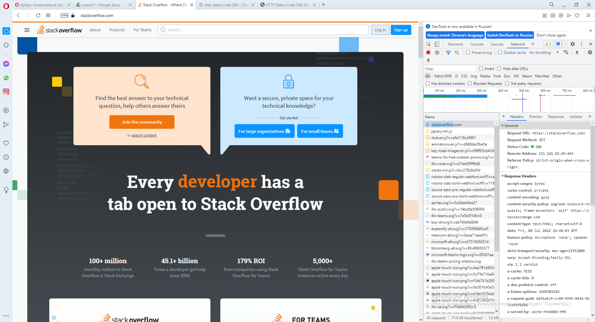
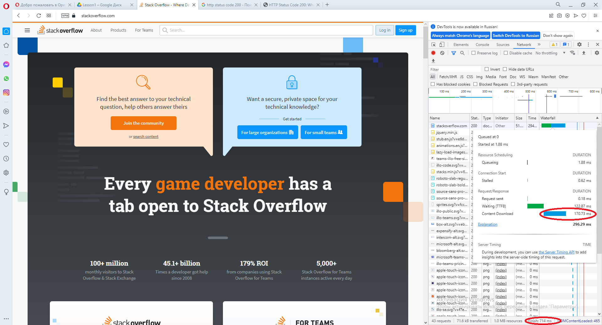

# Домашнее задание к занятию "3.6. Компьютерные сети, лекция 1"

1. Работа c HTTP через телнет.
- Подключитесь утилитой телнет к сайту stackoverflow.com
`telnet stackoverflow.com 80`
- отправьте HTTP запрос
```bash
GET /questions HTTP/1.0
HOST: stackoverflow.com
[press enter]
[press enter]
```
- В ответе укажите полученный HTTP код, что он означает?

```bash
Получен HTTP код 301 - показывает, что запрошенный ресурс был окончательно перемещён в URL, указанный в заголовке,
т.е. https://stackoverflow.com/questions
полный вывод команды:

[root@server ~]# telnet stackoverflow.com 80
Trying 151.101.193.69...
Connected to stackoverflow.com.
Escape character is '^]'.
GET /questions HTTP/1.0
HOST: stackoverflow.com

HTTP/1.1 301 Moved Permanently
cache-control: no-cache, no-store, must-revalidate
location: https://stackoverflow.com/questions
x-request-guid: 8d3c9ec4-1de3-4e1e-9339-9479c8c67f38
feature-policy: microphone 'none'; speaker 'none'
content-security-policy: upgrade-insecure-requests; frame-ancestors 'self' https://stackexchange.com
Accept-Ranges: bytes
Date: Wed, 06 Jul 2022 20:25:34 GMT
Via: 1.1 varnish
Connection: close
X-Served-By: cache-hhn4049-HHN
X-Cache: MISS
X-Cache-Hits: 0
X-Timer: S1657139135.856824,VS0,VE87
Vary: Fastly-SSL
X-DNS-Prefetch-Control: off
Set-Cookie: prov=69f8ec10-4361-3210-2a38-2bc95d49a8ad; domain=.stackoverflow.com; expires=Fri, 01-Jan-2055 00:00:00 GMT; path=/; HttpOnly

Connection closed by foreign host.
```

2. Повторите задание 1 в браузере, используя консоль разработчика F12.
- откройте вкладку `Network`
- отправьте запрос http://stackoverflow.com
- найдите первый ответ HTTP сервера, откройте вкладку `Headers`
- укажите в ответе полученный HTTP код.
- проверьте время загрузки страницы, какой запрос обрабатывался дольше всего?
- приложите скриншот консоли браузера в ответ.

```bash
Первый ответ HTTP сервера содержит код 200 — показывает, что запрос выполнен успешно.
Общее время загрузки страницы составило 714 ms.
Дольше всего обрабатывался первый запрос. Время 296,29 ms.
В этом запросе больше всего времени ушло на действие: "Content Download" - 170,73 ms.
Скриншоты будут приложены при сдаче домашнего задания.
```



3. Какой IP адрес у вас в интернете?

```bash
для определения адреса был использован ресурс whoer.net.
IP адрес: 37.214.28.XX
```

4. Какому провайдеру принадлежит ваш IP адрес? Какой автономной системе AS? Воспользуйтесь утилитой `whois`

```bash
провайдер: BELTELECOM
автономная система: AS6697
Данные получены с помощью утилиты whois.
```

5. Через какие сети проходит пакет, отправленный с вашего компьютера на адрес 8.8.8.8? Через какие AS? Воспользуйтесь утилитой `traceroute`

```bash
[root@server ~]# traceroute -An 8.8.8.8
traceroute to 8.8.8.8 (8.8.8.8), 30 hops max, 60 byte packets
 1  * * *
 2  100.122.0.1 [*]  3.906 ms  3.800 ms  3.690 ms
 3  93.84.80.49 [AS6697]  2.918 ms  4.209 ms  3.317 ms
 4  172.23.2.9 [*]  3.183 ms  3.088 ms  2.931 ms
 5  93.85.80.45 [AS6697]  8.060 ms  7.937 ms  7.837 ms
 6  93.85.80.42 [AS6697]  9.575 ms  7.606 ms  6.977 ms
 7  93.85.80.233 [AS6697]  2.442 ms  2.346 ms  2.230 ms
 8  194.158.197.210 [AS6697]  26.726 ms 194.158.197.209 [AS6697]  28.087 ms 194.158.197.210 [AS6697]  26.460 ms
 9  * * *
10  8.8.8.8 [AS15169]  24.203 ms  23.713 ms  23.364 ms
[root@server ~]#
```

6. Повторите задание 5 в утилите `mtr`. На каком участке наибольшая задержка - delay?

```bash
                  My traceroute  [v0.92]
server (192.168.100.5)                                 2022-07-08T23:03:43+0300
Keys:  Help   Display mode   Restart statistics   Order of fields   quit
                                       Packets               Pings
 Host                                Loss%   Snt   Last   Avg  Best  Wrst StDev
 1. ???
 2. AS???    100.122.0.1              0.0%   288    2.6   4.6   2.2  26.3   3.0
 3. AS6697   93.84.80.49              0.0%   288    4.8   4.0   1.8   6.5   1.2
 4. AS???    172.23.2.9               0.0%   288    3.5   4.8   2.2  10.0   1.3
 5. AS6697   93.85.80.45              0.0%   287    4.8   6.1   2.1  14.5   2.4
 6. AS6697   93.85.80.42              0.0%   287    8.1   6.5   2.1  17.7   2.5
 7. AS6697   93.85.80.233             0.0%   287    2.8   2.7   2.2   4.7   0.4
 8. AS6697   194.158.197.210          0.0%   287   25.5  25.9  24.3  50.7   4.1
 9. AS15169  142.251.65.69            0.0%   287   23.7  24.0  23.4  26.5   0.4
10. AS15169  172.253.66.137           0.0%   287   24.2  23.9  23.3  24.6   0.3
11. AS15169  8.8.8.8                  0.0%   287   24.3  23.9  23.5  24.7   0.3

Максимальное среднее время задержки (25.9), а также максимальное зафиксированное время задержки (50.7)
на участке, обслуживаемом маршрутизатором с IP-адресом 194.158.197.210 в автономной системе AS6697.
```

7. Какие DNS сервера отвечают за доменное имя dns.google? Какие A записи? воспользуйтесь утилитой `dig`.

```bash
NS-серверы: 
m.root-servers.net.
b.root-servers.net.
c.root-servers.net.
d.root-servers.net.
e.root-servers.net.
f.root-servers.net.
g.root-servers.net.
h.root-servers.net.
i.root-servers.net.
a.root-servers.net.
j.root-servers.net.
k.root-servers.net.
l.root-servers.net. 
ns-tld1.charlestonroadregistry.com.
ns-tld2.charlestonroadregistry.com.
ns-tld3.charlestonroadregistry.com.
ns-tld4.charlestonroadregistry.com.
ns-tld5.charlestonroadregistry.com.
ns3.zdns.google.
ns4.zdns.google.
ns1.zdns.google.
ns2.zdns.google.
----------------------------------------------
Записи типа A: 
8.8.8.8
8.8.4.4
```

8. Проверьте PTR записи для IP адресов из задания 7. Какое доменное имя привязано к IP? воспользуйтесь утилитой `dig`.

```bash
К IP-адресу 8.8.8.8 привязано доменное имя dns.google.
[root@server ~]# dig -x 8.8.8.8

; <<>> DiG 9.11.36-RedHat-9.11.36-3.el8 <<>> -x 8.8.8.8
;; global options: +cmd
;; Got answer:
;; ->>HEADER<<- opcode: QUERY, status: NOERROR, id: 39013
;; flags: qr rd ra; QUERY: 1, ANSWER: 1, AUTHORITY: 0, ADDITIONAL: 1

;; OPT PSEUDOSECTION:
; EDNS: version: 0, flags:; udp: 512
;; QUESTION SECTION:
;8.8.8.8.in-addr.arpa.          IN      PTR

;; ANSWER SECTION:
8.8.8.8.in-addr.arpa.   18357   IN      PTR     dns.google.

;; Query time: 27 msec
;; SERVER: 8.8.8.8#53(8.8.8.8)
;; WHEN: Fri Jul 08 23:26:20 +03 2022
;; MSG SIZE  rcvd: 73
```
--------------------------------------------------------------
```bash
К IP-адресу 8.8.4.4 также привязано доменное имя dns.google.

[root@server ~]# dig -x 8.8.4.4

; <<>> DiG 9.11.36-RedHat-9.11.36-3.el8 <<>> -x 8.8.4.4
;; global options: +cmd
;; Got answer:
;; ->>HEADER<<- opcode: QUERY, status: NOERROR, id: 13114
;; flags: qr rd ra; QUERY: 1, ANSWER: 1, AUTHORITY: 0, ADDITIONAL: 1

;; OPT PSEUDOSECTION:
; EDNS: version: 0, flags:; udp: 512
;; QUESTION SECTION:
;4.4.8.8.in-addr.arpa.          IN      PTR

;; ANSWER SECTION:
4.4.8.8.in-addr.arpa.   18986   IN      PTR     dns.google.

;; Query time: 27 msec
;; SERVER: 8.8.8.8#53(8.8.8.8)
;; WHEN: Fri Jul 08 23:26:33 +03 2022
;; MSG SIZE  rcvd: 73

```


