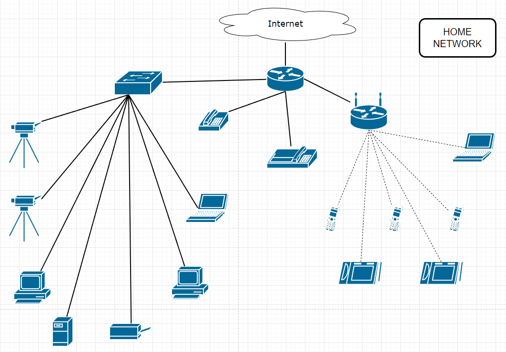

# Домашнее задание к занятию "3.8. Компьютерные сети, лекция 3"

1. Подключитесь к публичному маршрутизатору в интернет. Найдите маршрут к вашему публичному IP.

```bash
telnet route-views.routeviews.org
Username: rviews
show ip route x.x.x.x/32
show bgp x.x.x.x/32
```

```bash
[root@server ~]# telnet route-views.routeviews.org
Trying 128.223.51.103...
Connected to route-views.routeviews.org.
Escape character is '^]'.
C
**********************************************************************

                    RouteViews BGP Route Viewer
                    route-views.routeviews.org

 route views data is archived on http://archive.routeviews.org

 This hardware is part of a grant by the NSF.
 Please contact help@routeviews.org if you have questions, or
 if you wish to contribute your view.

 This router has views of full routing tables from several ASes.
 The list of peers is located at http://www.routeviews.org/peers
 in route-views.oregon-ix.net.txt

 NOTE: The hardware was upgraded in August 2014.  If you are seeing
 the error message, "no default Kerberos realm", you may want to
 in Mac OS X add "default unset autologin" to your ~/.telnetrc

 To login, use the username "rviews".

 **********************************************************************


User Access Verification

Username: rviews
route-views>
route-views>show ip route 37.214.49.XXX
Routing entry for 37.214.48.0/23
  Known via "bgp 6447", distance 20, metric 0
  Tag 6939, type external
  Last update from 64.71.137.241 3w1d ago
  Routing Descriptor Blocks:
  * 64.71.137.241, from 64.71.137.241, 3w1d ago
      Route metric is 0, traffic share count is 1
      AS Hops 2
      Route tag 6939
      MPLS label: none
route-views>
route-views>
route-views>show bgp 37.214.49.XXX
BGP routing table entry for 37.214.48.0/23, version 2327955545
Paths: (24 available, best #16, table default)
  Not advertised to any peer
  Refresh Epoch 1
  3333 12859 6697
    193.0.0.56 from 193.0.0.56 (193.0.0.56)
      Origin incomplete, localpref 100, valid, external
      Community: 12859:1015 12859:1100 12859:1665 65101:1085 65102:1000 65103:276 65104:150
      unknown transitive attribute: flag 0xE0 type 0x20 length 0xC
        value 0000 1A27 0000 03E8 0000 0001
      path 7FE10BA47390 RPKI State valid
      rx pathid: 0, tx pathid: 0
  Refresh Epoch 1
  4901 6079 8359 6697
    162.250.137.254 from 162.250.137.254 (162.250.137.254)
      Origin IGP, localpref 100, valid, external
      Community: 65000:10100 65000:10300 65000:10400
      path 7FE125B81730 RPKI State valid
      rx pathid: 0, tx pathid: 0
  Refresh Epoch 1
  7018 3356 6697
    12.0.1.63 from 12.0.1.63 (12.0.1.63)
      Origin IGP, localpref 100, valid, external
      Community: 7018:5000 7018:37232
      path 7FE117784FB8 RPKI State valid
      rx pathid: 0, tx pathid: 0
  Refresh Epoch 1
  3267 42632 6697
    194.85.40.15 from 194.85.40.15 (185.141.126.1)
      Origin incomplete, metric 0, localpref 100, valid, external
      path 7FE088A7F258 RPKI State valid
      rx pathid: 0, tx pathid: 0
  Refresh Epoch 1
  20912 3257 3356 6697
    212.66.96.126 from 212.66.96.126 (212.66.96.126)
      Origin IGP, localpref 100, valid, external
      Community: 3257:8070 3257:30515 3257:50001 3257:53900 3257:53902 20912:65004
      path 7FE0974579C8 RPKI State valid
      rx pathid: 0, tx pathid: 0
  Refresh Epoch 1
  1351 8359 8359 6697
    132.198.255.253 from 132.198.255.253 (132.198.255.253)
      Origin IGP, localpref 100, valid, external
      path 7FE0246C81B0 RPKI State valid
      rx pathid: 0, tx pathid: 0
  Refresh Epoch 1
  101 3356 6697
    209.124.176.223 from 209.124.176.223 (209.124.176.223)
      Origin IGP, localpref 100, valid, external
      Community: 101:20100 101:20110 101:22100 3356:2 3356:22 3356:100 3356:123 3356:513 3356:901 3356:2084 64980:0 64984:0 65000:174 65000:3216 65000:15169 65000:16509 65002:3320
      Extended Community: RT:101:22100
      path 7FE13855E6A8 RPKI State valid
      rx pathid: 0, tx pathid: 0
  Refresh Epoch 1
  49788 12552 6697
    91.218.184.60 from 91.218.184.60 (91.218.184.60)
      Origin incomplete, localpref 100, valid, external
      Community: 12552:12000 12552:12600 12552:12601 12552:22000
      Extended Community: 0x43:100:1
      path 7FE0D89D7F60 RPKI State valid
      rx pathid: 0, tx pathid: 0
  Refresh Epoch 1
  852 3356 6697
    154.11.12.212 from 154.11.12.212 (96.1.209.43)
      Origin IGP, metric 0, localpref 100, valid, external
      path 7FE176C761C8 RPKI State valid
      rx pathid: 0, tx pathid: 0
  Refresh Epoch 1
  8283 1299 6697
    94.142.247.3 from 94.142.247.3 (94.142.247.3)
      Origin incomplete, metric 0, localpref 100, valid, external
      Community: 1299:30000 8283:1 8283:101 8283:102
      unknown transitive attribute: flag 0xE0 type 0x20 length 0x24
        value 0000 205B 0000 0000 0000 0001 0000 205B
              0000 0005 0000 0001 0000 205B 0000 0005
              0000 0002
      path 7FE0D3B294C0 RPKI State valid
      rx pathid: 0, tx pathid: 0
  Refresh Epoch 1
  57866 28917 6697
    37.139.139.17 from 37.139.139.17 (37.139.139.17)
      Origin IGP, metric 0, localpref 100, valid, external
      Community: 0:6939 0:16276 6697:7 6697:100 28917:2000 28917:5100 28917:5180 28917:5210 28917:5220 28917:5300 28917:5500 57866:304 57866:501
      path 7FE0FC550170 RPKI State valid
      rx pathid: 0, tx pathid: 0
  Refresh Epoch 1
  3549 3356 6697
    208.51.134.254 from 208.51.134.254 (67.16.168.191)
      Origin IGP, metric 0, localpref 100, valid, external
      Community: 3356:2 3356:22 3356:100 3356:123 3356:513 3356:901 3356:2084 3549:2581 3549:30840
      path 7FE0C6ED18C8 RPKI State valid
      rx pathid: 0, tx pathid: 0
  Refresh Epoch 1
  20130 6939 6697
    140.192.8.16 from 140.192.8.16 (140.192.8.16)
      Origin IGP, localpref 100, valid, external
      path 7FE179908F68 RPKI State valid
      rx pathid: 0, tx pathid: 0
  Refresh Epoch 1
  3356 6697
    4.68.4.46 from 4.68.4.46 (4.69.184.201)
      Origin IGP, metric 0, localpref 100, valid, external
      Community: 3356:2 3356:22 3356:100 3356:123 3356:513 3356:901 3356:2084 64980:0 64984:0 65000:174 65000:3216 65000:15169 65000:16509 65002:3320
      path 7FE0BEEBEC40 RPKI State valid
      rx pathid: 0, tx pathid: 0
  Refresh Epoch 1
  53767 174 6697
    162.251.163.2 from 162.251.163.2 (162.251.162.3)
      Origin incomplete, localpref 100, valid, external
      Community: 174:21101 174:22028 53767:5000
      path 7FE1073F2450 RPKI State valid
      rx pathid: 0, tx pathid: 0
  Refresh Epoch 1
  6939 6697
    64.71.137.241 from 64.71.137.241 (216.218.252.164)
      Origin IGP, localpref 100, valid, external, best
      path 7FE08B5DE768 RPKI State valid
      rx pathid: 0, tx pathid: 0x0
  Refresh Epoch 1
  19214 174 6697
    208.74.64.40 from 208.74.64.40 (208.74.64.40)
      Origin incomplete, localpref 100, valid, external
      Community: 174:21101 174:22028
      path 7FE14C721DA8 RPKI State valid
      rx pathid: 0, tx pathid: 0
  Refresh Epoch 1
  701 1273 12389 6697
    137.39.3.55 from 137.39.3.55 (137.39.3.55)
      Origin incomplete, localpref 100, valid, external
      path 7FE10DB57D50 RPKI State valid
      rx pathid: 0, tx pathid: 0
  Refresh Epoch 1
  7660 2516 12389 6697
    203.181.248.168 from 203.181.248.168 (203.181.248.168)
      Origin incomplete, localpref 100, valid, external
      Community: 2516:1050 7660:9001
      path 7FE1853BF3A8 RPKI State valid
      rx pathid: 0, tx pathid: 0
  Refresh Epoch 1
  3561 3910 3356 6697
    206.24.210.80 from 206.24.210.80 (206.24.210.80)
      Origin IGP, localpref 100, valid, external
      path 7FE022FA0E38 RPKI State valid
      rx pathid: 0, tx pathid: 0
  Refresh Epoch 1
  3303 6697
    217.192.89.50 from 217.192.89.50 (138.187.128.158)
      Origin incomplete, localpref 100, valid, external
      Community: 3303:1004 3303:1006 3303:1030 3303:1031 3303:3056 65101:1085 65102:1000 65103:276 65104:150
      path 7FE17AA81728 RPKI State valid
      rx pathid: 0, tx pathid: 0
  Refresh Epoch 3
  2497 3356 6697
    202.232.0.2 from 202.232.0.2 (58.138.96.254)
      Origin IGP, localpref 100, valid, external
      path 7FE143D13CD0 RPKI State valid
      rx pathid: 0, tx pathid: 0
  Refresh Epoch 1
  1221 4637 3356 6697
    203.62.252.83 from 203.62.252.83 (203.62.252.83)
      Origin IGP, localpref 100, valid, external
      path 7FE12EE54028 RPKI State valid
      rx pathid: 0, tx pathid: 0
  Refresh Epoch 1
  3257 3356 6697
    89.149.178.10 from 89.149.178.10 (213.200.83.26)
      Origin IGP, metric 10, localpref 100, valid, external
      Community: 3257:8794 3257:30043 3257:50001 3257:54900 3257:54901
      path 7FE11E445DD0 RPKI State valid
      rx pathid: 0, tx pathid: 0
route-views>
route-views>
```

2. Создайте dummy0 интерфейс в Ubuntu. Добавьте несколько статических маршрутов. Проверьте таблицу маршрутизации.

```bash
Метод, описанный в лекции и предусматривающий добавление в файл /etc/network/interfaces следующей секции:
auto dummy0
iface dummy0 inet static
    address 10.10.10.10/32
    pre-up ip link add dummy0 type dummy
    post-down ip link del dummy0
у меня в Ubuntu 20.04 не сработал.
-------------------------------------------------------------------------------
В итоге я делал немного по-другому:
1) Был создан файл "/etc/systemd/network/10-dummy0.netdev" с содержимым:
[NetDev]
Name=dummy0
Kind=dummy
2) Был создан файл "/etc/systemd/network/10-dummy0.network" с содержимым:
[Match]
Name=dummy0
[Network]
Address=10.10.10.10/32
3) Был перезапущен сервис systemd-networkd:
systemctl restart systemd-networkd.service
4) Интерфейс dummy0 появился:
root@vagrant:/etc/netplan# ip -br a
lo               UNKNOWN        127.0.0.1/8 ::1/128
ens33            UP             192.168.111.129/24 fe80::20c:29ff:fef2:321e/64
dummy0           UNKNOWN        10.10.10.10/32 fe80::a849:25ff:fed8:c644/64
ens38            UP             192.168.147.130/24 fe80::20c:29ff:fef2:3232/64
ens39            UP             192.168.147.129/24 fe80::20c:29ff:fef2:3228/64
5) Работоспособность интерфейса dummy0 подтверждается:
root@vagrant:~# ping -c3 10.10.10.10
PING 10.10.10.10 (10.10.10.10) 56(84) bytes of data.
64 bytes from 10.10.10.10: icmp_seq=1 ttl=64 time=0.020 ms
64 bytes from 10.10.10.10: icmp_seq=2 ttl=64 time=0.051 ms
64 bytes from 10.10.10.10: icmp_seq=3 ttl=64 time=0.052 ms

--- 10.10.10.10 ping statistics ---
3 packets transmitted, 3 received, 0% packet loss, time 2015ms
rtt min/avg/max/mdev = 0.020/0.041/0.052/0.014 ms
-------------------------------------------------------------------------------
Добавление статических маршрутов:
root@vagrant:~# ip route add 172.16.100.0/24 dev ens39 src 192.168.147.129
root@vagrant:~# ip route add 172.16.200.0/24 dev ens38 src 192.168.147.130
root@vagrant:~# ip route add 10.10.10.0/30 dev dummy0 src 10.10.10.10
-------------------------------------------------------------------------------
Проверка таблицы маршрутизации:
root@vagrant:~# ip -br r
default via 192.168.111.2 dev ens33 proto dhcp src 192.168.111.129 metric 100
10.10.10.0/30 dev dummy0 scope link src 10.10.10.10
172.16.100.0/24 dev ens39 scope link src 192.168.147.129
172.16.200.0/24 dev ens38 scope link src 192.168.147.130
192.168.111.0/24 dev ens33 proto kernel scope link src 192.168.111.129
192.168.111.2 dev ens33 proto dhcp scope link src 192.168.111.129 metric 100
192.168.147.0/24 dev ens39 proto kernel scope link src 192.168.147.129
192.168.147.0/24 dev ens38 proto kernel scope link src 192.168.147.130
```

3. Проверьте открытые TCP порты в Ubuntu, какие протоколы и приложения используют эти порты? Приведите несколько примеров.

```bash
root@vagrant:~# ss -tnap
State        Recv-Q       Send-Q                 Local Address:Port                Peer Address:Port        Process
LISTEN       0            4096                   127.0.0.53%lo:53                       0.0.0.0:*            users:(("systemd-resolve",pid=717,fd=13))
LISTEN       0            128                          0.0.0.0:22                       0.0.0.0:*            users:(("sshd",pid=845,fd=3))
LISTEN       0            5                          127.0.0.1:631                      0.0.0.0:*            users:(("cupsd",pid=2581,fd=7))
ESTAB        0            64                   192.168.111.129:22                 192.168.111.1:59869        users:(("sshd",pid=3695,fd=4))
LISTEN       0            128                             [::]:22                          [::]:*            users:(("sshd",pid=845,fd=4))
LISTEN       0            5                              [::1]:631                         [::]:*            users:(("cupsd",pid=2581,fd=6))
-------------------------------------------------------------------------------
root@vagrant:~# ss -tap
State        Recv-Q       Send-Q               Local Address:Port                  Peer Address:Port        Process
LISTEN       0            4096                 127.0.0.53%lo:domain                     0.0.0.0:*            users:(("systemd-resolve",pid=717,fd=13))
LISTEN       0            128                        0.0.0.0:ssh                        0.0.0.0:*            users:(("sshd",pid=845,fd=3))
LISTEN       0            5                        127.0.0.1:ipp                        0.0.0.0:*            users:(("cupsd",pid=2581,fd=7))
ESTAB        0            64                 192.168.111.129:ssh                  192.168.111.1:59869        users:(("sshd",pid=3695,fd=4))
LISTEN       0            128                           [::]:ssh                           [::]:*            users:(("sshd",pid=845,fd=4))
LISTEN       0            5                            [::1]:ipp                           [::]:*            users:(("cupsd",pid=2581,fd=6))
-------------------------------------------------------------------------------
Используемые TCP-порты:
22 - для протокола SSH, используется процессом sshd.
53 - для протокола DNS (Domain Name System), используется процессом systemd-resolve.
631 - для протокола IPP (Internet Printing Protocol), используется процессом cupsd.
Сопоставление известных портов и протоколов, их использующих, можно увидеть в файле "/etc/services".
```

4. Проверьте используемые UDP сокеты в Ubuntu, какие протоколы и приложения используют эти порты?

```bash
root@vagrant:~# ss -uap
State      Recv-Q     Send-Q                              Local Address:Port           Peer Address:Port    Process
UNCONN     0          0                                   127.0.0.53%lo:domain              0.0.0.0:*        users:(("systemd-resolve",pid=717,fd=12))
UNCONN     0          0                           192.168.147.130%ens38:bootpc              0.0.0.0:*        users:(("systemd-network",pid=67590,fd=27))
UNCONN     0          0                           192.168.111.129%ens33:bootpc              0.0.0.0:*        users:(("systemd-network",pid=67590,fd=28))
UNCONN     0          0                           192.168.147.129%ens39:bootpc              0.0.0.0:*        users:(("systemd-network",pid=67590,fd=26))
UNCONN     0          0                                         0.0.0.0:631                 0.0.0.0:*        users:(("cups-browsed",pid=2582,fd=7))
UNCONN     0          0                                 192.168.147.129:ntp                 0.0.0.0:*        users:(("ntpd",pid=794,fd=28))
UNCONN     0          0                                 192.168.147.130:ntp                 0.0.0.0:*        users:(("ntpd",pid=794,fd=25))
UNCONN     0          0                                 192.168.111.129:ntp                 0.0.0.0:*        users:(("ntpd",pid=794,fd=19))
UNCONN     0          0                                     10.10.10.10:ntp                 0.0.0.0:*        users:(("ntpd",pid=794,fd=27))
UNCONN     0          0                                       127.0.0.1:ntp                 0.0.0.0:*        users:(("ntpd",pid=794,fd=18))
UNCONN     0          0                                         0.0.0.0:ntp                 0.0.0.0:*        users:(("ntpd",pid=794,fd=17))
UNCONN     0          0                                         0.0.0.0:52926               0.0.0.0:*        users:(("avahi-daemon",pid=731,fd=14))
UNCONN     0          0                                         0.0.0.0:mdns                0.0.0.0:*        users:(("avahi-daemon",pid=731,fd=12))
UNCONN     0          0                                            [::]:47157                  [::]:*        users:(("avahi-daemon",pid=731,fd=15))
UNCONN     0          0                [fe80::20c:29ff:fef2:3228]%ens39:ntp                    [::]:*        users:(("ntpd",pid=794,fd=30))
UNCONN     0          0                [fe80::20c:29ff:fef2:3232]%ens38:ntp                    [::]:*        users:(("ntpd",pid=794,fd=29))
UNCONN     0          0              [fe80::a849:25ff:fed8:c644]%dummy0:ntp                    [::]:*        users:(("ntpd",pid=794,fd=26))
UNCONN     0          0                [fe80::20c:29ff:fef2:321e]%ens33:ntp                    [::]:*        users:(("ntpd",pid=794,fd=21))
UNCONN     0          0                                           [::1]:ntp                    [::]:*        users:(("ntpd",pid=794,fd=20))
UNCONN     0          0                                            [::]:ntp                    [::]:*        users:(("ntpd",pid=794,fd=16))
UNCONN     0          0                                            [::]:mdns                   [::]:*        users:(("avahi-daemon",pid=731,fd=13))
-------------------------------------------------------------------------------
root@vagrant:~# ss -unap
State      Recv-Q     Send-Q                              Local Address:Port          Peer Address:Port     Process
UNCONN     0          0                                   127.0.0.53%lo:53                 0.0.0.0:*         users:(("systemd-resolve",pid=717,fd=12))
UNCONN     0          0                           192.168.147.130%ens38:68                 0.0.0.0:*         users:(("systemd-network",pid=67590,fd=27))
UNCONN     0          0                           192.168.111.129%ens33:68                 0.0.0.0:*         users:(("systemd-network",pid=67590,fd=28))
UNCONN     0          0                           192.168.147.129%ens39:68                 0.0.0.0:*         users:(("systemd-network",pid=67590,fd=26))
UNCONN     0          0                                         0.0.0.0:631                0.0.0.0:*         users:(("cups-browsed",pid=2582,fd=7))
UNCONN     0          0                                 192.168.147.129:123                0.0.0.0:*         users:(("ntpd",pid=794,fd=28))
UNCONN     0          0                                 192.168.147.130:123                0.0.0.0:*         users:(("ntpd",pid=794,fd=25))
UNCONN     0          0                                 192.168.111.129:123                0.0.0.0:*         users:(("ntpd",pid=794,fd=19))
UNCONN     0          0                                     10.10.10.10:123                0.0.0.0:*         users:(("ntpd",pid=794,fd=27))
UNCONN     0          0                                       127.0.0.1:123                0.0.0.0:*         users:(("ntpd",pid=794,fd=18))
UNCONN     0          0                                         0.0.0.0:123                0.0.0.0:*         users:(("ntpd",pid=794,fd=17))
UNCONN     0          0                                         0.0.0.0:52926              0.0.0.0:*         users:(("avahi-daemon",pid=731,fd=14))
UNCONN     0          0                                         0.0.0.0:5353               0.0.0.0:*         users:(("avahi-daemon",pid=731,fd=12))
UNCONN     0          0                                            [::]:47157                 [::]:*         users:(("avahi-daemon",pid=731,fd=15))
UNCONN     0          0                [fe80::20c:29ff:fef2:3228]%ens39:123                   [::]:*         users:(("ntpd",pid=794,fd=30))
UNCONN     0          0                [fe80::20c:29ff:fef2:3232]%ens38:123                   [::]:*         users:(("ntpd",pid=794,fd=29))
UNCONN     0          0              [fe80::a849:25ff:fed8:c644]%dummy0:123                   [::]:*         users:(("ntpd",pid=794,fd=26))
UNCONN     0          0                [fe80::20c:29ff:fef2:321e]%ens33:123                   [::]:*         users:(("ntpd",pid=794,fd=21))
UNCONN     0          0                                           [::1]:123                   [::]:*         users:(("ntpd",pid=794,fd=20))
UNCONN     0          0                                            [::]:123                   [::]:*         users:(("ntpd",pid=794,fd=16))
UNCONN     0          0                                            [::]:5353                  [::]:*         users:(("avahi-daemon",pid=731,fd=13))
-------------------------------------------------------------------------------
Используемые UDP-порты:
53 - для протокола DNS (Domain Name System), используется процессом systemd-resolve.
68 - для протокола BOOTPC (Bootstrap Protocol Client), используется процессом systemd-network.
631 - для протокола IPP (Internet Printing Protocol), используется процессом cups-browsed.
123 - для протокола NTP (Network Time Protocol), используется процессом ntpd.
52926 - динамически выбранный порт, используется процессом avahi-daemon.
5353 - для протокола MDNS (Multicast DNS), используется процессом avahi-daemon.
47157 - динамически выбранный порт, используется процессом avahi-daemon.
```

5. Используя diagrams.net, создайте L3 диаграмму вашей домашней сети или любой другой сети, с которой вы работали.

```bash
Диаграмма приведена на рисунке:
```



