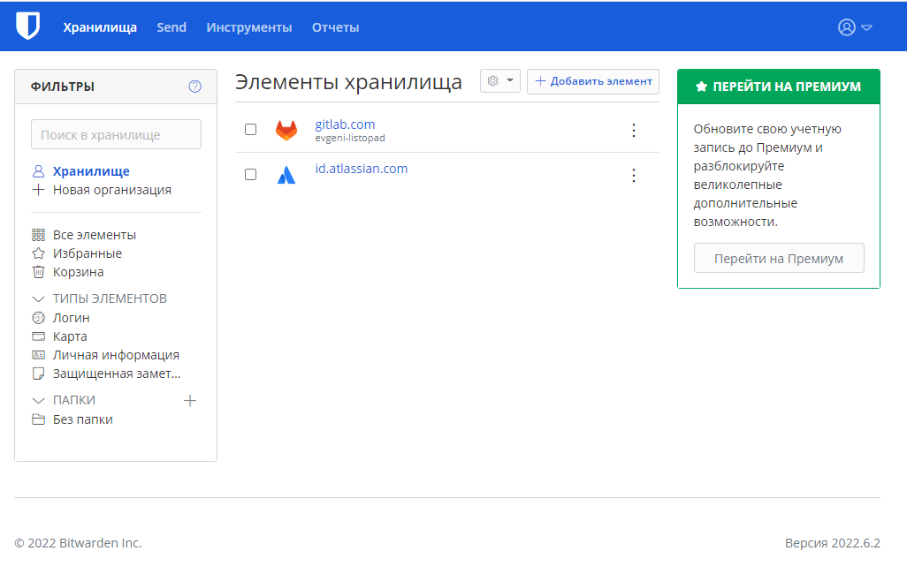
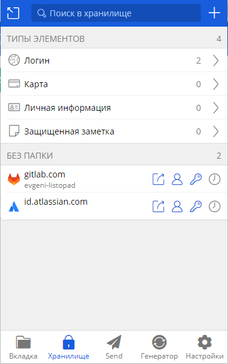
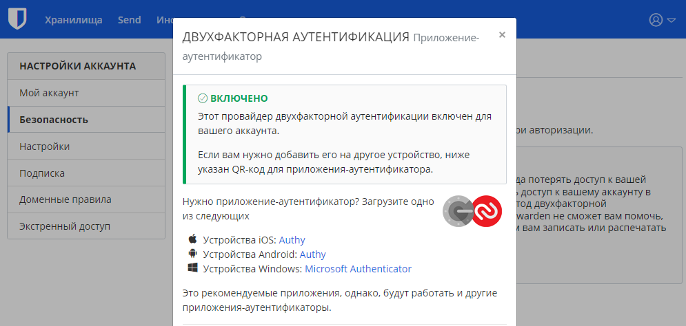
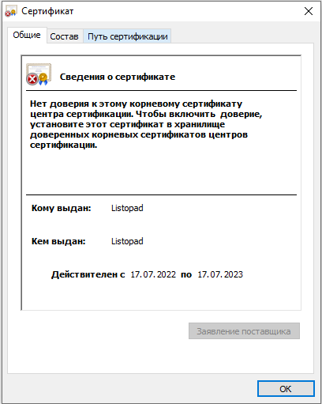
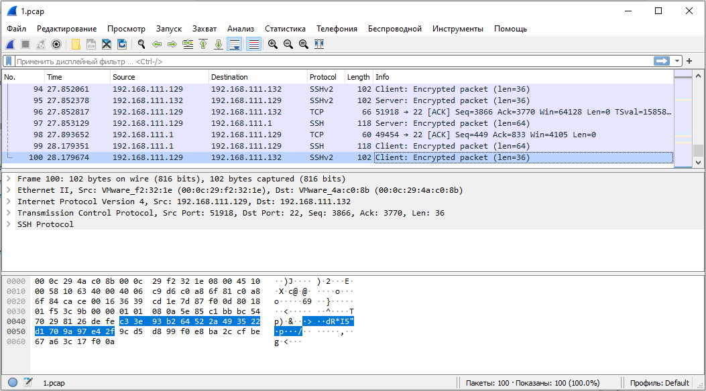

# Домашнее задание к занятию "3.9. Элементы безопасности информационных систем"

1. Установите Bitwarden плагин для браузера. Зарегестрируйтесь и сохраните несколько паролей.

```bash
Выполнено. Результат выполнения приведен на рисунках:
```



2. Установите Google authenticator на мобильный телефон. Настройте вход в Bitwarden акаунт через Google authenticator OTP.

```bash
Выполнено. Результат выполнения приведен на рисунке:
```


3. Установите apache2, сгенерируйте самоподписанный сертификат, настройте тестовый сайт для работы по HTTPS.

```bash
Задание выполнялось в CentOS8
-------------------------------------------------------------------------------
Устанавливаем apache2:
[root@cloneserv ~]# yum install httpd
-------------------------------------------------------------------------------
Добавляем сервисы в firewall:
[root@cloneserv ~]# firewall-cmd --permanent --add-service=http
[root@cloneserv ~]# firewall-cmd --permanent --add-service=https
[root@cloneserv ~]# firewall-cmd --list-all
public (active)
  target: default
  icmp-block-inversion: no
  interfaces: ens33
  sources:
  services: cockpit dhcpv6-client http https ssh
  ports:
  protocols:
  masquerade: no
  forward-ports:
  source-ports:
  icmp-blocks:
  rich rules:
-------------------------------------------------------------------------------
Запускаем apache2:
[root@cloneserv ~]# systemctl start httpd.service
[root@cloneserv ~]# systemctl is-active httpd.service
active
-------------------------------------------------------------------------------
Генерируем самоподписанный сертификат:
[root@cloneserv ~]# openssl req -x509 -nodes -days 365 -newkey rsa:2048 -keyout /etc/pki/tls/private/apache-selfsigned.key -out /etc/pki/tls/certs/apache-selfsigned.crt
Generating a RSA private key
..............................................................................................+++++
...............................................+++++
writing new private key to '/etc/pki/tls/private/apache-selfsigned.key'
-----
You are about to be asked to enter information that will be incorporated
into your certificate request.
What you are about to enter is what is called a Distinguished Name or a DN.
There are quite a few fields but you can leave some blank
For some fields there will be a default value,
If you enter '.', the field will be left blank.
-----
Country Name (2 letter code) [XX]:BY
State or Province Name (full name) []:BELARUS
Locality Name (eg, city) [Default City]:MINSK
Organization Name (eg, company) [Default Company Ltd]:Test Inc
Organizational Unit Name (eg, section) []:Test Dep
Common Name (eg, your name or your server's hostname) []:Listopad
Email Address []:listopad@example.com
[root@cloneserv ~]#
-------------------------------------------------------------------------------
Создаем файл "/etc/httpd/conf.d/Listopad.conf" с содержимым:
<VirtualHost *:443>
ServerName Listopad
DocumentRoot /var/www/listopad
SSLEngine on
SSLCertificateFile /etc/pki/tls/certs/apache-selfsigned.crt
SSLCertificateKeyFile /etc/pki/tls/private/apache-selfsigned.key
</VirtualHost>
-------------------------------------------------------------------------------
Создаем файл "/var/www/listopad/index.html" с содержимым:
<h1> This page is working with applying TLS! </h1>
-------------------------------------------------------------------------------
Перегружаем конфигурационные файлы для apache2:
[root@cloneserv ~]# systemctl reload httpd.service
-------------------------------------------------------------------------------
Проверяем работу в Linux (в сообщении указано, что сертификат самоподписанный):
[root@cloneserv ~]# curl https://localhost
curl: (60) SSL certificate problem: self signed certificate
More details here: https://curl.haxx.se/docs/sslcerts.html

curl failed to verify the legitimacy of the server and therefore could not
establish a secure connection to it. To learn more about this situation and
how to fix it, please visit the web page mentioned above.
-------------------------------------------------------------------------------
Проверяем работу в Linux (с выключенной проверкой сертификата):
[root@cloneserv ~]# curl -k https://localhost
<h1> This page is working with applying TLS! </h1>
-------------------------------------------------------------------------------
Все работает корректно.
В Windows тоже всё сработало корректно.
Данные о сертификате приведены на рисунке:
```


4. Проверьте на TLS уязвимости произвольный сайт в интернете (кроме сайтов МВД, ФСБ, МинОбр, НацБанк, РосКосмос, РосАтом, РосНАНО и любых госкомпаний, объектов КИИ, ВПК ... и тому подобное).

```bash
[root@cloneserv testssl.sh]# ./testssl.sh -U --sneaky https://178.172.244.8/

###########################################################
    testssl.sh       3.1dev from https://testssl.sh/dev/
    (88e80d2 2022-07-02 22:13:06)

      This program is free software. Distribution and
             modification under GPLv2 permitted.
      USAGE w/o ANY WARRANTY. USE IT AT YOUR OWN RISK!

       Please file bugs @ https://testssl.sh/bugs/

###########################################################

 Using "OpenSSL 1.0.2-chacha (1.0.2k-dev)" [~183 ciphers]
 on cloneserv:./bin/openssl.Linux.x86_64
 (built: "Jan 18 17:12:17 2019", platform: "linux-x86_64")


 Start 2022-07-17 23:57:24        -->> 178.172.244.8:443 (178.172.244.8) <<--

 rDNS (178.172.244.8):   8.244.172.178.in-addr.arpa.
 Service detected:       HTTP


 Testing vulnerabilities

 Heartbleed (CVE-2014-0160)                not vulnerable (OK), no heartbeat extension
 CCS (CVE-2014-0224)                       not vulnerable (OK)
 Ticketbleed (CVE-2016-9244), experiment.  not vulnerable (OK), no session ticket extension
 ROBOT                                     Server does not support any cipher suites that use RSA key transport
 Secure Renegotiation (RFC 5746)           supported (OK)
 Secure Client-Initiated Renegotiation     not vulnerable (OK)
 CRIME, TLS (CVE-2012-4929)                not vulnerable (OK)
 BREACH (CVE-2013-3587)                    no gzip/deflate/compress/br HTTP compression (OK)  - only supplied "/" tested
 POODLE, SSL (CVE-2014-3566)               not vulnerable (OK)
 TLS_FALLBACK_SCSV (RFC 7507)              Downgrade attack prevention supported (OK)
 SWEET32 (CVE-2016-2183, CVE-2016-6329)    not vulnerable (OK)
 FREAK (CVE-2015-0204)                     not vulnerable (OK)
 DROWN (CVE-2016-0800, CVE-2016-0703)      not vulnerable on this host and port (OK)
                                           make sure you don't use this certificate elsewhere with SSLv2 enabled services, see
                                           https://search.censys.io/search?resource=hosts&virtual_hosts=INCLUDE&q=0F64DB93F2DA3C9552A388F276DA17FE5BF641C0A6914062A2EF56C544146F14
 LOGJAM (CVE-2015-4000), experimental      not vulnerable (OK): no DH EXPORT ciphers, no common prime detected
 BEAST (CVE-2011-3389)                     TLS1: ECDHE-RSA-AES256-SHA DHE-RSA-AES256-SHA
                                           VULNERABLE -- but also supports higher protocols  TLSv1.1 TLSv1.2 (likely mitigated)
 LUCKY13 (CVE-2013-0169), experimental     potentially VULNERABLE, uses cipher block chaining (CBC) ciphers with TLS. Check patches
 Winshock (CVE-2014-6321), experimental    not vulnerable (OK) - ARIA, CHACHA or CCM ciphers found
 RC4 (CVE-2013-2566, CVE-2015-2808)        no RC4 ciphers detected (OK)


 Done 2022-07-17 23:57:39 [  17s] -->> 178.172.244.8:443 (178.172.244.8) <<--
```

5. Установите на Ubuntu ssh сервер, сгенерируйте новый приватный ключ. Скопируйте свой публичный ключ на другой сервер. Подключитесь к серверу по SSH-ключу.

```bash
Генерируем ключ с именем new_id_rsa:
root@vagrant:~# ssh-keygen
Generating public/private rsa key pair.
Enter file in which to save the key (/root/.ssh/id_rsa): /root/.ssh/new_id_rsa
Enter passphrase (empty for no passphrase):
Enter same passphrase again:
Your identification has been saved in /root/.ssh/new_id_rsa
Your public key has been saved in /root/.ssh/new_id_rsa.pub
The key fingerprint is:
SHA256:2P/sHD6sbhHOIxONtvHHqSw0Yw9oc//qfC/5BavhDO8 root@vagrant
The key's randomart image is:
+---[RSA 3072]----+
|                 |
|                 |
|         o       |
|       o= o      |
|      .oSB o ..  |
|      + @.* +  o |
|     . = Xo*o.. .|
|        ..*X*+ . |
|         =*BE=o  |
+----[SHA256]-----+
root@vagrant:~#
-------------------------------------------------------------------------------
Копируем ключ с именем new_id_rsa на сервер с IP-адресом 192.168.111.132:
root@vagrant:~# ssh-copy-id -i new_id_rsa.pub 192.168.111.132
/usr/bin/ssh-copy-id: INFO: Source of key(s) to be installed: "new_id_rsa.pub"
/usr/bin/ssh-copy-id: INFO: attempting to log in with the new key(s), to filter out any that are already installed
/usr/bin/ssh-copy-id: INFO: 1 key(s) remain to be installed -- if you are prompted now it is to install the new keys
root@192.168.111.132's password:

Number of key(s) added: 1

Now try logging into the machine, with:   "ssh '192.168.111.132'"
and check to make sure that only the key(s) you wanted were added.

root@vagrant:~#
-------------------------------------------------------------------------------
Подключаемся с использованием ключа new_id_rsa к серверу без пароля:
root@vagrant:~# ssh -i new_id_rsa 192.168.111.132
Activate the web console with: systemctl enable --now cockpit.socket

Last login: Mon Jul 18 00:13:38 2022 from 192.168.111.129
[root@cloneserv ~]#
```

6. Переименуйте файлы ключей из задания 5. Настройте файл конфигурации SSH клиента, так чтобы вход на удаленный сервер осуществлялся по имени сервера.

```bash
Переименовываем файлы ключей:
root@vagrant:~/.ssh# mv new_id_rsa cloneserv.key
root@vagrant:~/.ssh# mv new_id_rsa.pub cloneserv.key.pub
-------------------------------------------------------------------------------
Настраиваем файл конфигурации:
root@vagrant:~# vim .ssh/config
Host cloneserv
  HostName 192.168.111.132
  IdentityFile /root/.ssh/cloneserv.key
-------------------------------------------------------------------------------
Проверяем вход по имени сервера:
root@vagrant:~# ssh cloneserv
Activate the web console with: systemctl enable --now cockpit.socket

Last login: Mon Jul 18 00:29:33 2022 from 192.168.111.129
[root@cloneserv ~]#
-------------------------------------------------------------------------------
Все работает без ввода пароля.
```

7. Соберите дамп трафика утилитой tcpdump в формате pcap, 100 пакетов. Откройте файл pcap в Wireshark.

```bash
[root@cloneserv ~]# tcpdump -c 100 -i ens33 -w 1.pcap
Выполнено. Результат выполнения приведен на рисунке:
```


