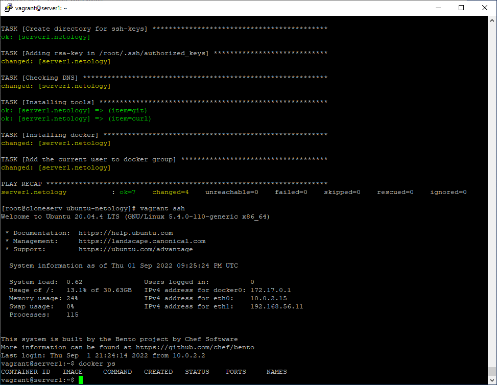

# Домашнее задание к занятию "5.2. Применение принципов IaaC в работе с виртуальными машинами"

## Задача 1

- Опишите своими словами основные преимущества применения на практике IaaC паттернов.
- Какой из принципов IaaC является основополагающим?

### Ответ к задаче 1
```
1) Оновные преимущества применения на практике IaaC-паттернов:
- Значительно ускоряется процесс развертывания виртуальной инфраструктуры 
в сравнениии с ручным подходом. Имеется возможность быстро и гибко корректировать
объемы аппаратных ресурсов, предоставляемых виртуальной среде.
- Обеспечивается идентичность конфигураций виртуальных сред, к которым были применены 
одинаковые паттерны. Легче обеспечивать единый подход к администрированию ИТ-инфраструктуры
в том числе при условии работы нескольких специалистов, а также их смены.
- Легче обеспечивать документирование конфигураций, в том числе с использованием
систем контроля версий, а также формирование общих схем ИТ-инфраструктуры.
- Повышается эффективность разработки целевого программного продукта 
за счет обеспечения возможности быстро организовать любые виртуальные стенды, 
необходимые для проверки конкретной функциональности продукта.
- Обеспечивается возможность автоматизации каждого этапа разработки 
целевого программного продукта за построения сред непрерывной интеграции/доставки/развертывания.

2) Для IaaC основополагающим является принцип идемпотентности, 
который определяет свойство объекта или операции, 
которое гарантирует получение одинакового результата при многократном (повторяющемся) их выполнении.
```

## Задача 2

- Чем Ansible выгодно отличается от других систем управление конфигурациями?
- Какой, на ваш взгляд, метод работы систем конфигурации более надёжный push или pull?

### Ответ к задаче 2
```
1) Ansible выгодно отличается от других систем управления конфигурациями возможностью 
использовать существующую ssh-инфраструктуру. При этом другие системы требуют установки 
специального PKI-окружения.

2) На мой взгляд, более надежным является метод pull, поскольку он подразумевает, 
что целевой хост сам инициирует получение своей конфигурации от управляющего сервера. 
В методе push конфигурацию целевому хосту присылает управляющий сервер. 
В случае, если целевой хост временно не доступен в момент отправки ему конфигурации 
(от управляющего сервера), то впоследствии даже при восстановлении доступности 
этот хост продолжит работать на старой конфигурации при использовании метода push.
При восстановлении доступности хоста, работающего с использованием метода pull,
этот хост сам запросит у управляющего сервера новыю конфигруацию.
В то же время, на мой взгляд метод push является более простым в реализации и менее требовательным к ресурсам.
```

## Задача 3

Установить на личный компьютер:

- VirtualBox
- Vagrant
- Ansible

*Приложить вывод команд установленных версий каждой из программ, оформленный в markdown.*

### Ответ к задаче 3
```
[root@cloneserv bin]# VBoxManage --version
6.1.36r152435
[root@cloneserv bin]# vagrant --version
Vagrant 2.3.0
[root@cloneserv bin]# ansible --version
ansible [core 2.13.3]
  config file = /root/.local/bin/ansible.cfg
  configured module search path = ['/root/.ansible/plugins/modules', '/usr/share/ansible/plugins/modules']
  ansible python module location = /root/.local/lib/python3.9/site-packages/ansible
  ansible collection location = /root/.ansible/collections:/usr/share/ansible/collections
  executable location = /root/.local/bin/ansible
  python version = 3.9.6 (default, Aug 25 2021, 16:22:38) [GCC 8.5.0 20210514 (Red Hat 8.5.0-3)]
  jinja version = 3.1.2
  libyaml = True
[root@cloneserv bin]#
```

## Задача 4 (*)

Воспроизвести практическую часть лекции самостоятельно.

- Создать виртуальную машину.
- Зайти внутрь ВМ, убедиться, что Docker установлен с помощью команды
```
docker ps
```

### Ответ к задаче 4 (*)
```
Выполнено. Для скачивания vagrant'ом образа 'bento/ubuntu-20.04' пришлось использовать VPN.

[root@cloneserv ubuntu-netology]# vagrant up
Bringing machine 'server1.netology' up with 'virtualbox' provider...
==> server1.netology: Box 'bento/ubuntu-20.04' could not be found. Attempting to find and install...
    server1.netology: Box Provider: virtualbox
    server1.netology: Box Version: >= 0
==> server1.netology: Loading metadata for box 'bento/ubuntu-20.04'
    server1.netology: URL: https://vagrantcloud.com/bento/ubuntu-20.04
==> server1.netology: Adding box 'bento/ubuntu-20.04' (v202206.03.0) for provider: virtualbox
    server1.netology: Downloading: https://vagrantcloud.com/bento/boxes/ubuntu-20.04/versions/202206.03.0/providers/virtualbox.box
==> server1.netology: Successfully added box 'bento/ubuntu-20.04' (v202206.03.0) for 'virtualbox'!
==> server1.netology: Importing base box 'bento/ubuntu-20.04'...
==> server1.netology: Matching MAC address for NAT networking...
==> server1.netology: Checking if box 'bento/ubuntu-20.04' version '202206.03.0' is up to date...
==> server1.netology: Setting the name of the VM: server1.netology
==> server1.netology: Clearing any previously set network interfaces...
==> server1.netology: Preparing network interfaces based on configuration...
    server1.netology: Adapter 1: nat
    server1.netology: Adapter 2: hostonly
==> server1.netology: Forwarding ports...
    server1.netology: 22 (guest) => 20011 (host) (adapter 1)
    server1.netology: 22 (guest) => 2222 (host) (adapter 1)
==> server1.netology: Running 'pre-boot' VM customizations...
==> server1.netology: Booting VM...
==> server1.netology: Waiting for machine to boot. This may take a few minutes...
    server1.netology: SSH address: 127.0.0.1:2222
    server1.netology: SSH username: vagrant
    server1.netology: SSH auth method: private key
    server1.netology: Warning: Connection reset. Retrying...
    server1.netology: Warning: Remote connection disconnect. Retrying...
    server1.netology: Warning: Connection reset. Retrying...
    server1.netology: Warning: Remote connection disconnect. Retrying...
    server1.netology:
    server1.netology: Vagrant insecure key detected. Vagrant will automatically replace
    server1.netology: this with a newly generated keypair for better security.
    server1.netology:
    server1.netology: Inserting generated public key within guest...
    server1.netology: Removing insecure key from the guest if it's present...
    server1.netology: Key inserted! Disconnecting and reconnecting using new SSH key...
==> server1.netology: Machine booted and ready!
==> server1.netology: Checking for guest additions in VM...
==> server1.netology: Setting hostname...
==> server1.netology: Configuring and enabling network interfaces...
==> server1.netology: Mounting shared folders...
    server1.netology: /vagrant => /opt/vagrant/ubuntu-netology
==> server1.netology: Running provisioner: ansible...
    server1.netology: Running ansible-playbook...

PLAY [nodes] *******************************************************************

TASK [Gathering Facts] *********************************************************
ok: [server1.netology]

TASK [Create directory for ssh-keys] *******************************************
ok: [server1.netology]

TASK [Adding rsa-key in /root/.ssh/authorized_keys] ****************************
changed: [server1.netology]

TASK [Checking DNS] ************************************************************
changed: [server1.netology]

TASK [Installing tools] ********************************************************
ok: [server1.netology] => (item=git)
ok: [server1.netology] => (item=curl)

TASK [Installing docker] *******************************************************
changed: [server1.netology]

TASK [Add the current user to docker group] ************************************
changed: [server1.netology]

PLAY RECAP *********************************************************************
server1.netology           : ok=7    changed=4    unreachable=0    failed=0    skipped=0    rescued=0    ignored=0

[root@cloneserv ubuntu-netology]# vagrant ssh
Welcome to Ubuntu 20.04.4 LTS (GNU/Linux 5.4.0-110-generic x86_64)

 * Documentation:  https://help.ubuntu.com
 * Management:     https://landscape.canonical.com
 * Support:        https://ubuntu.com/advantage

  System information as of Thu 01 Sep 2022 09:25:24 PM UTC

  System load:  0.62               Users logged in:          0
  Usage of /:   13.1% of 30.63GB   IPv4 address for docker0: 172.17.0.1
  Memory usage: 24%                IPv4 address for eth0:    10.0.2.15
  Swap usage:   0%                 IPv4 address for eth1:    192.168.56.11
  Processes:    115


This system is built by the Bento project by Chef Software
More information can be found at https://github.com/chef/bento
Last login: Thu Sep  1 21:24:14 2022 from 10.0.2.2
vagrant@server1:~$ docker ps
CONTAINER ID   IMAGE     COMMAND   CREATED   STATUS    PORTS     NAMES
vagrant@server1:~$
```



