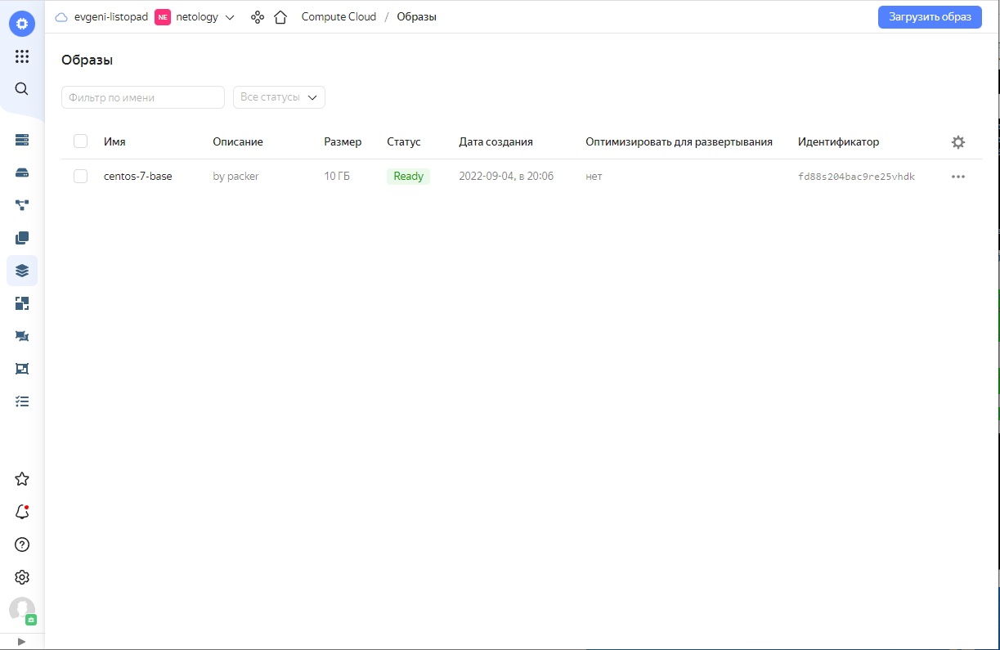
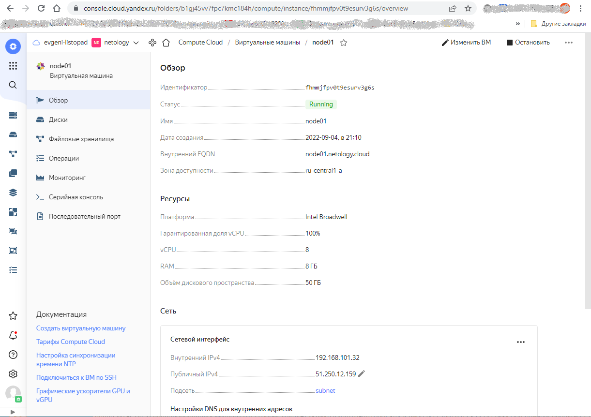
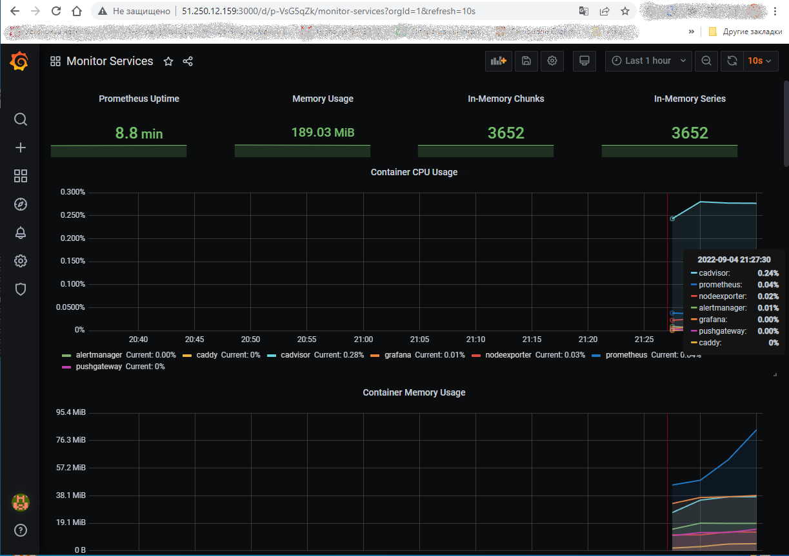
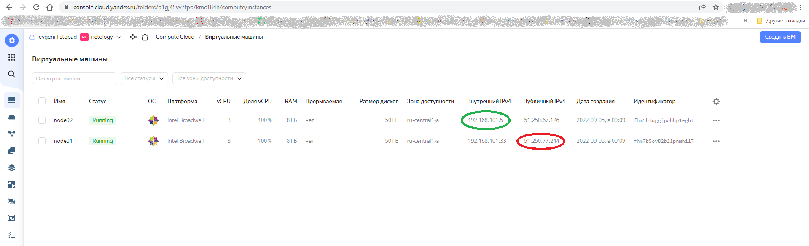
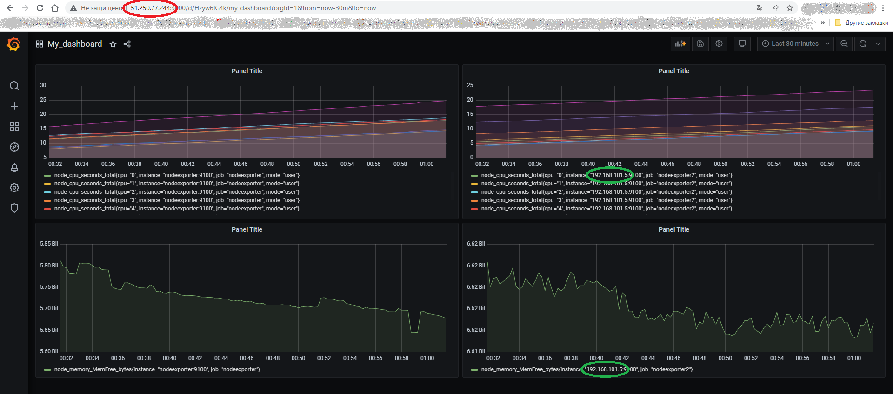

# Домашнее задание к занятию "5.4. Оркестрация группой Docker контейнеров на примере Docker Compose"

## Задача 1

Создать собственный образ операционной системы с помощью Packer.

### Решение задачи 1
```
[root@cloneserv packer]# packer build centos-7-base.json
yandex: output will be in this color.

==> yandex: Creating temporary RSA SSH key for instance...

------------------------------------------------------------------------
------------------------------ВЫВОД ОПУЩЕН------------------------------
------------------------------------------------------------------------

Build 'yandex' finished after 5 minutes 8 seconds.

==> Wait completed after 5 minutes 8 seconds

==> Builds finished. The artifacts of successful builds are:
--> yandex: A disk image was created: centos-7-base (id: fd88s204bac9re25vhdk) with family name centos
[root@cloneserv packer]#
[root@cloneserv packer]# yc compute image list
+----------------------+---------------+--------+----------------------+--------+
|          ID          |     NAME      | FAMILY |     PRODUCT IDS      | STATUS |
+----------------------+---------------+--------+----------------------+--------+
| fd88s204bac9re25vhdk | centos-7-base | centos | f2euv1kekdgvc0jrpaet | READY  |
+----------------------+---------------+--------+----------------------+--------+

```

Скриншот страницы, как на слайде из презентации:
<p align="center">
  
</p>

## Задача 2

Создать вашу первую виртуальную машину в Яндекс.Облаке.

### Решение задачи 2
```
[root@cloneserv terraform]# terraform apply --auto-approve

Terraform used the selected providers to generate the following execution plan. 
Resource actions are indicated with the following symbols:
  + create

------------------------------------------------------------------------
------------------------------ВЫВОД ОПУЩЕН------------------------------
------------------------------------------------------------------------

Apply complete! Resources: 3 added, 0 changed, 0 destroyed.

Outputs:

external_ip_address_node01_yandex_cloud = "51.250.12.159"
internal_ip_address_node01_yandex_cloud = "192.168.101.32"
[root@cloneserv terraform]#
```
Скриншот страницы свойств созданной ВМ:
<p align="center">
  
</p>

## Задача 3

Создать ваш первый готовый к боевой эксплуатации компонент мониторинга, состоящий из стека микросервисов.

### Решение задачи 3
```
[root@cloneserv ansible]# ansible-playbook provision.yml

PLAY [nodes] *******************************************************************************************

TASK [Gathering Facts] *********************************************************************************
The authenticity of host '51.250.12.159 (51.250.12.159)' can't be established.
ECDSA key fingerprint is SHA256:1o+pW2h+4l2roNbXyZ+MoCBYwisR9CJ2paokXJK2AGU.
Are you sure you want to continue connecting (yes/no/[fingerprint])? yes
ok: [node01.netology.cloud]

------------------------------------------------------------------------
------------------------------ВЫВОД ОПУЩЕН------------------------------
------------------------------------------------------------------------

PLAY RECAP *********************************************************************************************
node01.netology.cloud      : ok=12   changed=10   unreachable=0    failed=0    skipped=0    rescued=0    ignored=0

[root@cloneserv ansible]#
```
Скриншот работающего веб-интерфейса Grafana с текущими метриками:
<p align="center">
  
</p>

## Задача 4 (*)

Создать вторую ВМ и подключить её к мониторингу, развёрнутому на первом сервере.

### Решение задачи 4
```
[root@cloneserv terraform]# terraform apply --auto-approve

Terraform used the selected providers to generate the following execution plan. Resource actions are indicated with
the following symbols:
  + create

------------------------------------------------------------------------
------------------------------ВЫВОД ОПУЩЕН------------------------------
------------------------------------------------------------------------
yandex_compute_instance.node01: Still creating... [30s elapsed]
yandex_compute_instance.node02: Creation complete after 33s [id=fhmjv5lrlfid0vqb04ab]
yandex_compute_instance.node01: Still creating... [40s elapsed]
yandex_compute_instance.node01: Creation complete after 45s [id=fhmpk6635spkojtk3sq8]

Apply complete! Resources: 4 added, 0 changed, 0 destroyed.

Outputs:

external_ip_address_node01_yandex_cloud = "51.250.77.244"
external_ip_address_node02_yandex_cloud = "51.250.67.126"
internal_ip_address_node01_yandex_cloud = "192.168.101.33"
internal_ip_address_node02_yandex_cloud = "192.168.101.5"
```

Вывод docker-compose на ***node01***:
```
[root@node01 stack]# docker-compose ps
    Name                  Command                  State                                Ports
-----------------------------------------------------------------------------------------------------------------------
alertmanager   /bin/alertmanager --config ...   Up             9093/tcp
caddy          /sbin/tini -- caddy -agree ...   Up             0.0.0.0:3000->3000/tcp, 0.0.0.0:9090->9090/tcp,
                                                               0.0.0.0:9091->9091/tcp, 0.0.0.0:9093->9093/tcp
cadvisor       /usr/bin/cadvisor -logtostderr   Up (healthy)   8080/tcp
grafana        /run.sh                          Up             3000/tcp
nodeexporter   /bin/node_exporter --path. ...   Up             9100/tcp
prometheus     /bin/prometheus --config.f ...   Up             9090/tcp
pushgateway    /bin/pushgateway                 Up             9091/tcp
[root@node01 stack]#
```

Вывод docker-compose на ***node02***:
```
[root@node02 stack]# docker-compose ps
    Name                  Command                  State       Ports
--------------------------------------------------------------------
cadvisor       /usr/bin/cadvisor -logtostderr   Up (healthy)
nodeexporter   /bin/node_exporter --path. ...   Up
```

Скриншот страницы созданных ВМ:
<p align="center">
  
</p>

Скриншот из Grafana, на котором отображаются метрики добавленного сервера:
<p align="center">
  
</p>

