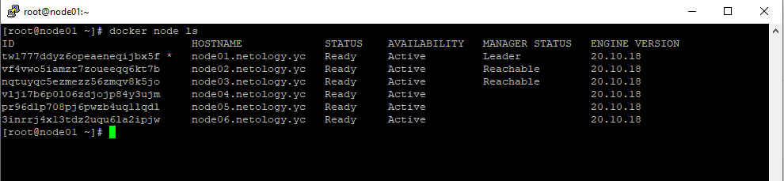
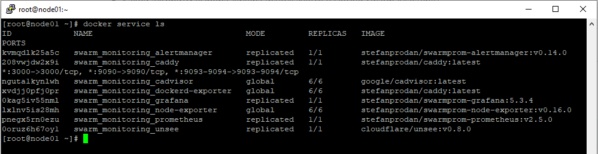

# Домашнее задание к занятию "5.5. Оркестрация кластером Docker контейнеров на примере Docker Swarm"

## Задача 1

Дайте письменые ответы на следующие вопросы:

- В чём отличие режимов работы сервисов в Docker Swarm кластере: replication и global?
- Какой алгоритм выбора лидера используется в Docker Swarm кластере?
- Что такое Overlay Network?

### Решение задачи 1
```
1) Docker Swarm имеет два режима работы сервисов: replicated и global.
Для сервисов типа replicated указывается общее число их экземпляров, 
которое необходимо запустить на доступных нодах Swarm-кластера,
а также можно задать максимальное число экземпляров, которое разрешено запустить на одной ноде.
С помощью настройки ролей можно обеспечить запуск replicated-сервисов 
только на worker-нодах или только на manager-нодах. Если настройку ролей не выполнять, 
то Docker Swarm запустит replicated-сервисы в нужном количестве на любых нодах 
по своему усмотрению.
Сервисы типа global запускаются по одному экземпляру на каждой ноде Swarm-кластера 
(и на worker, и на manager). Примером global-сервиса может быть агент мониторинга.
----------------------------------------------------------------------------------------
2) В Docker Swarm-кластере для выбора лидера используется алгоритм 
RAFT (алгоритм поддержания распределенного консенсуса)
----------------------------------------------------------------------------------------
3) Overlay Network - это логическая сеть, которая соединяет между собой несколько демонов 
Docker, работающих в режиме Swarm, и позволяет им обмениваться данными, образуя кластер.
Сеть overlay строится поверх существующей функционирующей сети (физической или виртуальной).
Данные передаются по overlay-сети между демонами в шифрованном виде.
```

## Задача 2

Создать ваш первый Docker Swarm кластер в Яндекс.Облаке

Для получения зачета, вам необходимо предоставить скриншот из терминала (консоли), с выводом команды:
```
docker node ls
```
### Решение задачи 2
```
[root@node01 ~]# docker node ls
ID                            HOSTNAME             STATUS    AVAILABILITY   MANAGER STATUS   ENGINE VERSION
tw1777ddyz6opeaeneqijbx5f *   node01.netology.yc   Ready     Active         Leader           20.10.18
vf4vwo5iamzr7zoueeqq6kt7b     node02.netology.yc   Ready     Active         Reachable        20.10.18
nqtuyqc5ezmezz56zmqv8k5jo     node03.netology.yc   Ready     Active         Reachable        20.10.18
vlji7b6p0l06zdjojp84y3ujm     node04.netology.yc   Ready     Active                          20.10.18
pr96dlp708pj6pwzb4uq1lqdl     node05.netology.yc   Ready     Active                          20.10.18
3inrrj4x13tdz2uqu6la2ipjw     node06.netology.yc   Ready     Active                          20.10.18
```
Скриншот из терминала:
<p align="center">
  
</p>


## Задача 3

Создать ваш первый, готовый к боевой эксплуатации кластер мониторинга, состоящий из стека микросервисов.

Для получения зачета, вам необходимо предоставить скриншот из терминала (консоли), с выводом команды:
```
docker service ls
```
### Решение задачи 3
```
[root@node01 ~]# docker service ls
ID             NAME                                MODE         REPLICAS   IMAGE                                          PORTS
kvmqdlk25a5c   swarm_monitoring_alertmanager       replicated   1/1        stefanprodan/swarmprom-alertmanager:v0.14.0
208vwjdw2x9i   swarm_monitoring_caddy              replicated   1/1        stefanprodan/caddy:latest                      *:3000->3000/tcp, *:9090->9090/tcp, *:9093-9094->9093-9094/tcp
nguta1kynlwh   swarm_monitoring_cadvisor           global       6/6        google/cadvisor:latest
xvdjj0pfj0pr   swarm_monitoring_dockerd-exporter   global       6/6        stefanprodan/caddy:latest
0kag5iv55nml   swarm_monitoring_grafana            replicated   1/1        stefanprodan/swarmprom-grafana:5.3.4
lxlnv5is28mh   swarm_monitoring_node-exporter      global       6/6        stefanprodan/swarmprom-node-exporter:v0.16.0
pnegx5rn0ezu   swarm_monitoring_prometheus         replicated   1/1        stefanprodan/swarmprom-prometheus:v2.5.0
0oruz6h67oy1   swarm_monitoring_unsee              replicated   1/1        cloudflare/unsee:v0.8.0
[root@node01 ~]#
```
Скриншот из терминала:
<p align="center">
  
</p>


## Задача 4 (*)

Выполнить на лидере Docker Swarm кластера команду (указанную ниже) и дать письменное описание её функционала, что она делает и зачем она нужна:
```
# см.документацию: https://docs.docker.com/engine/swarm/swarm_manager_locking/
docker swarm update --autolock=true
```

### Решение задачи 4 (*)

Команда ```docker swarm update --autolock=true``` включает функцию autolock на существующем 
Docker Swarm-кластере. Функция autolock обеспечивает закрытие доступа к 
TLS-ключу, который используется для защищенного взаимодействия Swarm-нодов между собой,
а также ключу, который используется для шифрования/расшифрования хранящихся RAFT-логов.
Закрытие доступа происходит в момент перезапуска демона docker.
Для того, чтобы этот доступ восстановить, пользователю необходимо ввести ключ разблокировки,
который генерируется демоном docker при введении команды:
```docker swarm update --autolock=true``` для существующего Docker Swarm-кластера или
```docker swarm init --autolock``` для вновь создаваемого Docker Swarm-кластера.
Пример использования:
```
[root@node01 ~]# docker swarm update --autolock=true
Swarm updated.
To unlock a swarm manager after it restarts, run the `docker swarm unlock`
command and provide the following key:

    SWMKEY-1-DivnbAi6GAWn4HxbaGQR2h5l3dKRORwoqyQX4838RNc

Please remember to store this key in a password manager, since without it you
will not be able to restart the manager.
[root@node01 ~]#
```
Перезапускаем демон docker проверяем доступность Swarm-кластера:
```
[root@node01 ~]# systemctl restart docker.service
[root@node01 ~]# docker node ls
Error response from daemon: Swarm is encrypted and needs to be unlocked before it can be used. Please use "docker swarm unlock" to unlock it.
[root@node01 ~]#
[root@node01 ~]# docker service ls
Error response from daemon: Swarm is encrypted and needs to be unlocked before it can be used. Please use "docker swarm unlock" to unlock it.
```
Проверяем, как отображается состояние ноды node01 при проверке из-под других нод кластера (например, из-под node02):
```
[root@node02 ~]# docker node ls
ID                            HOSTNAME             STATUS    AVAILABILITY   MANAGER STATUS   ENGINE VERSION
wwwn4b9shgn9ojmlluwx5m0y4     node01.netology.yc   Down      Active         Unreachable      20.10.18
367qn1cjcujac8f563e5eie9e *   node02.netology.yc   Ready     Active         Reachable        20.10.18
i67rtrw0yv7mmy7tftkekgtao     node03.netology.yc   Ready     Active         Leader           20.10.18
s95yzmzbz06f51fyotjzsq5od     node04.netology.yc   Ready     Active                          20.10.18
o8j5fj3fxtdwkgm39eto24678     node05.netology.yc   Ready     Active                          20.10.18
jw13yjdiowx9akn0g9gzwdvf7     node06.netology.yc   Ready     Active                          20.10.18
[root@node02 ~]#
```
На выводе выше видим, что нода node01.netology.yc недоступна, т.к. ее TLS-ключ зашифрован, и она не может взаимодействовать с другими
нодами кластера. Теперь выполним временную разблокировку ключей на ноде node01 (команда ```docker swarm unlock```):
```
[root@node01 ~]# docker swarm unlock
Please enter unlock key:
[root@node01 ~]#
[root@node01 ~]# docker node ls
ID                            HOSTNAME             STATUS    AVAILABILITY   MANAGER STATUS   ENGINE VERSION
wwwn4b9shgn9ojmlluwx5m0y4 *   node01.netology.yc   Ready     Active         Reachable        20.10.18
367qn1cjcujac8f563e5eie9e     node02.netology.yc   Ready     Active         Reachable        20.10.18
i67rtrw0yv7mmy7tftkekgtao     node03.netology.yc   Ready     Active         Leader           20.10.18
s95yzmzbz06f51fyotjzsq5od     node04.netology.yc   Ready     Active                          20.10.18
o8j5fj3fxtdwkgm39eto24678     node05.netology.yc   Ready     Active                          20.10.18
jw13yjdiowx9akn0g9gzwdvf7     node06.netology.yc   Ready     Active                          20.10.18

```
Отключим функцию autolock на существующем Docker Swarm-кластере (команда ```docker swarm update --autolock=false```).
Перезапустим демон docker и убедимся в работоспособности кластера без необходимости ввода ключа разблокировки:
```
[root@node01 ~]# docker swarm update --autolock=false
Swarm updated.
[root@node01 ~]# systemctl restart docker.service
[root@node01 ~]#
[root@node01 ~]# docker node ls
ID                            HOSTNAME             STATUS    AVAILABILITY   MANAGER STATUS   ENGINE VERSION
wwwn4b9shgn9ojmlluwx5m0y4 *   node01.netology.yc   Ready     Active         Reachable        20.10.18
367qn1cjcujac8f563e5eie9e     node02.netology.yc   Ready     Active         Reachable        20.10.18
i67rtrw0yv7mmy7tftkekgtao     node03.netology.yc   Ready     Active         Leader           20.10.18
s95yzmzbz06f51fyotjzsq5od     node04.netology.yc   Ready     Active                          20.10.18
o8j5fj3fxtdwkgm39eto24678     node05.netology.yc   Ready     Active                          20.10.18
jw13yjdiowx9akn0g9gzwdvf7     node06.netology.yc   Ready     Active                          20.10.18
[root@node01 ~]#
```
Всё работает.
