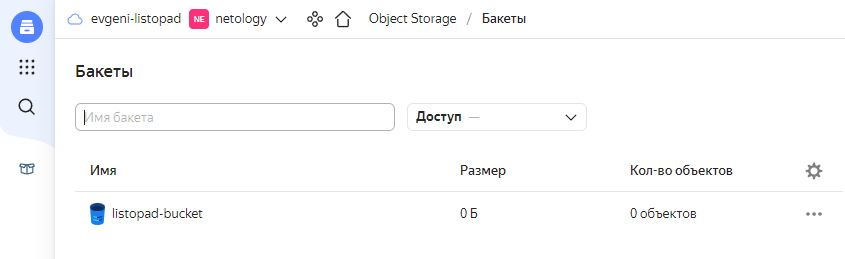

# Домашнее задание к занятию "7.3. Основы и принцип работы Терраформ"

## Задача 1. Создадим бэкэнд в S3 (необязательно, но крайне желательно).

Если в рамках предыдущего задания у вас уже есть аккаунт AWS, то давайте продолжим знакомство со взаимодействием
терраформа и aws. 

1. Создайте s3 бакет, iam роль и пользователя от которого будет работать терраформ. Можно создать отдельного пользователя,
а можно использовать созданного в рамках предыдущего задания, просто добавьте ему необходимы права, как описано 
[здесь](https://www.terraform.io/docs/backends/types/s3.html).
1. Зарегистрируйте бэкэнд в терраформ проекте как описано по ссылке выше. 

### Решение задачи 1
- Создаем S3 bucket в Yandex Cloud:
<p align="center">
  
</p>

- Проверяем наличие сервисного аккаунта:
```
 23:44:12 @ ~ []
└─ #  yc iam service-account list
+----------------------+----------+
|          ID          |   NAME   |
+----------------------+----------+
| ajedravjt1m7o6ijph44 | my-robot |
+----------------------+----------+
```
- Назначаем роль editor директории netology для сервисного аккаунта my-robot и проверяем результат назначения:
```
 23:46:28 @ ~ []
└─ #  yc resource-manager folder add-access-binding netology --role editor --subject serviceAccount:ajedravjt1m7o6ijph44
done (1s)
 23:59:11 @ ~ []
└─ # yc resource-manager folder list-access-bindings netology
+---------+----------------+----------------------+
| ROLE ID |  SUBJECT TYPE  |      SUBJECT ID      |
+---------+----------------+----------------------+
| editor  | serviceAccount | ajedravjt1m7o6ijph44 |
+---------+----------------+----------------------+
```
- Создаем ключ доступа для сервисного аккаунта:
```
 00:12:17 @ ~ []
└─ #  yc iam access-key create --service-account-name my-robot
access_key:
  id: aje...
  service_account_id: aje...
  created_at: "2022-11-03T21:12:20.524008364Z"
  key_id: YCA...
secret: YCP...
```
- Задаем необходимые для работы terraform переменые среды:
```
 00:17:19 @ ~ []
└─ #  export YC_TOKEN=$(yc iam create-token)
 00:17:21 @ ~ []
└─ #  export YC_CLOUD_ID=$(yc config get cloud-id)
 00:17:21 @ ~ []
└─ #  export YC_FOLDER_ID=$(yc config get folder-id)
 00:17:21 @ ~ []
└─ #  export YC_ZONE=$(yc config get compute-default-zone)
```
- Создадим файл provider.tf для выполнения регистрации S3-бэкенда в Terraform-проекте:
```
 00:30:02 @ ~/terraform/task7.3 []
└─ #  cat provider.tf
# Provider
terraform {
  required_providers {
    yandex = {
      source = "yandex-cloud/yandex"
    }
  }

  backend "s3" {
    endpoint   = "storage.yandexcloud.net"
    bucket     = "listopad-bucket"
    region     = "ru-central1"
    key        = "teffarorm.tfstate"
    access_key = "YCAJEnJQS-T1EpLV30UIKmCFz"
    secret_key = "YCPx5KMNgGbFL34Ctx228Y-myoZFDPUKK-v8g1_U"

    skip_region_validation      = true
    skip_credentials_validation = true
  }
}
```

## Задача 2. Инициализируем проект и создаем воркспейсы. 

1. Выполните `terraform init`:
    * если был создан бэкэнд в S3, то терраформ создат файл стейтов в S3 и запись в таблице 
dynamodb.
    * иначе будет создан локальный файл со стейтами.  
1. Создайте два воркспейса `stage` и `prod`.
1. В уже созданный `aws_instance` добавьте зависимость типа инстанса от вокспейса, что бы в разных ворскспейсах 
использовались разные `instance_type`.
1. Добавим `count`. Для `stage` должен создаться один экземпляр `ec2`, а для `prod` два. 
1. Создайте рядом еще один `aws_instance`, но теперь определите их количество при помощи `for_each`, а не `count`.
1. Что бы при изменении типа инстанса не возникло ситуации, когда не будет ни одного инстанса добавьте параметр
жизненного цикла `create_before_destroy = true` в один из рессурсов `aws_instance`.
1. При желании поэкспериментируйте с другими параметрами и рессурсами.

В виде результата работы пришлите:
* Вывод команды `terraform workspace list`.
* Вывод команды `terraform plan` для воркспейса `prod`.  

### Решение задачи 2
1. Выполняем `terraform init`:
```
 00:30:20 @ ~/terraform/task7.3 []
└─ # terraform init

Initializing the backend...

Successfully configured the backend "s3"! Terraform will automatically
use this backend unless the backend configuration changes.

----------------ВЫВОД ОПУЩЕН--------------------------

Terraform has been successfully initialized!

----------------ВЫВОД ОПУЩЕН--------------------------
```
2. Создаем два воркспейса `stage` и `prod`:
```
 00:38:09 @ ~/terraform/task7.3 []
└─ #  terraform workspace new stage
Created and switched to workspace "stage"!
----------------ВЫВОД ОПУЩЕН--------------------------
 00:38:13 @ ~/terraform/task7.3 []
└─ #  terraform workspace new prod
Created and switched to workspace "prod"!
----------------ВЫВОД ОПУЩЕН--------------------------
 00:39:25 @ ~/terraform/task7.3 []
└─ #  terraform workspace list
  default
* prod
  stage
```
3. По заданию в уже созданный `aws_instance` необходимо добавить зависимость типа инстанса от воркспейса, что бы в разных ворскспейсах использовались разные `instance_type`. Поскольку работа выполняется в Yandex cloud, для которого не удалось найти понятия `instance_type`, для примера было принято решение в зависимости от воркспейса менять не `instance_type`, а `platform_id`. Думаю, это не принципиально для демонстрации понимания зависимостей от воркспейсов:
```
 00:41:04 @ ~/terraform/task7.3 []
└─ #  cat ../task7.2/main.tf
resource "yandex_compute_instance" "node-workspace-depend" {
  name                      = "node-${terraform.workspace}"
  zone                      = "ru-central1-a"
  allow_stopping_for_update = true
  platform_id               = local.instance_type.[terraform.workspace]

  resources {
    cores  = 2
    memory = 4
  }

  boot_disk {
    initialize_params {
      image_id    = "${var.centos}"
      type        = "network-nvme"
      size        = "50"
    }
  }

  network_interface {
    subnet_id = "${yandex_vpc_subnet.default.id}"
    nat       = true
  }

  metadata = {
    ssh-keys = "centos:${file("~/.ssh/id_rsa.pub")}"
  }
}

locals {
  instance_type = {
  stage = "standard-v1"
  prod = "standard-v2"
  }
}


variable "centos" {
  default = "fd8j0db3lnmi4g7k93u5"
}

resource "yandex_vpc_network" "default" {
  name = "net"
}

resource "yandex_vpc_subnet" "default" {
  name = "subnet"
  zone           = "ru-central1-a"
  network_id     = "${yandex_vpc_network.default.id}"
  v4_cidr_blocks = ["192.168.101.0/24"]
}
```
4. Добавим `count`. Для `stage` будем создавать один экземпляр `yandex_compute_instance`, а для `prod` - два:
```
 00:41:04 @ ~/terraform/task7.3 []
└─ #  cat ../task7.2/main.tf
resource "yandex_compute_instance" "node-count-workspace-depend" {
  name                      = "node-count-${count.index+1}-${terraform.workspace}"
  zone                      = "ru-central1-a"
  allow_stopping_for_update = true
  platform_id               = local.instance_type[terraform.workspace]
  count                     = local.instance_count[terraform.workspace]

  resources {
    cores  = 2
    memory = 4
  }

  boot_disk {
    initialize_params {
      image_id    = "${var.centos}"
      type        = "network-nvme"
      size        = "50"
    }
  }

  network_interface {
    subnet_id = "${yandex_vpc_subnet.default.id}"
    nat       = true
  }

  metadata = {
    ssh-keys = "centos:${file("~/.ssh/id_rsa.pub")}"
  }
}

locals {
  instance_type = {
  stage = "standard-v1"
  prod = "standard-v2"
  }
  instance_count = {
  stage = 1
  prod = 2
  }
}

variable "centos" {
  default = "fd8j0db3lnmi4g7k93u5"
}

resource "yandex_vpc_network" "default" {
  name = "net"
}

resource "yandex_vpc_subnet" "default" {
  name = "subnet"
  zone           = "ru-central1-a"
  network_id     = "${yandex_vpc_network.default.id}"
  v4_cidr_blocks = ["192.168.101.0/24"]
}
```
5. Создадим еще один `yandex_compute_instance`, но теперь определим их количество при помощи `for_each`, а не `count`. Также добавим параметр жизненного цикла `create_before_destroy = true` в один из ресурсов `yandex_compute_instance`:
```
 00:45:37 @ ~/terraform/task7.3 []
└─ #  cat ../task7.2/main.tf
resource "yandex_compute_instance" "node-count-workspace-depend" {
  name                      = "node-count-${count.index+1}-${terraform.workspace}"
  zone                      = "ru-central1-a"
  allow_stopping_for_update = true
  platform_id               = local.instance_type[terraform.workspace]
  count                     = local.instance_count[terraform.workspace]

  resources {
    cores  = 2
    memory = 4
  }

  boot_disk {
    initialize_params {
      image_id    = "${var.centos}"
      type        = "network-nvme"
      size        = "50"
    }
  }

  network_interface {
    subnet_id = "${yandex_vpc_subnet.default.id}"
    nat       = true
  }

  metadata = {
    ssh-keys = "centos:${file("~/.ssh/id_rsa.pub")}"
  }
}


resource "yandex_compute_instance" "node-foreach-workspace-depend" {
  for_each                  = local.instance_foreach[terraform.workspace]
  name                      = "node-foreach-${each.key}-${terraform.workspace}"
  zone                      = "ru-central1-a"
  allow_stopping_for_update = true
  platform_id               = "${each.value}"

  resources {
    cores  = 2
    memory = 4
  }

  boot_disk {
    initialize_params {
      image_id    = "${var.centos}"
      type        = "network-nvme"
      size        = "50"
    }
  }

  network_interface {
    subnet_id = "${yandex_vpc_subnet.default.id}"
    nat       = true
  }

  metadata = {
    ssh-keys = "centos:${file("~/.ssh/id_rsa.pub")}"
  }

  lifecycle {
    create_before_destroy = true
  }
}

locals {
  instance_type = {
    stage = "standard-v1"
    prod = "standard-v2"
  }
  instance_count = {
    stage = 1
    prod = 2
  }
  instance_foreach = {
    stage = {
      "1" = "standard-v1"
    }
    prod = {
      "1" = "standard-v2"
      "2" = "standard-v2"
    }
  }  
}

variable "centos" {
  default = "fd8j0db3lnmi4g7k93u5"
}

resource "yandex_vpc_network" "default" {
  name = "net"
}

resource "yandex_vpc_subnet" "default" {
  name = "subnet"
  zone           = "ru-central1-a"
  network_id     = "${yandex_vpc_network.default.id}"
  v4_cidr_blocks = ["192.168.101.0/24"]
}
```
- Результаты выполненной работы:
```
 00:48:40 @ ~/terraform/task7.3 []
└─ #  terraform workspace list
  default
* prod
  stage
 00:49:37 @ ~/terraform/task7.3 []
└─ #  terraform plan

Terraform used the selected providers to generate the following execution plan. Resource actions
are indicated with the following symbols:
  + create

Terraform will perform the following actions:

  # yandex_compute_instance.node-count-workspace-depend[0] will be created
  + resource "yandex_compute_instance" "node-count-workspace-depend" {
      + allow_stopping_for_update = true
      + created_at                = (known after apply)
      + folder_id                 = (known after apply)
      + fqdn                      = (known after apply)
      + hostname                  = (known after apply)
      + id                        = (known after apply)
      + metadata                  = {
          + "ssh-keys" = <<-EOT
                centos:ssh-rsa AAAAB3NzaC1yc2EAAAADAQABAAABgQCwmhpH8TIOY1tOGpmrxOVdyeZ2k8wXpJoRvp7Qa4hzODOrsnV3C8WGH5X1f3pqZ8jECklxiv17wsXIyvcH4WNhNPbbO6VHKZ13rDoOTEaotP+WGEQuaUfTcgyGhKMo5zGoBINoMbM8IDtVH6unKDec0iSxlANXGGar5RkNha7J4igYp+6vnwFMF/hyLRrOh8DLxxhG9Fn5C7v9UhMEiM2bT7ZRX2u1SwYQtnzD6UD96Qw3PEag9hrY74UlFD50IsNLleufolJSPO4tqCpmufNz7TbSbvpLRXP0WI1bj8sjgKa9BAR5PqxnvqinYij8rkbSUUwbhHRezEPkGg2Gj1xts91YxPMmgoNMyl8tXeo8G3TEJzDXgn6TqPBZPV5xzZbJBF4ee/pbGTPA9AR2WQywrSKdM+9IXmKUmZ9abVkgHNyp3US8FdEtS4ajv71rE3GOXOuywVfT7859ny6g6OJ3re3r2Uf4vPf8AVINHbCLn4/8aMdjoLQ8+N/9dI0Hk+E= root@cloneserv
            EOT
        }
      + name                      = "node-count-1-prod"
      + network_acceleration_type = "standard"
      + platform_id               = "standard-v2"
      + service_account_id        = (known after apply)
      + status                    = (known after apply)
      + zone                      = "ru-central1-a"

      + boot_disk {
          + auto_delete = true
          + device_name = (known after apply)
          + disk_id     = (known after apply)
          + mode        = (known after apply)

          + initialize_params {
              + block_size  = (known after apply)
              + description = (known after apply)
              + image_id    = "fd8j0db3lnmi4g7k93u5"
              + name        = (known after apply)
              + size        = 50
              + snapshot_id = (known after apply)
              + type        = "network-nvme"
            }
        }

      + network_interface {
          + index              = (known after apply)
          + ip_address         = (known after apply)
          + ipv4               = true
          + ipv6               = (known after apply)
          + ipv6_address       = (known after apply)
          + mac_address        = (known after apply)
          + nat                = true
          + nat_ip_address     = (known after apply)
          + nat_ip_version     = (known after apply)
          + security_group_ids = (known after apply)
          + subnet_id          = (known after apply)
        }

      + placement_policy {
          + host_affinity_rules = (known after apply)
          + placement_group_id  = (known after apply)
        }

      + resources {
          + core_fraction = 100
          + cores         = 2
          + memory        = 4
        }

      + scheduling_policy {
          + preemptible = (known after apply)
        }
    }

  # yandex_compute_instance.node-count-workspace-depend[1] will be created
  + resource "yandex_compute_instance" "node-count-workspace-depend" {
      + allow_stopping_for_update = true
      + created_at                = (known after apply)
      + folder_id                 = (known after apply)
      + fqdn                      = (known after apply)
      + hostname                  = (known after apply)
      + id                        = (known after apply)
      + metadata                  = {
          + "ssh-keys" = <<-EOT
                centos:ssh-rsa AAAAB3NzaC1yc2EAAAADAQABAAABgQCwmhpH8TIOY1tOGpmrxOVdyeZ2k8wXpJoRvp7Qa4hzODOrsnV3C8WGH5X1f3pqZ8jECklxiv17wsXIyvcH4WNhNPbbO6VHKZ13rDoOTEaotP+WGEQuaUfTcgyGhKMo5zGoBINoMbM8IDtVH6unKDec0iSxlANXGGar5RkNha7J4igYp+6vnwFMF/hyLRrOh8DLxxhG9Fn5C7v9UhMEiM2bT7ZRX2u1SwYQtnzD6UD96Qw3PEag9hrY74UlFD50IsNLleufolJSPO4tqCpmufNz7TbSbvpLRXP0WI1bj8sjgKa9BAR5PqxnvqinYij8rkbSUUwbhHRezEPkGg2Gj1xts91YxPMmgoNMyl8tXeo8G3TEJzDXgn6TqPBZPV5xzZbJBF4ee/pbGTPA9AR2WQywrSKdM+9IXmKUmZ9abVkgHNyp3US8FdEtS4ajv71rE3GOXOuywVfT7859ny6g6OJ3re3r2Uf4vPf8AVINHbCLn4/8aMdjoLQ8+N/9dI0Hk+E= root@cloneserv
            EOT
        }
      + name                      = "node-count-2-prod"
      + network_acceleration_type = "standard"
      + platform_id               = "standard-v2"
      + service_account_id        = (known after apply)
      + status                    = (known after apply)
      + zone                      = "ru-central1-a"

      + boot_disk {
          + auto_delete = true
          + device_name = (known after apply)
          + disk_id     = (known after apply)
          + mode        = (known after apply)

          + initialize_params {
              + block_size  = (known after apply)
              + description = (known after apply)
              + image_id    = "fd8j0db3lnmi4g7k93u5"
              + name        = (known after apply)
              + size        = 50
              + snapshot_id = (known after apply)
              + type        = "network-nvme"
            }
        }

      + network_interface {
          + index              = (known after apply)
          + ip_address         = (known after apply)
          + ipv4               = true
          + ipv6               = (known after apply)
          + ipv6_address       = (known after apply)
          + mac_address        = (known after apply)
          + nat                = true
          + nat_ip_address     = (known after apply)
          + nat_ip_version     = (known after apply)
          + security_group_ids = (known after apply)
          + subnet_id          = (known after apply)
        }

      + placement_policy {
          + host_affinity_rules = (known after apply)
          + placement_group_id  = (known after apply)
        }

      + resources {
          + core_fraction = 100
          + cores         = 2
          + memory        = 4
        }

      + scheduling_policy {
          + preemptible = (known after apply)
        }
    }

  # yandex_compute_instance.node-foreach-workspace-depend["1"] will be created
  + resource "yandex_compute_instance" "node-foreach-workspace-depend" {
      + allow_stopping_for_update = true
      + created_at                = (known after apply)
      + folder_id                 = (known after apply)
      + fqdn                      = (known after apply)
      + hostname                  = (known after apply)
      + id                        = (known after apply)
      + metadata                  = {
          + "ssh-keys" = <<-EOT
                centos:ssh-rsa AAAAB3NzaC1yc2EAAAADAQABAAABgQCwmhpH8TIOY1tOGpmrxOVdyeZ2k8wXpJoRvp7Qa4hzODOrsnV3C8WGH5X1f3pqZ8jECklxiv17wsXIyvcH4WNhNPbbO6VHKZ13rDoOTEaotP+WGEQuaUfTcgyGhKMo5zGoBINoMbM8IDtVH6unKDec0iSxlANXGGar5RkNha7J4igYp+6vnwFMF/hyLRrOh8DLxxhG9Fn5C7v9UhMEiM2bT7ZRX2u1SwYQtnzD6UD96Qw3PEag9hrY74UlFD50IsNLleufolJSPO4tqCpmufNz7TbSbvpLRXP0WI1bj8sjgKa9BAR5PqxnvqinYij8rkbSUUwbhHRezEPkGg2Gj1xts91YxPMmgoNMyl8tXeo8G3TEJzDXgn6TqPBZPV5xzZbJBF4ee/pbGTPA9AR2WQywrSKdM+9IXmKUmZ9abVkgHNyp3US8FdEtS4ajv71rE3GOXOuywVfT7859ny6g6OJ3re3r2Uf4vPf8AVINHbCLn4/8aMdjoLQ8+N/9dI0Hk+E= root@cloneserv
            EOT
        }
      + name                      = "node-foreach-1-prod"
      + network_acceleration_type = "standard"
      + platform_id               = "standard-v2"
      + service_account_id        = (known after apply)
      + status                    = (known after apply)
      + zone                      = "ru-central1-a"

      + boot_disk {
          + auto_delete = true
          + device_name = (known after apply)
          + disk_id     = (known after apply)
          + mode        = (known after apply)

          + initialize_params {
              + block_size  = (known after apply)
              + description = (known after apply)
              + image_id    = "fd8j0db3lnmi4g7k93u5"
              + name        = (known after apply)
              + size        = 50
              + snapshot_id = (known after apply)
              + type        = "network-nvme"
            }
        }

      + network_interface {
          + index              = (known after apply)
          + ip_address         = (known after apply)
          + ipv4               = true
          + ipv6               = (known after apply)
          + ipv6_address       = (known after apply)
          + mac_address        = (known after apply)
          + nat                = true
          + nat_ip_address     = (known after apply)
          + nat_ip_version     = (known after apply)
          + security_group_ids = (known after apply)
          + subnet_id          = (known after apply)
        }

      + placement_policy {
          + host_affinity_rules = (known after apply)
          + placement_group_id  = (known after apply)
        }

      + resources {
          + core_fraction = 100
          + cores         = 2
          + memory        = 4
        }

      + scheduling_policy {
          + preemptible = (known after apply)
        }
    }

  # yandex_compute_instance.node-foreach-workspace-depend["2"] will be created
  + resource "yandex_compute_instance" "node-foreach-workspace-depend" {
      + allow_stopping_for_update = true
      + created_at                = (known after apply)
      + folder_id                 = (known after apply)
      + fqdn                      = (known after apply)
      + hostname                  = (known after apply)
      + id                        = (known after apply)
      + metadata                  = {
          + "ssh-keys" = <<-EOT
                centos:ssh-rsa AAAAB3NzaC1yc2EAAAADAQABAAABgQCwmhpH8TIOY1tOGpmrxOVdyeZ2k8wXpJoRvp7Qa4hzODOrsnV3C8WGH5X1f3pqZ8jECklxiv17wsXIyvcH4WNhNPbbO6VHKZ13rDoOTEaotP+WGEQuaUfTcgyGhKMo5zGoBINoMbM8IDtVH6unKDec0iSxlANXGGar5RkNha7J4igYp+6vnwFMF/hyLRrOh8DLxxhG9Fn5C7v9UhMEiM2bT7ZRX2u1SwYQtnzD6UD96Qw3PEag9hrY74UlFD50IsNLleufolJSPO4tqCpmufNz7TbSbvpLRXP0WI1bj8sjgKa9BAR5PqxnvqinYij8rkbSUUwbhHRezEPkGg2Gj1xts91YxPMmgoNMyl8tXeo8G3TEJzDXgn6TqPBZPV5xzZbJBF4ee/pbGTPA9AR2WQywrSKdM+9IXmKUmZ9abVkgHNyp3US8FdEtS4ajv71rE3GOXOuywVfT7859ny6g6OJ3re3r2Uf4vPf8AVINHbCLn4/8aMdjoLQ8+N/9dI0Hk+E= root@cloneserv
            EOT
        }
      + name                      = "node-foreach-2-prod"
      + network_acceleration_type = "standard"
      + platform_id               = "standard-v2"
      + service_account_id        = (known after apply)
      + status                    = (known after apply)
      + zone                      = "ru-central1-a"

      + boot_disk {
          + auto_delete = true
          + device_name = (known after apply)
          + disk_id     = (known after apply)
          + mode        = (known after apply)

          + initialize_params {
              + block_size  = (known after apply)
              + description = (known after apply)
              + image_id    = "fd8j0db3lnmi4g7k93u5"
              + name        = (known after apply)
              + size        = 50
              + snapshot_id = (known after apply)
              + type        = "network-nvme"
            }
        }

      + network_interface {
          + index              = (known after apply)
          + ip_address         = (known after apply)
          + ipv4               = true
          + ipv6               = (known after apply)
          + ipv6_address       = (known after apply)
          + mac_address        = (known after apply)
          + nat                = true
          + nat_ip_address     = (known after apply)
          + nat_ip_version     = (known after apply)
          + security_group_ids = (known after apply)
          + subnet_id          = (known after apply)
        }

      + placement_policy {
          + host_affinity_rules = (known after apply)
          + placement_group_id  = (known after apply)
        }

      + resources {
          + core_fraction = 100
          + cores         = 2
          + memory        = 4
        }

      + scheduling_policy {
          + preemptible = (known after apply)
        }
    }

  # yandex_vpc_network.default will be created
  + resource "yandex_vpc_network" "default" {
      + created_at                = (known after apply)
      + default_security_group_id = (known after apply)
      + folder_id                 = (known after apply)
      + id                        = (known after apply)
      + labels                    = (known after apply)
      + name                      = "net"
      + subnet_ids                = (known after apply)
    }

  # yandex_vpc_subnet.default will be created
  + resource "yandex_vpc_subnet" "default" {
      + created_at     = (known after apply)
      + folder_id      = (known after apply)
      + id             = (known after apply)
      + labels         = (known after apply)
      + name           = "subnet"
      + network_id     = (known after apply)
      + v4_cidr_blocks = [
          + "192.168.101.0/24",
        ]
      + v6_cidr_blocks = (known after apply)
      + zone           = "ru-central1-a"
    }

Plan: 6 to add, 0 to change, 0 to destroy.

─────────────────────────────────────────────────────────────────────────────────────────────────

Note: You didn't use the -out option to save this plan, so Terraform can't guarantee to take
exactly these actions if you run "terraform apply" now.
 00:49:52 @ ~/terraform/task7.3 []
└─ #  terraform apply --auto-approve

Terraform used the selected providers to generate the following execution plan. Resource actions
are indicated with the following symbols:
  + create

Terraform will perform the following actions:
-------------------------------ВЫВОД ОПУЩЕН---------------------------------
Plan: 6 to add, 0 to change, 0 to destroy.
yandex_vpc_network.default: Creating...
yandex_vpc_network.default: Creation complete after 1s [id=enpk7eqsom9vqlje480u]
yandex_vpc_subnet.default: Creating...
yandex_vpc_subnet.default: Creation complete after 1s [id=e9bbcka028e5ppb4jlgs]
yandex_compute_instance.node-count-workspace-depend[1]: Creating...
yandex_compute_instance.node-foreach-workspace-depend["2"]: Creating...
yandex_compute_instance.node-foreach-workspace-depend["1"]: Creating...
yandex_compute_instance.node-count-workspace-depend[0]: Creating...
yandex_compute_instance.node-count-workspace-depend[1]: Still creating... [10s elapsed]
yandex_compute_instance.node-foreach-workspace-depend["2"]: Still creating... [10s elapsed]
yandex_compute_instance.node-foreach-workspace-depend["1"]: Still creating... [10s elapsed]
yandex_compute_instance.node-count-workspace-depend[0]: Still creating... [10s elapsed]
yandex_compute_instance.node-count-workspace-depend[1]: Still creating... [20s elapsed]
yandex_compute_instance.node-foreach-workspace-depend["2"]: Still creating... [20s elapsed]
yandex_compute_instance.node-foreach-workspace-depend["1"]: Still creating... [20s elapsed]
yandex_compute_instance.node-count-workspace-depend[0]: Still creating... [20s elapsed]
yandex_compute_instance.node-foreach-workspace-depend["2"]: Creation complete after 28s [id=fhmr85nuld5ck50lrdu3]
yandex_compute_instance.node-count-workspace-depend[1]: Still creating... [30s elapsed]
yandex_compute_instance.node-foreach-workspace-depend["1"]: Still creating... [30s elapsed]
yandex_compute_instance.node-count-workspace-depend[0]: Still creating... [30s elapsed]
yandex_compute_instance.node-count-workspace-depend[1]: Creation complete after 33s [id=fhmf9bl2udepjif99q6q]
yandex_compute_instance.node-count-workspace-depend[0]: Creation complete after 33s [id=fhmvvs5frk0ttuuj5cr6]
yandex_compute_instance.node-foreach-workspace-depend["1"]: Creation complete after 34s [id=fhmileglv4httc28l4s6]

Apply complete! Resources: 6 added, 0 changed, 0 destroyed.

 00:53:16 @ ~/terraform/task7.3 []
└─ #  yc compute instance list
+----------------------+---------------------+---------------+---------+----------------+----------------+
|          ID          |        NAME         |    ZONE ID    | STATUS  |  EXTERNAL IP   |  INTERNAL IP   |
+----------------------+---------------------+---------------+---------+----------------+----------------+
| fhmf9bl2udepjif99q6q | node-count-2-prod   | ru-central1-a | RUNNING | 158.160.32.99  | 192.168.101.9  |
| fhmileglv4httc28l4s6 | node-foreach-1-prod | ru-central1-a | RUNNING | 84.252.129.242 | 192.168.101.4  |
| fhmr85nuld5ck50lrdu3 | node-foreach-2-prod | ru-central1-a | RUNNING | 158.160.36.207 | 192.168.101.29 |
| fhmvvs5frk0ttuuj5cr6 | node-count-1-prod   | ru-central1-a | RUNNING | 158.160.33.255 | 192.168.101.20 |
+----------------------+---------------------+---------------+---------+----------------+----------------+
```

