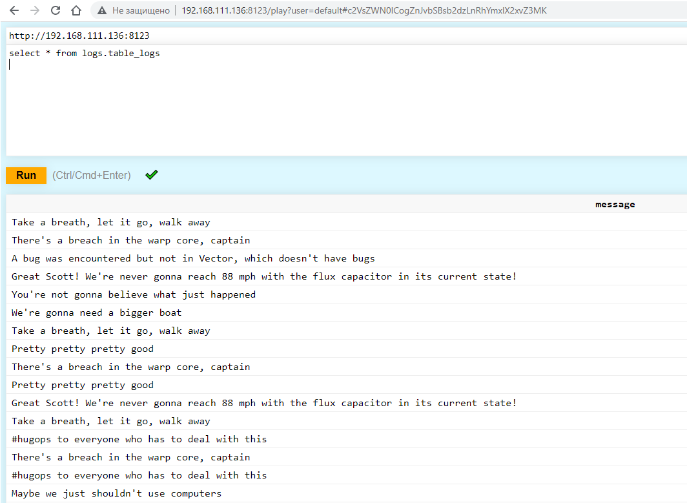

# Домашнее задание к занятию "8.2. Работа с Playbook"

## Подготовка к выполнению

1. (Необязательно) Изучите, что такое [clickhouse](https://www.youtube.com/watch?v=fjTNS2zkeBs) и [vector](https://www.youtube.com/watch?v=CgEhyffisLY)
2. Создайте свой собственный (или используйте старый) публичный репозиторий на github с произвольным именем.
3. Скачайте [playbook](./playbook/) из репозитория с домашним заданием и перенесите его в свой репозиторий.
4. Подготовьте хосты в соответствии с группами из предподготовленного playbook.

## Основная часть

1. Приготовьте свой собственный inventory файл `prod.yml`.
2. Допишите playbook: нужно сделать ещё один play, который устанавливает и настраивает [vector](https://vector.dev).
3. При создании tasks рекомендую использовать модули: `get_url`, `template`, `unarchive`, `file`.
4. Tasks должны: скачать нужной версии дистрибутив, выполнить распаковку в выбранную директорию, установить vector.
```
Доработан play для clickhouse и создан play для vector. Содержимое файла site.yml:
 02:00:33 @ ~/my-ansible/8.2_Blank/playbook []
└─ #  cat site.yml
---
- name: Install Clickhouse
  tags: clickhouse
  hosts: clickhouse-01
  tasks:
    - name: Get clickhouse packages with vars
      ansible.builtin.get_url:
        url: "https://packages.clickhouse.com/rpm/stable/{{ item }}-{{ clickhouse_version }}.noarch.rpm"
        dest: "./{{ item }}-{{ clickhouse_version }}.rpm"
      with_items: "{{ clickhouse_packages }}"
    - name: Get clickhouse packages without vars
      ansible.builtin.get_url:
        url: "https://packages.clickhouse.com/rpm/stable/clickhouse-common-static-{{ clickhouse_version }}.x86_64.rpm"
        dest: "./clickhouse-common-static-{{ clickhouse_version }}.rpm"
    - name: Install clickhouse packages
      become: true
      ansible.builtin.yum:
        name:
          - clickhouse-common-static-{{ clickhouse_version }}.rpm
          - clickhouse-client-{{ clickhouse_version }}.rpm
          - clickhouse-server-{{ clickhouse_version }}.rpm
        disable_gpg_check: true
    - name: Enable connections to clickhouse server
      become: true
      ansible.builtin.lineinfile:
        path: /etc/clickhouse-server/config.xml
        regexp: <!-- <listen_host>::</listen_host> -->
        line: <listen_host>::</listen_host>
    - name: Start clickhouse service
      become: true
      ansible.builtin.service:
        name: clickhouse-server
        state: restarted
    - name: Create database
      tags: create_database_in_clickhouse
      ansible.builtin.command: "clickhouse-client -q 'create database logs;'"
      register: create_db
      failed_when: create_db.rc != 0 and create_db.rc != 82
      changed_when: create_db.rc == 0
    - name: Create table
      tags: create_table_in_clickhouse_database
      ansible.builtin.command: "clickhouse-client -q 'create table logs.table_logs (message String) ENGINE = MergeTree() ORDER BY tuple();'"
      register: create_table
      failed_when: create_table.rc != 0 and create_table.rc != 57
      changed_when: create_table.rc == 0
# Vector
- name: Install Vector
  tags: vector
  hosts: vector-01
  tasks:
    - name: Get RPM packages
      ansible.builtin.get_url:
        url: "https://packages.timber.io/vector/{{ vector_version }}/{{ item }}-{{ vector_version }}-1.x86_64.rpm"
        dest: "./{{ item }}.rpm"
      with_items: "{{ vector_packages }}"
    - name: Install RPM packages
      ansible.builtin.yum:
        name: "{{ item }}.rpm"
        disable_gpg_check: true
      with_items: "{{ vector_packages }}"
    - name: Copy server configuration file
      ansible.builtin.template:
        src: vector.toml
        dest: "/etc/vector/vector.toml"
        owner: "0"
        group: "0"
        mode: "0664"
    - name: Start vector service
      become: true
      ansible.builtin.service:
        name: vector
        state: restarted
```
5. Запустите `ansible-lint site.yml` и исправьте ошибки, если они есть.
```
Ошибки исправлены, остались только Warnings:
 02:03:37 @ ~/my-ansible/8.2_Blank/playbook []
└─ #  ansible-lint site.yml
WARNING  Overriding detected file kind 'yaml' with 'playbook' for given positional argument: site.yml
WARNING  Listing 3 violation(s) that are fatal
risky-file-permissions: File permissions unset or incorrect. (warning)
site.yml:6 Task/Handler: Get clickhouse packages with vars

risky-file-permissions: File permissions unset or incorrect. (warning)
site.yml:11 Task/Handler: Get clickhouse packages without vars

risky-file-permissions: File permissions unset or incorrect. (warning)
site.yml:51 Task/Handler: Get RPM packages

You can skip specific rules or tags by adding them to your configuration file:
# .config/ansible-lint.yml
warn_list:  # or 'skip_list' to silence them completely
  - experimental  # all rules tagged as experimental

                            Rule Violation Summary
 count tag                    profile rule associated tags
     3 risky-file-permissions safety  unpredictability, experimental (warning)

Passed with moderate profile, 2/5 star rating: 0 failure(s), 3 warning(s) on 1 files.
```
6. Попробуйте запустить playbook на этом окружении с флагом `--check`.
```
Запуск playbook'a с флагом `--check` вызывает ошибку в месте инсталляции пакетов, поскольку они должны быть скачаны  на предыдущем шаге, а раз мы использовали флаг `--check`, то это скачивание не выполнено, и соответственно пакетов нет. Поэтому и возникает ошибка. Всё логично.
 02:07:29 @ ~/my-ansible/8.2_Blank/playbook []
└─ #  ansible-playbook -i inventory/prod.yml site.yml --check

PLAY [Install Clickhouse] *******************************************************************************************************

TASK [Gathering Facts] **********************************************************************************************************
ok: [clickhouse-01]

TASK [Get clickhouse packages with vars] ****************************************************************************************
changed: [clickhouse-01] => (item=clickhouse-client)
changed: [clickhouse-01] => (item=clickhouse-server)

TASK [Get clickhouse packages without vars] *************************************************************************************
changed: [clickhouse-01]

TASK [Install clickhouse packages] **********************************************************************************************
An exception occurred during task execution. To see the full traceback, use -vvv. The error was: OSError: Could not open: clickhouse-common-static-22.3.3.44.rpm clickhouse-client-22.3.3.44.rpm clickhouse-server-22.3.3.44.rpm
fatal: [clickhouse-01]: FAILED! => {"changed": false, "module_stderr": "Shared connection to 192.168.111.136 closed.\r\n", "module_stdout": "Traceback (most recent call last):\r\n  File \"/root/.ansible/tmp/ansible-tmp-1668985743.3688817-4569-254221462455572/AnsiballZ_dnf.py\", line 107, in <module>\r\n    _ansiballz_main()\r\n  File \"/root/.ansible/tmp/ansible-tmp-1668985743.3688817-4569-254221462455572/AnsiballZ_dnf.py\", line 99, in _ansiballz_main\r\n    invoke_module(zipped_mod, temp_path, ANSIBALLZ_PARAMS)\r\n  File \"/root/.ansible/tmp/ansible-tmp-1668985743.3688817-4569-254221462455572/AnsiballZ_dnf.py\", line 48, in invoke_module\r\n    run_name='__main__', alter_sys=True)\r\n  File \"/usr/lib64/python3.6/runpy.py\", line 205, in run_module\r\n    return _run_module_code(code, init_globals, run_name, mod_spec)\r\n  File \"/usr/lib64/python3.6/runpy.py\", line 96, in _run_module_code\r\n    mod_name, mod_spec, pkg_name, script_name)\r\n  File \"/usr/lib64/python3.6/runpy.py\", line 85, in _run_code\r\n    exec(code, run_globals)\r\n  File \"/tmp/ansible_ansible.legacy.dnf_payload_339g62cl/ansible_ansible.legacy.dnf_payload.zip/ansible/modules/dnf.py\", line 1446, in <module>\r\n  File \"/tmp/ansible_ansible.legacy.dnf_payload_339g62cl/ansible_ansible.legacy.dnf_payload.zip/ansible/modules/dnf.py\", line 1435, in main\r\n  File \"/tmp/ansible_ansible.legacy.dnf_payload_339g62cl/ansible_ansible.legacy.dnf_payload.zip/ansible/modules/dnf.py\", line 1409, in run\r\n  File \"/tmp/ansible_ansible.legacy.dnf_payload_339g62cl/ansible_ansible.legacy.dnf_payload.zip/ansible/modules/dnf.py\", line 1067, in ensure\r\n  File \"/tmp/ansible_ansible.legacy.dnf_payload_339g62cl/ansible_ansible.legacy.dnf_payload.zip/ansible/modules/dnf.py\", line 967, in _install_remote_rpms\r\n  File \"/usr/lib/python3.6/site-packages/dnf/base.py\", line 1181, in add_remote_rpms\r\n    raise IOError(_(\"Could not open: {}\").format(' '.join(pkgs_error)))\r\nOSError: Could not open: clickhouse-common-static-22.3.3.44.rpm clickhouse-client-22.3.3.44.rpm clickhouse-server-22.3.3.44.rpm\r\n", "msg": "MODULE FAILURE\nSee stdout/stderr for the exact error", "rc": 1}

PLAY RECAP **********************************************************************************************************************
clickhouse-01              : ok=3    changed=2    unreachable=0    failed=1    skipped=0    rescued=0    ignored=0
```
7. Запустите playbook на `prod.yml` окружении с флагом `--diff`. Убедитесь, что изменения на системе произведены.
```
Выполнено.
 02:09:07 @ ~/my-ansible/8.2_Blank/playbook []
└─ #  ansible-playbook -i inventory/prod.yml site.yml --diff

PLAY [Install Clickhouse] *******************************************************************************************************

TASK [Gathering Facts] **********************************************************************************************************
ok: [clickhouse-01]

TASK [Get clickhouse packages with vars] ****************************************************************************************
changed: [clickhouse-01] => (item=clickhouse-client)
changed: [clickhouse-01] => (item=clickhouse-server)

TASK [Get clickhouse packages without vars] *************************************************************************************
changed: [clickhouse-01]

TASK [Install clickhouse packages] **********************************************************************************************
changed: [clickhouse-01]

TASK [Enable connections to clickhouse server] **********************************************************************************
--- before: /etc/clickhouse-server/config.xml (content)
+++ after: /etc/clickhouse-server/config.xml (content)
@@ -176,7 +176,7 @@
          - users without password have readonly access.
          See also: https://www.shodan.io/search?query=clickhouse
       -->
-    <!-- <listen_host>::</listen_host> -->
+<listen_host>::</listen_host>


     <!-- Same for hosts without support for IPv6: -->

changed: [clickhouse-01]

TASK [Start clickhouse service] *************************************************************************************************
changed: [clickhouse-01]

TASK [Create database] **********************************************************************************************************
changed: [clickhouse-01]

TASK [Create table] *************************************************************************************************************
changed: [clickhouse-01]

PLAY [Install Vector] ***********************************************************************************************************

TASK [Gathering Facts] **********************************************************************************************************
ok: [vector-01]

TASK [Get RPM packages] *********************************************************************************************************
changed: [vector-01] => (item=vector)

TASK [Install RPM packages] *****************************************************************************************************
changed: [vector-01] => (item=vector)

TASK [Copy server configuration file] *******************************************************************************************
--- before: /etc/vector/vector.toml
+++ after: /root/.ansible/tmp/ansible-local-4585j7omeiuy/tmpxbaqi1xy/vector.toml
@@ -19,7 +19,7 @@
 [sources.dummy_logs]
 type = "demo_logs"
 format = "syslog"
-interval = 1
+interval = 10

 # Parse Syslog logs
 # See the Vector Remap Language reference for more info: https://vrl.dev
@@ -30,15 +30,12 @@
 . = parse_syslog!(string!(.message))
 '''

-# Print parsed logs to stdout
-[sinks.print]
-type = "console"
+# Send logs to clickhouse
+[sinks.clickhouse]
+type = "clickhouse"
 inputs = ["parse_logs"]
-encoding.codec = "json"
-
-# Vector's GraphQL API (disabled by default)
-# Uncomment to try it out with the `vector top` command or
-# in your browser at http://localhost:8686
-#[api]
-#enabled = true
-#address = "127.0.0.1:8686"
+database = "logs"
+endpoint = "http://localhost:8123"
+table = "table_logs"
+compression = "gzip"
+skip_unknown_fields = true

changed: [vector-01]

TASK [Start vector service] *****************************************************************************************************
changed: [vector-01]

PLAY RECAP **********************************************************************************************************************
clickhouse-01              : ok=8    changed=7    unreachable=0    failed=0    skipped=0    rescued=0    ignored=0
vector-01                  : ok=5    changed=4    unreachable=0    failed=0    skipped=0    rescued=0    ignored=0
 02:16:27 @ ~/my-ansible/8.2_Blank/playbook []
└─ #
 02:16:43 @ ~/my-ansible/8.2_Blank/playbook []
└─ #  curl 192.168.111.136:8123
Ok.
```
8. Повторно запустите playbook с флагом `--diff` и убедитесь, что playbook идемпотентен.
```
 02:16:44 @ ~/my-ansible/8.2_Blank/playbook []
└─ #  ansible-playbook -i inventory/prod.yml site.yml --diff

PLAY [Install Clickhouse] *******************************************************************************************************

TASK [Gathering Facts] **********************************************************************************************************
ok: [clickhouse-01]

TASK [Get clickhouse packages with vars] ****************************************************************************************
ok: [clickhouse-01] => (item=clickhouse-client)
ok: [clickhouse-01] => (item=clickhouse-server)

TASK [Get clickhouse packages without vars] *************************************************************************************
ok: [clickhouse-01]

TASK [Install clickhouse packages] **********************************************************************************************
ok: [clickhouse-01]

TASK [Enable connections to clickhouse server] **********************************************************************************
ok: [clickhouse-01]

TASK [Start clickhouse service] *************************************************************************************************
changed: [clickhouse-01]

TASK [Create database] **********************************************************************************************************
ok: [clickhouse-01]

TASK [Create table] *************************************************************************************************************
ok: [clickhouse-01]

PLAY [Install Vector] ***********************************************************************************************************

TASK [Gathering Facts] **********************************************************************************************************
ok: [vector-01]

TASK [Get RPM packages] *********************************************************************************************************
ok: [vector-01] => (item=vector)

TASK [Install RPM packages] *****************************************************************************************************
ok: [vector-01] => (item=vector)

TASK [Copy server configuration file] *******************************************************************************************
ok: [vector-01]

TASK [Start vector service] *****************************************************************************************************
changed: [vector-01]

PLAY RECAP **********************************************************************************************************************
clickhouse-01              : ok=8    changed=1    unreachable=0    failed=0    skipped=0    rescued=0    ignored=0
vector-01                  : ok=5    changed=1    unreachable=0    failed=0    skipped=0    rescued=0    ignored=0

```
-
```
Playbook оказался идемпотентен, так как статус changed возник только на task'ах, где выполняется рестарт сервисов clickhouse-server и vector.
```
9. Подготовьте README.md файл по своему playbook. В нём должно быть описано: что делает playbook, какие у него есть параметры и теги.
```
Выполнено. README.md подготовлен и размещен в репозитории с playbook'ом.
```

10. Готовый playbook выложите в свой репозиторий, поставьте тег `08-ansible-02-playbook` на фиксирующий коммит, в ответ предоставьте ссылку на него.

[Репозиторий с playbook'ом](https://github.com/evgeni-listopad/devops-netology/tree/main/TASK_8.2)
- Результат обращения к Clickhouse:


