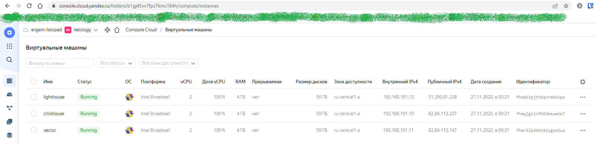
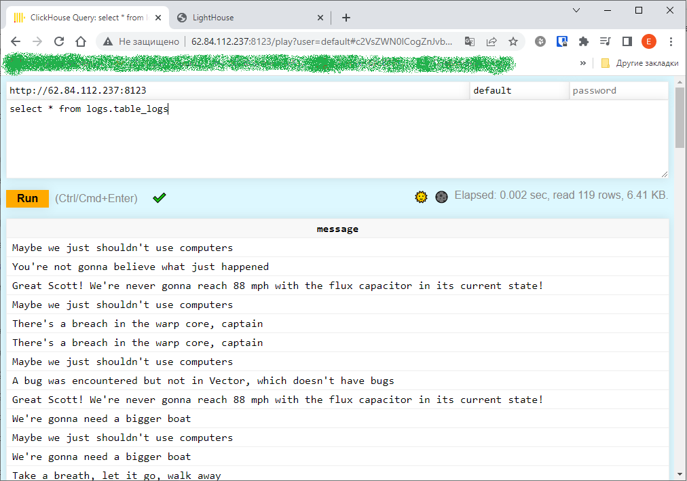
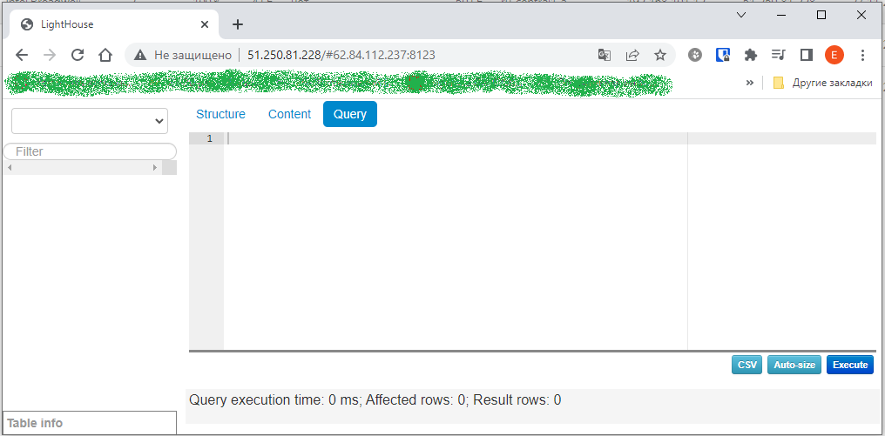

# Домашнее задание к занятию "8.3. Использование Yandex Cloud"

## Подготовка к выполнению

1. Подготовьте в Yandex Cloud три хоста: для `clickhouse`, для `vector` и для `lighthouse`.

Ссылка на репозиторий LightHouse: https://github.com/VKCOM/lighthouse

### Выполнена подготовка:
```
 00:21:23 @ ~/my-ansible/8.3 []
└─ #  terraform apply --auto-approve

Terraform used the selected providers to generate the following execution plan. Resource actions are indicated with the following symbols:
  + create

Terraform will perform the following actions:

  # yandex_compute_instance.node["clickhouse"] will be created
---------------------------ВЫВОД ОПУЩЕН--------------------------------

  # yandex_compute_instance.node["lighthouse"] will be created
---------------------------ВЫВОД ОПУЩЕН--------------------------------

  # yandex_compute_instance.node["vector"] will be created
---------------------------ВЫВОД ОПУЩЕН--------------------------------

  # yandex_vpc_network.default will be created
---------------------------ВЫВОД ОПУЩЕН--------------------------------

  # yandex_vpc_subnet.default will be created
---------------------------ВЫВОД ОПУЩЕН--------------------------------

Plan: 5 to add, 0 to change, 0 to destroy.
yandex_vpc_network.default: Creating...
yandex_vpc_network.default: Creation complete after 1s [id=enpvl127vnj1fhqhcbij]
yandex_vpc_subnet.default: Creating...
yandex_vpc_subnet.default: Creation complete after 1s [id=e9br6g96u755hkt7r3nf]
yandex_compute_instance.node["vector"]: Creating...
yandex_compute_instance.node["clickhouse"]: Creating...
yandex_compute_instance.node["lighthouse"]: Creating...
yandex_compute_instance.node["vector"]: Still creating... [10s elapsed]
yandex_compute_instance.node["clickhouse"]: Still creating... [10s elapsed]
yandex_compute_instance.node["lighthouse"]: Still creating... [10s elapsed]
yandex_compute_instance.node["clickhouse"]: Still creating... [20s elapsed]
yandex_compute_instance.node["vector"]: Still creating... [20s elapsed]
yandex_compute_instance.node["lighthouse"]: Still creating... [20s elapsed]
yandex_compute_instance.node["lighthouse"]: Creation complete after 27s [id=fhmab3pjtt8qnrm4kope]
yandex_compute_instance.node["vector"]: Still creating... [30s elapsed]
yandex_compute_instance.node["clickhouse"]: Still creating... [30s elapsed]
yandex_compute_instance.node["clickhouse"]: Creation complete after 31s [id=fhmqjg1lnfb93meumtm7]
yandex_compute_instance.node["vector"]: Creation complete after 33s [id=fhmv5lbd4hh42ogse5ua]

Apply complete! Resources: 5 added, 0 changed, 0 destroyed.
 00:22:15 @ ~/my-ansible/8.3 []
└─ #  yc compute instance list
+----------------------+------------+---------------+---------+---------------+----------------+
|          ID          |    NAME    |    ZONE ID    | STATUS  |  EXTERNAL IP  |  INTERNAL IP   |
+----------------------+------------+---------------+---------+---------------+----------------+
| fhmab3pjtt8qnrm4kope | lighthouse | ru-central1-a | RUNNING | 51.250.81.228 | 192.168.101.12 |
| fhmqjg1lnfb93meumtm7 | clickhouse | ru-central1-a | RUNNING | 62.84.112.237 | 192.168.101.10 |
| fhmv5lbd4hh42ogse5ua | vector     | ru-central1-a | RUNNING | 62.84.112.147 | 192.168.101.11 |
+----------------------+------------+---------------+---------+---------------+----------------+
```
Требуемые виртуальные машины в yandex-облаке:



## Основная часть

1. Допишите playbook: нужно сделать ещё один play, который устанавливает и настраивает lighthouse.
2. При создании tasks рекомендую использовать модули: `get_url`, `template`, `yum`, `apt`.
3. Tasks должны: скачать статику lighthouse, установить nginx или любой другой webserver, настроить его конфиг для открытия lighthouse, запустить webserver.
4. Приготовьте свой собственный inventory файл `prod.yml`.

```
Cоздан play для lighthouse. Содержимое нового файла site.yml в локальном репозитории:
```
[site.yml](https://github.com/evgeni-listopad/devops-netology/blob/main/TASK_8.3/playbook/site.yml)

5. Запустили `ansible-lint site.yml`.
```
Ошибки исправлены, остались только Warnings:
 01:19:02 @ ~/my-ansible/8.3/playbook []
└─ #  ansible-lint site.yml
WARNING  Overriding detected file kind 'yaml' with 'playbook' for given positional argument: site.yml
WARNING  Listing 4 violation(s) that are fatal
risky-file-permissions: File permissions unset or incorrect. (warning)
site.yml:6 Task/Handler: Get clickhouse packages with vars

risky-file-permissions: File permissions unset or incorrect. (warning)
site.yml:11 Task/Handler: Get clickhouse packages without vars

risky-file-permissions: File permissions unset or incorrect. (warning)
site.yml:51 Task/Handler: Get RPM packages

risky-file-permissions: File permissions unset or incorrect. (warning)
site.yml:91 Task/Handler: Get Lightkhouse Archive

You can skip specific rules or tags by adding them to your configuration file:
# .config/ansible-lint.yml
warn_list:  # or 'skip_list' to silence them completely
  - experimental  # all rules tagged as experimental

                            Rule Violation Summary
 count tag                    profile rule associated tags
     4 risky-file-permissions safety  unpredictability, experimental (warning)

Passed with moderate profile, 2/5 star rating: 0 failure(s), 4 warning(s) on 1 files.
A new release of ansible-lint is available: 6.8.6 → 6.9.0 Upgrade by running: pip3 install --user --upgrade ansible-lint
 01:19:09 @ ~/my-ansible/8.3/playbook []
```
6. Попробовали запустить playbook с флагом `--check`.
```
Запуск playbook'a с флагом `--check` вызывает ошибку в месте инсталляции пакетов, поскольку они должны быть скачаны  на предыдущем шаге, а раз мы использовали флаг `--check`, то это скачивание не выполнено, и соответственно пакетов нет. Поэтому и возникает ошибка. Это нормальная ситуация.
```
7. Запустили playbook на `prod.yml` окружении.
```
 00:28:00 @ ~/my-ansible/8.3/playbook []
└─ #  ansible-playbook -i inventory/prod.yml site.yml

PLAY [Install Clickhouse] ****************************************************************************

TASK [Gathering Facts] *******************************************************************************
ok: [clickhouse-01]

TASK [Get clickhouse packages with vars] *************************************************************
changed: [clickhouse-01] => (item=clickhouse-client)
changed: [clickhouse-01] => (item=clickhouse-server)

TASK [Get clickhouse packages without vars] **********************************************************
changed: [clickhouse-01]

TASK [Install clickhouse packages] *******************************************************************
changed: [clickhouse-01]

TASK [Enable connections to clickhouse server] *******************************************************
changed: [clickhouse-01]

TASK [Start clickhouse service] **********************************************************************
changed: [clickhouse-01]

TASK [Create database] *******************************************************************************
changed: [clickhouse-01]

TASK [Create table] **********************************************************************************
changed: [clickhouse-01]

PLAY [Install Vector] ********************************************************************************

TASK [Gathering Facts] *******************************************************************************
ok: [vector-01]

TASK [Get RPM packages] ******************************************************************************
changed: [vector-01] => (item=vector)

TASK [Install RPM packages] **************************************************************************
changed: [vector-01] => (item=vector)

TASK [Copy server configuration file] ****************************************************************
changed: [vector-01]

TASK [Start vector service] **************************************************************************
changed: [vector-01]

PLAY [Install Lighthouse] ****************************************************************************

TASK [Gathering Facts] *******************************************************************************
ok: [lighthouse-01]

TASK [Install required packages] *********************************************************************
changed: [lighthouse-01] => (item=epel-release)
changed: [lighthouse-01] => (item=unzip)
changed: [lighthouse-01] => (item=nginx)

TASK [Get Lightkhouse Archive] ***********************************************************************
changed: [lighthouse-01]

TASK [Unpack Lighthouse Archive] *********************************************************************
changed: [lighthouse-01]

TASK [Copy nginx configuration file] *****************************************************************
changed: [lighthouse-01]

RUNNING HANDLER [Start nginx service] ****************************************************************
changed: [lighthouse-01]

PLAY RECAP *******************************************************************************************
clickhouse-01              : ok=8    changed=7    unreachable=0    failed=0    skipped=0    rescued=0    ignored=0
lighthouse-01              : ok=6    changed=5    unreachable=0    failed=0    skipped=0    rescued=0    ignored=0
vector-01                  : ok=5    changed=4    unreachable=0    failed=0    skipped=0    rescued=0    ignored=0
```

8. Повторно запустили playbook с флагом `--diff` и убедитесь, что playbook идемпотентен.
```
00:33:59 @ ~/my-ansible/8.3/playbook []
└─ #  ansible-playbook -i inventory/prod.yml site.yml --diff

PLAY [Install Clickhouse] ****************************************************************************

TASK [Gathering Facts] *******************************************************************************
ok: [clickhouse-01]

TASK [Get clickhouse packages with vars] *************************************************************
ok: [clickhouse-01] => (item=clickhouse-client)
ok: [clickhouse-01] => (item=clickhouse-server)

TASK [Get clickhouse packages without vars] **********************************************************
ok: [clickhouse-01]

TASK [Install clickhouse packages] *******************************************************************
ok: [clickhouse-01]

TASK [Enable connections to clickhouse server] *******************************************************
ok: [clickhouse-01]

TASK [Start clickhouse service] **********************************************************************
changed: [clickhouse-01]

TASK [Create database] *******************************************************************************
ok: [clickhouse-01]

TASK [Create table] **********************************************************************************
ok: [clickhouse-01]

PLAY [Install Vector] ********************************************************************************

TASK [Gathering Facts] *******************************************************************************
ok: [vector-01]

TASK [Get RPM packages] ******************************************************************************
ok: [vector-01] => (item=vector)

TASK [Install RPM packages] **************************************************************************
ok: [vector-01] => (item=vector)

TASK [Copy server configuration file] ****************************************************************
ok: [vector-01]

TASK [Start vector service] **************************************************************************
changed: [vector-01]

PLAY [Install Lighthouse] ****************************************************************************

TASK [Gathering Facts] *******************************************************************************
ok: [lighthouse-01]

TASK [Install required packages] *********************************************************************
ok: [lighthouse-01] => (item=epel-release)
ok: [lighthouse-01] => (item=unzip)
ok: [lighthouse-01] => (item=nginx)

TASK [Get Lightkhouse Archive] ***********************************************************************
ok: [lighthouse-01]

TASK [Unpack Lighthouse Archive] *********************************************************************
ok: [lighthouse-01]

TASK [Copy nginx configuration file] *****************************************************************
ok: [lighthouse-01]

PLAY RECAP *******************************************************************************************
clickhouse-01              : ok=8    changed=1    unreachable=0    failed=0    skipped=0    rescued=0    ignored=0
lighthouse-01              : ok=5    changed=0    unreachable=0    failed=0    skipped=0    rescued=0    ignored=0
vector-01                  : ok=5    changed=1    unreachable=0    failed=0    skipped=0    rescued=0    ignored=0

```
-
```
Playbook оказался идемпотентен, так как статус changed возник только на task'ах, где выполняется рестарт сервисов clickhouse-server и vector.
```
9. Файл `README.md` подготовлен и размещен в репозитории с playbook'ом.

10. Готовый playbook выложен в локальный репозиторий с тегом `08-ansible-03-yandex`.
[Ссылка на репозиторий](https://github.com/evgeni-listopad/devops-netology/tree/main/TASK_8.3)

Результат развертывания `clickhouse`:


Результат развертывания `lighthouse`:



