# Дипломный практикум в Yandex.Cloud
  * [Цели:](#цели)
  * [Этапы выполнения:](#этапы-выполнения)
     * [Создание облачной инфраструктуры](#создание-облачной-инфраструктуры)
     * [Создание Kubernetes кластера](#создание-kubernetes-кластера)
     * [Создание тестового приложения](#создание-тестового-приложения)
     * [Подготовка cистемы мониторинга и деплой приложения](#подготовка-cистемы-мониторинга-и-деплой-приложения)
     * [Установка и настройка CI/CD](#установка-и-настройка-cicd)
  * [Что необходимо для сдачи задания?](#что-необходимо-для-сдачи-задания)
  * [Как правильно задавать вопросы дипломному руководителю?](#как-правильно-задавать-вопросы-дипломному-руководителю)

**Перед началом работы над дипломным заданием изучите [Инструкция по экономии облачных ресурсов](https://github.com/netology-code/devops-materials/blob/master/cloudwork.MD).**

---
## Цели:

1. Подготовить облачную инфраструктуру на базе облачного провайдера Яндекс.Облако.
2. Запустить и сконфигурировать Kubernetes кластер.
3. Установить и настроить систему мониторинга.
4. Настроить и автоматизировать сборку тестового приложения с использованием Docker-контейнеров.
5. Настроить CI для автоматической сборки и тестирования.
6. Настроить CD для автоматического развёртывания приложения.

---
## Этапы выполнения:


### Создание облачной инфраструктуры

Для начала необходимо подготовить облачную инфраструктуру в ЯО при помощи [Terraform](https://www.terraform.io/).

Ожидаемые результаты:

1. Terraform сконфигурирован и создание инфраструктуры посредством Terraform возможно без дополнительных ручных действий.
2. Полученная конфигурация инфраструктуры является предварительной, поэтому в ходе дальнейшего выполнения задания возможны изменения.

---
### Создание Kubernetes кластера

На этом этапе необходимо создать [Kubernetes](https://kubernetes.io/ru/docs/concepts/overview/what-is-kubernetes/) кластер на базе предварительно созданной инфраструктуры.   Требуется обеспечить доступ к ресурсам из Интернета.
  
Ожидаемый результат:

1. Работоспособный Kubernetes кластер.
2. В файле `~/.kube/config` находятся данные для доступа к кластеру.
3. Команда `kubectl get pods --all-namespaces` отрабатывает без ошибок.

---
### Создание тестового приложения

Для перехода к следующему этапу необходимо подготовить тестовое приложение, эмулирующее основное приложение разрабатываемое вашей компанией.

Ожидаемый результат:

1. Git репозиторий с тестовым приложением и Dockerfile.
2. Регистри с собранным docker image. В качестве регистри может быть DockerHub или [Yandex Container Registry](https://cloud.yandex.ru/services/container-registry), созданный также с помощью terraform.

---
### Подготовка cистемы мониторинга и деплой приложения

Уже должны быть готовы конфигурации для автоматического создания облачной инфраструктуры и поднятия Kubernetes кластера.  
Теперь необходимо подготовить конфигурационные файлы для настройки нашего Kubernetes кластера.

Цель:
1. Задеплоить в кластер [prometheus](https://prometheus.io/), [grafana](https://grafana.com/), [alertmanager](https://github.com/prometheus/alertmanager), [экспортер](https://github.com/prometheus/node_exporter) основных метрик Kubernetes.
2. Задеплоить тестовое приложение, например, [nginx](https://www.nginx.com/) сервер отдающий статическую страницу.

Ожидаемый результат:
1. Git репозиторий с конфигурационными файлами для настройки Kubernetes.
2. Http доступ к web интерфейсу grafana.
3. Дашборды в grafana отображающие состояние Kubernetes кластера.
4. Http доступ к тестовому приложению.

---
### Установка и настройка CI/CD

Осталось настроить ci/cd систему для автоматической сборки docker image и деплоя приложения при изменении кода.

Цель:

1. Автоматическая сборка docker образа при коммите в репозиторий с тестовым приложением.
2. Автоматический деплой нового docker образа.

Ожидаемый результат:

1. Интерфейс ci/cd сервиса доступен по http.
2. При любом коммите в репозиторие с тестовым приложением происходит сборка и отправка в регистр Docker образа.
3. При создании тега (например, v1.0.0) происходит сборка и отправка с соответствующим label в регистри, а также деплой соответствующего Docker образа в кластер Kubernetes.

---
## Что необходимо для сдачи задания?

1. Репозиторий с конфигурационными файлами Terraform и готовность продемонстрировать создание всех ресурсов с нуля.
2. Пример pull request с комментариями созданными atlantis'ом или снимки экрана из Terraform Cloud или вашего CI-CD-terraform pipeline.
3. Репозиторий с конфигурацией ansible, если был выбран способ создания Kubernetes кластера при помощи ansible.
4. Репозиторий с Dockerfile тестового приложения и ссылка на собранный docker image.
5. Репозиторий с конфигурацией Kubernetes кластера.
6. Ссылка на тестовое приложение и веб интерфейс Grafana с данными доступа.
7. Все репозитории рекомендуется хранить на одном ресурсе (github, gitlab)


# Решение

## Оглавление

- [Создание облачной инфраструктуры](#1)
    - [Подготовка инструментов для работы](#1-1)
    - [Создание сервисного аккаунта для работы с облачной инфрасруктурой](#1-2)
    - [Подготовка backend'a в виде S3-bucket'a](#1-3)
    - [Создание VPC с подсетями в разных зонах доступности](#1-4)
    - [Общая проверка работы Terraform](#1-5)
- [Создание Kubernetes кластера](#2)
    - [Подготовка виртуальных машины Compute Cloud для создания Kubernetes-кластера](#2-1)
    - [Подготовка ansible-конфигурации Kubespray](#2-2)
    - [Развертывание Kubernetes кластера с помощью Kubespray](#2-3)
    - [Результаты создания Kubernetes кластера](#2-4)
- [Создание тестового приложения](#3)
    - [Подготовка инструментов для работы](#3-1)
    - [Создание Docker-образа приложения](#3-2)
    - [Отправка Docker-образа в Docker Hub](#3-3)
    - [Подготовка Kubernetes deployment для созданного приложения](#3-4)
    - [Подготовка Helm чарт для созданного приложения](#3-5)
- [Подготовка системы мониторинга и деплой приложения](#4)
    - [Развертывание kube-prometheus на Kubernetes кластере](#4-1)
    - [Развертывание созданного приложения на Kubernetes кластере](#4-2)
- [Установка и настройка CI/CD](#5)
    - [Подготовка GitHub для создания Docker-образа в Docker Hub](#5-1)
    - [Отработка создания Docker-образа и загрузки его в Docker Hub](#5-2)
    - [Подготовка GitHub для развертывания приложения в Kubernetes кластере](#5-3)
    - [Отработка развертывания приложения в Kubernetes кластере при коммите с тегом](#5-4)
- [Созданные ресурсы](#6)
    - [Ресурсы на GitHub](#6-1)
    - [Ресурсы на Docker Hub](#6-2)
    - [Ресурсы на Yandex cloud](#6-3)

---

<a id="1"></a>
## Создание облачной инфраструктуры

<a id="1-1"></a>
### Подготовка инструментов для работы

1. Поверим настройки утилиты `yc` для работы с Yandex Cloud:
```
[root@workstation diploma]# yc config list
token: y0_*********XKA
cloud-id: b1gkjk5reuc4u9svu54m
folder-id: b1gj45vv7fpc7kmc184h
compute-default-zone: ru-central1-a
```

2. Получим IAM-токен для работы с Yandex Cloud:
```
yc iam create-token
t1.9*********-*********tr1Dg
```

3. Сохраним IAM-токен и остальные параметры в соответствующие переменные окружения `yc`:
```
export YC_TOKEN=$(yc iam create-token)
export YC_CLOUD_ID=$(yc config get cloud-id)
export YC_FOLDER_ID=$(yc config get folder-id)
export YC_ZONE=$(yc config get compute-default-zone)
```

4. Выполним настройку зеркала провайдера Yandex Cloud для Terraform, добавив файл `~/.terraformrc`:
```
[root@workstation diploma]# cat ~/.terraformrc
provider_installation {
  network_mirror {
    url = "https://terraform-mirror.yandexcloud.net/"
    include = ["registry.terraform.io/*/*"]
  }
  direct {
    exclude = ["registry.terraform.io/*/*"]
  }
}
```

5. Создадим файл `main.tf` для Terraform с информацией об облачном провайдере:
```
[root@workstation diploma]# cat main.tf
terraform {
  required_providers {
    yandex = {
      source = "yandex-cloud/yandex"
    }
  }
  required_version = ">= 0.13"
}

provider "yandex" {
  zone = "ru-central1-a"
}
``` 

6. Выполним инициализацию Terraform для работы с Yandex Cloud:
```
[root@workstation diploma]# terraform init

Initializing the backend...

Initializing provider plugins...
- Reusing previous version of yandex-cloud/yandex from the dependency lock file
- Using previously-installed yandex-cloud/yandex v0.103.0

Terraform has been successfully initialized!

You may now begin working with Terraform. Try running "terraform plan" to see
any changes that are required for your infrastructure. All Terraform commands
should now work.

If you ever set or change modules or backend configuration for Terraform,
rerun this command to reinitialize your working directory. If you forget, other
commands will detect it and remind you to do so if necessary.
```
7. Terraform успешно инициализирован. Подтвердим результат инициализации скриншотом:
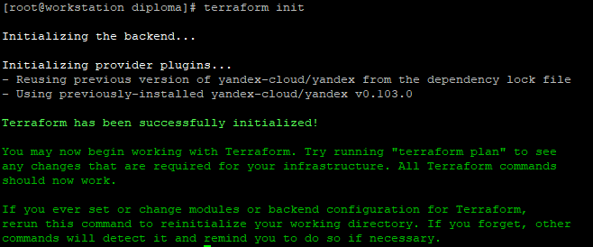
8. Дополним файл `main.tf` для Terraform необходимой информацией для создания VPC и публичной подсети в Yandex Cloud:
* Добавим блок переменных, определяющих основные параметры Yandex Cloud:
```
# Variables
variable "yc_token" {
  default = "t1.9**************************************jCWSAw"
}
variable "yc_cloud_id" {
  default = "b1gkjk5reuc4u9svu54m"
}
variable "yc_folder_id" {
  default = "b1gj45vv7fpc7kmc184h"
}
variable "yc_zone" {
  default = "ru-central1-a"
} 
```
* Уточним информацию об облачном провайдере, используя описанные переменные:
```
provider "yandex" {
  token     = var.yc_token
  cloud_id  = var.yc_cloud_id
  folder_id = var.yc_folder_id
  zone = var.yc_zone
}
```

<a id="1-2"></a>
### Создание сервисного аккаунта для работы с облачной инфрасруктурой

* Дополним файл `main.tf` для Terraform необходимой информацией для создания сервисного аккаунта:
```
# SA
resource "yandex_iam_service_account" "sa-diploma" {
  folder_id = var.yc_folder_id
  name        = "sa-diploma"
}
resource "yandex_resourcemanager_folder_iam_member" "editor" {
  folder_id = var.yc_folder_id
  role      = "editor"
  member    = "serviceAccount:${yandex_iam_service_account.sa-diploma.id}"
}
```

<a id="1-3"></a>
### Подготовка backend'a в виде S3-bucket'a
1. Дополним файл `main.tf` для Terraform необходимой информацией для создания S3-bucket'a с именем `listopad-diploma` и предоставления доступа к нему:
```
# Bucket-key
resource "yandex_iam_service_account_static_access_key" "accesskey-bucket" {
  service_account_id = yandex_iam_service_account.sa-diploma.id
}

# Bucket-create
resource "yandex_storage_bucket" "listopad-diploma" {
  access_key = yandex_iam_service_account_static_access_key.accesskey-bucket.access_key
  secret_key = yandex_iam_service_account_static_access_key.accesskey-bucket.secret_key
  bucket     = "listopad-diploma"
  default_storage_class = "STANDARD"
  acl           = "public-read"
  force_destroy = "true"
  anonymous_access_flags {
    read = true
    list = true
    config_read = true
  }
}
```

2. Применим вышеописанные настройки для создания сервисного аккаунта и S3-bucket'a.
* Для этого выполним проверку синтаксиса `main.tf`:
```
[root@workstation diploma]# terraform validate
Success! The configuration is valid.
```
* Далее составим план применения конфигурации:
```
[root@workstation diploma]# terraform plan

Terraform used the selected providers to generate the following execution plan. Resource actions are indicated with the following symbols:
  + create

Terraform will perform the following actions:

  # yandex_iam_service_account.sa-diploma will be created
-------------------------ВЫВОД ПРОПУЩЕН-----------------------------------

  # yandex_iam_service_account_static_access_key.accesskey-bucket will be created
-------------------------ВЫВОД ПРОПУЩЕН-----------------------------------

  # yandex_resourcemanager_folder_iam_member.editor will be created
-------------------------ВЫВОД ПРОПУЩЕН-----------------------------------

  # yandex_storage_bucket.listopad-diploma will be created
-------------------------ВЫВОД ПРОПУЩЕН-----------------------------------

Plan: 4 to add, 0 to change, 0 to destroy.

────────────────────────────────────────────────────────────────────────────────────────────────────────────────────────────────────────────────────────────────────────────────────────────────────────────────────────────────────────────

Note: You didn't use the -out option to save this plan, so Terraform can't guarantee to take exactly these actions if you run "terraform apply" now.

```

* Применим конфигурацию, описанную в `main.tf`:
```
[root@workstation diploma]# terraform apply --auto-approve

Terraform used the selected providers to generate the following execution plan. Resource actions are indicated with the following symbols:
  + create

Terraform will perform the following actions:

  # yandex_iam_service_account.sa-diploma will be created
-------------------------ВЫВОД ПРОПУЩЕН-----------------------------------

  # yandex_iam_service_account_static_access_key.accesskey-bucket will be created
-------------------------ВЫВОД ПРОПУЩЕН-----------------------------------

  # yandex_resourcemanager_folder_iam_member.editor will be created
-------------------------ВЫВОД ПРОПУЩЕН-----------------------------------

  # yandex_storage_bucket.listopad-diploma will be created
-------------------------ВЫВОД ПРОПУЩЕН-----------------------------------

Plan: 4 to add, 0 to change, 0 to destroy.
yandex_iam_service_account.sa-diploma: Creating...
yandex_iam_service_account.sa-diploma: Creation complete after 3s [id=aje7d9n1pqd421k7hak9]
yandex_iam_service_account_static_access_key.accesskey-bucket: Creating...
yandex_resourcemanager_folder_iam_member.editor: Creating...
yandex_iam_service_account_static_access_key.accesskey-bucket: Creation complete after 2s [id=ajes87lmhailsmics8nd]
yandex_storage_bucket.listopad-diploma: Creating...
yandex_resourcemanager_folder_iam_member.editor: Creation complete after 3s [id=b1gj45vv7fpc7kmc184h/editor/serviceAccount:aje7d9n1pqd421k7hak9]
yandex_storage_bucket.listopad-diploma: Still creating... [10s elapsed]
yandex_storage_bucket.listopad-diploma: Still creating... [20s elapsed]
yandex_storage_bucket.listopad-diploma: Still creating... [30s elapsed]
yandex_storage_bucket.listopad-diploma: Still creating... [40s elapsed]
yandex_storage_bucket.listopad-diploma: Still creating... [50s elapsed]
yandex_storage_bucket.listopad-diploma: Still creating... [1m0s elapsed]
yandex_storage_bucket.listopad-diploma: Creation complete after 1m9s [id=listopad-diploma]

Apply complete! Resources: 4 added, 0 changed, 0 destroyed.

```

3. S3-bucket был успешно создан. Теперь выполним настройку terraform для использования созданного S3-bucket'а в качестве backend'a.
* Для этого создадим файл с именем `backend.tf` со следующим содержимым:
```
[root@workstation diploma]# cat backend.tf
terraform {
  backend "s3" {
    endpoint       = "storage.yandexcloud.net"
    bucket         = "listopad-diploma"
    key            = "terraform.tfstate"
    region         = "ru-central1-a"
    skip_region_validation      = true
    skip_credentials_validation = true
  }
}

```
* Для корректного применения файла необходимо задать параметры доступа для s3-хранилища. Сделаем это с помощью переменных среды:
```
[root@workstation diploma]# export AWS_ACCESS_KEY_ID=YCAJEx5yBx****
[root@workstation diploma]# export AWS_SECRET_ACCESS_KEY=YCOvNA3AGLRhKerPx****
```

* Выполним команду `terraform init` для применения файла `backend.tf`:

```
[root@workstation diploma]# terraform init

Initializing the backend...
Do you want to copy existing state to the new backend?
  Pre-existing state was found while migrating the previous "local" backend to the
  newly configured "s3" backend. No existing state was found in the newly
  configured "s3" backend. Do you want to copy this state to the new "s3"
  backend? Enter "yes" to copy and "no" to start with an empty state.

  Enter a value: yes


Successfully configured the backend "s3"! Terraform will automatically
use this backend unless the backend configuration changes.

Initializing provider plugins...
- Reusing previous version of yandex-cloud/yandex from the dependency lock file
- Using previously-installed yandex-cloud/yandex v0.103.0

Terraform has been successfully initialized!

You may now begin working with Terraform. Try running "terraform plan" to see
any changes that are required for your infrastructure. All Terraform commands
should now work.

If you ever set or change modules or backend configuration for Terraform,
rerun this command to reinitialize your working directory. If you forget, other
commands will detect it and remind you to do so if necessary.
```
* Подтвердим успешность задействования S3-bucket'а скриншотом:
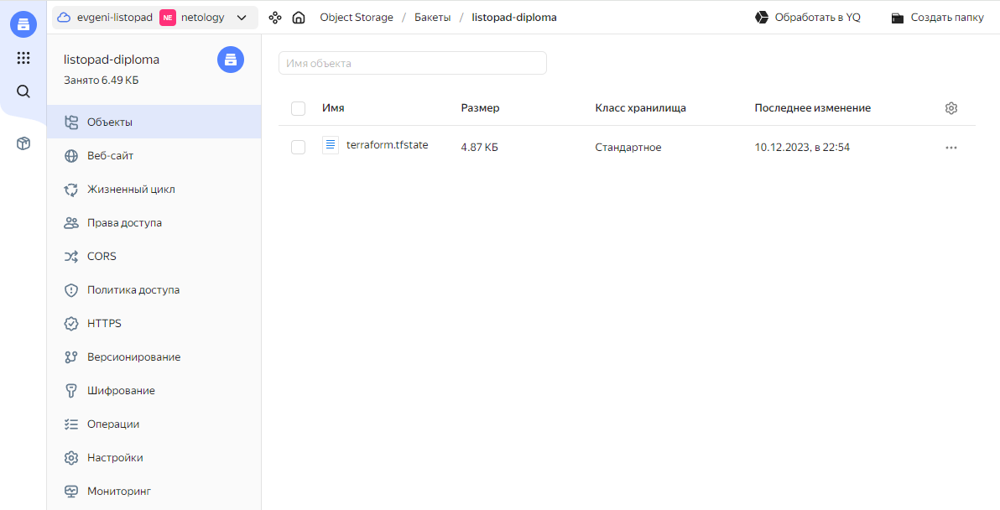


<a id="1-4"></a>
### Создание VPC с подсетями в разных зонах доступности

1. Опишем создание VPC:
```
# VPC
resource "yandex_vpc_network" "network-diploma" {
  name = "network-diploma"
  folder_id = var.yc_folder_id
}
```
2. Опишем создание подсетей в разных зонах доступности
```
# Subnets
resource "yandex_vpc_subnet" "subnet-a" {
  name           = "subnet-a"
  zone           = "ru-central1-a"
  network_id     = yandex_vpc_network.network-diploma.id
  v4_cidr_blocks = ["192.168.10.0/24"]
}

resource "yandex_vpc_subnet" "subnet-b" {
  name           = "subnet-b"
  zone           = "ru-central1-b"
  network_id     = yandex_vpc_network.network-diploma.id
  v4_cidr_blocks = ["192.168.20.0/24"]
}

resource "yandex_vpc_subnet" "subnet-c" {
  name           = "subnet-c"
  zone           = "ru-central1-c"
  network_id     = yandex_vpc_network.network-diploma.id
  v4_cidr_blocks = ["192.168.30.0/24"]
}
```

<a id="1-5"></a>
### Общая проверка работы Terraform

1. После добавления в файл `main.tf` блоков, описывающих создание VPC с подсетями в разных зонах доступности, проверим синтаксис этого файла и составим план его применения:
```
[root@workstation diploma]# terraform validate
Success! The configuration is valid.
[root@workstation diploma]# terraform plan
yandex_iam_service_account.sa-diploma: Refreshing state... [id=aje7d9n1pqd421k7hak9]
yandex_resourcemanager_folder_iam_member.editor: Refreshing state... [id=b1gj45vv7fpc7kmc184h/editor/serviceAccount:aje7d9n1pqd421k7hak9]
yandex_iam_service_account_static_access_key.accesskey-bucket: Refreshing state... [id=ajes87lmhailsmics8nd]
yandex_storage_bucket.listopad-diploma: Refreshing state... [id=listopad-diploma]

Terraform used the selected providers to generate the following execution plan. Resource actions are indicated with the following symbols:
  + create

Terraform will perform the following actions:

  # yandex_vpc_network.network-diploma will be created
-------------------------ВЫВОД ПРОПУЩЕН-----------------------------------

  # yandex_vpc_subnet.subnet-a will be created
-------------------------ВЫВОД ПРОПУЩЕН-----------------------------------

  # yandex_vpc_subnet.subnet-b will be created
-------------------------ВЫВОД ПРОПУЩЕН-----------------------------------

  # yandex_vpc_subnet.subnet-c will be created
-------------------------ВЫВОД ПРОПУЩЕН-----------------------------------

Plan: 4 to add, 0 to change, 0 to destroy.

────────────────────────────────────────────────────────────────────────────────────────────────────────────────────────────────────────────────────────────────────────────────────────────────────────────────────────────────────────────

Note: You didn't use the -out option to save this plan, so Terraform can't guarantee to take exactly these actions if you run "terraform apply" now.

```
2. Применим предложенные изменения:
```
[root@workstation diploma]# terraform apply
yandex_iam_service_account.sa-diploma: Refreshing state... [id=aje7d9n1pqd421k7hak9]
yandex_iam_service_account_static_access_key.accesskey-bucket: Refreshing state... [id=ajes87lmhailsmics8nd]
yandex_resourcemanager_folder_iam_member.editor: Refreshing state... [id=b1gj45vv7fpc7kmc184h/editor/serviceAccount:aje7d9n1pqd421k7hak9]
yandex_storage_bucket.listopad-diploma: Refreshing state... [id=listopad-diploma]

Terraform used the selected providers to generate the following execution plan. Resource actions are indicated with the following symbols:
  + create

Terraform will perform the following actions:

  # yandex_vpc_network.network-diploma will be created
-------------------------ВЫВОД ПРОПУЩЕН-----------------------------------

  # yandex_vpc_subnet.subnet-a will be created
-------------------------ВЫВОД ПРОПУЩЕН-----------------------------------

  # yandex_vpc_subnet.subnet-b will be created
-------------------------ВЫВОД ПРОПУЩЕН-----------------------------------

  # yandex_vpc_subnet.subnet-c will be created
-------------------------ВЫВОД ПРОПУЩЕН-----------------------------------

Plan: 4 to add, 0 to change, 0 to destroy.

Do you want to perform these actions?
  Terraform will perform the actions described above.
  Only 'yes' will be accepted to approve.

  Enter a value: yes

yandex_vpc_network.network-diploma: Creating...
yandex_vpc_network.network-diploma: Creation complete after 2s [id=enpbk19r96fp2gks314v]
yandex_vpc_subnet.subnet-c: Creating...
yandex_vpc_subnet.subnet-b: Creating...
yandex_vpc_subnet.subnet-a: Creating...
yandex_vpc_subnet.subnet-a: Creation complete after 1s [id=e9bfh7ehmoalqflrvubp]
yandex_vpc_subnet.subnet-c: Creation complete after 1s [id=b0ci2vgk66hkopma5g27]
yandex_vpc_subnet.subnet-b: Creation complete after 1s [id=e2l8khdg42ih0l1k7q9v]

Apply complete! Resources: 4 added, 0 changed, 0 destroyed.

```
3. Изменения были успешно применены. Подтвердим результат создания ресурсов скриншотом:
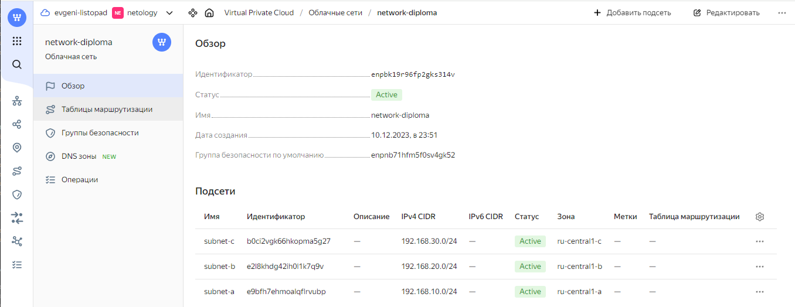


---

<a id="2"></a>
## Создание Kubernetes кластера

<a id="2-1"></a>
### Подготовка виртуальных машин Compute Cloud для создания Kubernetes-кластера
1. Дополним файл `main.tf` для Terraform необходимой информацией для создания виртуальных машин Compute Cloud. Целесообразно создать одну виртуальную машину master и три виртуальные машины worker в разных зонах доступности:
```
# Virtual machines
## Kubernetes master
resource "yandex_compute_instance" "vm-master" {
  name = "vm-master"
  hostname = "vm-master"
  zone      = "ru-central1-a"
  resources {
    cores  = 2
    memory = 4
  }
  boot_disk {
    initialize_params {
      image_id = "fd826honb8s0i1jtt6cg"
      size = "10"
    }
  }
  network_interface {
    subnet_id = yandex_vpc_subnet.subnet-a.id
    nat       = true
  }
  metadata = {
    ssh-keys = "ubuntu:${file("~/.ssh/id_rsa.pub")}"
  }
}

## Kubernetes worker-1
resource "yandex_compute_instance" "vm-worker-1" {
  name = "vm-worker-1"
  hostname = "vm-worker-1"
  zone      = "ru-central1-a"
  resources {
    cores  = 2
    memory = 2
  }
  boot_disk {
    initialize_params {
      image_id = "fd826honb8s0i1jtt6cg"
      size = "10"
    }
  }
  network_interface {
    subnet_id = yandex_vpc_subnet.subnet-a.id
    nat       = true
  }
  metadata = {
    ssh-keys = "ubuntu:${file("~/.ssh/id_rsa.pub")}"
  }
}

## Kubernetes worker-2
resource "yandex_compute_instance" "vm-worker-2" {
  name = "vm-worker-2"
  hostname = "vm-worker-2"
  zone      = "ru-central1-b"
  resources {
    cores  = 2
    memory = 2
  }
  boot_disk {
    initialize_params {
      image_id = "fd826honb8s0i1jtt6cg"
      size = "10"
    }
  }
  network_interface {
    subnet_id = yandex_vpc_subnet.subnet-b.id
    nat       = true
  }
  metadata = {
    ssh-keys = "ubuntu:${file("~/.ssh/id_rsa.pub")}"
  }
}

## Kubernetes worker-3
resource "yandex_compute_instance" "vm-worker-3" {
  name = "vm-worker-3"
  hostname = "vm-worker-3"
  zone      = "ru-central1-c"
  resources {
    cores  = 2
    memory = 2
  }
  boot_disk {
    initialize_params {
      image_id = "fd826honb8s0i1jtt6cg"
      size = "10"
    }
  }
  network_interface {
    subnet_id = yandex_vpc_subnet.subnet-c.id
    nat       = true
  }
  metadata = {
    ssh-keys = "ubuntu:${file("~/.ssh/id_rsa.pub")}"
  }
}

```

2. Создадим файл `output.tf` с информацией об отображении интересующих ресурсов. 
```
# Output
output "internal-ip-address-vm-master" {
  value = "${yandex_compute_instance.vm-master.network_interface.0.ip_address}"
}
output "fqdn-vm-master" {
  value = "${yandex_compute_instance.vm-master.fqdn}"
}
```

3. Применим описанные конфигурации для развертывания виртуальных машин Compute Cloud
```
[root@workstation diploma]# terraform plan
-------------------------ВЫВОД ПРОПУЩЕН-----------------------------------
Terraform used the selected providers to generate the following execution plan. Resource actions are indicated with the following symbols:
  + create

Terraform will perform the following actions:

  # yandex_compute_instance.vm-master will be created
-------------------------ВЫВОД ПРОПУЩЕН-----------------------------------
  # yandex_compute_instance.vm-worker-1 will be created
-------------------------ВЫВОД ПРОПУЩЕН-----------------------------------
  # yandex_compute_instance.vm-worker-2 will be created
-------------------------ВЫВОД ПРОПУЩЕН-----------------------------------
  # yandex_compute_instance.vm-worker-3 will be created
-------------------------ВЫВОД ПРОПУЩЕН-----------------------------------
Plan: 4 to add, 0 to change, 0 to destroy.

Changes to Outputs:
  + fqdn-vm-master                = (known after apply)
  + internal-ip-address-vm-master = (known after apply)
────────────────────────────────────────────────────────────────────────────────────────────────────────────────────────────────────────────────────────────────────────────────────────────────────────────────────────────────────────────

Note: You didn't use the -out option to save this plan, so Terraform can't guarantee to take exactly these actions if you run "terraform apply" now.
[root@workstation diploma]#
[root@workstation diploma]# terraform apply --auto-approve
-------------------------ВЫВОД ПРОПУЩЕН-----------------------------------

Apply complete! Resources: 4 added, 0 changed, 0 destroyed.

Outputs:

fqdn-vm-master = "vm-master.ru-central1.internal"
internal-ip-address-vm-master = "192.168.10.24"
```

4. Виртуальные машины созданы корректно. Подтвердим результат их создания скриншотом:
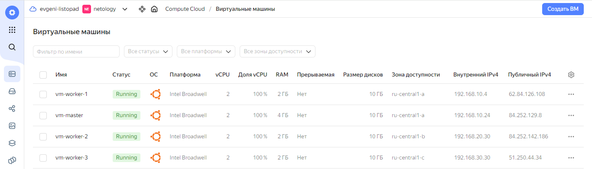


<a id="2-2"></a>
### Подготовка ansible-конфигурации Kubespray
*Для подготовки ansible-конфигурации необходимо сформировать:
1) предварительный ansible-playbook, выполняющий подготовку узлов для установки Kubernetes методом Kubespray;
2) inventory-файл для предварительного ansible-playbook'a;
3) комплексный inventory-файл для отработки инструмента Kubespray;

1. Предварительный ansible-playbook, выполняющий подготовку узлов для установки Kubernetes методом Kubespray, будет выглядеть следующим образом:
```
[root@workstation ansible]# cat prep.yaml
---
- name: prep
  hosts: kube-cloud
  become: true
  tasks:
    - name: packages-update
      apt:
        update_cache: yes

    - name: Install packages
      apt:
        name:
          - git
          - python3-pip
        state: present

    - name: clone Kubespray repo
      git:
        repo: https://github.com/kubernetes-sigs/kubespray.git
        dest: ~/kubespray

    - name: Install requirements
      pip:
        requirements: ~/kubespray/requirements.txt

```

2. Inventory-файл для предварительного ansible-playbook'a будем формировать автоматически с помощью terraform. Для этого дополним имеющийся файл `main.tf` следующим блоком:
```
## Ansible inventory for preparation
resource "local_file" "inventory-preparation" {
  content = <<EOF1
[kube-cloud]
${yandex_compute_instance.vm-master.network_interface.0.nat_ip_address}
${yandex_compute_instance.vm-worker-1.network_interface.0.nat_ip_address}
${yandex_compute_instance.vm-worker-2.network_interface.0.nat_ip_address}
${yandex_compute_instance.vm-worker-3.network_interface.0.nat_ip_address}
  EOF1
  filename = "./ansible/inventory-preparation"
  depends_on = [yandex_compute_instance.vm-master, yandex_compute_instance.vm-worker-1, yandex_compute_instance.vm-worker-2, yandex_compute_instance.vm-worker-3]
}
```

3. Комплексный inventory-файл для отработки инструмента Kubespray также будем формировать автоматически с помощью terraform. Для этого дополним имеющийся файл `main.tf` следующим блоком:
```
## Ansible inventory for Kuberspray
resource "local_file" "inventory-kubespray" {
  content = <<EOF2
all:
  hosts:
    ${yandex_compute_instance.vm-master.fqdn}:
      ansible_host: ${yandex_compute_instance.vm-master.network_interface.0.ip_address}
      ip: ${yandex_compute_instance.vm-master.network_interface.0.ip_address}
      access_ip: ${yandex_compute_instance.vm-master.network_interface.0.ip_address}
    ${yandex_compute_instance.vm-worker-1.fqdn}:
      ansible_host: ${yandex_compute_instance.vm-worker-1.network_interface.0.ip_address}
      ip: ${yandex_compute_instance.vm-worker-1.network_interface.0.ip_address}
      access_ip: ${yandex_compute_instance.vm-worker-1.network_interface.0.ip_address}
    ${yandex_compute_instance.vm-worker-2.fqdn}:
      ansible_host: ${yandex_compute_instance.vm-worker-2.network_interface.0.ip_address}
      ip: ${yandex_compute_instance.vm-worker-2.network_interface.0.ip_address}
      access_ip: ${yandex_compute_instance.vm-worker-2.network_interface.0.ip_address}
    ${yandex_compute_instance.vm-worker-3.fqdn}:
      ansible_host: ${yandex_compute_instance.vm-worker-3.network_interface.0.ip_address}
      ip: ${yandex_compute_instance.vm-worker-3.network_interface.0.ip_address}
      access_ip: ${yandex_compute_instance.vm-worker-3.network_interface.0.ip_address}
  children:
    kube_control_plane:
      hosts:
        ${yandex_compute_instance.vm-master.fqdn}:
    kube_node:
      hosts:
        ${yandex_compute_instance.vm-worker-1.fqdn}:
        ${yandex_compute_instance.vm-worker-2.fqdn}:
        ${yandex_compute_instance.vm-worker-3.fqdn}:
    etcd:
      hosts:
        ${yandex_compute_instance.vm-master.fqdn}:
    k8s_cluster:
      children:
        kube_control_plane:
        kube_node:
    calico_rr:
      hosts: {}
  EOF2
  filename = "./ansible/inventory-kubespray"
  depends_on = [yandex_compute_instance.vm-master, yandex_compute_instance.vm-worker-1, yandex_compute_instance.vm-worker-2, yandex_compute_instance.vm-worker-3]
}
```
* Далее необходимо применить дополненный `main.tf`, убедиться в корректности его работы и проверить сформированные им inventory-файлы `inventory-preparation` и `inventory-kubespray`:
```
[root@workstation diploma]# terraform plan
-------------------------ВЫВОД ПРОПУЩЕН-----------------------------------

[root@workstation diploma]# terraform apply
-------------------------ВЫВОД ПРОПУЩЕН-----------------------------------
Apply complete! Resources: 2 added, 0 changed, 0 destroyed.

Outputs:

fqdn-vm-master = "vm-master.ru-central1.internal"
internal-ip-address-vm-master = "192.168.10.22"
[root@workstation diploma]# cat ansible/inventory-preparation
[kube-cloud]
62.84.118.89
51.250.77.242
84.201.140.138
51.250.34.211
[root@workstation diploma]# cat ansible/inventory-kubespray
all:
  hosts:
    vm-master.ru-central1.internal:
      ansible_host: 192.168.10.22
      ip: 192.168.10.22
      access_ip: 192.168.10.22
    vm-worker-1.ru-central1.internal:
      ansible_host: 192.168.10.23
      ip: 192.168.10.23
      access_ip: 192.168.10.23
    vm-worker-2.ru-central1.internal:
      ansible_host: 192.168.20.13
      ip: 192.168.20.13
      access_ip: 192.168.20.13
    vm-worker-3.ru-central1.internal:
      ansible_host: 192.168.30.11
      ip: 192.168.30.11
      access_ip: 192.168.30.11
  children:
    kube_control_plane:
      hosts:
        vm-master.ru-central1.internal:
    kube_node:
      hosts:
        vm-worker-1.ru-central1.internal:
        vm-worker-2.ru-central1.internal:
        vm-worker-3.ru-central1.internal:
    etcd:
      hosts:
        vm-master.ru-central1.internal:
    k8s_cluster:
      children:
        kube_control_plane:
        kube_node:
    calico_rr:
      hosts: {}
```
* Inventory-файлы были сформированы корректно. Переходим к развертыванию ресурсов с помощью ansible.

<a id="2-3"></a>
### Развертывание Kubernetes кластера с помощью Kubespray
1. Запустим вышеописанный ansible-playbook, выполняющий подготовку узлов для установки Kubernetes методом Kubespray:
```
[root@workstation ansible]# ansible-playbook -i inventory-preparation -b -v -u ubuntu prep.yaml
No config file found; using defaults

PLAY [prep] *********************************************************************************************************************************************************************************************************************************

TASK [Gathering Facts] **********************************************************************************************************************************************************************************************************************
ok: [62.84.118.89]
ok: [51.250.77.242]
ok: [51.250.34.211]
ok: [84.201.140.138]

TASK [packages-update] **********************************************************************************************************************************************************************************************************************
changed: [51.250.34.211] => {"cache_update_time": 1702586666, "cache_updated": true, "changed": true}
changed: [51.250.77.242] => {"cache_update_time": 1702586666, "cache_updated": true, "changed": true}
changed: [62.84.118.89] => {"cache_update_time": 1702586666, "cache_updated": true, "changed": true}
changed: [84.201.140.138] => {"cache_update_time": 1702586666, "cache_updated": true, "changed": true}

TASK [Install packages] 
*****************************************************************************************************************************************************************************************************************
-------------------------ВЫВОД ПРОПУЩЕН-----------------------------------
TASK [clone Kubespray repo] *****************************************************************************************************************************************************************************************************************
changed: [51.250.34.211] => {"after": "eb73f1d27d9ac5a68e216c4da315617dc9abf493", "before": null, "changed": true}
changed: [84.201.140.138] => {"after": "eb73f1d27d9ac5a68e216c4da315617dc9abf493", "before": null, "changed": true}
changed: [62.84.118.89] => {"after": "eb73f1d27d9ac5a68e216c4da315617dc9abf493", "before": null, "changed": true}
changed: [51.250.77.242] => {"after": "eb73f1d27d9ac5a68e216c4da315617dc9abf493", "before": null, "changed": true}

TASK [Install requirements] *****************************************************************************************************************************************************************************************************************
-------------------------ВЫВОД ПРОПУЩЕН-----------------------------------
PLAY RECAP **********************************************************************************************************************************************************************************************************************************
51.250.34.211              : ok=5    changed=4    unreachable=0    failed=0    skipped=0    rescued=0    ignored=0
51.250.77.242              : ok=5    changed=4    unreachable=0    failed=0    skipped=0    rescued=0    ignored=0
62.84.118.89               : ok=5    changed=4    unreachable=0    failed=0    skipped=0    rescued=0    ignored=0
84.201.140.138             : ok=5    changed=4    unreachable=0    failed=0    skipped=0    rescued=0    ignored=0
```
2. Ansible-playbook отработал корректно. Далее скопируем закрытый ключ и сформированный inventory-kubespray с локальной машины на мастер-ноду
```
[root@workstation diploma]# rsync --rsync-path="sudo rsync" /root/.ssh/id_rsa ubuntu@62.84.118.89:/root/.ssh/id_rsa
[root@workstation diploma]# rsync --rsync-path="sudo rsync" ./ansible/inventory-kubespray ubuntu@62.84.118.89:/root/kubespray/inventory/
```
3. С мастер-ноды запустим развертывание Kubernetes методом Kubespray:
```
root@vm-master:~/kubespray# ansible-playbook -i inventory/inventory-kubespray -u ubuntu -b -v --private-key=/root/.ssh/id_rsa cluster.yml
-------------------------ВЫВОД ПРОПУЩЕН-----------------------------------
Thursday 14 December 2023  21:30:38 +0000 (0:00:00.110)       0:22:52.048 *****
Thursday 14 December 2023  21:30:38 +0000 (0:00:00.071)       0:22:52.119 *****
Thursday 14 December 2023  21:30:38 +0000 (0:00:00.081)       0:22:52.200 *****

PLAY RECAP **********************************************************************************************************************************************************************************************************************************
localhost                  : ok=3    changed=0    unreachable=0    failed=0    skipped=0    rescued=0    ignored=0
vm-master.ru-central1.internal : ok=735  changed=129  unreachable=0    failed=0    skipped=1181 rescued=0    ignored=6
vm-worker-1.ru-central1.internal : ok=506  changed=77   unreachable=0    failed=0    skipped=736  rescued=0    ignored=1
vm-worker-2.ru-central1.internal : ok=506  changed=76   unreachable=0    failed=0    skipped=735  rescued=0    ignored=1
vm-worker-3.ru-central1.internal : ok=506  changed=76   unreachable=0    failed=0    skipped=735  rescued=0    ignored=1

Thursday 14 December 2023  21:30:39 +0000 (0:00:00.400)       0:22:52.600 *****
===============================================================================
download : Download_file | Download item --------------------------------------------------------------- 75.45s
network_plugin/calico : Wait for calico kubeconfig to be created --------------------------------------- 43.68s
download : Download_file | Download item --------------------------------------------------------------- 39.66s
kubernetes/control-plane : Kubeadm | Initialize first master ------------------------------------------- 33.53s
download : Download_container | Download image if required --------------------------------------------- 25.01s
kubernetes/node : Install | Copy kubelet binary from download dir -------------------------------------- 22.13s
network_plugin/calico : Calico | Copy calicoctl binary from download dir ------------------------------- 20.28s
container-engine/containerd : Download_file | Download item -------------------------------------------- 17.41s
container-engine/runc : Download_file | Download item -------------------------------------------------- 16.83s
container-engine/crictl : Download_file | Download item ------------------------------------------------ 16.61s
container-engine/nerdctl : Download_file | Download item ----------------------------------------------- 16.44s
download : Download_container | Download image if required --------------------------------------------- 15.67s
download : Download_container | Download image if required --------------------------------------------- 15.62s
download : Download_container | Download image if required --------------------------------------------- 14.86s
download : Download_container | Download image if required --------------------------------------------- 14.70s
kubernetes/kubeadm : Join to cluster ------------------------------------------------------------------- 14.42s
download : Extract_file | Unpacking archive ------------------------------------------------------------ 13.70s
container-engine/crictl : Extract_file | Unpacking archive --------------------------------------------- 13.58s
download : Download_container | Download image if required --------------------------------------------- 13.07s
download : Download_container | Download image if required --------------------------------------------- 12.57s

```
4. Выполним создание и настройку kubeconfig-файла для пользователя ubuntu:
```
ubuntu@vm-master:~$ mkdir -p $HOME/.kube
ubuntu@vm-master:~$ sudo cp -i /etc/kubernetes/admin.conf $HOME/.kube/config
ubuntu@vm-master:~$ sudo chown $(id -u):$(id -g) $HOME/.kube/config
```
*Установка Kubernetes завершена. В следующем разделе продемонстрируем её результаты.

<a id="2-4"></a>
### Результаты создания Kubernetes кластера
1. От имени пользователя ubuntu проверяем состояния нод в кластере Kubernetes:
```
ubuntu@vm-master:~$ kubectl get nodes
NAME                               STATUS   ROLES           AGE   VERSION
vm-master.ru-central1.internal     Ready    control-plane   14m   v1.28.4
vm-worker-1.ru-central1.internal   Ready    <none>          13m   v1.28.4
vm-worker-2.ru-central1.internal   Ready    <none>          13m   v1.28.4
vm-worker-3.ru-central1.internal   Ready    <none>          13m   v1.28.4
```
2. От имени пользователя ubuntu проверяем состояния подов в кластере Kubernetes:
```
ubuntu@vm-master:~$ kubectl get pods --all-namespaces
NAMESPACE     NAME                                                     READY   STATUS    RESTARTS   AGE
kube-system   calico-kube-controllers-648dffd99-ptqn2                  1/1     Running   0          12m
kube-system   calico-node-7mtj9                                        1/1     Running   0          14m
kube-system   calico-node-cx4qd                                        1/1     Running   0          14m
kube-system   calico-node-d8stk                                        1/1     Running   0          14m
kube-system   calico-node-k227q                                        1/1     Running   0          14m
kube-system   coredns-77f7cc69db-zd985                                 1/1     Running   0          12m
kube-system   coredns-77f7cc69db-zf7xx                                 1/1     Running   0          12m
kube-system   dns-autoscaler-8576bb9f5b-tgdm9                          1/1     Running   0          12m
kube-system   kube-apiserver-vm-master.ru-central1.internal            1/1     Running   1          16m
kube-system   kube-controller-manager-vm-master.ru-central1.internal   1/1     Running   2          16m
kube-system   kube-proxy-g6qn4                                         1/1     Running   0          15m
kube-system   kube-proxy-lfqlr                                         1/1     Running   0          15m
kube-system   kube-proxy-rc8vr                                         1/1     Running   0          15m
kube-system   kube-proxy-z7jqx                                         1/1     Running   0          15m
kube-system   kube-scheduler-vm-master.ru-central1.internal            1/1     Running   1          16m
kube-system   nginx-proxy-vm-worker-1.ru-central1.internal             1/1     Running   0          15m
kube-system   nginx-proxy-vm-worker-2.ru-central1.internal             1/1     Running   0          15m
kube-system   nginx-proxy-vm-worker-3.ru-central1.internal             1/1     Running   0          15m
kube-system   nodelocaldns-bjz7j                                       1/1     Running   0          12m
kube-system   nodelocaldns-ffbjv                                       1/1     Running   0          12m
kube-system   nodelocaldns-m2j9b                                       1/1     Running   0          12m
kube-system   nodelocaldns-rmtzq                                       1/1     Running   0          12m
```
3. Кластер Kubernetes работает корректно. Подтвердим результат развертывания скриншотом:
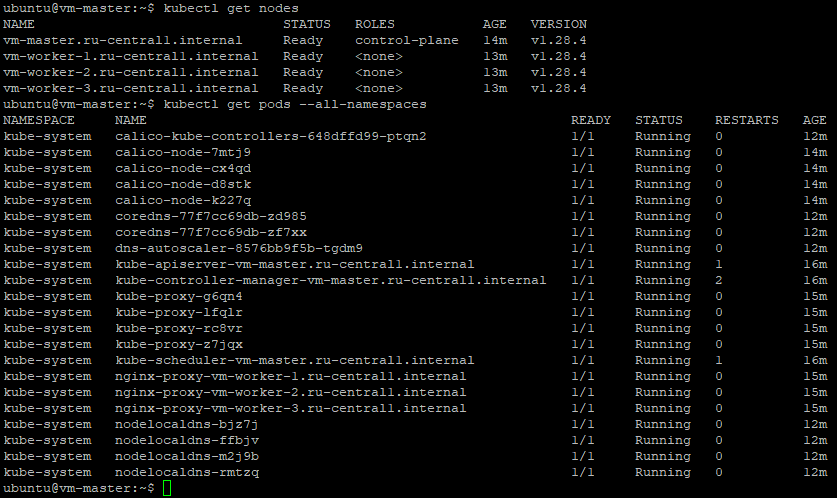


---

<a id="3"></a>
## Создание тестового приложения

<a id="3-1"></a>
### Подготовка инструментов для работы

1. Выполним установку Docker на виртуальную машину
```
root@test-vm:~# apt-get install ca-certificates curl gnupg lsb-release
Reading package lists... Done
Building dependency tree... Done
Reading state information... Done
lsb-release is already the newest version (11.1.0ubuntu4).
lsb-release set to manually installed.
ca-certificates is already the newest version (20230311ubuntu0.22.04.1).
ca-certificates set to manually installed.
curl is already the newest version (7.81.0-1ubuntu1.15).
gnupg is already the newest version (2.2.27-3ubuntu2.1).
gnupg set to manually installed.
0 upgraded, 0 newly installed, 0 to remove and 2 not upgraded.
root@test-vm:~# mkdir -p /etc/apt/keyrings
root@test-vm:~# curl -fsSL https://download.docker.com/linux/ubuntu/gpg | gpg --dearmor -o /etc/apt/keyrings/docker.gpg
root@test-vm:~# echo "deb [arch=$(dpkg --print-architecture) signed-by=/etc/apt/keyrings/docker.gpg] https://download.docker.com/linux/ubuntu $(lsb_release -cs) stable" | tee /etc/apt/sources.list.d/docker.list > /dev/null
root@test-vm:~# apt-get update
Hit:1 http://mirror.yandex.ru/ubuntu jammy InRelease
Get:2 http://mirror.yandex.ru/ubuntu jammy-updates InRelease [119 kB]
Hit:3 http://mirror.yandex.ru/ubuntu jammy-backports InRelease
Get:4 http://security.ubuntu.com/ubuntu jammy-security InRelease [110 kB]
Get:5 https://download.docker.com/linux/ubuntu jammy InRelease [48.8 kB]
Get:6 https://download.docker.com/linux/ubuntu jammy/stable amd64 Packages [23.0 kB]
Fetched 301 kB in 1s (491 kB/s)
Reading package lists... Done
root@test-vm:~# apt-get install docker-ce docker-ce-cli containerd.io docker-compose-plugin docker-compose
-------------------------ВЫВОД ПРОПУЩЕН-----------------------------------
```
2. Проверим результат установки Docker:
```
root@test-vm:~# docker --version
Docker version 24.0.7, build afdd53b
```
3. Выполним установку Helm на виртуальную машину
```
root@test-vm:~# curl https://baltocdn.com/helm/signing.asc | gpg --dearmor | tee /usr/share/keyrings/helm.gpg > /dev/null
  % Total    % Received % Xferd  Average Speed   Time    Time     Time  Current
                                 Dload  Upload   Total   Spent    Left  Speed
100  1699  100  1699    0     0   7931      0 --:--:-- --:--:-- --:--:--  7939
root@test-vm:~# apt-get install apt-transport-https --yes
-------------------------ВЫВОД ПРОПУЩЕН-----------------------------------
root@test-vm:~# echo "deb [arch=$(dpkg --print-architecture) signed-by=/usr/share/keyrings/helm.gpg] https://baltocdn.com/helm/stable/debian/ all main" | tee /etc/apt/sources.list.d/helm-stable-debian.list
deb [arch=amd64 signed-by=/usr/share/keyrings/helm.gpg] https://baltocdn.com/helm/stable/debian/ all main
root@test-vm:~# apt-get update
Hit:1 http://mirror.yandex.ru/ubuntu jammy InRelease
Hit:2 http://mirror.yandex.ru/ubuntu jammy-updates InRelease
Hit:3 http://mirror.yandex.ru/ubuntu jammy-backports InRelease
Hit:4 http://security.ubuntu.com/ubuntu jammy-security InRelease
Hit:5 https://download.docker.com/linux/ubuntu jammy InRelease
Get:6 https://baltocdn.com/helm/stable/debian all InRelease [7,652 B]
Get:7 https://baltocdn.com/helm/stable/debian all/main amd64 Packages [3,912 B]
Fetched 11.6 kB in 1s (22.0 kB/s)
Reading package lists... Done
root@test-vm:~# apt-get install helm
-------------------------ВЫВОД ПРОПУЩЕН-----------------------------------  
```
4. Проверим результат установки Helm:
```
root@test-vm:~# helm version
version.BuildInfo{Version:"v3.13.3", GitCommit:"c8b948945e52abba22ff885446a1486cb5fd3474", GitTreeState:"clean", GoVersion:"go1.20.11"}
```


<a id="3-2"></a>
### Создание Docker-образа приложения
1. Создадим директорию для приложения: 
```
root@test-vm:~# mkdir docker
root@test-vm:~# cd docker/
```

2. Создадим статическую страницу веб-приложения:
```
root@test-vm:~/docker# cat index.html
<html>
<head>
Example web-page for diploma
</head>
<body>
<h1>Evgeni Listopad v0.1</h1>
</body>
</html>
```
3. Создадим `Dockerfile` для последующей сборки образа:
```
root@test-vm:~/docker# cat Dockerfile
FROM nginx:latest
RUN rm -rf /usr/share/nginx/html/*
COPY index.html /usr/share/nginx/html/
EXPOSE 80
```
4. Выполним сборку образа на основе `Dockerfile`:
```
root@test-vm:~/docker# docker build -t evgenilistopad/webapp-diploma:v0.0.1 .
[+] Building 21.6s (8/8) FINISHED                                                                                                                                                                                             docker:default
 => [internal] load build definition from Dockerfile                                                                                                                                                                                    0.2s
 => => transferring dockerfile: 139B                                                                                                                                                                                                    0.0s
 => [internal] load .dockerignore                                                                                                                                                                                                       0.2s
 => => transferring context: 2B                                                                                                                                                                                                         0.0s
 => [internal] load metadata for docker.io/library/nginx:latest                                                                                                                                                                         1.8s
 => [1/3] FROM docker.io/library/nginx:latest@sha256:2bdc49f2f8ae8d8dc50ed00f2ee56d00385c6f8bc8a8b320d0a294d9e3b49026                                                                                                                  16.1s
 => => resolve docker.io/library/nginx:latest@sha256:2bdc49f2f8ae8d8dc50ed00f2ee56d00385c6f8bc8a8b320d0a294d9e3b49026                                                                                                                   0.1s
 => => sha256:9784f7985f6fba493ba30fb68419f50484fee8faaf677216cb95826f8491d2e9 1.99kB / 1.99kB                                                                                                                                          0.0s
 => => sha256:af107e978371b6cd6339127a05502c5eacd1e6b0e9eb7b2f4aa7b6fc87e2dd81 29.13MB / 29.13MB                                                                                                                                        1.3s
 => => sha256:336ba1f05c3ede29f0a73d3f88b39a14f6abdc57fafedf3891fd793504440263 41.37MB / 41.37MB                                                                                                                                        4.2s
 => => sha256:2bdc49f2f8ae8d8dc50ed00f2ee56d00385c6f8bc8a8b320d0a294d9e3b49026 7.59kB / 7.59kB                                                                                                                                          0.0s
 => => sha256:d453dd892d9357f3559b967478ae9cbc417b52de66b53142f6c16c8a275486b9 7.02kB / 7.02kB                                                                                                                                          0.0s
 => => sha256:8c37d2ff6efa0a08f83056109a47aa0caf2cc82136d926d1176cd451f7fbb245 628B / 628B                                                                                                                                              0.3s
 => => sha256:51d6357098de68f5fc2e50afdaa73fc4fcbdeed2161adc9f14d1d8dae9d94d36 955B / 955B                                                                                                                                              1.3s
 => => extracting sha256:af107e978371b6cd6339127a05502c5eacd1e6b0e9eb7b2f4aa7b6fc87e2dd81                                                                                                                                               1.3s
 => => sha256:782f1ecce57d1fa61421872a16b979ad92057db19841b5811616a749705214f4 365B / 365B                                                                                                                                              4.5s
 => => sha256:7b73345df136081ef2e60fd5cb875771c02c5ecb76015292babbc4711d195a31 1.40kB / 1.40kB                                                                                                                                          4.4s
 => => extracting sha256:336ba1f05c3ede29f0a73d3f88b39a14f6abdc57fafedf3891fd793504440263                                                                                                                                               1.0s
 => => sha256:5e99d351b073fec15b9817dc5234f32433ef0404849cc66857be2eca5192ccf8 1.21kB / 1.21kB                                                                                                                                          4.5s
 => => extracting sha256:8c37d2ff6efa0a08f83056109a47aa0caf2cc82136d926d1176cd451f7fbb245                                                                                                                                               0.0s
 => => extracting sha256:51d6357098de68f5fc2e50afdaa73fc4fcbdeed2161adc9f14d1d8dae9d94d36                                                                                                                                               0.0s
 => => extracting sha256:782f1ecce57d1fa61421872a16b979ad92057db19841b5811616a749705214f4                                                                                                                                               0.0s
 => => extracting sha256:5e99d351b073fec15b9817dc5234f32433ef0404849cc66857be2eca5192ccf8                                                                                                                                               0.0s
 => => extracting sha256:7b73345df136081ef2e60fd5cb875771c02c5ecb76015292babbc4711d195a31                                                                                                                                               0.0s
 => [internal] load build context                                                                                                                                                                                                       0.1s
 => => transferring context: 141B                                                                                                                                                                                                       0.0s
 => [2/3] RUN rm -rf /usr/share/nginx/html/*                                                                                                                                                                                            3.1s
 => [3/3] COPY index.html /usr/share/nginx/html/                                                                                                                                                                                        0.2s
 => exporting to image                                                                                                                                                                                                                  0.1s
 => => exporting layers                                                                                                                                                                                                                 0.1s
 => => writing image sha256:a163593c1fce5f6f11561aa9f50946cc0f7ac873d5524fb5d2d37e3b148da50d                                                                                                                                            0.0s
 => => naming to docker.io/evgenilistopad/webapp-diploma:v0.0.1                                                       
```
* Сборка образа выполнена успешно

<a id="3-3"></a>
### Отправка Docker-образа в Docker Hub
1. Создадим репозиторий `webapp-diploma` на DockerHub
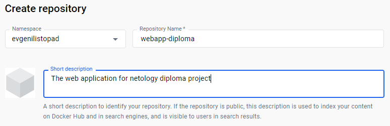

2. Отправим созданный образ на DockerHub
```
root@test-vm:~/docker# docker login -u evgenilistopad
Password:
WARNING! Your password will be stored unencrypted in /root/.docker/config.json.
Configure a credential helper to remove this warning. See
https://docs.docker.com/engine/reference/commandline/login/#credentials-store

Login Succeeded
root@test-vm:~/docker# docker push evgenilistopad/webapp-diploma:v0.0.1
The push refers to repository [docker.io/evgenilistopad/webapp-diploma]
20e763817888: Pushed
39265f16fd93: Pushed
b074db3b55e1: Mounted from library/nginx
e50c68532c4a: Mounted from library/nginx
f6ba584ca3ec: Mounted from library/nginx
01aaa195cdad: Mounted from library/nginx
2a13e6a7cca6: Mounted from library/nginx
370869eba6e9: Mounted from library/nginx
7292cf786aa8: Mounted from library/nginx
v0.0.1: digest: sha256:3f3d38d12f71f227e660ad6a1798d1bd58c3d5699932f227fb775617f3288a47 size: 2192
```

3. Проверим успешность загрузки образа на DockerHub:
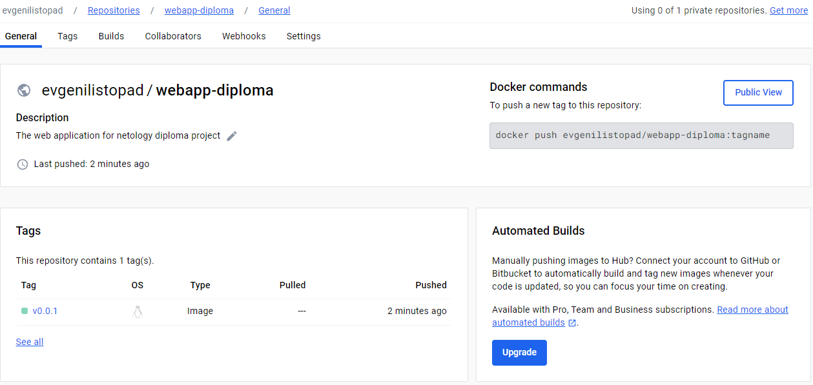
* Образ успешно загружен на DockerHub


<a id="3-4"></a>
### Подготовка Kubernetes deployment для созданного приложения
1. Создадим файл `deployment.yaml` для развёртывания приложения в Kubernetes:
```
root@test-vm:~/docker# cat deployment.yaml
---
apiVersion: apps/v1
kind: Deployment
metadata:
  name: webapp-diploma
  labels:
    app: webapp
spec:
  replicas: 1
  selector:
    matchLabels:
      app: webapp
  template:
    metadata:
      labels:
        app: webapp
    spec:
      containers:
      - name: webapp-diploma
        image: evgenilistopad/webapp-diploma
        ports:
        - containerPort: 80
```

2. Создадим файл `service.yaml` для развёртывания сервиса в Kubernetes:
```
root@test-vm:~/docker# cat service.yaml
---
apiVersion: v1
kind: Service
metadata:
  name: webapp-service
spec:
  type: NodePort
  selector:
    app: webapp
  ports:
  - protocol: TCP
    port: 80
    nodePort: 30080
```

3. Проверим работоспособность вышеописанной конфигурации на кластере Kubernetes:
```
ubuntu@vm-master:~/docker$ kubectl apply -f deployment.yaml
deployment.apps/webapp-diploma created
ubuntu@vm-master:~/docker$ kubectl apply -f service.yaml
service/webapp-service created
ubuntu@vm-master:~/docker$ kubectl get pods
NAME                              READY   STATUS    RESTARTS   AGE
webapp-diploma-688d6677cc-k25dk   1/1     Running   0          37s
```

4. Убедимся в доступности статической веб-страницы по адресу http://51.250.68.52:30080/:

* Веб-страница отображается корректно

5. Удалим развернутые `deployment` и `service` с кластера Kubernetes:
```
ubuntu@vm-master:~/docker$ kubectl delete -f service.yaml
service "webapp-service" deleted
ubuntu@vm-master:~/docker$ kubectl delete -f deployment.yaml
deployment.apps "webapp-diploma" deleted
```

<a id="3-5"></a>
### Подготовка Helm чарта для созданного приложения

1. Создадим директорию для чарта: 
```
root@test-vm:~/docker# mkdir helm
root@test-vm:~/docker# cd helm
root@test-vm:~/docker/helm#
```

2. Создадим файлы Helm чарта: `Chart.yaml`, `values.yaml`, `templates/deployment.yaml`:
```
root@test-vm:~/docker/helm# ls -lR
.:
total 4
-rw-r--r-- 1 root root    0 Dec 31 20:15 Chart.yaml
drwxr-xr-x 2 root root 4096 Dec 31 20:16 templates
-rw-r--r-- 1 root root    0 Dec 31 20:16 values.yaml

./templates:
total 0
-rw-r--r-- 1 root root 0 Dec 31 20:16 deployment.yam
```

3. Заполним файл `Chart.yaml`:
```
root@test-vm:~/docker/helm# cat Chart.yaml
---
apiVersion: v2
name: webapp-chart
description: A Helm chart for Kubernetes

type: application

version: "0.1"
appVersion: "0.1"
```

4. Заполним файл `values.yaml`:
```
root@test-vm:~/docker/helm# cat values.yaml
---
replicaCount: 1
app:
  name: webapp
image:
  repository: evgenilistopad/webapp-diploma
  tag: latest
service:
  type: NodePort
  port: 80
  nodePort: 30080
```

5. Заполним файл `templates/deployment.yaml`:
```
root@test-vm:~/docker/helm# cat templates/deployment.yaml
---
apiVersion: apps/v1
kind: Deployment
metadata:
  name: webapp-diploma
  labels:
    app: {{ .Values.app.name }}
spec:
  replicas: {{ .Values.replicaCount }}
  selector:
    matchLabels:
      app: {{ .Values.app.name }}
  template:
    metadata:
      labels:
        app: {{ .Values.app.name }}
    spec:
      containers:
      - name: webapp-container
        image: "{{ .Values.image.repository }}:{{ .Values.image.tag }}"
        ports:
        - containerPort: 80
---
apiVersion: v1
kind: Service
metadata:
  name: webapp-service
spec:
  type: {{ .Values.service.type }}
  selector:
    app: {{ .Values.app.name }}
  ports:
    - protocol: TCP
      port: 80
      nodePort: {{ .Values.service.nodePort }}
```

6. Выполним проверку конструктора helm чарта:
```
root@vm-master:~/docker/helm# helm template webapp-diploma
---
# Source: webapp-chart/templates/deployment.yaml
apiVersion: v1
kind: Service
metadata:
  name: webapp-service
spec:
  type: NodePort
  selector:
    app: webapp
  ports:
    - protocol: TCP
      port: 80
      nodePort: 30080
---
# Source: webapp-chart/templates/deployment.yaml
apiVersion: apps/v1
kind: Deployment
metadata:
  name: webapp-diploma
  labels:
    app: webapp
spec:
  replicas: 1
  selector:
    matchLabels:
      app: webapp
  template:
    metadata:
      labels:
        app: webapp
    spec:
      containers:
      - name: webapp-container
        image: "evgenilistopad/webapp-diploma:latest"
        ports:
        - containerPort: 80
```

7. Выполним проверку конструктора helm чарта:
```
root@vm-master:~/docker/helm# helm lint webapp-diploma
==> Linting webapp-diploma
[INFO] Chart.yaml: icon is recommended

1 chart(s) linted, 0 chart(s) failed
```

8. Выполним запуск на исполнение helm чарта:
```
ubuntu@vm-master:~/docker/helm$ helm upgrade --install webapp-diploma webapp-diploma --set image.tag=v0.0.1
Release "webapp-diploma" does not exist. Installing it now.
NAME: webapp-diploma
LAST DEPLOYED: Sun Dec 31 21:08:02 2023
NAMESPACE: default
STATUS: deployed
REVISION: 1
TEST SUITE: None
```

9. Проверим развернутые ресурсы:
```
ubuntu@vm-master:~/docker/helm$ helm ls
NAME            NAMESPACE       REVISION        UPDATED                                 STATUS          CHART                   APP VERSION
webapp-diploma  default         1               2023-12-31 21:08:02.868350261 +0000 UTC deployed        webapp-chart-0.1        0.1
ubuntu@vm-master:~/docker/helm$ kubectl get pods
NAME                              READY   STATUS    RESTARTS   AGE
webapp-diploma-6988ffc544-tng9x   1/1     Running   0          74s
```

10. Убедимся в доступности статической веб-страницы по адресу worker-ноды (http://51.250.85.229:30080/):
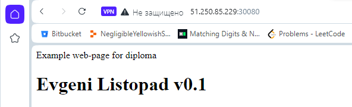
* Веб-страница отображается корректно

11. Удалим развернутые helm ресурсы с кластера Kubernetes:
```
ubuntu@vm-master:~/docker/helm$ helm uninstall webapp-diploma
release "webapp-diploma" uninstalled
ubuntu@vm-master:~/docker/helm$ helm ls
NAME    NAMESPACE       REVISION        UPDATED STATUS  CHART   APP VERSION
ubuntu@vm-master:~/docker/helm$
```


---

<a id="4"></a>
## Подготовка системы мониторинга и деплой приложения

<a id="4-1"></a>
### Развертывание kube-prometheus на Kubernetes кластере

1. Создадим директорию для чарта системы мониторинга:
```
ubuntu@vm-master:~/docker/helm$ mkdir kube-prometheus
ubuntu@vm-master:~/docker/helm$ cd kube-prometheus/
```

2. Добавим репозиторий `prometheus-community` для helm чарта и выведем значения переменных `values` для последующего редактирования:
```
ubuntu@vm-master:~/docker/helm/kube-prometheus$ helm repo add prometheus-community https://prometheus-community.github.io/helm-charts
"prometheus-community" has been added to your repositories
ubuntu@vm-master:~/docker/helm/kube-prometheus$ helm repo update
Hang tight while we grab the latest from your chart repositories...
...Successfully got an update from the "prometheus-community" chart repository
Update Complete. ⎈Happy Helming!⎈
ubuntu@vm-master:~/docker/helm/kube-prometheus$ helm show values prometheus-community/kube-prometheus-stack > values.yaml
```

3. Выполним редактирование файла values.yaml в секции `grafana`:
```
grafana:
  service:
    portName: http-web
    type: NodePort
    nodePort: 30081
```

4. Выполним установку kube-prometheus с помощью helm:
```
root@vm-master:~/docker/helm/kube-prometheus# helm upgrade --install monitoring prometheus-community/kube-prometheus-stack --create-namespace -n monitoring -f values.yaml
Release "monitoring" does not exist. Installing it now.
NAME: monitoring
LAST DEPLOYED: Sun Dec 31 22:07:40 2023
NAMESPACE: monitoring
STATUS: deployed
REVISION: 1
NOTES:
kube-prometheus-stack has been installed. Check its status by running:
  kubectl --namespace monitoring get pods -l "release=monitoring"

Visit https://github.com/prometheus-operator/kube-prometheus for instructions on how to create & configure Alertmanager and Prometheus instances using the Operator.
```

5. Проверим успешность развертывания ресурсов kube-prometheus
```
root@vm-master:~/docker/helm/kube-prometheus# kubectl --namespace monitoring get pods -l "release=monitoring"
NAME                                                  READY   STATUS    RESTARTS   AGE
monitoring-kube-prometheus-operator-99d6d9475-8wpkm   1/1     Running   0          3m24s
monitoring-kube-state-metrics-f7ff68767-9cwdk         1/1     Running   0          3m24s
monitoring-prometheus-node-exporter-cc9dw             1/1     Running   0          3m25s
monitoring-prometheus-node-exporter-nk5f5             1/1     Running   0          3m25s
monitoring-prometheus-node-exporter-qr8s2             1/1     Running   0          3m25s
monitoring-prometheus-node-exporter-vzsvk             1/1     Running   0          3m25s
```

6. Получим значение пароля по умолчанию для входа в графический интерфейс Grafana:
```
root@vm-master:~/docker/helm/kube-prometheus# cat values.yaml | grep adminPassword
  adminPassword: prom-operator
```

7. Выполним вход в графический интерфейс Grafana:
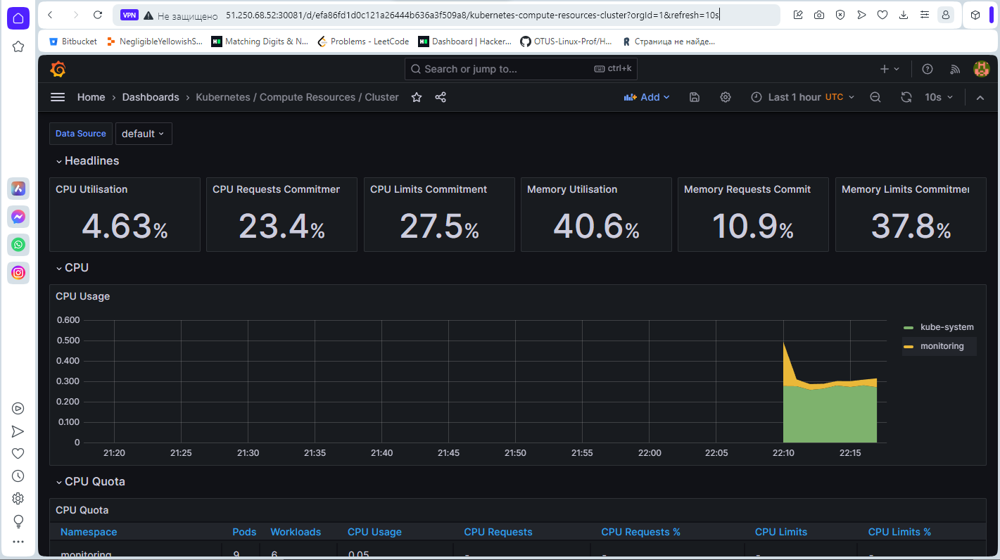
* Веб-страница с Grafana отображается корректно

<a id="4-2"></a>
### Развертывание созданного приложения на Kubernetes кластере

1. Еще раз выполним развертывание нашего приложения со статической web-страницей:
```
root@vm-master:~/docker/helm# helm upgrade --install webapp-diploma webapp-diploma --set image.tag=v0.0.1
Release "webapp-diploma" does not exist. Installing it now.
NAME: webapp-diploma
LAST DEPLOYED: Sun Dec 31 22:22:10 2023
NAMESPACE: default
STATUS: deployed
REVISION: 1
TEST SUITE: None
```

2. Проверим успешность развертывания:
```
root@vm-master:~/docker/helm# helm ls
NAME            NAMESPACE       REVISION        UPDATED                                 STATUS          CHART                   APP VERSION
webapp-diploma  default         1               2023-12-31 22:22:10.957717652 +0000 UTC deployed        webapp-chart-0.1        0.1
root@vm-master:~/docker/helm# kubectl get pods
NAME                              READY   STATUS    RESTARTS   AGE
webapp-diploma-6988ffc544-hj54f   1/1     Running   0          16m
```

3. В графическом интерфесе Grafana видим, что появился новый namespace `default` (кроме `kube-system` и `monitoring`), в котором запущен наш Pod с пользовательским приложением:
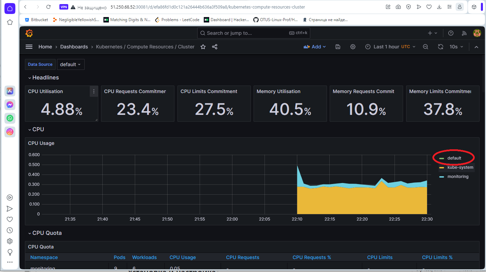

4. Также видим, что в namespace `default` появился Pod, содержащий в имени `webapp-diploma`:
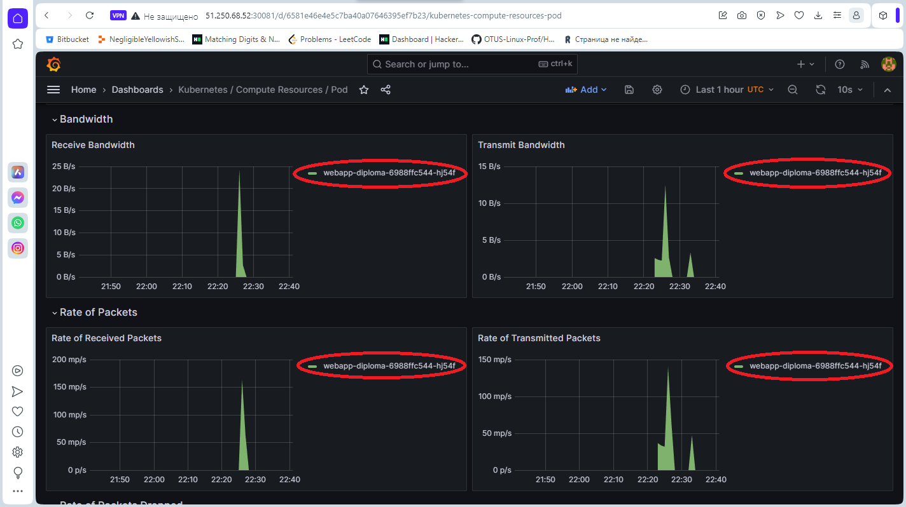

* Система мониторинга и развертывание пользовательского приложения работают корректно

---

<a id="5"></a>
## Установка и настройка CI/CD

<a id="5-1"></a>
### Подготовка GitHub для создания Docker-образа в Docker Hub

1. Создадим новый репозиторий для дипломного проекта:
```
https://github.com/evgeni-listopad/webapp-diploma
```
* Подтвердим создание репозитория скриншотом:
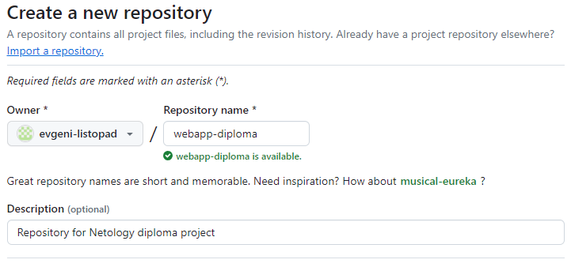

2. Добавим в репозиторий атрибуты доступа в Docker Hub
```
Settings / Secrets and variables / Actions / Secrets / New repository secret
```
* Результат добавления приведем на скриншоте:
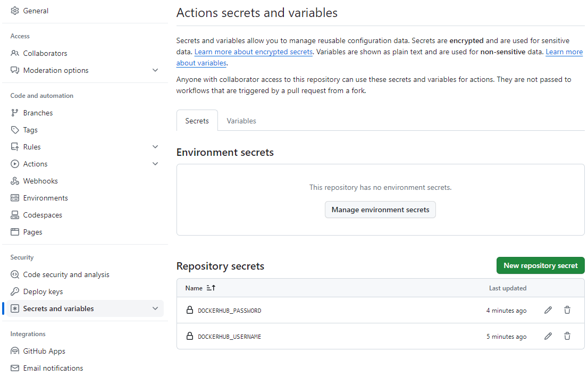

3. Добавим в GitHub-профиль публичный ключ ssh и проверим возможность работы с ним через консоль:
```
[root@workstation ~]# ssh git@github.com
The authenticity of host 'github.com (140.82.121.4)' can't be established.
ECDSA key fingerprint is SHA256:p2QAMXNIC1TJYWeIOttrVc98/R1BUFWu3/LiyKgUfQM.
Are you sure you want to continue connecting (yes/no/[fingerprint])? yes
Warning: Permanently added 'github.com,140.82.121.4' (ECDSA) to the list of known hosts.
PTY allocation request failed on channel 0
Hi evgeni-listopad! You've successfully authenticated, but GitHub does not provide shell access.
Connection to github.com closed.
```
* Аутентификация по ключу работает корректно.


<a id="5-2"></a>
### Отработка создания Docker-образа и загрузки его в Docker Hub

1. Создадим директорию для работы с GitHub Actions:
```
[root@workstation docker]# mkdir -p actions/.github/workflows
[root@workstation docker]# cd actions/.github/workflows
[root@workstation workflows]#
```

2. Создадим файл для описания процесса развёртывания в GitHub Actions:
```
[root@workstation workflows]# cat dockerimage.yml
name: Docker Image CI
on:
  push:
    branches: [ main ]
jobs:
  build:
    runs-on: ubuntu-latest
    steps:
    - uses: actions/checkout@v2
    - name: Login to DockerHub
      uses: docker/login-action@v1
      with:
        username: ${{ secrets.DOCKERHUB_USERNAME }}
        password: ${{ secrets.DOCKERHUB_PASSWORD }}

    - name: Build and push Docker image
      uses: docker/build-push-action@v2
      with:
        context: .
        push: true
        tags: evgenilistopad/webapp-diploma:latest
```

3. В директории для GitHub-репозитория обеспечим наличие следующих файлов:
```
[root@workstation actions]# ls -la
total 16
drwxr-xr-x. 3 root root 100 Jan  1 13:33 .
drwxr-xr-x. 4 root root 112 Jan  1 13:23 ..
-rw-r--r--. 1 root root 379 Jan  1 13:33 deployment.yaml
-rw-r--r--. 1 root root 102 Jan  1 13:33 Dockerfile
drwxr-xr-x. 3 root root  23 Jan  1 13:24 .github
-rw-r--r--. 1 root root 106 Jan  1 13:33 index.html
-rw-r--r--. 1 root root 177 Jan  1 13:33 service.yaml
```

4. Подключим созданный GitHub-репозиторий:
```
[root@workstation actions]# git init
Initialized empty Git repository in /root/diploma/docker/actions/.git/
[root@workstation actions]# git add .
[root@workstation actions]# git commit -m "Initial commit"
[master (root-commit) 057850a] Initial commit
 5 files changed, 68 insertions(+)
 create mode 100644 .github/workflows/dockerimage.yml
 create mode 100644 Dockerfile
 create mode 100644 deployment.yaml
 create mode 100644 index.html
 create mode 100644 service.yaml
[root@workstation actions]# git branch -M main
[root@workstation actions]# git remote add origin git@github.com:evgeni-listopad/webapp-diploma.git
```

5. Выполним загрузку файлов в GitHub-репозиторий:
```
[root@workstation actions]# git push --force origin main
Enumerating objects: 9, done.
Counting objects: 100% (9/9), done.
Delta compression using up to 2 threads
Compressing objects: 100% (7/7), done.
Writing objects: 100% (9/9), 1.22 KiB | 250.00 KiB/s, done.
Total 9 (delta 0), reused 0 (delta 0), pack-reused 0
To github.com:evgeni-listopad/webapp-diploma.git
 + 881be07...057850a main -> main (forced update)
```

6. Изменим файл веб-приложения index.html в репозитории и отправим изменения в GitHub:
```
[root@workstation actions]# cat index.html | grep Listopad
<h1>Evgeni Listopad v0.0.2</h1>
[root@workstation actions]# git add .
[root@workstation actions]# git commit -m "changed index.html v0.0.2"
[main 3a71ec9] changed index.html v0.0.2
 1 file changed, 1 insertion(+), 1 deletion(-)
[root@workstation actions]# git push -u origin main
Enumerating objects: 5, done.
Counting objects: 100% (5/5), done.
Delta compression using up to 2 threads
Compressing objects: 100% (3/3), done.
Writing objects: 100% (3/3), 317 bytes | 105.00 KiB/s, done.
Total 3 (delta 2), reused 0 (delta 0), pack-reused 0
remote: Resolving deltas: 100% (2/2), completed with 2 local objects.
To github.com:evgeni-listopad/webapp-diploma.git
   057850a..3a71ec9  main -> main
Branch 'main' set up to track remote branch 'main' from 'origin'.
```

7. Зайдем в GitHub Actions и убедимся в корректной отработке двух коммитов:
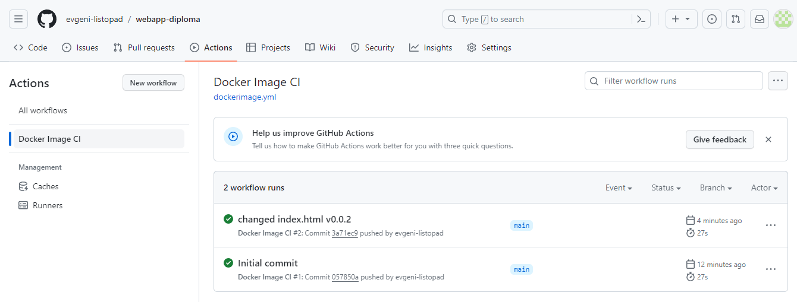
* Видим, что коммиты на GitHub Actions отработали корректно

8. Зайдем в Docker Hub и убедимся, что в репозитории загружен образ с тегом `latest`:
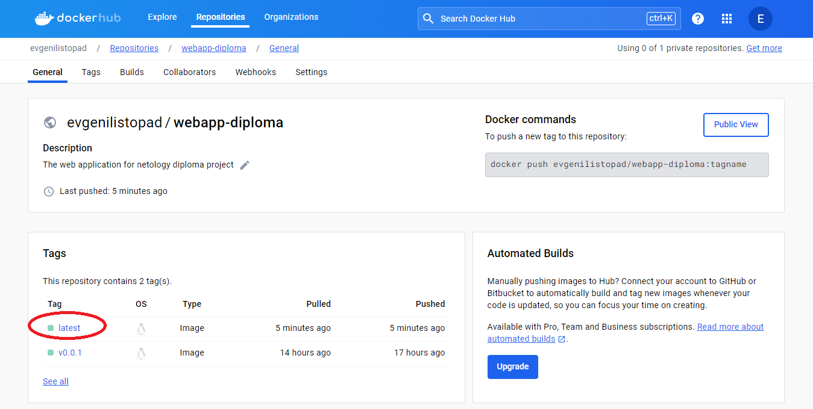
* Видим, что GitHub Actions корректно создает и загружает образ пользовательского web-приложения в Docker Hub при выполнении коммита.

---

<a id="5-3"></a>
### Подготовка GitHub для развертывания приложения в Kubernetes кластере

1. Добавим в репозиторий атрибут доступа к Kubernetes-кластеру
* В свойствах репозитория Github добавим секрет для Kubernetes и укажем содержание kubeconfig-файла для подключения к Kubernetes кластеру. Имя: KUBECONFIG_FILE, содержание: из файла `~/.kube/config`.

2. Подтвердим добавление секрета скриншотом:
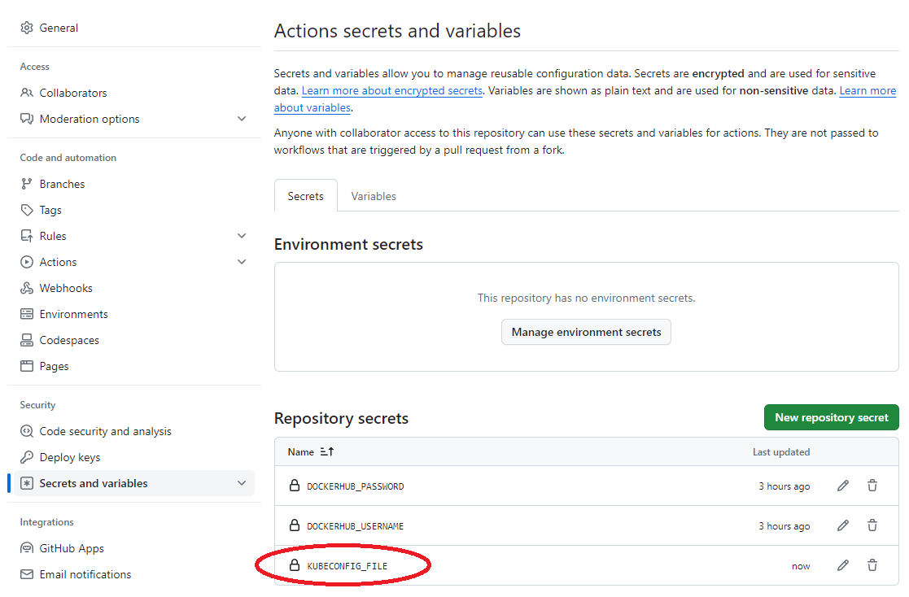

---

<a id="5-4"></a>
### Отработка развертывания приложения в Kubernetes кластере при коммите с тегом

1. В директории `actions/.github/workflows` cоздадим файл для описания процесса развёртывания в Kubernetes с помощью GitHub Actions:
```
[root@workstation workflows]# cat deploy.yml
name: Deploy CI/CD
on:
  push:
    tags:
    - "v*"
jobs:
  build:
    runs-on: ubuntu-latest
    steps:
    - uses: actions/checkout@v2
    - name: Login to DockerHub
      uses: docker/login-action@v1
      with:
        username: ${{ secrets.DOCKERHUB_USERNAME }}
        password: ${{ secrets.DOCKERHUB_PASSWORD }}

    - name: Build and push Docker image
      uses: docker/build-push-action@v2
      with:
        context: .
        push: true
        tags: evgenilistopad/webapp-diploma:${{ github.ref_name }}

    - name: Setup kubeconfig
      run: echo '${{ secrets.KUBECONFIG_FILE }}' > kubeconfig

    - name: Install Kubernetes CLI
      run: |
        curl -LO "https://storage.googleapis.com/kubernetes-release/release/$(curl -s https://storage.googleapis.com/kubernetes-release/release/stable.txt)/bin/linux/amd64/kubectl"
        chmod +x kubectl
        sudo mv kubectl /usr/local/bin/

    - name: Delete old deployment
      run: |
        export KUBECONFIG=kubeconfig
        kubectl delete deploy webapp-diploma || true

    - name: Deploy to Kubernetes
      run: |
        export KUBECONFIG=kubeconfig
        kubectl apply -f deployment.yaml && kubectl apply -f service.yaml && kubectl set image deployment/webapp-diploma webapp-diploma=evgenilistopad/webapp-diploma:${{ github.ref_name }}
```

2. Загрузим изменения в GitHub-репозиторий:
```
[root@workstation actions]# git add .
[root@workstation actions]# git status
On branch main
Your branch is up to date with 'origin/main'.

Changes to be committed:
  (use "git restore --staged <file>..." to unstage)
        new file:   .github/workflows/deploy.yml

[root@workstation actions]# git commit -m "added workflow for Kubernetes"
[main a862e72] added workflow for Kubernetes
 1 file changed, 41 insertions(+)
 create mode 100644 .github/workflows/deploy.yml
[root@workstation actions]# git push origin main
Enumerating objects: 8, done.
Counting objects: 100% (8/8), done.
Delta compression using up to 2 threads
Compressing objects: 100% (4/4), done.
Writing objects: 100% (5/5), 971 bytes | 971.00 KiB/s, done.
Total 5 (delta 1), reused 0 (delta 0), pack-reused 0
remote: Resolving deltas: 100% (1/1), completed with 1 local object.
To github.com:evgeni-listopad/webapp-diploma.git
   3a71ec9..a862e72  main -> main
[root@workstation actions]#
```

3. Изменим файл веб-приложения index.html в репозитории и отправим изменения в GitHub:
```
[root@workstation actions]# cat index.html | grep Listopad
<h1>Evgeni Listopad v0.0.3</h1>
[root@workstation actions]# git add .
[root@workstation actions]# git commit -m "changed index.html v0.0.3"
[main d5391ec] changed index.html v0.0.3
 1 file changed, 1 insertion(+), 1 deletion(-)
[root@workstation actions]# git push origin main
Enumerating objects: 5, done.
Counting objects: 100% (5/5), done.
Delta compression using up to 2 threads
Compressing objects: 100% (3/3), done.
Writing objects: 100% (3/3), 316 bytes | 316.00 KiB/s, done.
Total 3 (delta 2), reused 0 (delta 0), pack-reused 0
remote: Resolving deltas: 100% (2/2), completed with 2 local objects.
To github.com:evgeni-listopad/webapp-diploma.git
   633a0a1..d5391ec  main -> main
```


4. Поставим тег `v0.0.3` на последний коммит и загрузим его в GitHub:
```
[root@workstation actions]# git tag v0.0.3
[root@workstation actions]# git push origin v0.0.3
Total 0 (delta 0), reused 0 (delta 0), pack-reused 0
To github.com:evgeni-listopad/webapp-diploma.git
 * [new tag]         v0.0.3 -> v0.0.3
```

5. Проверим результат отработки GitHub Actions:
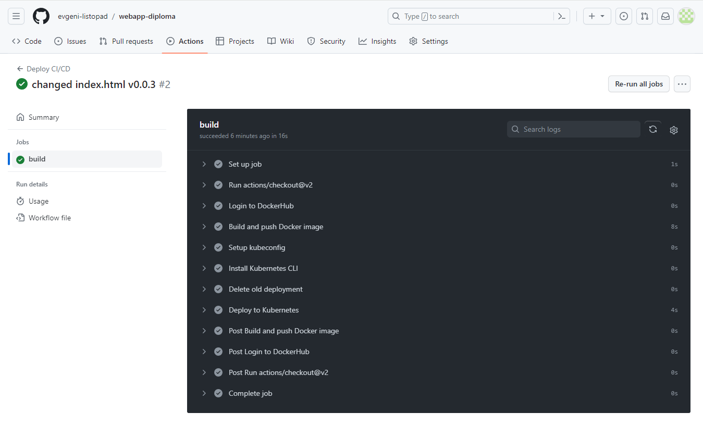
* Build отработал корректно без ошибок

6. Проверим результат в Docker Hub:
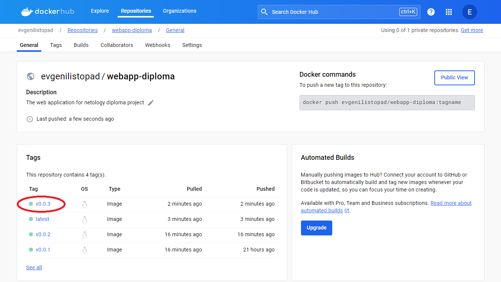
* В Docker Hub корректно загружен образ с тегом `v0.0.3`

7. Проверим доступность веб-приложения в браузере по публичному IP-адресу:
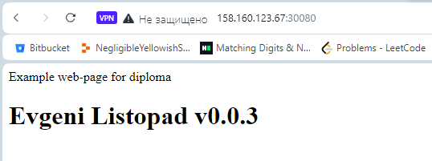
* Веб-страница с правильным содержимым отображается корректно

8. Проверим ресурсы в Kubernetes:
```
[root@workstation actions]# kubectl get all
NAME                                  READY   STATUS    RESTARTS   AGE
pod/webapp-diploma-564876648f-dkq9b   1/1     Running   0          13m

NAME                     TYPE        CLUSTER-IP      EXTERNAL-IP   PORT(S)        AGE
service/kubernetes       ClusterIP   10.233.0.1      <none>        443/TCP        103m
service/webapp-service   NodePort    10.233.42.117   <none>        80:30080/TCP   27m

NAME                             READY   UP-TO-DATE   AVAILABLE   AGE
deployment.apps/webapp-diploma   1/1     1            1           13m

NAME                                        DESIRED   CURRENT   READY   AGE
replicaset.apps/webapp-diploma-564876648f   1         1         1       13m
replicaset.apps/webapp-diploma-786dcff846   0         0         0       13m
```

---

<a id="6"></a>
## Созданные ресурсы

<a id="6-1"></a>
### Ресурсы на GitHub

1. [Репозиторий для созданного веб-приложения](https://github.com/evgeni-listopad/webapp-diploma);
2. [GitHub Actions для созданного веб-приложения](https://github.com/evgeni-listopad/webapp-diploma/actions);
3. [terraform/backend.tf](./Diploma/terraform/backend.tf) - файл для настройки Yandex cloud в качестве S3-бекэнда для Terraform;
4. [terraform/terraformrc](./Diploma/terraform/terraformrc) - файл для настройки зеркала для работы Terraform с Yandex cloud без VPN-туннелирования;
5. [terraform/output.tf](./Diploma/terraform/output.tf) - файл для настройки вывода необходимой информации на экран при развертывании ресурсов в облаке с помощью Terraform;
6. [terraform/main.tf](./Diploma/terraform/main.tf) - основной файл-сценарий для развертывания ресурсов в облаке с помощью Terraform;
7. [ansible/prep.yaml](./Diploma/ansible/prep.yaml) - файл-сценарий для Ansible для подготовки хостов в облаке к инсталляции Kubernetes через метод Kubespray;
8. [ansible/inventory-preparation](./Diploma/ansible/inventory-preparation) - инвентарный файл для Ansible для запуска файла-сценария prep.yaml. Файл inventory-preparation генерируется автоматически при отработке Terraform по файлу main.tf;
9. [ansible/inventory-kubespray](./Diploma/ansible/inventory-kubespray) - инвентарный файл для Ansible для запуска файла-сценария инсталляции Kubernetes через метод Kubespray. Файл inventory-kubespray также генерируется автоматически при отработке Terraform по файлу main.tf;
10. [docker/Dockerfile](./Diploma/docker/Dockerfile) - файл для сборки собственного образа приложения из образа `nginx:latest`;
11. [docker/index.html](./Diploma/docker/index.html) - файл собственной статической веб-страницы;
12. [docker/deployment.yaml](./Diploma/docker/deployment.yaml) - файл для развертывания собственного образа приложения в Kubernetes-кластере;
13. [docker/service.yaml](https://github.com/evgeni-listopad/webapp-diploma/blob/main/service.yaml) - файл для запуска сетевого сервиса собственного приложения в Kubernetes-кластере;
14. [helm/webapp-diploma/Chart.yaml](./Diploma/helm/webapp-diploma/Chart.yaml) - файл с описанием созданного Helm-чарта для развертывания собственного веб-приложения;
15. [helm/webapp-diploma/values.yaml](./Diploma/helm/webapp-diploma/values.yaml) - файл с переменными для созданного Helm-чарта для развертывания собственного веб-приложения;
16. [helm/webapp-diploma/templates/deployment.yaml](./Diploma/helm/webapp-diploma/templates/deployment.yaml) - файл с шаблоном созданного Helm-чарта для развертывания собственного веб-приложения;
17. [helm/kube-prometheus/values.yaml](./Diploma/helm/kube-prometheus/values.yaml) - файл с переменными для kube-prometheus шаблона, выкачиваемого из публичного Helm-репозитория;
18. [actions/.github/workflows/dockerimage.yml](./Diploma/actions/.github/workflows/dockerimage.yml) - workflow-файл для GitHub Action, определяющий сборку образа при коммите и загрузку его в Docker Hub;
19. [actions/.github/workflows/deploy.yml](./Diploma/actions/.github/workflows/deploy.yml) - workflow-файл для GitHub Action, определяющий развертывание образа в Kubernetes-кластере при коммите тега.

<a id="6-2"></a>
### Ресурсы на Docker Hub
* Ресурсы на Docker Hub представлены публичным репозиторием [evgenilistopad/webapp-diploma](https://hub.docker.com/r/evgenilistopad/webapp-diploma/tags), содержащим несколько версий веб-приложения со статической страницей.

<a id="6-3"></a>
### Ресурсы на Yandex cloud
* Ресурсы на Yandex cloud представлены публичным S3-хранилищем [listopad-diploma](https://storage.yandexcloud.net/listopad-diploma), содержащим файл состояния Terraform [terraform.tfstate](https://storage.yandexcloud.net/listopad-diploma/terraform.tfstate), как это требовалось по заданию.


