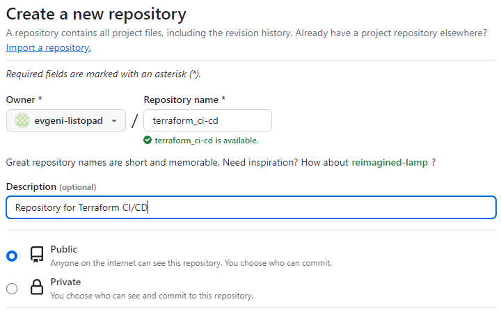
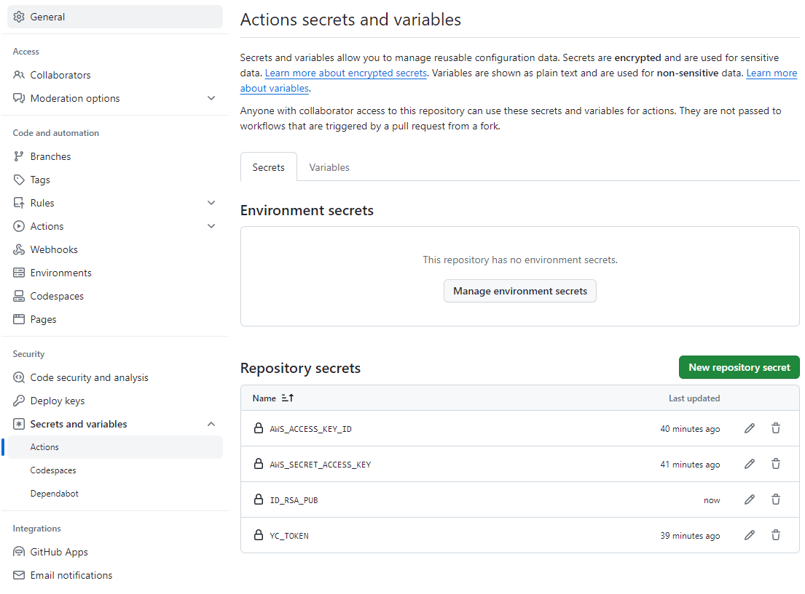
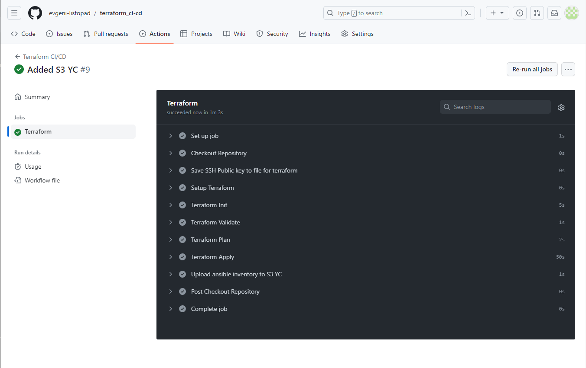
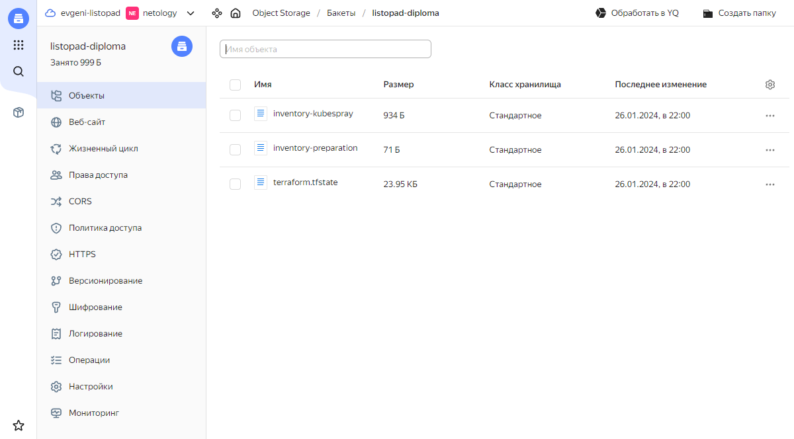
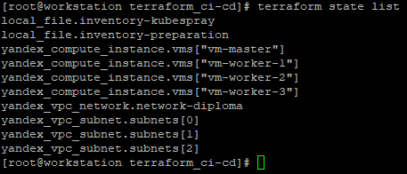

# Доработка дипломного практикума в Yandex.Cloud

---
## Задача:
Необходимо настроить автоматический запуск и применение конфигурации terraform из git-репозитория в выбранной CI-CD системе при любом комите в main ветку.

### Выполнение задачи

1. Создадим отдельный git-репозиторий для построения CI/CD-конвейера развертывания ресурсов через инструмент Terraform:
```
https://github.com/evgeni-listopad/terraform_ci-cd
```
* Подтвердим создание репозитория скриншотом:


2. Добавим в репозиторий атрибуты доступа к облачному провайдеру Yandex.Cloud и его объектному хранилищу, а также публичный ssh-ключ для создаваемых в облаке виртуальных машин
```
Settings / Secrets and variables / Actions / Secrets / New repository secret
```
* Результат добавления секретов приведем на скриншоте:


3. Создадим директорию для работы с GitHub Actions:
```
[root@workstation terraform_ci-cd]# mkdir -p .github/workflows
[root@workstation terraform_ci-cd]# cd .github/workflows
[root@workstation workflows]#
```

4. Создадим файл для описания процесса развёртывания в GitHub Actions:
```
[root@workstation terraform_ci-cd]# cat .github/workflows/terraform_ci-cd.yml
name: Terraform CI/CD

on:
  push:
    branches:
      - main

jobs:
  terraform:
    name: Terraform
    runs-on: ubuntu-latest

    env:
      AWS_ACCESS_KEY_ID: ${{ secrets.AWS_ACCESS_KEY_ID }}
      AWS_SECRET_ACCESS_KEY: ${{ secrets.AWS_SECRET_ACCESS_KEY }}
      YC_TOKEN: ${{ secrets.YC_TOKEN }}
      ID_RSA_PUB: ${{ secrets.ID_RSA_PUB }}
      working-directory: .
    defaults:
      run:
        working-directory: ${{ env.working-directory }}

    steps:
      - name: Checkout Repository
        uses: actions/checkout@v2

      - name: Save SSH Public key to file for terraform
        run: echo $ID_RSA_PUB > id_rsa.pub

      - name: Setup Terraform
        uses: hashicorp/setup-terraform@v1
        with:
          terraform_version: 1.5.7

      - name: Terraform Init
        id: init
        run: terraform init

      - name: Terraform Validate
        id: validate
        run: terraform validate -no-color

      - name: Terraform Plan
        id: plan
        run: terraform plan -no-color

      - name: Terraform Apply
        id: apply
        run: terraform apply -auto-approve


      - name: Upload ansible inventory to S3 YC
        uses: povetek/yandex-object-storage-action@v3
        with:
          access-key-id: ${{ secrets.AWS_ACCESS_KEY_ID }}
          secret-access-key: ${{ secrets.AWS_SECRET_ACCESS_KEY }}
          bucket: listopad-diploma
          path: ansible
          clear: false
```

* В данном файле выполняется инициализация переменных среды AWS_ACCESS_KEY_ID, AWS_SECRET_ACCESS_KEY, YC_TOKEN и ID_RSA_PUB значениями из ранее заданных секретов (secrets), а также задается текущая рабочая директория.

* Выполняется скачивание в текущую директорию содержимого репозитория.

* Сохраняется значение публичного ключа для будущих виртуальных машин Yandex.Cloud в файл с именем `id_rsa.pub` в текущей директории.

* Выполняется установка Terraform версии 1.5.7

* Выполняется инициализация Terraform в соответствии с tf-файлами из текущего каталога. В нашем конкретном случае Terraform будет настроен на работу с облачным провайдером Yandex.Cloud и на использование его объектного хранилища в качестве Backend'a.

* Выполняется проверка синтаксиса в tf-файлах описания инфраструктуры.

* Готовится план применения инфраструктуры в соответствии с описаниями в tf-файлах, но с учетом текущего сотояния (state), сохраненного в облачном объектном хранилище Yandex.Cloud.

* Выполняется развертывание облачной инфраструктуры в автоматическом режиме (опция -auto-approve) и генерирование inventory-файлов для ansible с целью их последующего использования в Kubespray (это было сделано в основном блоке дипломного практикума)

* Выполняется загрузка сгенерированных Terraform'ом inventory-файлов из директории ansible в облачное объектное хранилище Yandex.Cloud.

5. В соответствии с замечаниями переработаем файл `main.tf`, обеспечив использование переменных, а также операторов count и for_each. Все переменные вынесем в отдельный файл `variables.tf`, а блок для формирования inventory-файлов для ansible вынесем в отдельный файл `ansible.tf`. В результате содержимое `main.tf` будет следующим:
```
[root@workstation terraform_ci-cd]# cat main.tf
terraform {
  required_providers {
    yandex = {
      source = "yandex-cloud/yandex"
    }
  }
  required_version = ">= 0.13"
}

provider "yandex" {
  cloud_id  = var.yc_cloud_id
  folder_id = var.yc_folder_id
  zone = var.yc_zone
}

# VPC
resource "yandex_vpc_network" "network-diploma" {
  name = "network-diploma"
  folder_id = var.yc_folder_id
}

# Subnets
resource "yandex_vpc_subnet" "subnets" {
  count = length(var.subnet_names)

  name           = var.subnet_names[count.index]
  zone           = var.zones[count.index]
  network_id     = yandex_vpc_network.network-diploma.id
  v4_cidr_blocks = [var.cidr_blocks[count.index]]
}

# Virtual machines
resource "yandex_compute_instance" "vms" {
  for_each = var.instances

  name = each.value.name
  hostname = each.value.hostname
  zone = each.value.zone

  resources {
    cores  = each.value.cores
    memory = each.value.memory
  }

  boot_disk {
    initialize_params {
      image_id = "fd84nt41ssoaapgql97p"
      size     = "10"
    }
  }

  network_interface {
#    subnet_id = each.value.subnet_id
    subnet_id = yandex_vpc_subnet.subnets[each.value.subnet_id].id
# subnet_id = yandex_vpc_subnet.subnet-a.id
    nat       = true
  }

  metadata = {
    ssh-keys = "ubuntu:${file("id_rsa.pub")}"
  }
}
```
* Остальные файлы также приведены в репозитории [terraform_ci-cd](https://github.com/evgeni-listopad/terraform_ci-cd)

6. В директории для GitHub-репозитория обеспечим наличие следующих файлов:
```
[root@workstation terraform_ci-cd]# ls -l
total 24
-rw-r--r--. 1 root root 2355 Jan 22 23:30 ansible.tf
-rw-r--r--. 1 root root  278 Jan 21 20:20 backend.tf
-rw-r--r--. 1 root root 1275 Jan 23 00:54 main.tf
-rw-r--r--. 1 root root  222 Jan 21 23:03 output.tf
-rw-r--r--. 1 root root   59 Jan 22 23:54 README.md
-rw-r--r--. 1 root root 1268 Jan 22 00:36 variables.tf
```

7. Подключим созданный GitHub-репозиторий и загрузим в него вышеуказанные файлы:
```
[root@workstation terraform_ci-cd]# git init
Initialized empty Git repository in /root/diploma/terraform_ci-cd/.git/
[root@workstation terraform_ci-cd]# git add .
[root@workstation terraform_ci-cd]# git commit -m "Initial commit"
[master (root-commit) 6a813f8] Initial commit
 6 files changed, 179 insertions(+)
 create mode 100644 README.md
 create mode 100644 ansible.tf
 create mode 100644 backend.tf
 create mode 100644 main.tf
 create mode 100644 output.tf
 create mode 100644 variables.tf
[root@workstation terraform_ci-cd]# git branch -M main
[root@workstation terraform_ci-cd]# git remote add origin git@github.com:evgeni-listopad/terraform_ci-cd.git
[root@workstation terraform_ci-cd]# git push -u origin main
Enumerating objects: 8, done.
Counting objects: 100% (8/8), done.
Delta compression using up to 2 threads
Compressing objects: 100% (8/8), done.
Writing objects: 100% (8/8), 2.05 KiB | 1.02 MiB/s, done.
Total 8 (delta 0), reused 0 (delta 0), pack-reused 0
To github.com:evgeni-listopad/terraform_ci-cd.git
 * [new branch]      main -> main
Branch 'main' set up to track remote branch 'main' from 'origin'.
[root@workstation terraform_ci-cd]#
```

8. Отдельно выполним загрузку в GitHub-репозиторий скорректированного Workflow-файла для запуска GitHub Action
```
[root@workstation terraform_ci-cd]# git commit --amend
[main 97c4191] Added S3 YC
 Date: Fri Jan 26 21:18:04 2024 +0300
 1 file changed, 8 insertions(+), 6 deletions(-)
[root@workstation terraform_ci-cd]# git push origin main
Enumerating objects: 9, done.
Counting objects: 100% (9/9), done.
Delta compression using up to 2 threads
Compressing objects: 100% (3/3), done.
Writing objects: 100% (5/5), 595 bytes | 297.00 KiB/s, done.
Total 5 (delta 2), reused 0 (delta 0), pack-reused 0
remote: Resolving deltas: 100% (2/2), completed with 2 local objects.
To github.com:evgeni-listopad/terraform_ci-cd.git
 + 0741b98...97c4191 main -> main
```

9. Зайдем в GitHub Actions и убедимся в корректной отработке Workflow при 
[коммите] (https://github.com/evgeni-listopad/terraform_ci-cd/actions/runs/7672246949/job/20912347151).
* Видим, что Workflow в GitHub Actions отработал корректно.

10. Подтвердим результат отработки скриншотом:


11. Зайдем в объектое хранилище Yandex.Cloud и убедимся, что Inventory-файлы для Ansible успешно загружены:


12. На локальной машине с настроенным S3-backend'ом для Terraform проверим поднятые ресурсы в облаке Yandex.Cloud:
```
[root@workstation terraform_ci-cd]# terraform state list
local_file.inventory-kubespray
local_file.inventory-preparation
yandex_compute_instance.vms["vm-master"]
yandex_compute_instance.vms["vm-worker-1"]
yandex_compute_instance.vms["vm-worker-2"]
yandex_compute_instance.vms["vm-worker-3"]
yandex_vpc_network.network-diploma
yandex_vpc_subnet.subnets[0]
yandex_vpc_subnet.subnets[1]
yandex_vpc_subnet.subnets[2]
```

13. Подтвердим результат проверки ресурсов скриншотом:


14. Созданные ресурсы:
* [Репозиторий для созданного CI/CD-конвейера Terraform](https://github.com/evgeni-listopad/terraform_ci-cd)
* [GitHub Actions для созданного репозитория](https://github.com/evgeni-listopad/terraform_ci-cd/actions)
* [ansible/inventory-preparation](https://storage.yandexcloud.net/listopad-diploma/inventory-preparation) - инвентарный файл для Ansible для запуска подготовительного файла-сценария prep.yaml. Файл inventory-preparation генерируется автоматически при отработке Terraform по файлу main.tf и загружается в объектное хранилище Yandex.Cloud;
* [ansible/inventory-kubespray](https://storage.yandexcloud.net/listopad-diploma/inventory-kubespray) - инвентарный файл для Ansible для запуска файла-сценария инсталляции Kubernetes через метод Kubespray. Файл inventory-kubespray также генерируется автоматически при отработке Terraform по файлу main.tf и загружается в объектное хранилище Yandex.Cloud.

